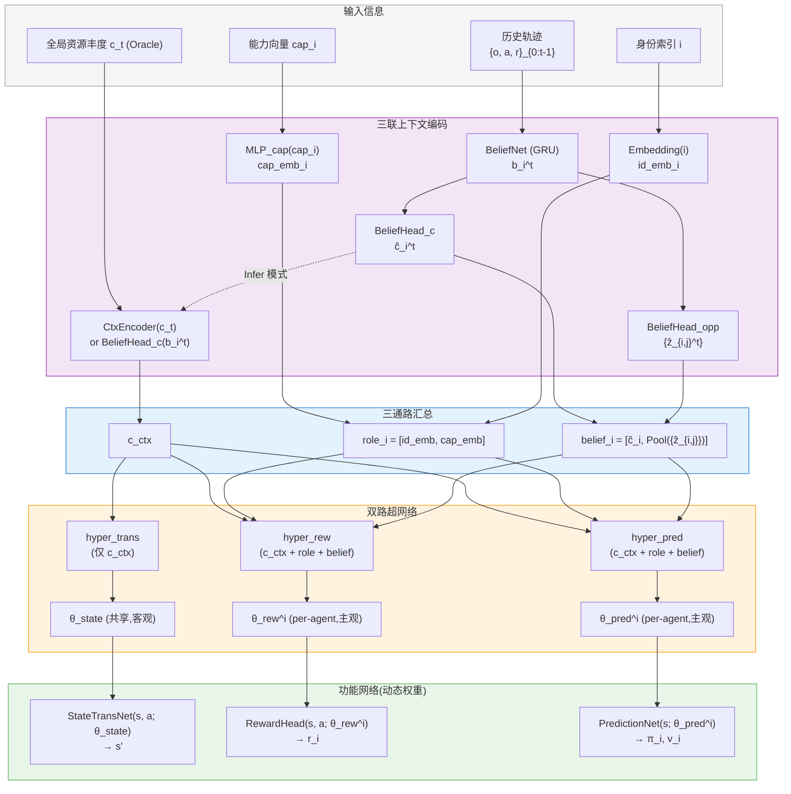

# 第四章 Hyper-MuZero 框架核心架构(v2 升级版)

> **升级要点**:本章在原 DualHyperNetwork(主观通路输入 `rule_emb ⊕ id_emb`)的基础上,将主观通路升级为**角色异质性 + 信念状态**双组件架构。该升级源于第一章对约束 (C1)-(C3) 的形式化,并与 Harsanyi 不完全信息博弈中的"私人信念"概念严格对应。

---

## 4.1 设计原则:从博弈论到世界模型的对应

在第一章中,我们将关系非平稳混合博弈(RNS-MMG)的核心特性总结为三条结构性约束:物理转移的上下文不变性 (C1)、博弈关系的上下文耦合 (C2)、上下文的物理不可控性 (C3)。本章的架构设计**严格遵循 (C1)-(C2) 的几何对应**,通过将世界模型分解为客观与主观两条独立通路,实现"共同知识"与"私人信念"在网络结构上的显式分离。

### 4.1.1 Harsanyi 不完全信息博弈的对应

Harsanyi [10] 在 1967 年指出,在多智能体决策的不完全信息博弈中,任何关于环境与他人的不确定性都可归约为对**类型**(type)的不确定性,从而通过引入一个虚拟的"自然之手"(Nature)将不完全信息博弈转化为完全信息但不完美观测的贝叶斯博弈。该框架自然区分了两类信息:

- **共同知识**(Common Knowledge):所有智能体都同意的物理规律与博弈结构(本文中即资源场的时空动力学 $P(s' \mid s, a)$,由约束 C1 保证其上下文不变性)。
- **私人信念**(Private Belief):每个智能体根据自身类型与观测,对当前博弈状态及他人类型的主观推断(本文中包括对 $c_t$ 的推断、对他人类型/能力的推断)。

本章提出的**双路超网络**(DualHyperNetwork)正是这一二分法在深度世界模型中的几何实现:

| 博弈论概念 | 世界模型组件 | 对应约束 |
|---|---|---|
| 共同知识(Common Knowledge) | **客观通路** `hyper_trans` | C1(物理不变性) |
| 私人信念(Private Belief) | **主观通路** `hyper_rew`, `hyper_pred` | C2(关系耦合) |

### 4.1.2 主观通路升级的必要性

原 v1 架构中,主观通路输入为 `[rule_emb, id_emb]`,即"环境规则 + 离散身份"。该设计在简单 Tag 环境下足够工作,但在 RNS-MMG 的资源驱动混合博弈中暴露出三个根本性不足:

**不足 1(角色异质性的丢失)**。 离散 `id_emb` 仅编码"我是哪个 agent",无法编码"我具备哪些能力"——而在 ResourceCommons 中,不同 agent 的采集速度、视野范围、移动速度均不同,这些**连续能力差异**直接决定了最优策略,但被 v1 架构忽略。

**不足 2(信念状态的缺失)**。 v1 架构假设 $c_t$ 可被直接编码(Oracle)或由 GRU 推断(Infer),但 GRU 仅推断单一标量 $c_t$,**未推断对手的类型/意图**——这与 Harsanyi 框架中"对他人类型的信念"是核心私人信息的论断相违背。在博弈关系动态切换的场景中,缺失对手信念会导致策略对社会伙伴的变化失去适应力。

**不足 3(信念与决策的解耦)**。 v1 架构将 GRU 推断的 `rule_emb_hat` 与离散 `id_emb` 简单拼接,二者地位平等。但从博弈论看,"我的类型"是先验固定的,"我的信念"是后验更新的,二者本质不同,需要在架构上**分别对待**。

针对上述三点,本章 v2 架构进行如下升级:

```
v1 主观通路输入:  [rule_emb,  id_emb]
                  ↓
v2 主观通路输入:  [c_context, role_emb,  belief_emb]
                  ↓           ↓          ↓
                  客观锚点    角色异质性  信念状态
```

下文 4.2 节详细介绍三个组件的设计。

---

## 4.2 上下文编码模块:三联通路设计

### 4.2.1 客观上下文(Common Knowledge Channel)

客观上下文 $c_{\text{ctx}} \in \mathbb{R}^{d_c}$ 编码了所有 agent **共同同意**的环境状态信息,主要是当前共享资源丰度 $c_t$:

$$c_{\text{ctx}} = \text{CtxEncoder}(c_t) \quad \text{(Oracle)} \quad \text{或} \quad c_{\text{ctx}} = \text{BeliefHead}_{c}(b_t) \quad \text{(Infer)}$$

其中 $b_t$ 是下文 4.2.3 节引入的信念状态。

**关键性质**:$c_{\text{ctx}}$ 在所有 agent 间**完全共享**(对一个 episode 内的固定时刻 $t$,所有 agent 看到同一个 $c_{\text{ctx}}$),保证客观通路的物理不变性。

### 4.2.2 角色异质性(Role Heterogeneity Channel)

角色异质性 $\text{role}_i \in \mathbb{R}^{d_r}$ 是与 agent 身份强绑定的**先验固定**信息,由两部分组成:

$$\text{role}_i = \text{Concat}\bigl[\,\text{id\_emb}_i,\;\text{cap\_emb}_i\,\bigr]$$

其中:

- **`id_emb_i`**: 离散身份嵌入,通过 `nn.Embedding(N, d_{id})` 实现。该组件编码 agent 在族群中的"index 身份",支持同类型 agent 之间的策略分化。

- **`cap_emb_i`**: 连续能力嵌入,由小 MLP 编码 agent 的物理能力向量 $\mathbf{cap}_i \in \mathbb{R}^{d_{\text{phy}}}$:
  $$\mathbf{cap}_i = [\text{harvest\_speed}_i,\;\text{fov}_i,\;\text{move\_speed}_i,\;\text{capacity}_i,\;\ldots]$$
  $$\text{cap\_emb}_i = \text{MLP}_{\text{cap}}(\mathbf{cap}_i)$$
  能力向量在 episode 内固定,但可在 agent 间随机化(参见 ResourceCommons 设计)。

**关键性质**:`role_i` 是 agent 的"出厂参数",一生不变,**先验地塑造了策略空间**。这与下文信念状态的"后验更新性"形成对比。

### 4.2.3 信念状态(Belief State Channel)

信念状态 $b_i^t \in \mathbb{R}^{d_b}$ 是 agent $i$ 在时刻 $t$ 根据历史观测、动作、奖励**后验推断**得到的私人信息表示,由 BeliefNet 统一计算:

$$b_i^t = \text{BeliefNet}_{\text{GRU}}(o_i^{0:t},\;a_i^{0:t-1},\;r_i^{0:t-1})$$

`BeliefNet` 是一个**单向 GRU**,在每个时间步增量更新隐状态 $h_i^t$,并输出该步的信念向量 $b_i^t = \text{LayerNorm}(h_i^t)$。

信念状态通过两个**解读头**(belief heads)被分解为可解释的两部分:

$$\hat{c}_i^t = \text{BeliefHead}_c(b_i^t) \quad \text{(对全局 } c_t \text{ 的推断)}$$

$$\hat{z}_{i,j}^t = \text{BeliefHead}_{\text{opp}}(b_i^t)_j,\quad j \in \mathcal{N}_{-i} \quad \text{(对每个其他 agent 类型的推断)}$$

其中 $\hat{c}_i^t \in \mathbb{R}^{d_c}$ 是 agent $i$ 对当前资源丰度的估计,$\hat{z}_{i,j}^t \in \mathbb{R}^{d_z}$ 是 agent $i$ 对其他 agent $j$ 类型的估计向量。

**用于主观通路的最终信念嵌入**:
$$\text{belief}_i^t = \text{Concat}\bigl[\,\hat{c}_i^t,\;\text{Pool}(\{\hat{z}_{i,j}^t\}_{j \neq i})\,\bigr]$$
其中 $\text{Pool}(\cdot)$ 是一个置换不变聚合函数(如 mean / max),保证对其他 agent 的索引顺序不敏感。

**Belief Heads 的训练目标**(详见 4.5 节):
- $\hat{c}_i^t$ 通过监督损失 $\mathcal{L}_c = \|\hat{c}_i^t - c_t^{\text{true}}\|^2$ 训练(Oracle 模式下);
- $\hat{z}_{i,j}^t$ 通过对比损失或对手动作预测损失训练(self-supervised)。

### 4.2.4 三通路汇总:广义条件向量

agent $i$ 在时刻 $t$ 的广义条件向量:

$$C_{\text{aug},i}^t = \text{Concat}\bigl[\,c_{\text{ctx}}^t,\;\text{role}_i,\;\text{belief}_i^t\,\bigr] \in \mathbb{R}^{d_c + d_r + d_b}$$

---

## 4.3 双路超网络(DualHyperNetwork v2)

升级后的双路超网络由三个超网络模块组成,**输入选择性地使用三通路中的不同组合**:

```
hyper_trans:  输入 = c_ctx                            (仅客观锚点)
hyper_rew:    输入 = [c_ctx, role_i, belief_i]        (全三通路)
hyper_pred:   输入 = [c_ctx, role_i, belief_i]        (全三通路)
```

### 4.3.1 数据流图



### 4.3.2 客观通路:`hyper_trans`

```python
hyper_trans:  R^{d_c}  →  R^{|θ_state|}
              c_ctx    →  θ_state
```

`hyper_trans` 仅以共享的客观上下文 $c_{\text{ctx}}$ 为输入,生成 **所有 agent 共享** 的状态转移网络权重 $\theta_{\text{state}}$。该网络对应的函数网络为 `StateTransNet`,负责预测资源场的时空动力学:

$$s_{t+1} = \text{StateTransNet}(s_t,\;\mathbf{a}_t;\;\theta_{\text{state}})$$

由于 $\theta_{\text{state}}$ 不依赖任何 per-agent 信息,根据 (C1) 物理一致性自然成立。

### 4.3.3 主观通路:`hyper_rew` 与 `hyper_pred`

```python
hyper_rew:    R^{d_c + d_r + d_b}              →  R^{|θ_rew|}
              [c_ctx, role_i, belief_i]        →  θ_rew^i

hyper_pred:   R^{d_c + d_r + d_b}              →  R^{|θ_pred|}
              [c_ctx, role_i, belief_i]        →  θ_pred^i
```

两条主观通路接收**完整三通路输入**,生成 agent-specific 权重 $\theta_{\text{rew}}^i$ 和 $\theta_{\text{pred}}^i$。其对应的函数网络分别负责:

$$r_i = \text{RewardHead}(s,\;\mathbf{a};\;\theta_{\text{rew}}^i) \quad \text{(预测 agent } i \text{ 的瞬时奖励)}$$

$$\pi_i,\;v_i = \text{PredictionNet}(s;\;\theta_{\text{pred}}^i) \quad \text{(agent } i \text{ 的策略与价值)}$$

由于这两个网络的权重依赖 $i$ 的角色与信念,允许不同 agent 在同一物理状态 $s$ 下产生**截然不同**的价值判断与最优行为——这是 (C2) 博弈关系耦合的直接实现。

---

## 4.4 五大核心网络与数据流

升级后的 Hyper-MuZero 包含**六大核心网络**(在原五大基础上新增 BeliefNet):

| 网络 | 输入 | 输出 | 权重来源 | 客/主观 |
|---|---|---|---|---|
| **RepresentationNet** | $o_{\text{joint}}$ | 隐状态 $s$ | 固定训练参数 | 客观 |
| **BeliefNet (新增)** | $o_i^{0:t}, a_i^{0:t-1}, r_i^{0:t-1}$ | 信念向量 $b_i^t$ | 固定训练参数 | 主观 |
| **StateTransNet** | $s, \mathbf{a}$ | $s'$ | `hyper_trans(c_ctx)` | 客观 |
| **RewardHead** | $s, \mathbf{a}$ | $r_i$ | `hyper_rew(c_ctx, role_i, belief_i)` | 主观 |
| **PredictionNet** | $s$ | $\pi_i, v_i$ | `hyper_pred(c_ctx, role_i, belief_i)` | 主观 |
| **ContextEncoder (重构)** | $c_t, i, \mathbf{cap}_i, b_i^t$ | 三联上下文 | 固定训练参数 | -- |

**关键升级点**:

1. RepresentationNet 仍以联合观测为输入,保持客观感知通路的统一;
2. BeliefNet 是**全新加入**的模块,每个 agent 单独运行,用历史推断私人信念;
3. ContextEncoder 由原"Rule + ID"重构为"客观锚点 + 角色 + 信念"三联结构;
4. 客观/主观通路的功能网络结构不变,但输入维度发生变化,需要调整 `hyper_rew`、`hyper_pred` 的入口层。

---

## 4.5 信念状态网络的训练目标

BeliefNet 的训练采用**多任务联合学习**,损失函数包含三个独立项:

### 4.5.1 Rule 推断损失 $\mathcal{L}_c$(监督)

在训练阶段,环境真实的 $c_t$ 是已知的(Oracle-style 监督信号),用于约束信念头 $\hat{c}_i^t$:

$$\mathcal{L}_c = \frac{1}{NT} \sum_{i,t} \|\hat{c}_i^t - c_t\|_2^2$$

**目的**:确保 belief 中编码了对 $c_t$ 的有效估计,即使在测试时 $c_t$ 不可见也能保持准确性。

### 4.5.2 对手类型预测损失 $\mathcal{L}_{\text{opp}}$(自监督)

由于 agent 的"类型"是潜变量(无 ground truth),对手 belief $\hat{z}_{i,j}^t$ 采用**对手动作预测**作为自监督代理任务:

$$\mathcal{L}_{\text{opp}} = \frac{1}{NT(N-1)} \sum_{i,t,j \neq i} \text{CE}\bigl(\text{Decoder}_{\text{act}}(\hat{z}_{i,j}^t,\;o_i^t),\;a_j^t\bigr)$$

其中 $\text{Decoder}_{\text{act}}$ 是一个轻量 MLP,接收 $\hat{z}_{i,j}$ 与 $o_i^t$,预测对手 $j$ 在时刻 $t$ 的实际动作。

**目的**:使 $\hat{z}_{i,j}$ 编码足以预测对手未来行为的对手类型表示,类似 ToMnet [55] 的 character net。

### 4.5.3 信念多样性正则 $\mathcal{L}_{\text{div}}$

为防止 BeliefNet 输出坍缩为常数(模式崩溃),引入方差铰链损失:

$$\mathcal{L}_{\text{div}} = \max\bigl(0,\;\sigma_{\text{target}}^2 - \text{Var}(b_i^t)\bigr)$$

其中 $\sigma_{\text{target}}$ 是目标方差阈值(默认 0.1)。

### 4.5.4 总损失

$$\mathcal{L}_{\text{BeliefNet}} = \lambda_c \cdot \mathcal{L}_c + \lambda_{\text{opp}} \cdot \mathcal{L}_{\text{opp}} + \lambda_{\text{div}} \cdot \mathcal{L}_{\text{div}}$$

推荐权重:$\lambda_c = 1.0$,$\lambda_{\text{opp}} = 0.5$,$\lambda_{\text{div}} = 0.01$。

### 4.5.5 与主任务的耦合

$\mathcal{L}_{\text{BeliefNet}}$ 与主 MuZero 损失(策略、价值、奖励、一致性)**联合优化**:

$$\mathcal{L}_{\text{total}} = \mathcal{L}_{\text{MuZero}} + w_b \cdot \mathcal{L}_{\text{BeliefNet}}$$

其中 $w_b \in [0.1, 1.0]$ 是 belief 模块的整体权重系数,建议训练前 30% 步数预热到 1.0,之后稳定。

---

## 4.6 功能网络的稳定性设计(四层防线)

升级后的功能网络面对的条件向量维度从 $32$(v1)扩大到 $d_c + d_r + d_b$(v2,典型 $\approx 64$-$96$),超网络的输出空间相应扩大,稳定性挑战加剧。本节继承 v1 中验证有效的四层防线设计,并指出**升级带来的新挑战**及其应对:

| 防线层 | v1 实现 | v2 升级要点 |
|---|---|---|
| L0:L2 归一化 | 超网络输出向量 L2 归一化 | 不变 |
| L1:可学习缩放 | $\times$ `output_scale`,初始 0.01 | 不变,但 `hyper_rew` 的 `output_scale` 初值上调至 0.1(避免主观通路被信念噪声压制) |
| L2:AdaLN 残差调制 | $h \times (1 + \gamma) + \beta$,$\gamma \approx 0$ 时恒等传递 | 不变 |
| L3:残差连接 | $s' = s + \text{TransNet}(s, \mathbf{a};\theta)$ | 不变 |

**新增**:为防止 BeliefNet 在训练早期产生大幅度噪声导致主观通路不稳定,对 belief 输入加入**梯度门控**:训练前 5K 步,belief 通路使用 detached 副本作为输入,只允许 RepNet → HyperNet → FuncNet 主链路进行梯度更新;5K 步之后解除门控,启用 belief 端到端训练。

---

## 4.7 关键代码 Diff 指引

为帮助实现,本节列出升级所涉及的代码模块,按改动幅度从大到小排序:

### 4.7.1 新增文件

**`belief_net.py`**(新增):
```python
class BeliefNet(nn.Module):
    """GRU-based belief encoder.
    
    Inputs:
        obs_seq:    (B, T, obs_dim)
        act_seq:    (B, T, action_dim)  # one-hot
        rew_seq:    (B, T, 1)
    Outputs:
        belief:     (B, belief_dim)
        c_hat:      (B, d_c)
        opp_hat:    (B, N-1, d_z)
    """
    def __init__(self, obs_dim, action_dim, num_agents, 
                 hidden_dim=128, belief_dim=64, d_c=16, d_z=16):
        super().__init__()
        self.input_proj = nn.Linear(obs_dim + action_dim + 1, hidden_dim)
        self.gru = nn.GRU(hidden_dim, hidden_dim, batch_first=True)
        self.belief_norm = nn.LayerNorm(hidden_dim)
        # Two belief heads
        self.head_c = nn.Linear(hidden_dim, d_c)
        self.head_opp = nn.Linear(hidden_dim, (num_agents - 1) * d_z)
        self.action_decoder = nn.Linear(d_z + obs_dim, action_dim)
        # ...
```

### 4.7.2 重大修改

**`context_encoder.py`**:`AugmentedContextEncoder` 升级为 `TriContextEncoder`,新增 `cap_encoder` 和与 `BeliefNet` 的接口。

**`hyper_network.py`**:`DualHyperNetwork.forward` 接受新的三联上下文输入,`hyper_rew` / `hyper_pred` 的入口层维度调整。

**`hyper_muzero_model.py`**:`set_context` 方法接收 `belief`,`forward` 方法整合 `BeliefNet` 的输出。

### 4.7.3 轻微修改

**`muzero_trainer.py`**:增加 belief 相关的损失计算与日志,新增 belief 模块的 EMA 同步。

**`buffer.py`** / **`episode_buffer.py`**:确保历史轨迹采样能正确给 BeliefNet 提供 (obs, act, rew) 三元组序列。

---

## 4.8 与 v1 架构的对比小结

| 维度 | v1 架构 | v2 升级架构 |
|---|---|---|
| 主观通路输入 | $[\text{rule\_emb},\;\text{id\_emb}]$(32 维) | $[c_{\text{ctx}},\;\text{role}_i,\;\text{belief}_i]$($\approx$ 80 维) |
| 角色编码 | 仅离散身份 | 离散身份 + 连续能力 |
| 信念建模 | GRU 仅推断 $c_t$ | BeliefNet 推断 $c_t$ + 他人类型 |
| 心智理论 | 无 | 有(ToMnet 风格 character net) |
| 博弈论对应 | 模糊 | 严格对应 Harsanyi 私人信念 |
| 训练目标 | 4 项(策略/价值/奖励/一致性) | 7 项(+ Rule 推断 + 对手预测 + 信念多样性) |
| 代码改动 | -- | $\approx$ 400-600 行(新增 + 改动) |
| 工作量 | -- | $\approx$ 2 周开发 + 1 周调试 |

升级后的架构在保留 v1 所有验证有效设计(主客解耦、四层稳定性防线、Per-Agent CRN MVE、Target EMA)的基础上,通过引入**角色异质性**与**信念状态**双组件,使主观通路具备了真正的"以我之身、信我之念"的博弈适应能力,为后续在 ResourceCommons 环境中处理动态混合动机博弈奠定了架构基础。

---

## 4.9 本章小结

本章在原 v1 DualHyperNetwork 的基础上,基于 Harsanyi 不完全信息博弈的理论指导,将主观通路升级为"客观锚点 + 角色异质性 + 信念状态"三联架构,并通过新增 BeliefNet 模块实现 ToMnet 风格的对手类型推断。该升级在数学结构上严格对应于 RNS-MMG 的约束 (C1)-(C2),在工程实现上保留了 v1 所有稳定性设计,代码改动可控(约 400-600 行)。下一章将详细介绍 MVE 规划器与 MuZero 风格训练流程,以及 BeliefNet 的训练目标如何与主任务联合优化。
