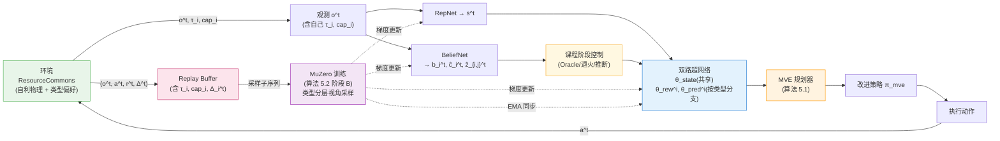

# 第五章 MVE 规划器与训练算法(v4 最终版)

> **本章定位**:第四章已经定义了"如何看世界"的架构,本章定义"如何做决策与如何训练"。我们将面对两个核心难题——联合动作空间的组合爆炸、以及多智能体随机性造成的信号噪声陷阱——分别用**逐智能体协调下降**与**共同随机数**两项技术予以解决,最终给出一个在 ResourceCommons 这类异构偏好公地博弈中可工作的完整 model-based 规划-训练循环。
>
> **v4 关键演进**:相对 v3 版本,本章核心改动是(1)规划器与训练算法全面接入类型机制——`set_context` 接收 type_i、RewardHead 预测目标按类型分支(类型 α 用 $u_i$,类型 β 用 $u_i + \phi(c)\psi(\Delta)$);(2)BeliefNet 训练目标的对手类型推断头从动作预测改为类型 2 分类(α / β),使用 Oracle type_j 监督;(3)**新增 5.7 节"对手类型推断的课程学习协议"**,定义 Oracle → 退火 → 纯推断三阶段;(4)μP 启用与 LR sweep 协议作为附录指引;(5)Instantaneous Δ 的 reward scale 自然对齐说明(无需复杂 normalization)。
>
> **[v4-opt 2026-06 修订摘要]**:按优化阶段实证与《Review_v4_TheoryAudit_2026-06》勘正:π_mve 的 z-score 归一(5.2.3 / 算法 5.1)、γ=0.95、spa=8、损失权重按实现(5.6.3)、全 agent 视角训练(5.6.5 重写)、ε-greedy 采集(算法 5.2)、**自蒸馏退化引理与规划信号必要性(5.9.1b 新增)**、EMA 约定勘正(5.8.1)、诊断指标族(5.8.5 新增)。

---

## 5.1 规划层的两个核心张力

### 5.1.1 张力 I:联合动作空间的组合爆炸

在第三章定义的 ResourceCommons 环境中,每个智能体的动作空间大小 $|\mathcal{A}_i| = 6$,$N$ 个智能体的联合动作空间为

$$|\mathcal{A}| = \prod_{i=1}^N |\mathcal{A}_i| = 6^N$$

基础配置 $N = 4$ 时,$|\mathcal{A}| = 1296$;难度等级 Hard 配置 $N = 8$ 时,$|\mathcal{A}| = 1\,679\,616$。即使是基础配置,$1296$ 个联合动作也远超传统单智能体 MuZero 在 MCTS 中可枚举的范围(Atari 中 $|\mathcal{A}| \leq 18$)。

更根本的问题在于:单智能体 MuZero 的 MCTS 通过 UCB 公式在所有动作上做选择性扩展,这要求**根节点上每个动作都至少被访问一次以建立初始 Q 值估计**。当 $|\mathcal{A}|$ 达到千级以上时,MCTS 的搜索预算(通常 50-100 次模拟)甚至无法覆盖所有根节点动作,使得 UCB 探索机制完全失效。MA-MuZero [30] 通过 Gumbel 采样部分缓解了这个问题,但其本质仍是在**联合动作空间**上展开搜索,无法解决组合爆炸的根本来源。

### 5.1.2 张力 II:多智能体随机性造成的信号噪声陷阱

即使我们绕过 MCTS,采用更简单的**模型价值估计**(Model-based Value Estimation, MVE [67])——即对每个候选动作展开 $K$ 步预测、估计累积回报、再做 softmax 得到改进策略——多智能体场景下还有一个隐蔽得多的难题:**信号-噪声比塌陷**(SNR collapse)。

考虑评估 agent $i$ 在根节点的两个候选动作 $a^{(1)}, a^{(2)}$。在单智能体场景下,环境对两个候选的响应差异完全由动作差异决定,信号清晰。但在多智能体场景下,**根节点处其他智能体的动作 $\mathbf{a}_{-i}$ 是随机变量**——若我们对每个候选独立采样 $\mathbf{a}_{-i}$,则候选 1 与候选 2 的回报差异中,**包含了 $\mathbf{a}_{-i}$ 不同采样所引入的方差**,这一方差在 $N$ 较大时**远远主导**了真正由 $a_i$ 引起的信号差异。

**v4 中类型异质性进一步放大此问题**:不同类型 agent 在同一物理状态下的最优响应差异巨大(类型 α 贪婪 vs 类型 β 在 c 低时也贪婪、在 c 高时辅助),agent $i$ 在评估自身候选时,其他 agent 的类型组合(2α+2β 中的其他 3 个 agent)引入额外方差源。

在我们的早期实验中观测到的具体数值:

| 配置 | 候选间真实信号 | 其他 agent 随机性引入的噪声 | SNR |
|---|---|---|---|
| 基础 MVE,无任何技巧 | $\sim 0.05$(单步回报标度) | $\sim 2.5$ | $\approx 0.02$ |
| 加 K=5 步展开 | 信号被衰减放大至 $\sim 0.1$ | 噪声被 $\gamma^k$ 衰减后仍约 $\sim 2.0$ | $\approx 0.05$ |

SNR $\approx 0.02$ 意味着候选动作之间的统计差异几乎被噪声完全淹没——经过 softmax 后,得到的"改进策略" $\pi_{\text{mve}}$ **接近均匀分布**,无法对策略网络提供有用的训练信号。**这是多智能体 model-based RL 中一个未被广泛讨论但极为关键的问题**。

### 5.1.3 设计目标

针对上述两个张力,本章规划器的设计目标为:

- **目标 5.1.A**:将联合动作搜索空间从 $\mathcal{O}(A^N)$ 降至 $\mathcal{O}(N \cdot A)$,使得搜索预算 $\ll A^N$ 时仍能覆盖关键候选;
- **目标 5.1.B**:将候选评估的 SNR 从 $\approx 0.02$ 提升至理论最优(消除非目标方差),使得 $\pi_{\text{mve}}$ 具备真正的判别力;
- **目标 5.1.C**:在 5.1.A 和 5.1.B 的基础上,保持与第四章双路超网络的无缝对接——客观通路提供共享世界模型,主观通路提供 **type/cap/belief 联合条件化** 的 agent-specific 价值评估。

下文 5.2 节先简要论证为何 MuZero 的 MCTS 在多智能体场景下不可行,5.3 节引入**逐智能体协调下降**解决目标 5.1.A,5.4 节引入**共同随机数(CRN)** 解决目标 5.1.B,5.5 节给出完整算法。

---

## 5.2 从 MCTS 到 MVE:为何 MuZero 在多智能体下需要换核

### 5.2.1 单智能体 MuZero 的 MCTS 范式

MuZero [24] 在每个真实决策点的规划过程为:

1. 用 representation network 将观测编码为根隐状态 $s^0$;
2. 在 $s^0$ 上展开蒙特卡洛树搜索(MCTS),每次模拟通过 PUCT 公式选择动作:

   $$a^k \;=\; \arg\max_a \;\Bigl\{\;Q(s,a) \;+\; P(s,a) \cdot \frac{\sqrt{\sum_b N(s,b)}}{1 + N(s,a)} \cdot c_{\text{puct}}\;\Bigr\}$$

3. 经过 $n_{\text{sim}}$ 次模拟后,根节点访问计数 $\{N(s^0, a)\}_a$ 归一化得到改进策略 $\pi_{\text{mcts}}$;
4. 实际执行的动作从 $\pi_{\text{mcts}}$ 采样,$\pi_{\text{mcts}}$ 用作策略训练目标。

### 5.2.2 MCTS 在多智能体场景下的失败

直接把 MuZero 的 MCTS 移植到多智能体场景会遇到三重失败:

**失败 1(树展开维度爆炸)**。 根节点的子节点必须覆盖每一个**联合动作**,基础配置下 $1296$ 个子节点,每个子节点又有 $1296$ 个孙子节点,搜索预算需求呈指数级增长。

**失败 2(PUCT 公式的多智能体歧义)**。 PUCT 中的 $P(s,a)$ 由策略网络给出,但在多智能体下"联合策略"是多个独立策略的笛卡尔积 $\prod_i \pi_i(s)$,直接用乘积形式喂入 PUCT 会导致访问极度稀疏(罕见联合动作的乘积概率接近 0)。

**失败 3(博弈结构的反馈撕裂)**。 在异构偏好博弈中,树展开的 Q 值更新需要回答"这个联合动作对**谁**好"——但 PUCT 是单一价值评估,无法表达多个 agent 的相反价值梯度。**v4 中这一问题尤为尖锐**:类型 α 与类型 β 在 c 低 + Δ 同符号场景下边际效用从 1 到 2 不等,单一 PUCT 价值会被两类梯度同时拉扯。

MA-MuZero [30] 用 Gumbel 采样解决了失败 1 的部分问题(把指数搜索降到线性),但失败 2 和失败 3 仍然存在。本章选择**完全放弃 MCTS,采用 MVE 替代**,理由有三:

1. MVE 的展开是"从根直接 rollout K 步",没有树结构,天然规避失败 1 和失败 2;
2. MVE 可以对**每个 (agent, type) 维护独立的价值评估通路**,与第四章主观通路的 agent-specific $\theta_{\text{pred}}^i$ 自然对接,直接解决失败 3;
3. MVE 的计算开销与 K 线性相关,远小于树搜索的指数开销,在搜索预算受限时更友好。

### 5.2.3 基础 MVE 的算法形式

MVE 的基础形式如下:对根节点的每个候选动作 $a^{(c)}$,模型展开 $K$ 步,累积折扣回报:

$$G(a^{(c)}) \;=\; r_0^{(c)} \;+\; \sum_{k=1}^{K-1} \gamma^k \cdot r_k^{(c)} \;+\; \gamma^K \cdot v(s_K^{(c)})$$

其中 $r_0^{(c)}$ 是采取候选 $a^{(c)}$ 在根节点获得的奖励(第 0 步),$r_{k>0}^{(c)}$ 是后续步通过策略网络采样动作获得的奖励,$v(s_K^{(c)})$ 是末态的价值估计。

**v4 中的关键扩展**:奖励 $r_k^{(c)}$ 由 type-specific RewardHead 计算——类型 α 的 RewardHead 仅预测物理项 $u_i$,类型 β 的 RewardHead 预测 $u_i + \phi(c)\psi(\Delta_i)$。这种类型分支由第四章 hyper_rew 通过 role_i 中的 type_emb 实现,详见 5.6 节。

最终改进策略(`[v4-opt 2026-06]` 含实现采用的 z-score 归一,原裸 softmax 表述勘正):

$$\tilde{G}(a) \;=\; \frac{G(a) - \mathrm{mean}_{a'} G(a')}{\mathrm{std}_{a'} G(a') + \epsilon}\,,\qquad \pi_{\text{mve}}(a) \;=\; \frac{\exp(\tilde{G}(a) / \tau_{\text{tmp}})}{\sum_{a'} \exp(\tilde{G}(a') / \tau_{\text{tmp}})}$$

其中 $\tau_{\text{tmp}}$ 是 softmax 温度系数(下标 tmp 区分于 type 变量 $\tau_i$)。**z-score 归一的作用**:跨候选回报先标准化再过 softmax,使温度具有"每标准差"的语义、对 reward 量纲不变——否则 reward scale 随训练增长时,固定温度下 $\pi_{\text{mve}}$ 的锐度会随之漂移。它与 CRN 构成信号链的两端:CRN 消除候选间的非目标方差,z-score 把幸存的目标信号放大到温度可分辨的尺度。

**问题清楚**:基础 MVE 在 MARL 下直接面临 5.1.2 节的 SNR 塌陷问题,需要进一步技术改良。

---

## 5.3 协调下降:从 $A^N$ 到 $N \cdot A$ 的搜索空间压缩

### 5.3.1 原理:博弈论协调下降

将联合动作的优化视为多变量函数最大化问题,**协调下降**(coordinate descent)是数值优化中的经典技术:每次只优化一个坐标(agent),将其他坐标(agents)固定为当前最佳,循环迭代直至收敛。

在 MARL 规划中,这意味着:**不要求同时给所有 agent 找最优动作,而是按一定顺序,逐个为每个 agent 计算其改进策略,过程中其他 agent 的动作固定为某个参考策略的采样**。

形式化:对 agent $i$ 计算改进策略时,我们枚举 $A$ 个候选动作 $a_i^{(1)}, \ldots, a_i^{(A)}$,其他 agent 的动作 $\mathbf{a}_{-i}$ 固定为一组采样值 $\bar{\mathbf{a}}_{-i}$,然后对每个候选展开 K 步 MVE。

### 5.3.2 搜索空间的对比

| 范式 | 单次决策的搜索空间 | $N=4, A=6$ 时 | $N=8, A=6$ 时 |
|---|---|---|---|
| 联合枚举 | $A^N$ | 1296 | 1 679 616 |
| **协调下降(本章)** | $N \cdot A$ | **24** | **48** |
| 压缩比 | $\frac{A^N}{N \cdot A} = \frac{A^{N-1}}{N}$ | 54 倍 | 34 992 倍 |

**协调下降并非全局最优**——它只能保证收敛到某个**协调下降不动点**(coordinate-wise local optimum)。但在 MARL 规划场景下,这个折中是有理论支撑的:

1. **博弈论意义**:协调下降不动点恰恰对应于 $\epsilon$-纳什均衡(每个 agent 给定他人策略时,自己已是最优响应),这在混合动机博弈中是合理的均衡概念;
2. **样本效率意义**:规划阶段只需要为策略网络生成"比当前策略略好的改进目标",不需要全局最优;
3. **稳定性意义**:逐 agent 优化减少了价值估计的同时变化,避免规划过程因多变量耦合而震荡。

### 5.3.3 协调下降的执行顺序

每次规划时,agent 的优化顺序采用**随机排列**(random permutation)而非固定顺序。理由:

- **避免顺序偏置**:固定顺序会让"靠前 agent"对其他 agent 的初始动作完全无依赖,而"靠后 agent"则需要适应所有先决条件,造成训练不对称;
- **避免类型偏置**(v4 新增考虑):若固定顺序总是"先 α 后 β",则 β 总是基于 α 已优化的动作做响应,可能放大类型间的非对称性。随机排列消除这一偏置。

### 5.3.4 其他 agent 动作的采样策略

在为 agent $i$ 评估其 $A$ 个候选动作时,其他 agent 的动作分两种情况处理:

**第 0 步(根节点)**:其他 agent 的动作 $\mathbf{a}_{-i}^{0}$ 从其当前策略 $\pi_{-i}^{(\text{old})}$ 采样,作为"参考行为"。**关键点**:这个采样必须满足 5.4 节的 CRN 性质——所有 $A$ 个候选共享同一组 $\mathbf{a}_{-i}^{0}$ 采样,否则 SNR 仍会塌陷。

**第 1 至 K-1 步(展开过程)**:所有 agent(包括 agent $i$ 自己)都从策略网络独立采样动作。这一步的采样无法做 CRN(因为状态已经分叉),但其方差通过 $\gamma^k$ 衰减,影响可控。

---

## 5.4 共同随机数:消除非目标方差

### 5.4.1 CRN 的方差分析

考虑评估 agent $i$ 的两个候选 $a_i^{(1)}, a_i^{(2)}$,其他 agent 的动作 $\mathbf{a}_{-i}$ 是随机变量。两种采样方案:

**方案 A(独立采样)**:为候选 $a_i^{(1)}$ 采样 $\mathbf{a}_{-i}^{(1)}$,为候选 $a_i^{(2)}$ 独立采样 $\mathbf{a}_{-i}^{(2)}$。

候选间回报差异:
$$\Delta G_{\text{indep}} \;=\; G(a_i^{(1)},\;\mathbf{a}_{-i}^{(1)}) \;-\; G(a_i^{(2)},\;\mathbf{a}_{-i}^{(2)})$$

其方差:
$$\mathrm{Var}(\Delta G_{\text{indep}}) \;=\; \mathrm{Var}(G_1) + \mathrm{Var}(G_2) \;\approx\; 2\sigma^2_{\mathbf{a}_{-i}} + 2\sigma^2_{a_i}$$

其中 $\sigma^2_{\mathbf{a}_{-i}}$ 是 $\mathbf{a}_{-i}$ 随机性引入的方差(**非目标方差**),$\sigma^2_{a_i}$ 是 $a_i$ 候选差异引入的方差(**目标信号方差**)。

**方案 B(CRN,共同随机数)**:为两个候选共享同一组 $\bar{\mathbf{a}}_{-i}$ 采样,即 $\mathbf{a}_{-i}^{(1)} = \mathbf{a}_{-i}^{(2)} = \bar{\mathbf{a}}_{-i}$。

候选间回报差异:
$$\Delta G_{\text{CRN}} \;=\; G(a_i^{(1)},\;\bar{\mathbf{a}}_{-i}) \;-\; G(a_i^{(2)},\;\bar{\mathbf{a}}_{-i})$$

其方差:
$$\mathrm{Var}(\Delta G_{\text{CRN}}) \;\approx\; 2\sigma^2_{a_i}$$

——**$\mathbf{a}_{-i}$ 的方差被完全抵消**(因为两个候选共享同一采样,差分时该项自动归零)。

### 5.4.2 信号-噪声比的提升

定义 SNR 为目标信号方差占总方差的比例:

$$\text{SNR}_{\text{indep}} \;=\; \frac{\sigma^2_{a_i}}{\sigma^2_{\mathbf{a}_{-i}} + \sigma^2_{a_i}} \quad ; \quad \text{SNR}_{\text{CRN}} \;=\; \frac{\sigma^2_{a_i}}{\sigma^2_{a_i}} \;=\; 1.0$$

在 5.1.2 节给出的早期实验中,$\sigma^2_{\mathbf{a}_{-i}} \gg \sigma^2_{a_i}$,故 $\text{SNR}_{\text{indep}} \approx 0.02$;启用 CRN 后,根节点的 SNR 直接跃升至理论最优。

### 5.4.3 CRN 仅作用于第 0 步的本质原因

CRN 只能在**比较候选间差异**的同一时刻奏效。一旦 K 步展开进入第 1 步,状态已经因第 0 步的候选动作 $a_i^{(1)} \neq a_i^{(2)}$ 而分叉,后续从策略网络采样的动作天然分布在不同的状态空间,无法再共享随机数。

所以严格地说,CRN **完美消除第 0 步的非目标方差**,但第 1 至 K-1 步的非目标方差仍然存在。幸运的是:

1. 第 0 步的差异是规划信号的**主导来源**(后续步骤的差异是第 0 步差异在动力学下的扩散);
2. 后续步骤的方差被 $\gamma^k$ 衰减(默认 $\gamma = 0.95$,$\gamma^5 \approx 0.77$;`[v4-opt 2026-06]` 原文 0.99 按实现 `TrainConfig.gamma=0.95` 勘正);
3. K 通常较小($K = 5$),展开方差累积有限。

### 5.4.4 CRN 的工程实现要点

CRN 在代码层面的关键约束:

**约束 1(采样时机)**:其他 agent 的第 0 步动作必须在"枚举 agent $i$ 的 A 个候选之前"就采样完毕,并广播给所有 A 次评估。这要求规划器对"每个场景"(scenario)做一次性预采样,而不是为每个候选独立采样。

**约束 2(数据布局)**:批数据的张量布局应为 $(B,\;\text{spa},\;A)$ —— 即"场景在外、候选在内",而非常见的 $(B,\;A,\;\text{spa})$。这样在评估候选时,外层的 spa(samples per agent)维度是共享的,内层的 A 维度是要枚举的。

**约束 3(代码可验证性)**:CRN 是否生效可以通过一个简单测试验证——固定随机种子下,运行同一场景的 A 次评估,**前 0 步**应该产生完全相同的状态序列;若任何一对候选的第 0 步状态不同,则 CRN 实现错误。

---

## 5.5 完整规划算法(v4 类型感知版)

### 5.5.1 算法总览(伪代码)

下面给出本章规划器的完整算法,对应代码 `mve_planner.py`。**v4 关键扩展**:`set_context` 调用接收 type_i,使主观通路按类型生成正确的 RewardHead 与 PredictionNet 权重。

```
算法 5.1: Per-Agent Coordinate Descent MVE with CRN (v4)

输入:
    s_0     ── 联合根隐状态(已由 RepresentationNet 编码)
    model   ── Hyper-MuZero 模型(含双路超网络)
    K       ── 展开步数(默认 5)
    spa     ── samples per agent(其他 agent 采样数;实现 spa = mve_samples // A
               = 50 // 6 = 8,[v4-opt 2026-06] 原默认 4 按实现勘正)
    τ_tmp   ── softmax 温度(默认 1.0)
    order   ── agent 优化顺序(随机排列)
    {τ_i}   ── agent 类型分配(自己 type 已知,Self Info 设定)
    {cap_i} ── agent 能力向量(自己 cap 已知)
    {b_i}   ── agent 信念向量(BeliefNet 推断输出)

输出:
    {π_mve^i}_{i=1}^N ── 每个 agent 的改进策略

算法步骤:

01: for i in order do                              ── 协调下降外循环
02:    ── 步骤 1: 设置 agent i 的视角(类型 + 能力 + 信念三联输入)
03:    model.set_context(c_t, τ_i, cap_i, b_i)     ── v4 关键:接收 τ_i
04:    ── set_context 内部触发 hyper_trans(c_ctx) → θ_state(所有 agent 共享)
05:    ──                  hyper_rew(c_ctx, role_i, belief_i) → θ_rew^i (类型分支)
06:    ──                  hyper_pred(c_ctx, role_i, belief_i) → θ_pred^i
07:
08:    ── 步骤 2: 预采样其他 agent 的第 0 步动作(CRN 核心)
09:    for spa_idx = 1 to spa do
10:        for j ≠ i do
11:            a_j^{(spa_idx,0)} ~ π_j^{(old)}(s_0)
12:        end for
13:    end for
14:    ── 此时形成 (spa, N-1) 的 CRN 动作矩阵 a_{-i,CRN}
15:
16:    ── 步骤 3: 枚举 agent i 的 A 个候选动作
17:    for candidate c = 1 to A do
18:        a_i^{(c)} = c                            ── 候选动作
19:        ── 数据布局: 外层 spa,内层 A
20:        for spa_idx = 1 to spa do
21:            s_curr = s_0
22:            G_i^{(c, spa_idx)} = 0
23:            ── 第 0 步: a_-i 共享自 CRN, a_i = candidate
24:            joint_a^0 = [a_i^{(c)}] ⊕ a_{-i,CRN}^{(spa_idx,0)}
25:            ── StateTransNet 使用共享 θ_state(客观通路)
26:            s_curr = StateTransNet(s_curr, joint_a^0; θ_state)
27:            ── RewardHead 使用 type-specific θ_rew^i(主观通路,按类型分支)
28:            r_i^0 = RewardHead(s_curr, joint_a^0; θ_rew^i)
29:            ── 注:τ_i = α 时 RewardHead 仅预测 u_i
30:            ──     τ_i = β 时 RewardHead 预测 u_i + φ(c)ψ(Δ_i)
31:            G_i^{(c, spa_idx)} += r_i^0
32:
33:            ── 第 1 至 K-1 步: 所有 agent 从策略网络采样
34:            for k = 1 to K-1 do
35:                for j = 1 to N do
36:                    a_j^k ~ π_j(s_curr)
37:                end for
38:                s_curr = StateTransNet(s_curr, [a_j^k]; θ_state)
39:                r_i^k = RewardHead(s_curr, [a_j^k]; θ_rew^i)
40:                G_i^{(c, spa_idx)} += γ^k · r_i^k
41:            end for
42:
43:            ── 第 K 步: 终值价值估计(PredictionNet 按类型分支)
44:            v_i^K = PredictionNet.value(s_curr; θ_pred^i)
45:            G_i^{(c, spa_idx)} += γ^K · v_i^K
46:        end for
47:        ── 对 spa 平均,得到候选 c 的预期回报
48:        Ḡ_i^{(c)} = (1/spa) · Σ_{spa_idx} G_i^{(c, spa_idx)}
49:    end for
50:
51:    ── 步骤 4: z-score 归一 + softmax 得到改进策略 (5.2.3 节)
52:    π_mve^i = softmax(zscore_a(Ḡ_i) / τ_tmp)
53: end for
54:
55: return {π_mve^i}
```

### 5.5.2 复杂度分析

**时间复杂度**:对 $N$ 个 agent 各 $A$ 个候选各 $\text{spa}$ 次采样各 $K$ 步展开,每步主要开销在 StateTransNet 和 RewardHead 的前向传播。总开销

$$\mathcal{O}_{\text{plan}} \;=\; N \cdot A \cdot \text{spa} \cdot K \cdot (\text{StateTransNet 前向}\,+\,\text{RewardHead 前向})$$

基础配置 $N = 4, A = 6, \text{spa} = 8, K = 5$(`[v4-opt 2026-06]` spa 按实现勘正):总前向次数 $= 4 \times 6 \times 8 \times 5 = 960$,在 GPU 批处理下可在 $\sim 100$ ms 内完成。

**v4 类型分支的额外开销**:type-specific $\theta_{\text{rew}}^i$ 由 hyper_rew 在 `set_context` 时一次性生成,**不增加 K 步展开的内层开销**;额外开销只在每个外层 agent 的 set_context 调用,可忽略。

**空间复杂度**:协调下降的每个 agent 优化独立,中间状态可在 GPU 上一次性 batch 处理,峰值显存约 $N \cdot A \cdot \text{spa} \cdot |s|$,对基础配置约 $96 \cdot |s|$,远低于树状 MCTS 的 $A^N \cdot K$。

### 5.5.3 与第四章双路超网络的对接(v4 三联输入版)

算法 5.1 的关键调用 `model.set_context(c_t, τ_i, cap_i, b_i)`(伪代码第 03 行)是本章规划器与第四章架构对接的核心:

- **客观通路** `hyper_trans(c_ctx)` → $\theta_{\text{state}}$:在 set_context 时一次性生成,在 $K$ 步展开过程中**所有 agent 共享同一个 $\theta_{\text{state}}$**;
- **主观通路** `hyper_rew(c_ctx, role_i, belief_i)` → $\theta_{\text{rew}}^i$:其中 `role_i = [id_emb_i, cap_emb(cap_i), type_emb(τ_i)]`,**type_emb 是 v4 新增的关键输入**,使 RewardHead 在 type=α 时学到"$\partial R/\partial u_i = 1$"的简单结构,在 type=β 时学到包含 Fehr-Schmidt 项的更复杂结构;
- **主观通路** `hyper_pred(c_ctx, role_i, belief_i)` → $\theta_{\text{pred}}^i$:策略与价值同样按类型分支。

**关键性质**:当我们从 agent $i$(类型 α)切换到 agent $i+1$(类型 β)时,客观通路的 $\theta_{\text{state}}$ 不变,**主观通路的权重按 type_emb 完全重新生成**。这恰恰对应了 4.1.1 节"类型梯度撕裂"挑战的架构层解决——类型 α 与类型 β 在共享 RewardHead 下会被相反梯度撕裂,但在 hyper_rew 生成的 per-agent θ_rew 下完全解耦。

---

## 5.6 MuZero 风格的训练算法(v4 类型分支版)

### 5.6.1 训练数据的组织(v4 扩展)

训练数据来自经验回放缓冲区(replay buffer),每条轨迹由 episode buffer 切分而成。对每个时间步 $t$,我们存储:

$$\langle\;o^t,\;\mathbf{a}^t,\;\mathbf{r}^t,\;\boldsymbol{\Delta}^t,\;\pi_{\text{mve}}^t,\;v^t,\;\{\tau_i\},\;\{\text{cap}_i\},\;\hat{c}^t,\;\hat{z}^t\;\rangle$$

**与 v3 的差异**:

- **新增 $\boldsymbol{\Delta}^t = \{\Delta_i^{(t)}\}$**:每个 agent 在时刻 $t$ 的 instantaneous 不平等差 $\Delta_i^{(t)} = u_{i,t} - \frac{1}{N-1}\sum_{j \neq i} u_{j,t}$。这一项在 buffer 中存储是为了避免训练时重新计算(N-1 求和的 broadcasting 开销);
- **新增 $\{\tau_i\}, \{\text{cap}_i\}$**:类型分配与能力向量(episode 内固定,但与每个 sample 绑定以便不同 episode 的不同分配可在同一 batch 中训练);
- **$\hat{z}^t$ 的含义变化**:v3 中 $\hat{z}$ 是对手类型推断头的 raw 输出(对手动作预测);v4 中 $\hat{z}_{i,j}^t \in [0,1]^2$ 是对手 $j$ 的类型 2 分类概率(类型 α / 类型 β)。

**注**:类型与能力虽然 episode 内固定,但仍然每步存储,理由是 replay buffer 的 sample 操作可能跨 episode batching,不绑定会引入复杂的 index 跟踪。空间代价可接受($N \times 2 + N \times 4 = 24$ floats per step,相对 obs 维度可忽略)。

### 5.6.2 K 步展开与多步回报

每次训练采样 $B$ 条长度为 $K+1$ 的子序列。对每条子序列,执行以下展开:

1. **初始编码**:$s^0 = \text{RepresentationNet}(o^0)$
2. **K 步动力学展开**(使用共享 θ_state):
   $$s^{k+1} = \text{StateTransNet}(s^k, \mathbf{a}^k; \theta_{\text{state}}) \quad,\quad k = 0, 1, \ldots, K-1$$

   > **[v4-opt 2026-06] 两个实现细节**:(1) **θ_state 由窗口根部的 $c_t$ 一次生成、K 步内复用**——static c 模式下精确;random_walk 模式(duo 系预设)下是陈旧近似(窗口内 c 漂移但 θ_state 不更新),其影响随 K 与漂移步长增大,正式实验若用漂移 c 需评估该近似。(2) **梯度半衰**(v4.6 技巧):每步展开后 $s^{k} \leftarrow 0.5\, s^{k} + 0.5\,\text{sg}(s^{k})$,使穿越时间的梯度按 0.5 的因子衰减,抑制 K 步反传的梯度放大。
3. **每步预测**(按当前视角 agent $i$ 的类型 $\tau_i$ 分支):
   $$\hat{r}_i^k = \text{RewardHead}(s^k, \mathbf{a}^k; \theta_{\text{rew}}^i)$$
   $$\hat{\pi}_i^k, \hat{v}_i^k = \text{PredictionNet}(s^k; \theta_{\text{pred}}^i)$$
4. **N 步 bootstrap 价值目标**(使用 Target Network):
   $$z_i^k \;=\; \sum_{j=0}^{n-1} \gamma^j r_i^{k+j} \;+\; \gamma^n \cdot v_i^{\text{target}}(s^{k+n})$$
   默认 $n = 5$。**注**:这里的 $r_i^{k+j}$ 是 buffer 中存储的**真实奖励**——对类型 α agent 是 $u_i$,对类型 β agent 是 $u_i + \phi(c)\psi(\Delta_i)$,环境已经按公式 (3.10) 计算并存储。

### 5.6.3 损失函数(v4 类型分支版)

总损失函数为五项加权之和:

$$\mathcal{L}_{\text{total}} \;=\; \frac{1}{K} \sum_{k=0}^{K-1} \Bigl[\;\mathcal{L}_{\text{policy}}^k + \mathcal{L}_{\text{value}}^k + \mathcal{L}_{\text{reward}}^k + \lambda_{\text{cons}} \cdot \mathcal{L}_{\text{consist}}^k\;\Bigr] \;+\; \lambda_b \cdot \mathcal{L}_{\text{BeliefNet}}$$

各项定义:

**策略损失**(交叉熵):
$$\mathcal{L}_{\text{policy}}^k \;=\; -\sum_a \pi_{\text{mve},i}^{t+k}(a) \cdot \log \hat{\pi}_i^k(a)$$

**价值损失**(MSE in scaled space):
$$\mathcal{L}_{\text{value}}^k \;=\; \bigl\|\;\hat{v}_i^k \;-\; h(z_i^k)\;\bigr\|_2^2$$

其中 $h(\cdot)$ 是 MuZero 标准的标度变换(scaled transform),用于压缩价值的动态范围。**v4 注**:类型 β 的 $z_i^k$ 包含 Fehr-Schmidt 项,其范围可能与类型 α 的 $z_i^k$ 不同;$h(\cdot)$ 的压缩使两种类型的 value 目标都落在合理的网络输出范围内。

**奖励损失**(MSE in scaled space):
$$\mathcal{L}_{\text{reward}}^k \;=\; \bigl\|\;\hat{r}_i^k \;-\; h(r_i^{t+k})\;\bigr\|_2^2$$

**v4 关键细节**:$r_i^{t+k}$ 是 buffer 中存储的**真实奖励**,按类型已经正确计算(类型 α 仅 $u_i$,类型 β 含 Fehr-Schmidt 项)。RewardHead 由 type-specific $\theta_{\text{rew}}^i$ 生成,故同一 (s, a) 输入下,类型 α 的预测目标与类型 β 的预测目标不同,这是 4.1.1 节"梯度撕裂"在训练目标层的体现。共享 RewardHead 会被两类目标拉扯,但 hyper_rew 生成的 per-agent θ_rew 完全解耦。

**一致性损失**(BYOL 风格的隐状态对齐,详见 5.8.2 节):
$$\mathcal{L}_{\text{consist}}^k \;=\; -\,\text{CosSim}\bigl(\;\text{Proj}(s^{k+1}),\;\text{sg}(\text{Proj}(\text{RepresentationNet}(o^{t+k+1})))\;\bigr)$$

**BeliefNet 损失**:见 5.7 节(v4 课程学习协议),包含 $c$ 推断 + 对手类型 2 分类 + 信念多样性正则三项。

**实现权重**(`[v4-opt 2026-06]` 按 `TrainConfig` 勘正,原"全 1.0 + λ_b=0.5"废止):$w_{\text{policy}} = 1.0$,$w_{\text{value}} = 0.25$,$w_{\text{reward}} = 3.0$,$\lambda_{\text{cons}} = w_{\text{consist}} = 0.5$,$\lambda_b = w_{\text{belief}} = 1.0$(恒定,课程经 oracle 混合权重而非 $\lambda_b$ 表达)。$w_{\text{reward}} = 3.0$ 与 `rew_output_scale_init = 0.1` 配套,使 reward 梯度对上下文编码器的贡献比达 ~30%(v4.7 §5.11 教训:两者单独都不足以破初始化陷阱);$w_{\text{value}} = 0.25$ 抑制 value 路径对共享表征的过度塑形。

### 5.6.4 Instantaneous Δ 的 reward scale 自然对齐

**v4 重要技术说明**:在选择 instantaneous Δ(而非 cumulative)的设计下,Fehr-Schmidt 项的 reward scale 自动与物理项对齐,无需复杂 normalization。

**尺度分析**:

- 物理项 $u_i \in [0, \eta_{\max}] = [0, 1.5]$;
- $\Delta_i = u_i - \bar{u}_{-i}$,worst case $|\Delta_i| \leq \eta_{\max} = 1.5$;
- Fehr-Schmidt 项 $|\phi(c) \cdot \psi(\Delta)| \leq \kappa \cdot \lambda_{\text{disadv}} \cdot |\Delta| = 0.5 \times 2.0 \times 1.5 = 1.5$。

故 instantaneous 设计下,物理项与 Fehr-Schmidt 项**同尺度**($\sim [0, 1.5]$),典型回合奖励 $r_i^t \in [-1.5, 3.0]$。这与 v3 中砍除 β(c) 后的物理奖励范围相同,**无需调整 Adam 的 eps、reward clipping、或 normalization**。

**对比 cumulative 设计**:cumulative 下 $|\Delta_i^{(t)}|$ 可达 $\eta_{\max} \cdot T = 1.5 \times 200 = 300$,Fehr-Schmidt 项可达 600,需要 reward scale 归一化与 warmup 窗口,工程复杂度显著上升。这是我们在 v4 设计阶段经过严格论证后选择 instantaneous 的核心理由(详见第一章 1.5 节贡献 4 的相关讨论)。

### 5.6.5 视角覆盖:全 agent 视角训练 [v4-opt 2026-06 重写]

> **修订说明**:原版本规定"每条子序列随机/分层抽取单个 agent 视角"。v4 实现改为**每个训练步对全部 N 个 agent 视角计算损失**(逐 agent 调用 `set_context_subjective` 后累加 $\mathcal{L}_{\text{policy/value/reward}}$,再除以 $K \cdot N$),v4.7 的单视角采样方案废止。本节按实现重写。

全视角训练的取舍:

- **优点**:类型覆盖天然均衡(2α+2β 下每步必然两类型各半),无单视角方案的批内类型偏置;每条子序列的数据被完全利用;`diag/cos_{rew,pred}_{cross,same}` 等角色分化诊断(5.8.5 节)可在每步同时观测全部 agent 对。
- **代价**:每步前向/反向开销 ×N。在 N=4(Medium)可接受;N=8(Hard)若算力受限,可回退为单视角采样作为算力换型(此时需恢复类型分层约束)。

**buffer 级类型分层**:`EpisodeReplayBuffer` 提供 episode 级的分层采样(按 episode 的类型分配归入 α-heavy / β-heavy 桶,各桶至少占 batch 的 `stratified_min_per_type_frac = 0.3`)。**注意其生效条件**:类型分配在单个配置内固定时(如 Medium 恒为 2α+2β),所有 episode 落入同一桶,分层退化为均匀采样(no-op);它仅在混合多种 type_assignment 的数据流(如消融 3 跨配置汇集)中才起作用。

---

## 5.7 对手类型推断的课程学习协议(v4 新增节)

> **本节定位**:BeliefNet 的对手类型推断头 $\hat{z}_{i,j}$ 在训练初期面临 chicken-and-egg 困境——agent 行为未学好时,从行为推断类型困难,而推断不准又拖累主任务训练。本节通过三阶段课程学习协议解决这一困境,对应 Chapter 4.5.2 节对手类型推断头的训练目标。

### 5.7.1 训练困境与课程的必要性

第四章 4.5 节定义 BeliefNet 的对手类型推断头 $\hat{z}_{i,j}^t \in [0,1]^2$ 通过监督交叉熵学习:

$$\mathcal{L}_{\text{opp}} \;=\; \frac{1}{NT(N-1)} \sum_{i,t,j \neq i} \text{CE}\bigl(\hat{z}_{i,j}^t,\;\tau_j\bigr)$$

其中 $\tau_j$ 是 agent $j$ 的真实类型(训练时作为 Oracle 监督信号给出,测试时不给)。

**朴素训练的失败模式**:训练初期,agent 行为基本随机,$\hat{z}_{i,j}$ 从随机行为推断类型几乎不可能,损失高;同时主观通路 hyper_rew/hyper_pred 接收 belief_i 输入,而 belief_i 包含未训练好的 $\hat{z}$,导致主观通路也学不好;主观通路学不好又导致 agent 行为继续随机,$\hat{z}$ 继续学不好——形成正反馈死锁。

**解决方案**:采用 Teacher Forcing → 退火 → 纯推断 三阶段课程学习,本质是"先让主任务学起来,再逐步把 BeliefNet 推断接入"。

### 5.7.2 三阶段课程定义

设总训练步数 $T_{\max}$,定义三个阶段:

**阶段 1(Oracle 教师强制,前 30% 步数)**:$t \in [0, 0.3 \cdot T_{\max}]$

主观通路接收的 belief 输入用真实 type one-hot 替换 $\hat{z}_{i,j}$:

$$\text{belief}_i^{\text{used}} \;=\; \text{Concat}\bigl[\hat{c}_i^t,\;\text{Pool}(\{\text{one-hot}(\tau_j)\}_{j \neq i})\bigr]$$

同时 $\hat{z}_{i,j}^t$ 仍通过 $\mathcal{L}_{\text{opp}}$ 被动训练,但其输出**不被主观通路使用**。

**目的**:让 hyper_rew/hyper_pred 在"对手类型完全准确"的条件下先学到正确的 type-conditional 响应,主任务损失能够正常下降;$\hat{z}$ 通过监督信号被动学习,不拖累主任务。

**阶段 2(线性退火,中 40% 步数)**:$t \in [0.3 \cdot T_{\max}, 0.7 \cdot T_{\max}]$

主观通路接收的 belief 输入按比例混合 Oracle 与推断:

$$\lambda(t) \;=\; \frac{t - 0.3 T_{\max}}{0.4 T_{\max}} \in [0, 1]$$

$$\text{belief}_i^{\text{used}} \;=\; \text{Concat}\bigl[\hat{c}_i^t,\;\text{Pool}(\{(1-\lambda) \cdot \text{one-hot}(\tau_j) + \lambda \cdot \hat{z}_{i,j}^t\}_{j \neq i})\bigr]$$

**目的**:平滑过渡到完全自推断,避免阶段 1 → 阶段 3 的硬切换造成主任务突然性能掉落。

**阶段 3(纯推断,后 30% 步数)**:$t \in [0.7 \cdot T_{\max}, T_{\max}]$

主观通路完全使用推断结果:

$$\text{belief}_i^{\text{used}} \;=\; \text{Concat}\bigl[\hat{c}_i^t,\;\text{Pool}(\{\hat{z}_{i,j}^t\}_{j \neq i})\bigr]$$

**目的**:最终模型在测试时完全不依赖 Oracle,$\hat{z}$ 必须有足够的推断能力。

### 5.7.3 课程阶段的监控指标

为验证课程学习的有效性,训练时需监控以下指标:

| 阶段 | 关键监控指标 | 期望趋势 |
|---|---|---|
| 阶段 1 | 主任务损失(policy/value/reward)、$\hat{z}$ 准确率 | 主任务损失快速下降;$\hat{z}$ 准确率从 50% 提升至 80%+ |
| 阶段 2 | 主任务损失、$\hat{z}$ 准确率随 λ 线性退火 | 主任务损失平稳(无突跃);$\hat{z}$ 准确率持续提升至 90%+ |
| 阶段 3 | 主任务损失、$\hat{z}$ 准确率 | 主任务损失继续下降(或稳定);$\hat{z}$ 准确率维持 90%+ |

**失败信号**:

- 阶段 2 中主任务损失出现突跃 → 退火窗口太短,延长至 50% 步数;
- 阶段 3 中 $\hat{z}$ 准确率掉至 70% 以下 → BeliefNet 容量不足,加大 GRU hidden_dim;
- 阶段 3 中主任务性能显著差于阶段 2 末期 → 推断与 Oracle 信号偏差过大,需要降低 belief 输入的权重或提高 $\hat{z}$ 准确率。

### 5.7.4 BeliefNet 总损失(v4 课程版)

整合三阶段课程后,BeliefNet 总损失为:

$$\mathcal{L}_{\text{BeliefNet}} \;=\; \lambda_c \cdot \mathcal{L}_c \;+\; \lambda_{\text{opp}} \cdot \mathcal{L}_{\text{opp}} \;+\; \lambda_{\text{div}} \cdot \mathcal{L}_{\text{div}}$$

其中:

- $\mathcal{L}_c$:对 $c_t$ 的监督损失(MSE),Oracle 模式下 $c_t$ 已知;
- $\mathcal{L}_{\text{opp}}$:对手类型 2 分类交叉熵,Oracle $\tau_j$ 监督;
- $\mathcal{L}_{\text{div}}$:信念多样性正则,防止 BeliefNet 输出坍缩为常数。

推荐权重:$\lambda_c = 1.0$,$\lambda_{\text{opp}} = 0.5$,$\lambda_{\text{div}} = 0.01$(三阶段权重不变,仅 belief 进入主观通路的方式不同)。

### 5.7.5 课程学习的方法论说明

三阶段课程是 BeliefNet 与主观通路联合训练的关键稳定化技术,其方法论基础来自:

- **Curriculum Learning** (Bengio et al., 2009) [49]:从简单任务到复杂任务的训练顺序,避免直接面对全难度的"局部最优陷阱";
- **Teacher Forcing in RNN** (Williams & Zipser, 1989) [50]:用真实标签替代上一步预测,加速收敛;
- **Scheduled Sampling** (Bengio et al., 2015) [51]:从 teacher forcing 到自推断的退火,缓解 exposure bias。

本文的三阶段课程将这三种思想组合应用到 belief inference + main task 的联合训练场景,是 v4 相对 v3 的工程贡献之一。

---

## 5.8 三大稳定化技术

### 5.8.1 Target Network 与 EMA 同步

直接用当前策略网络计算价值 bootstrap target $z^k$ 会导致**移动目标问题**:训练样本变化时,目标也跟着变化,使训练失稳。

本章采用 Deep Q-Networks [45] 引入的 **Target Network** 技术,但用 **指数滑动平均(EMA)** 同步:

$$\theta^{\text{target}} \;\leftarrow\; \tau_{\text{ema}} \cdot \theta^{\text{target}} + (1 - \tau_{\text{ema}}) \cdot \theta^{\text{online}}$$

每个训练步执行一次 EMA 更新。**`[v4-opt 2026-06]` 约定与数值按实现勘正**:$\tau_{\text{ema}}$ 在实现中是**保留率**(乘在 target 上),默认 $\tau_{\text{ema}} = 0.99$,等效更新率 $1 - \tau_{\text{ema}} = 0.01$(约每 100 步等价一次硬同步)。原版本采用相反约定(τ 乘 online)且数值 0.005(等效更新率为现值一半),已废止;0.005 与 0.01 的速率差异对稳定性的影响未单独消融,登记为待回归验证项。**记号注**:$\tau_{\text{ema}}$ 区分于 type 变量 $\tau_i$ 与 softmax 温度 $\tau_{\text{tmp}}$。

**为何用 EMA 而非硬同步**:EMA 提供了更平滑的目标变化,与第四章双路超网络的**动态权重生成**特别契合——超网络输出对条件向量极其敏感,硬同步会引入 step function 式的跃变,扰乱训练。

### 5.8.2 一致性损失:防止潜在表示坍缩

MuZero 的 K 步展开过程中,$s^k$ 是动力学网络预测的隐状态,$s^k_{\text{true}}$ 是真实观测经 RepresentationNet 编码得到的"基准点"。如果二者无约束自由漂移,会出现两个失败模式:

- **模式 1(展开漂移)**:$s^k$ 随 K 增大而漂离真实流形,K 步外的预测变得无意义;
- **模式 2(表示坍缩)**:RepresentationNet 学习把所有观测映射到同一点(常数表示),从而"轻松"满足展开预测——这是 BYOL [58] 风格架构的经典风险。

**一致性损失**采用 BYOL 思想,通过非对称结构防止坍缩:

$$\mathcal{L}_{\text{consist}}^k \;=\; -\,\text{CosSim}\bigl(\;\text{Proj}(s^{k+1}),\;\text{sg}(\text{Proj}(s^{k+1}_{\text{true}}))\;\bigr)$$

关键细节:

- **$\text{Proj}(\cdot)$** 是一个轻量 MLP,作为非对称变换"打破对称";
- **$\text{sg}(\cdot)$** 是 stop-gradient 操作,防止梯度反向流入 RepresentationNet 的目标分支,迫使表示学习只能通过"匹配预测"提升,而不能通过"自我塌缩"作弊。

### 5.8.3 信念状态正则

第四章 4.5.3 节定义的信念多样性正则 $\mathcal{L}_{\text{div}}$ 也属于稳定化范畴。它的目的是防止 BeliefNet 输出坍缩为常数,失去"信念"的语义。详见第四章。

### 5.8.4 训练超参数的耦合

上述稳定化技术的超参数存在相互耦合,本章给出的默认配置经过早期实验验证可工作:

| 技术 | 关键参数 | 默认值(`[v4-opt 2026-06]` 按实现) | 调参建议 |
|---|---|---|---|
| Target EMA | $\tau_{\text{ema}}$(保留率) | 0.99(更新率 0.01) | 训练不稳时升至 0.995(更新率减半),过慢时降至 0.98 |
| 一致性损失 | $\lambda_{\text{cons}}$ | 0.5 | 看到表示坍缩($s^k$ 方差降至 0)时升至 1.0 |
| BeliefNet 损失 | $\lambda_b$ | 1.0(恒定 = `w_belief`) | belief 训练不充分时升至 1.5 |
| 课程退火窗口 | 阶段分割 | 30% / 40% / 30% | 阶段 2 损失突跃时延长至 50% |
| 梯度裁剪 | grad_clip(全局单值) | 10.0 | 见 Ch4.6.3 勘正 |
| 价值/奖励 scale | scalar_transform | 标准 MuZero $h$ | 不需调 |

### 5.8.5 训练健康诊断指标族 [v4-opt 2026-06 新增]

优化阶段实装的标准诊断(TensorBoard 命名空间:`diag_*` → `diag/`,未加权损失 → `loss_raw/`,其余 → `loss/`),构成训练健康的检查清单:

| 指标 | 语义 | 健康判据 |
|---|---|---|
| `diag/pi_mve_entropy` | 规划器判别力;≈ $\ln A$(A=6 时 1.79)⇒ 未判别(5.9.1b 不动点指纹) | 训练中离开 $\ln A$ 并持续下降 |
| `diag/pi_pred_entropy` | 策略网络锐度(被 $\pi_{\text{mve}}$ 蒸馏的下游) | 滞后于 pi_mve_entropy 下降 |
| `diag/cos_pred_cross` / `cos_pred_same` | 跨/同类型 θ_pred 余弦;cross→1 = 角色坍缩(FULL 失败指纹,Ch4.3.5) | cross 显著低于 same 且 < 0.95 |
| `diag/cos_rew_cross` / `cos_rew_same` | 同上,θ_rew;断言 A 的**训练时在线证据** | 同上 |
| `loss_raw/*` | 未加权损失量纲 | 诊断 $w_*$ 配比 |

配套离线探针:`scripts/diagnose_mve.py` 加载 checkpoint 后打印逐 agent 的 `returns_per_action` 与 `q_normalized`(`MVEPlanner.sample_mve_plan(return_diagnostics=True)`),用于离线检查规划器是否区分动作。

---

## 5.9 完整算法流程(v4 类型 + 课程版)

### 5.9.1 整体训练循环

将本章规划器与第四章架构整合,Hyper-MuZero 的完整训练流程如下:

```
算法 5.2: Hyper-MuZero 完整训练循环 (v4)

初始化:
    Online networks θ           ── 第四章的所有网络
    Target network θ^tgt        ── θ 的副本
    Replay buffer B             ── 经验回放
    Episode buffer EB           ── 当前轨迹缓存

for global_step = 1 to T_max do

    ── 阶段 A: 经验收集
    a01: o^t, {τ_i}, {cap_i} = env.observe()      ── Self Info: 自己类型可见
    a02: s^t = RepresentationNet(o^t)
    a03: for i = 1 to N do
    a04:     b_i^t = BeliefNet(history_i^{0:t})    ── 信念推断
    a05:     ĉ_i^t = BeliefHead_c(b_i^t)
    a06:     {ẑ_{i,j}^t} = BeliefHead_opp(b_i^t)   ── 对手类型 2 分类输出
    a07: end for
    a08: c_ctx^t = encode(c_t or ĉ^t)
    
    a09: ── 调用算法 5.1 规划器(v4 接收 τ_i, cap_i, b_i)
    a10: {π_mve^i} = MVE_Planner(s^t, model, K, spa, τ_tmp, order,
                                  {τ_i}, {cap_i}, {b_i})
    
    a11: ── ε-greedy 动作选择 ([v4-opt 2026-06]: ε 概率均匀随机, 否则按 π_mve 采样;
    a11b:    ε 从 1.0 线性衰减至 0.05 (28K 步); warmup 期 (buffer 未达 min_buffer_size)
    a11c:    ε=1.0 且关闭规划器, 纯随机填充)
    a12: for i = 1 to N do
    a13:     a_i^t = Uniform(A)  with prob ε;  else  a_i^t ~ π_mve^i
    a14: end for
    
    a15: ── 执行动作,获得真实反馈
    a16: (o^{t+1}, {r_i^t}) = env.step(a^t)         ── 真实奖励按类型 (3.10) 计算
    a17: Δ_i^t = u_i^t - mean_{j≠i} u_j^t           ── 计算 instantaneous Δ
    a18: EB.append((o^t, a^t, r^t, Δ^t, π_mve^t, v^t, {τ_i}, {cap_i}, ĉ^t, ẑ^t))
    
    a19: if episode done then
    a20:     B.add_trajectory(EB)
    a21:     EB.clear()
    a22: end if
    
    ── 阶段 B: 模型训练
    if global_step % train_interval == 0 then
        for train_iter = 1 to inner_steps do
            t01: ── 从 buffer 采样 (B, K+1) 子序列
            t02: batch = B.sample(batch_size, K)
            
            t03: ── 类型分层视角采样(v4 关键)
            t04: for each sample do
            t05:     i ~ stratified_sample({type α agents} ∪ {type β agents})
            t06:     设置 agent i 视角: set_context(c_t, τ_i, cap_i, b_i)
            t07: end for
            
            t08: ── 课程阶段确定(v4 新增)
            t09: stage = curriculum_stage(global_step / T_max)
            t10: belief_used = construct_belief(stage, ẑ, {τ_j})
            t11: ── 阶段 1: belief_used 用 Oracle τ_j;
            t12: ── 阶段 2: 按 λ(t) 线性混合;阶段 3: 纯 ẑ
            
            t13: ── K 步展开,计算所有损失
            t14: loss = MuZero_loss(batch, perspectives, belief_used)
            t15:        + λ_b * belief_loss(batch)
            
            t16: ── 反向传播 + 优化
            t17: optimizer.step(loss)
            t18: scheduler.step()
            
            t19: ── EMA 同步 target network
            t20: θ^tgt = τ_ema · θ + (1 - τ_ema) · θ^tgt
        end for
    end if

end for
```

### 5.9.1b 规划信号的必要性:自蒸馏退化引理 [v4-opt 2026-06 新增]

> **背景**:算法 5.2 第 a09-a10 行规定采集时运行 MVE 规划器。实现初版偏离了这一规定(采集默认关闭规划器),实测策略熵钉死在 $\ln A$ 不动——该实证(提交 `0ba2eac`)暴露出本章原版本缺少对"为什么 a10 行是 load-bearing"的论证。补充如下。

**自蒸馏退化引理(非正式)**:策略损失为 $\mathcal{L}_{\text{policy}} = -\sum_a \pi_{\text{tgt}}(a)\log\hat\pi(a)$。若采集时不运行规划器,则存入 buffer 的策略目标就是模型自身先验($\pi_{\text{tgt}} = \hat\pi$),交叉熵对 logits 的梯度

$$\nabla_{\text{logits}} \mathcal{L}_{\text{policy}} \;=\; \hat\pi - \pi_{\text{tgt}} \;\equiv\; 0$$

策略网络得不到任何改进信号,熵停留在初始化的 $\ln A$;且由于 $\pi_{\text{mve}}$ 同时充当 MVE 展开中其他 agent 的行为先验,规划器的后续调用也在退化分布上自洽——**均匀策略是"采集-规划-训练"整个闭环的不动点**。ε-greedy 不解此锁:它只改变行为策略,不改变 $\pi_{\text{tgt}} = \hat\pi$ 的恒等。

**含义**:在 $A^N$ 大到 MCTS 不可行、必须依赖 MVE 风格规划的多智能体 MuZero 训练中,规划信号不是"提升样本效率的技巧",而是**训练可行性的必要条件**——这把本章贡献(协调下降 + CRN 使规划信号在可接受开销下具备判别力)的地位从效率优化提升为可行性基础设施。工程上:训练采集默认 planner-on,`--no_collect_planner` 仅作为调试探针保留;`diag/pi_mve_entropy` 是否离开 $\ln A$ 是训练健康的第一道检查(5.8.5 节)。

*(证据等级:不动点论证为 [理论推断];熵钉死现象为 [已观察-单次运行]——论文正文引用前需补 1-2 seed 的 planner-off 对照曲线。)*

### 5.9.2 训练-规划-推断的循环关系

下图可视化三个模块之间的循环关系:



### 5.9.3 在线推断时的简化版本

训练时使用完整 MVE 规划器(算法 5.1)+ 课程阶段 3 的纯 $\hat{z}$ 推断,**在线部署或评估时**可以选择两种推断模式:

**模式 1(完整规划)**:每个决策步运行完整算法 5.1,得到 $\pi_{\text{mve}}$,采样动作。开销约 50 ms / 步,适合精度优先场景。

**模式 2(策略直推)**:直接从 PredictionNet 输出的 $\hat{\pi}_i^0$ 采样动作,跳过规划。开销 $< 5$ ms / 步,适合实时场景。

由于训练时 $\hat{\pi}_i^0$ 持续被 $\pi_{\text{mve}}$ 蒸馏,模式 2 在已训练成熟的模型上**性能损失通常 $< 10\%$**,是工程上可接受的速度-质量平衡。

**v4 注**:测试时 $\hat{z}_{i,j}$ 完全使用 BeliefNet 推断结果(无 Oracle),这是阶段 3 训练目标的直接延伸。

---

## 5.10 实验协议预告:μP 与等参数量对齐(v4 新增)

> **本节定位**:本节预告第六章实验协议中关于"贡献 2 断言 B′ 硬验证"的关键配置细节——条件化谱对照实验(含 Input-Wide/Deep 与四档 gen_scope)如何严格设置。`[v4-opt 2026-06]` 原"等参数量"协议已修订为双指标协议(Ch1.5 加固 B′)。详细的 baseline 适配与实验结果留待第六章。

### 5.10.1 等参数量对齐范围

按 Chapter 1.5 节贡献 4 加固协议 A,三条 baseline 的参数对齐**仅涵盖功能网络通路 + 条件化机制**:

- **Shared(基线)**:无 c_ctx/role/belief 输入,纯 (s, a) → r/π/v 的共享网络;
- **Input-Wide**:(s, a, c_ctx, role, belief) concat 后送共享 MLP,通过加宽 hidden_dim 匹配 Hyper 总参数量;
- **Input-Deep**:同上但通过加深 depth 匹配总参数量;
- **Hyper-MuZero(本文)**:hyper_trans + hyper_rew + hyper_pred 生成 per-agent θ_state, θ_rew^i, θ_pred^i。

**BeliefNet、RepresentationNet、ContextEncoder 在四条 baseline 间完全共享**,参数完全相同,不计入对齐——避免稀释关键差异。

### 5.10.2 μP 学习率对齐

启用 Tensor Programs / μP (Yang & Hu, 2021) [41] 完整版本,做 hidden_dim scaling 时的学习率自动调整,具体协议:

**步骤 1**:实现 μP 的关键组件——initialization scaling、forward pass scaling、optimizer learning rate scaling,可使用 mup 库(GitHub: microsoft/mup);

**步骤 2**:对每个 baseline 在 Easy 配置上独立做 LR sweep,LR 范围 $\in \{1e-4, 3e-4, 1e-3, 3e-3, 1e-2\}$,每个 LR 跑 3 seeds,取最佳验证集 social welfare 的 LR;

**步骤 3**:用各 baseline 的最佳 LR 在 Medium 配置上跑主对比,5 seeds × 4 baseline = 20 runs;

**步骤 4**:报告主对比时同时给出 LR sweep 结果作为补充表格,证明 baseline 已得到公平调参。

### 5.10.3 与 Chapter 1.5 断言 B′ 的对应

通过上述协议,**只有部分生成变体显著优于 Input-Wide 与 Input-Deep 两者时,断言 B′(i) 才算硬验证**(B′(ii)/(iii) 由消融 1 的 FULL 格子与谱形判定,见 Ch6.4)。这是顶会审稿标准的对照实验设计,确保参数对照不被优化动力学差异污染。

详细的 baseline 适配代码改动、超参数完整列表、实验结果留待第六章。

---

## 5.11 本章小结

本章在第四章双路超网络架构的基础上,完成了从"会预测"到"能决策"的最后一公里(v4 版本)。核心贡献为:

1. **规划层针对多智能体 MARL 的两个根本难题**——联合动作组合爆炸与多智能体随机性 SNR 塌陷——分别给出**逐智能体协调下降**(将搜索空间从 $A^N$ 压缩至 $N \cdot A$)与**共同随机数 CRN**(将 SNR 从 $\approx 0.02$ 提升至理论最优 $1.0$)两项技术;

2. **训练层针对异构偏好公地博弈**,扩展了 MuZero 风格 K 步展开训练以支持类型分支:`set_context` 接收 type_i,RewardHead 预测目标按类型计算(类型 α 用 $u_i$,类型 β 用 $u_i + \phi(c)\psi(\Delta_i)$),从而在共享物理动力学预测的同时实现 per-type 主观通路;

3. **新增对手类型推断的课程学习协议**:三阶段 Oracle → 退火 → 纯推断的训练流程,解决 BeliefNet 与主任务联合训练的 chicken-and-egg 困境;

4. **Instantaneous Δ 设计的工程优势**:Fehr-Schmidt 项与物理项自然同尺度($\sim [0, 1.5]$),无需复杂 reward normalization,与 MuZero 标准 scaled transform $h(\cdot)$ 良好配合;

5. **保留 v3 验证有效的稳定化技术**:Target Network EMA + Consistency Loss + 信念多样性正则,构成完整的训练稳定性方案;

6. **μP 学习率对齐 + LR sweep 协议**:为第六章断言 B′ 的硬验证提供顶会标准的双指标对照实验设计。

至此,第一章问题定义、第三章环境设计、第四章架构升级、第五章规划与训练算法,共同构成了 Hyper-MuZero v4 方法的完整理论框架。下一章将基于此框架,在 ResourceCommons 基准环境上,通过覆盖样本效率、上下文泛化、社会福利、信念分化度、类型混合比例扫描、Fehr-Schmidt 参数敏感性等多维指标的系统实验,与 model-based MARL(MA-MuZero、MAMBA、MARIE)、混合博弈专用方法(Conflict-Aware GA)、无模型经典基线(MAPPO、QMIX)进行全面对比,系统检验贡献 2 的三个可证伪断言(A:类型梯度撕裂、B:信念专属容量、C:三联通路必要性)与贡献 3 的断言 D(规划器双重技术不可分割性),验证本文方法在关系非平稳混合博弈这一新类问题上的系统性优势。
