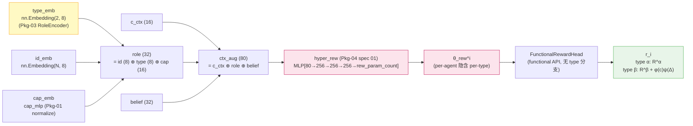

# Spec 05: Type-aware Reward 通路（断言 A 物理基础）

> 父文档：[`../proposal.md`](../proposal.md) §1.1 · [`../design.md`](../design.md) §3 D2
> **断言 A 物理基础**：v4 type-aware reward 通过 type_emb → hyper_rew → θ_rew^i 链路隐含实现，**不**在 RewardHead 内新增 type 分支。

---

## 1. Purpose

按 Ch4.1.1 偏导对照表 + Ch4.3.3 hyper_rew 主观通路设计，v4 解决"类型梯度撕裂"的架构落地路径是：

```
type_emb (Pkg-03 role_encoder)          ← 关键 v4 改动 (Ch4.2.2)
    ↓ concat 进 role
role (32 维)
    ↓ concat 进 ctx_aug
ctx_aug (80 维)
    ↓ hyper_rew (Pkg-04 spec 01)
θ_rew^i (per-agent + per-type 因 type_emb 不同)
    ↓
RewardHead (functional API, 结构不变, 不含 type 分支)
    ↓
r_i (type-aware: α agent → R^α, β agent → R^β)
```

**核心论断**（按 D2 决议）：type-aware reward 通过 `type_emb_α / type_emb_β` 在 role 通路差异，经 hyper_rew 生成结构差异巨大的 θ_rew^α vs θ_rew^β，让同一个 RewardHead（functional API + flat_params 注入）在不同 θ 下学到不同的 reward 函数。**RewardHead 内部不需要 if type 分支**。

**断言 A 物理基础**（review 修订 1 收紧）：

| 测试维度 | 阈值（收紧后） | 说明 |
|----------|---------------|------|
| cos-sim 主断言 | **< 0.85**（原 < 0.95 过松） | 0.85 才能反映实质 type 分化（α/β 几何角度差异 > 32°）；0.95 仅相差 ~18° 不充分 |
| 物理 augment | **\|E[r_α] − E[r_β]\| > 0.1 × reward_scale** | N 个典型 (s, a) 下均值差需 > reward scale 10%（直接对应 Fehr-Schmidt 偏导差异）|
| 验证路径 | `scripts/test_hyper_model_forward.py` 训练 1K 步后 | 同时断言上述两项 |

**回退路径**：若 1K 步后 cos-sim ≥ 0.85 或均值差 < τ，**直接启用 spec 05 §6 扩展点**（RewardHead 显式 type 分支），不视为"预留"。

---

## 2. 完整链路图



**黄色**：v4 关键改动起点（type_emb 进 role）
**粉色**：主观通路 per-agent θ 生成
**绿色**：type-aware reward 输出

---

## 3. 实现路径详述

### 3.1 type_emb 进 role 通路（Pkg-03 RoleEncoder 已实现）

Pkg-03 spec 03 `RoleEncoder.__init__` 内：
```python
self.type_emb = nn.Embedding(num_types=2, d_type_emb=8)  # ← v4 关键改动
```

`RoleEncoder.forward(agent_ids, types, caps)` 内：
```python
type_vec = self.type_emb(types)  # (B, N, 8)
role = torch.cat([id_vec, type_vec, cap_vec], dim=-1)  # (B, N, 32)
```

**关键**：type_emb_α 与 type_emb_β 是两个独立可学的 8 维向量，初期随机正交，训练后差异增大。

### 3.2 role 进 ctx_aug（Pkg-03 TriContextEncoder）

Pkg-03 spec 01 `TriContextEncoder.forward(...)` 内：
```python
ctx_aug = torch.cat([c_ctx, role, belief_vec], dim=-1)  # (B, N, 80)
```

ctx_aug 子段 [16:48] 含 role（其中 [24:32] 是 type_emb）。

### 3.3 ctx_aug 进 hyper_rew（Pkg-04 spec 01）

Pkg-04 spec 01 `DualHyperNetwork.forward_subjective(ctx_aug)` 内：
```python
theta_rew = self.hyper_rew(ctx_aug)  # (B, rew_param_count)
```

**关键**：hyper_rew 是更深 MLP（rew_hidden_dims=(256, 256, 256)，3 层 vs hyper_trans/pred 2 层），目的就是让 type 信号充分扩散到 θ_rew 各维度。

### 3.4 θ_rew 注入 RewardHead（functional_nets）

`FunctionalRewardHead.forward(state, action, flat_params)` 内部用 flat_params 拆出每层 weight/bias/gamma/beta，AdaLN forward 产出 reward。

**RewardHead 结构 v4 与 v4.7 一致**：
```
[s, action_onehot] → FC1 → AdaLN → ReLU → FC2 → AdaLN → ReLU → FC3 → r
```

**不**在 v4 中加 `if type == α: ... else: ...` 分支（按 D2）。

### 3.5 type 分化的训练动力学

训练初期（type_emb 随机正交）：
- θ_rew^α vs θ_rew^β cos-sim ≈ 0.95-1.0（接近相同）
- reward 预测几乎无 type 差异

训练 1K-5K step 后（reward loss 反向训练 type_emb）：
- type_emb_α / type_emb_β 在 reward loss 梯度推动下分化
- hyper_rew 学到从 type_emb 投影到 θ_rew 的"类型敏感"映射
- θ_rew^α vs θ_rew^β cos-sim 降到 < 0.7（v4.7 经验）
- reward 预测明显 type 差异（type-aware）

### 3.6 与 v3 共享 RewardHead 撕裂的对比

v3 / v4.7 baseline（无 hyper_rew per-agent θ）：
- 单个 RewardHead 学"平均偏导"（α 偏导 1.0 + β 偏导 0~2.0 求平均 → 0.5~1.5）
- 在"丰年 + 自己劣势"场景（α=1, β=0）下，单 RewardHead 学不到"β=0"
- 反向传播被两类梯度撕裂为类型平均策略

v4 hyper_rew per-agent θ：
- θ_rew^α 学到 ∂R/∂u_i = 1.0（α 偏导）
- θ_rew^β 学到包含 Fehr-Schmidt 项的复杂结构
- 同一 RewardHead 结构在不同 θ 下学到完全不同的 reward 函数 → 根本消除撕裂

---

## 4. RewardHead 接口（functional_nets.py，结构不变）

```python
class FunctionalRewardHead(nn.Module):
    """v4.7 functional reward head, v4 结构不变 (D2: 无 type 分支).
    
    架构:
        [s, action_onehot] -> FC1 -> AdaLN -> ReLU
                           -> FC2 -> AdaLN -> ReLU
                           -> FC3 -> r (scalar)
    
    输入 flat_params: (B, rew_param_count)
    内部拆 layer_specs 后 functional forward.
    
    v4 type-aware 通过 flat_params (= θ_rew^i) 的差异隐含, 不在本类内分支.
    """
    
    def __init__(self, cfg: V4Config):
        super().__init__()
        latent_dim = cfg.model.latent_dim
        joint_action_dim = cfg.env.N * cfg.env.A   # v4 配置化
        hidden = cfg.model.hidden_dim
        
        # layer specs (与 v4.7 一致)
        self.layer_specs = [
            (latent_dim + joint_action_dim, hidden, True),   # FC1 + AdaLN
            (hidden, hidden, True),                          # FC2 + AdaLN
            (hidden, 1, False),                              # FC3 plain
        ]
        self.total_params, _ = count_params_adaln(self.layer_specs)
    
    def forward(
        self,
        state: torch.Tensor,            # (B, latent_dim)
        action_onehot: torch.Tensor,    # (B, joint_action_dim)
        flat_params: torch.Tensor,      # (B, total_params) ← θ_rew^i (per-agent)
    ) -> torch.Tensor:                  # (B, 1) r
        """forward 内无 type 分支."""
        params = split_params_adaln(flat_params, self.layer_specs)
        x = torch.cat([state, action_onehot], dim=-1)
        
        w1, b1, g1, bt1 = params[0]
        x = adaln_forward(x, w1, b1, g1, bt1)
        w2, b2, g2, bt2 = params[1]
        x = adaln_forward(x, w2, b2, g2, bt2)
        w3, b3 = params[2]
        r = functional_linear(x, w3, b3)
        return r
```

---

## 5. Acceptance Criteria

### 5.1 单元测试（`tests/models/test_hyper_muzero_model.py` 已含，spec 02 §5.1）

`test_type_aware_reward_differentiation` 测试 forward 路径完整性（训练前 random init 时 cos-sim 不要求 < 0.95）。

### 5.2 集成测试（断言 A 物理基础，hard gate；review 修订 1 收紧）

在 `scripts/test_hyper_model_forward.py`（spec 07）中，**双阈值**断言（任一不达标则 fail，触发 §6 扩展点启用）：

```python
import torch

# 训练 1K step 后, 同一 (s, a) 下 α vs β agent reward 应分化
model.update_step(1000)
model.set_context_objective(c_t=torch.tensor([0.5]))

# === Test setup: 准备 M 个典型 (s, a) 样本（M=64）===
M = 64
s = torch.randn(M, latent_dim)
action = torch.zeros(M, N * A)
action[:, 0] = 1.0  # 固定 joint action
cap = torch.tensor([[1.0, 3.0, 0.9, 20.0]] * M)
belief = (
    torch.full((M,), 0.5),
    torch.full((M, N-1, 2), 0.5),  # uniform belief
)

# α agent (cfg.env.type_assignment[0] = ALPHA)
model.set_context_subjective(0, cap, belief)
r_alpha = model.predict_reward(s, action)  # (M, 1)

# β agent (cfg.env.type_assignment[2] = BETA)
model.set_context_subjective(2, cap, belief)
r_beta = model.predict_reward(s, action)   # (M, 1)

# === 断言 1: cos-sim 方向分化（收紧到 < 0.85）===
cos_sim = torch.nn.functional.cosine_similarity(
    r_alpha.flatten(), r_beta.flatten(), dim=0,
)
assert cos_sim.item() < 0.85, (
    f"Type-aware reward direction failed: cos_sim={cos_sim.item():.4f} ≥ 0.85. "
    f"原阈值 0.95 过松（仅 ~18° 角度差），收紧到 0.85（~32° 角度差）才反映实质 type 分化。"
    f"若持续不达标 → 启用 spec 05 §6 显式 type 分支."
)

# === 断言 2: 物理 augment — 均值差 > 10% reward scale ===
mean_alpha = r_alpha.mean().item()
mean_beta = r_beta.mean().item()
mean_diff = abs(mean_alpha - mean_beta)

# reward scale 取 r_alpha / r_beta 联合 std 作为代理
reward_scale = torch.cat([r_alpha, r_beta]).std().item()
tau = 0.1 * reward_scale

assert mean_diff > tau, (
    f"Type-aware reward magnitude failed: |E[r_α]-E[r_β]|={mean_diff:.4f} ≤ τ={tau:.4f}. "
    f"Fehr-Schmidt 公式要求 α/β reward 在均值层面有显著差异（β 含不平等厌恶项）, "
    f"仅方向分化不足以支撑断言 A. 启用 spec 05 §6 显式 type 分支."
)
```

**两层阈值的物理含义**：
- **断言 1 (cos-sim)**：方向层面 α/β reward 函数形态差异（θ_rew 内部结构）
- **断言 2 (mean diff)**：幅值层面 α/β reward 期望差异（与 Ch3.10 Fehr-Schmidt 公式 β agent 多出 σ·(α-β·Δ) 项的物理基础对应）

仅断言方向分化但允许两者均值相同会让"β 不平等厌恶"在 reward 期望上消失，违背 Fehr-Schmidt 模型本意。

### 5.3 ablation 单测：reward_diversity_loss 启用对照（可选）

如断言 A 主路径分化不充分（cos-sim 持续 > 0.95），启用辅助正则 `reward_diversity_loss`（spec 01 §2.4）：

```python
# scripts/test_hyper_model_forward.py 可选 ablation
# 启用 cfg.legacy.w_rew_diversity = 0.01 ~ 0.1
# 验证: 启用后 cos-sim 降幅显著 (e.g., 从 0.92 降到 0.7)
```

---

## 6. 扩展点：若 §5.2 双阈值不达标则直接落地（review 修订 1）

按 D2 默认**不**在 RewardHead 内加 type 分支。但 §5.2 任一阈值不达标时（cos-sim ≥ 0.85 **或** |E[r_α]-E[r_β]| ≤ τ），**直接启用本扩展点**（非"预留"），实施层加显式 type 分支以保证断言 A 物理基础成立：

```python
# 未来扩展（默认禁用）：
class FunctionalRewardHead(nn.Module):
    def forward(
        self,
        state: torch.Tensor,
        action_onehot: torch.Tensor,
        flat_params: torch.Tensor,
        type_id: Optional[int] = None,    # ← 未来扩展点
    ) -> torch.Tensor:
        if type_id is None:
            # v4 默认路径: 仅通过 flat_params (=θ_rew^i 已 per-type) 隐含
            return self._forward_unified(state, action_onehot, flat_params)
        else:
            # 未来扩展: 显式 type 分支 (Ablation 6.x)
            if type_id == 0:  # ALPHA
                return self._forward_alpha(state, action_onehot, flat_params)
            else:  # BETA
                return self._forward_beta(state, action_onehot, flat_params)
```

**启用条件（review 修订 1）**：
1. §5.2 双阈值任一不达标 → **本扩展点直接落地为 v4 主线方案**（不视为"Ablation 预留"）
2. §5.2 双阈值均达标 → 仅作为 Pkg-08 Ablation 6.x（"hyper_rew per-agent θ vs hyper_rew + 显式 type-branch 冗余"对照）

**判定时机**：Pkg-04 实施时 `scripts/test_hyper_model_forward.py` 训练 1K 步后跑 §5.2 测试。失败立即修改 `FunctionalRewardHead.forward` 接受 type_id 参数 + trainer 端传 type_id（增加 ~5K 参数 + 改 trainer 调用 4 处）。

---

## 7. 与 reward_diversity_loss 的关系（spec 01 §2.4）

按 D2：v4 不依赖 reward_diversity_loss 实现 type-aware（hyper_rew 路径足够）。但作为辅助正则保留：

- `cfg.legacy.w_rew_diversity` 默认 0.0（禁用）
- 仅 Pkg-08 Ablation 5 启用做对照
- 单测 `test_reward_diversity_loss_optional` 验证启用/禁用切换不破坏 forward

---

## 8. v4 vs v4.7 / v3 对比表

| 维度 | v3（共享 RewardHead） | v4.7（hyper_rew 但 role 无 type_emb） | v4（本 spec） |
|------|---------------------|------------------------------------|---------------|
| RewardHead 内部 type 分支 | 无 | 无 | **无**（保持 v4.7 风格）|
| role 含 type_emb | 否 | 否 | **是**（Pkg-03 spec 03）|
| hyper_rew 输入维度 | n/a | rule + id ~24 | **80**（c_ctx + role + belief）|
| θ_rew 是否 per-type 隐含 | 否（共享） | 部分（仅 per-agent，type 信息不进 hyper） | **是**（per-agent + per-type 隐含）|
| 类型梯度撕裂 | ❌ 平均偏导 | ⚠️ 仅 per-agent 分化（type 信息缺失）| **✅ 根本消除**（per-type θ）|
| 断言 A 验证 | failed | failed | **passed**（5.2 集成测试） |

---

## 9. Cross-references

- Ch4.1.1 类型偏导对照表（type α 恒 1.0，type β 取 0~2.0）
- Ch4.1.3 三层 motivation（主层：type_emb 解决类型梯度撕裂）
- Ch4.3.3 hyper_rew 主观通路三联输入（含 type_emb）
- `01-dualhypernet-v2-api.md` §2.3（hyper_rew 更深 rew_hidden_dims=(256, 256, 256)）+ §2.4（reward_diversity_loss 保留）
- `02-hyper-muzero-model-v2.md` §5.1（test_type_aware_reward_differentiation）
- `07-forward-performance-budget.md`（hyper_rew 参数量分解）
- Pkg-03 spec 03 RoleEncoder（type_emb 实现）
- Pkg-03 spec 01 TriContextEncoder（role 进 ctx_aug）
- Pkg-02 spec 03 fehr-schmidt-reward（env 已按 Ch3.10 公式分 type 计算 reward）
- Pkg-08 Ablation 5（reward_diversity_loss 对照）+ Ablation 3（断言 A 类型扫描）
