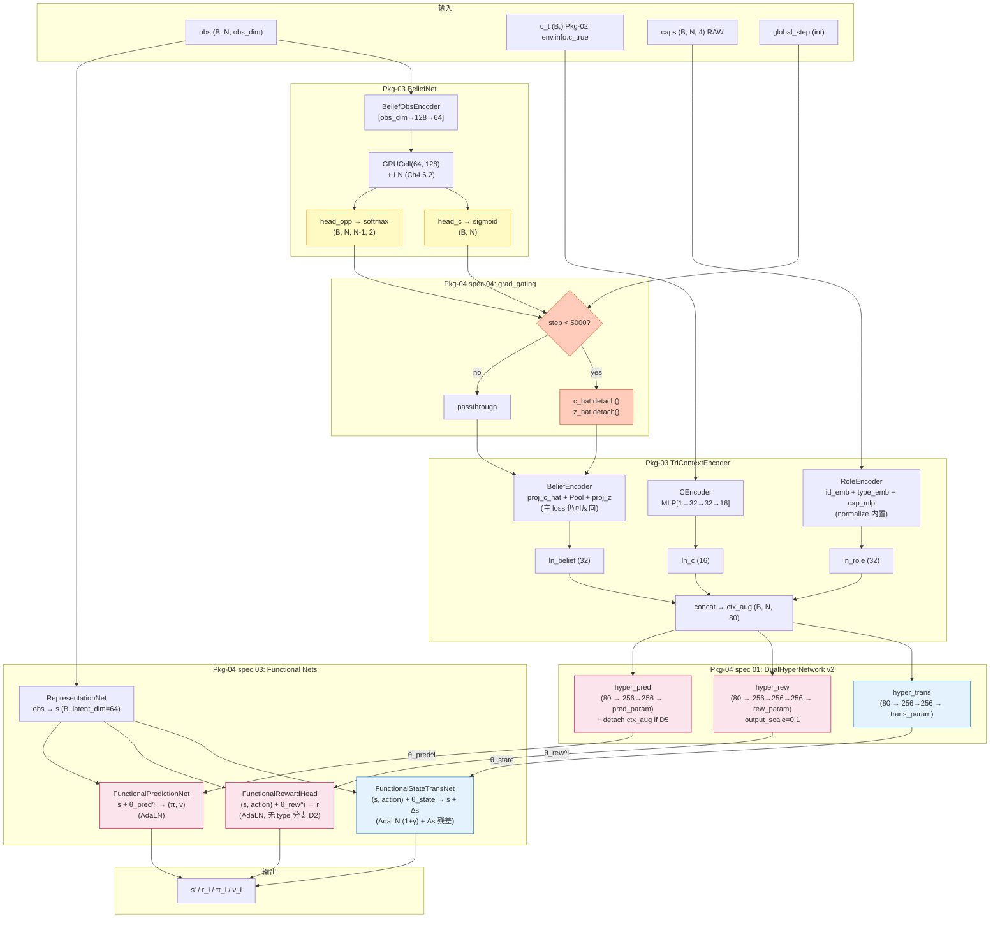

# Spec 06: 数据流图 + 张量 Shape 对照表 + N agents 调用顺序

> 父文档：[`../design.md`](../design.md) §6.2 · 参考 Ch4.3.1
> **本 spec 是 Pkg-04 6 个模块（RepNet / BeliefNet / TriContextEncoder / DualHyperNetwork / Functional* / grad_gating）协同的可视化总图**

---

## 1. Purpose

按 Ch4.3.1 数据流总图，绘制 v4 完整数据流：

1. **客观流**（所有 agent 共享）：obs → RepNet → s → StateTransNet → s'（使用 θ_state 共享）
2. **主观流**（per-agent N 次）：obs → BeliefNet → (c_hat, z_hat) → [.detach() if step<5K] → BeliefEncoder → ctx_aug → hyper_rew/hyper_pred → θ_rew^i / θ_pred^i → RewardHead / PredictionNet
3. **梯度门控切断点**显式标注（spec 04）
4. **N agents 调用顺序**：update_step → set_context_objective → for k: set_context_subjective(k)

---

## 2. 完整数据流图



**图例**：
- **黄色**：Pkg-03 BeliefNet raw heads（梯度门控切断点）
- **橙色**：Pkg-04 grad_gating 模块（v4 新增防线 5）
- **粉色**：主观通路 per-agent（hyper_rew / hyper_pred / RewardHead / PredictionNet）
- **蓝色**：客观通路所有 agent 共享（hyper_trans / StateTransNet）

---

## 3. 张量 Shape 对照表

### 3.1 输入侧

| 张量 | Shape | dtype | 来源 |
|------|-------|-------|------|
| obs | (B, N, obs_dim) | float32 | Pkg-02 env.observation_space |
| c_t | (B,) or (B, 1) | float32 | Pkg-02 env.info["c_true"] |
| caps | (B, N, 4) | float32 RAW | Pkg-02 env.info["caps"] |
| agent_ids | (B, N) | int64 | trainer 构造 (range(N) broadcast) |
| types | (B, N) | int64 | cfg.env.type_assignment（Self-Info 严格，D6） |
| global_step | scalar int | int | trainer 传给 model.update_step |

### 3.2 BeliefNet 输出

| 张量 | Shape | dtype | 来源 |
|------|-------|-------|------|
| c_hat | (B, N) | float32 sigmoid | BeliefNet head_c |
| z_hat | (B, N, N-1, 2) | float32 softmax | BeliefNet head_opp |
| hidden | (B, N, 128) | float32 | BeliefNet GRU + LN |

### 3.3 TriContextEncoder 中间

| 张量 | Shape | dtype | 备注 |
|------|-------|-------|------|
| c_ctx | (B, 16) | float32 | CEncoder 输出（所有 agent 共享） |
| c_ctx_broadcast | (B, N, 16) | float32 | expand 到 N agents |
| role | (B, N, 32) | float32 | id (8) + type (8) + cap (16) |
| belief_vec | (B, N, 32) | float32 | proj_c_hat (16) + Pool(z_hat) → proj_z (16) |
| ctx_aug | (B, N, 80) | float32 | concat 三路 |

### 3.4 DualHyperNetwork 输出

| 张量 | Shape | dtype | 备注 |
|------|-------|-------|------|
| θ_state | (B, trans_param_count) | float32 | 所有 agent 共享 |
| θ_rew^i | (B, rew_param_count) | float32 | per-agent (当前 set 的 agent) |
| θ_pred^i | (B, pred_param_count) | float32 | per-agent |

### 3.5 Functional Nets 输出

| 张量 | Shape | dtype | 备注 |
|------|-------|-------|------|
| s | (B, latent_dim=64) | float32 | RepNet（所有 agent 共享） |
| s_next | (B, latent_dim) | float32 | StateTransNet（s + Δs，C6） |
| r | (B, 1) | float32 | RewardHead（per-agent） |
| π | (B, A) | float32 logits | PredictionNet policy head |
| v | (B, 1) | float32 | PredictionNet value head |
| joint_action_onehot | (B, N*A) | float32 | C14：N agents 平铺 |

---

## 4. N agents 调用顺序（trainer / planner 标准模式）

### 4.1 trainer 单 train_step 模式（spec 02 §2.3 已给伪代码）

```
1. model.update_step(global_step)                           # ← 一次性
   ├─ 触发 grad_gating 阈值判断（前 5K step 切断）

2. obs = batch["obs"]
   s = model.encode(obs)                                    # 客观, 一次

3. model.set_context_objective(c_t=batch["c_t"])            # ← 一次性
   ├─ 计算 θ_state（所有 agent 共享）
   ├─ 缓存 self._cached_c_t（供 set_context_subjective 复用）
   ├─ 清空 self._theta_rew / self._theta_pred 缓存

4. for k in range(N):                                       # ← 循环 N 次
       model.set_context_subjective(                        # 切 agent
           agent_id=k,
           cap_i=batch["cap"][:, k],
           belief=(c_hat[:, k], z_hat[:, k]),
       )
       ├─ self.grad_gating.apply(c_hat, z_hat, self._step)
       ├─ 重建 ctx_aug_k via TriContextEncoder（仅 N=1 输入退化）
       ├─ θ_rew^k, θ_pred^k = hyper_net.forward_subjective(ctx_aug_k)
       
       r_k = model.predict_reward(s, action)                # 用 θ_rew^k
       pi_k, v_k = model.predict(s)                         # 用 θ_pred^k

5. K-step unroll:
   for unroll_t in range(K):
       s = model.transition(s, action)                      # 客观 (复用 θ_state)
       for k in range(N):
           # step 4 重复
```

### 4.2 worker 在线推断模式（不调 update_step）

```
1. obs, info = env.reset()
   prev_hidden = model.belief_net.init_hidden(B=1, N=N)

2. for t in range(T):
       # BeliefNet step（worker 不需要 trainer 的 update_step，model._step 保持上次值）
       prev_hidden, c_hat, z_hat = model.belief_net.step(obs, prev_hidden)
       
       s = model.encode(obs)
       
       model.set_context_objective(c_t=info["c_true"])
       
       for k in range(N):
           model.set_context_subjective(
               agent_id=k,
               cap_i=torch.tensor([info["caps"][k]]),
               belief=(c_hat[0, k:k+1], z_hat[0, k:k+1]),
           )
           pi_k, v_k = model.predict(s)
           action[k] = sample_from(pi_k)
       
       obs, _, done, _, info = env.step(action)
```

### 4.3 mve_planner.py 模式（v4.7 → v4 迁移，spec 08 §3）

```
def sample_mve_plan(model, root_s, ...):
    # planner 入口 (替代 v4.7 mve_planner.py:71 之前的初始化)
    model.set_context_objective(c_t=rule_exp)               # ← 一次
    
    for j in agent_order:                                   # ← Per-Agent Coordinate Descent
        model.set_context_subjective(j, cap[j], belief[j])  # 切 agent
        
        # 后续 logits / reward / value 调用（v4.7 mve_planner.py:71-258 对应位置）
        logits_j, _ = model.predict(curr_s)
        # ...
```

**关键迁移**：v4.7 在循环内 4 次 `model.set_context(rule_exp, id)` → v4 改为 1 次 `set_context_objective(c_t)` + N 次 `set_context_subjective(j, ...)`。性能优化 ~30%（spec 02 §3.1）。

---

## 5. 梯度反向路径分析（与 spec 04 协作）

### 5.1 step < 5000（gating active）

```
main loss (reward MSE + value MSE + policy CE)
    ↓
r / π / v
    ↓
RewardHead / PredictionNet 参数 ✅ 反向
    ↓
θ_rew^i / θ_pred^i
    ↓
hyper_rew / hyper_pred 参数 ✅ 反向
    ↓
ctx_aug
    ↓
ln_c / ln_role / ln_belief 参数 ✅ 反向
    ↓
[CEncoder / RoleEncoder / BeliefEncoder] 参数 ✅ 反向
    ↓
c_t / role / belief_vec
    ↓
BeliefEncoder → [Pool → z_hat] → ❌ .detach() 切断 ← spec 04 防线 5
```

**结果**：BeliefNet (GRU + heads) 参数**不**被 main loss 更新；BeliefEncoder + hyper + Functional + LN 等所有其他参数正常更新。

### 5.2 step >= 5000（gating inactive）

```
main loss → ... → BeliefEncoder → c_hat / z_hat → BeliefNet (GRU + heads) 参数 ✅ 反向
```

所有参数（含 BeliefNet）均由 main loss 反向更新。

### 5.3 独立 L_belief loss（始终有效）

```
L_belief (L_c + L_opp + L_div) → BeliefNet 参数 ✅ 反向（独立路径）
```

BeliefNet 自身始终由 L_belief 更新（不受 grad gating 影响）。

---

## 6. 关键数据流不变量

| 不变量 | 验证位置 |
|--------|---------|
| 所有 agent 共享同一 RepNet 参数 | spec 02 + spec 03 |
| 所有 agent 共享同一 BeliefNet 参数（独立 hidden state） | Pkg-03 spec 04 |
| 所有 agent 共享同一 θ_state（hyper_trans 仅 c_ctx） | C1, spec 01 + spec 02 |
| θ_rew^i / θ_pred^i per-agent（hyper_rew/pred 接 80 维 ctx_aug） | C2, spec 01 |
| BeliefEncoder 投影 MLP 始终由 main loss 训练（即使 belief grad gating active） | spec 04 §3.2 + Pkg-03 spec 01 P5 |
| StateTransNet 预测 Δs（s_next = s + Δs） | C6, spec 03 §2.3 |
| AdaLN (1+γ) factor 保留 | C7, spec 03 §2.2 |
| z_hat 顺序 agent_id 升序跳过 self | C12, Pkg-01 spec 04 + Pkg-03 spec 05 + spec 06 + spec 08 |
| Self-Info 严格（types 来自 cfg.env.type_assignment） | C11, spec 02 §3.7 |

---

## 7. Cross-references

- Ch4.3.1 数据流总图（v4 完整版）
- Ch4.4 六大网络客观-主观分工
- `01-dualhypernet-v2-api.md`（hyper_trans / hyper_rew / hyper_pred）
- `02-hyper-muzero-model-v2.md`（5 API 调用模式 + ModelConfig 字段穷举）
- `03-stability-safeguards-preservation.md`（AdaLN / Δs 残差 / output_scale）
- `04-belief-gradient-gating.md`（梯度门控切断点详述）
- `05-type-aware-reward.md`（type-aware 链路图细节）
- `07-forward-performance-budget.md`（性能预算 + 参数量）
- `08-integration-contracts.md` §3（v4.7 → v4 迁移行号）
- Pkg-03 spec 01/04/05/06/08（TriContextEncoder + BeliefNet + BeliefEncoder + 集成契约）
