# Spec 05: Loss Composition — 双路径 backward + main + L_belief 加权

> 父文档：[`../proposal.md`](../proposal.md) §2.2.2 + R5-5 · [`../design.md`](../design.md) §3 D5 · §6.6
> **review 修订 2 核心**：双路径独立张量（main 受 grad_gating / L_belief 始终不受影响）+ 强制实现顺序 + 两条单测验证。

---

## 1. Purpose

按 Pkg-04 spec 04 双层 detach 设计 + Pkg-03 spec 06 belief_loss API + Pkg-04 澄清 1（model 不暴露 compute_losses）实现 `compose_total_loss` 函数（D5 抽出独立模块）。

**核心约束（review 修订 2 强制顺序）**：
1. BeliefNet.forward 一次 forward 拿带 grad 的 c_hat / z_hat
2. belief_loss 用**原图** c_hat / z_hat 算 L_belief
3. model.set_context_subjective 把**同一张量**传入（model 内部按 step 决定 detach）
4. L_total = L_main + λ_b · L_belief，一次 backward 同时反传两路径

**禁止反模式**：先 detach 再算 L_belief。

---

## 2. Interface

### 2.1 文件路径

`hyper_mve/training/loss_composition.py`（新增）

### 2.2 函数签名（review 修订 1：trainer 参数取 scheduler）

```python
import torch
import torch.nn.functional as F
from typing import TYPE_CHECKING
from hyper_mve.configs import V4Config
from hyper_mve.models import HyperMuZeroModel
from hyper_mve.models.belief_losses import belief_loss, l_c, l_opp, l_div

if TYPE_CHECKING:
    from hyper_mve.training.muzero_trainer import MuZeroTrainer


def compose_total_loss(
    model: HyperMuZeroModel,
    batch: dict[str, torch.Tensor],
    trainer: "MuZeroTrainer",         # review 修订 1: 从 trainer.scheduler 取 scheduler
    global_step: int,
    cfg: V4Config,
) -> dict[str, torch.Tensor]:
    """主 loss + L_belief 双路径拼装 (review 修订 2 强制顺序).
    
    返回 dict[str, Tensor]:
        "total":      total loss (一次 backward 同时反传两路径)
        "main":       w_policy·L_π + w_value·L_v + w_reward·L_r + w_consist·L_BYOL
        "belief":     L_c + L_opp + L_div
        "lambda_b":   课程加权系数 (标量, = trainer.scheduler.lambda_b(global_step))
        "policy" / "value" / "reward" / "consist": main 分量
        "belief_c" / "belief_opp" / "belief_div": belief 分量
    """
    sched = trainer.scheduler
    target_model = trainer.target_model
    
    B = batch["obs"].shape[0]
    K = cfg.train.unroll_K
    N = cfg.env.N
    A = cfg.env.A
    
    # ================================================================
    # Step 1: BeliefNet.forward 一次 forward 拿带 grad 的 c_hat / z_hat
    # ================================================================
    # 训练时按 Stage 注入 oracle_z_seq (Stage 1/2)
    mixing_w = sched.oracle_z_mixing_weight(global_step)
    if mixing_w > 0:
        oracle_z_seq = sched.build_oracle_z_seq(batch["tau"])  # (B, K+1, N, N-1, 2)
    else:
        oracle_z_seq = None
    
    # BeliefNet.forward 输出 (B, K+1, N) for c_hat, (B, K+1, N, N-1, 2) for z_hat
    # 注: 这是训练时序列 forward (区别于 worker 用的 step API), Pkg-03 spec 04
    c_hat_raw, z_hat_raw, belief_hidden = model.belief_net.forward(
        batch["obs"],                       # (B, K+1, N, obs_dim)
        oracle_z_seq=oracle_z_seq,          # Stage 1/2 时 (B, K+1, N, N-1, 2); Stage 3 None
        oracle_mixing_weight=mixing_w,      # Stage 1: 1.0 / Stage 2 anneal / Stage 3: 0.0
    )
    # c_hat_raw shape (B, K+1, N), z_hat_raw shape (B, K+1, N, N-1, 2)
    # ★ 这些张量带 grad, 是后续 L_belief + main 两路径的共同来源
    
    # ================================================================
    # Step 2: L_belief 用原图 c_hat_raw / z_hat_raw 算 (不经 model.set_context_*)
    # ================================================================
    L_belief = belief_loss(
        c_hat_raw, z_hat_raw, belief_hidden,
        c_true=batch["c_t"],                # (B, K+1)
        types_true=batch["tau"],            # (B, K+1, N)
        w_c=cfg.train.w_belief_c,
        w_opp=cfg.train.w_belief_opp,
        w_div=cfg.train.w_belief_div,
        target_std=cfg.train.belief_div_target_std,
    )
    # L_belief 包含 L_c + L_opp + L_div 加权, 见 Pkg-03 spec 06
    
    # 同时计算 sub-losses 用于日志
    L_c_val = l_c(c_hat_raw, batch["c_t"])
    L_opp_val = l_opp(z_hat_raw, batch["tau"])
    L_div_val = l_div(c_hat_raw, target_std=cfg.train.belief_div_target_std)
    
    # ================================================================
    # Step 3: main 路径 — 经 model.set_context_subjective (内部按 step detach)
    # ================================================================
    # 取首步 obs encode 为 s
    s = model.encode(batch["obs"][:, 0])    # (B, latent_dim) 首步
    
    # K-step unroll 累积 main loss
    L_policy = torch.tensor(0.0, device=s.device)
    L_value = torch.tensor(0.0, device=s.device)
    L_reward = torch.tensor(0.0, device=s.device)
    L_consist = torch.tensor(0.0, device=s.device)
    
    # set_context_objective 每 K-step unroll 起点一次 (C5-T2)
    c_t_root = batch["c_t"][:, 0]           # (B,)
    model.set_context_objective(c_t_root)
    target_model.set_context_objective(c_t_root)
    
    # K-step unroll
    s_pred = s
    for k_step in range(K):
        # action one-hot (joint, shape (B, N*A))
        action_k = batch["actions"][:, k_step]  # (B, N)
        action_onehot = _joint_action_onehot(action_k, A)  # (B, N*A)
        
        # 客观 transition (复用 θ_state, 共享 N agents)
        s_pred = model.transition(s_pred, action_onehot)   # (B, latent_dim)
        
        # 计算 target v 用 target_model bootstrap (v4.4)
        with torch.no_grad():
            s_target = target_model.encode(batch["obs"][:, k_step + 1])
        
        # per agent 累积 main loss
        for agent_id in range(N):
            cap_k = batch["cap"][:, k_step, agent_id]      # (B, 4)
            # ★ 注: 这里把 c_hat_raw / z_hat_raw 同一张量 传入 model
            # model.set_context_subjective 内部按 self._step 决定是否 detach
            # (Pkg-04 spec 04 双层 detach: apply_raw + apply_ctx)
            model.set_context_subjective(
                agent_id=agent_id,
                cap_i=cap_k,
                belief=(c_hat_raw[:, k_step, agent_id], z_hat_raw[:, k_step, agent_id]),
            )
            target_model.set_context_subjective(
                agent_id=agent_id,
                cap_i=cap_k,
                belief=(c_hat_raw[:, k_step, agent_id].detach(),   # target 不接 grad
                        z_hat_raw[:, k_step, agent_id].detach()),
            )
            
            # forward: π / v / r
            pi_logits_k = model.predict(s_pred)[0]      # (B, A)
            v_k = model.predict(s_pred)[1]               # (B, 1)
            r_k = model.predict_reward(s_pred, action_onehot)  # (B, 1)
            
            # target v_target via target_model
            with torch.no_grad():
                v_target_k = target_model.predict(s_target)[1]  # (B, 1)
            
            # losses (per agent, 累积到 batch loss)
            pi_target = batch["pi_mve"][:, k_step + 1, agent_id]   # (B, A) 来自 buffer
            L_policy = L_policy + cfg.train.w_policy * F.cross_entropy(pi_logits_k, pi_target.argmax(-1))
            
            v_n_step = trainer.compute_n_step_return(
                batch["rewards"][:, k_step:k_step + cfg.train.n_step + 1, agent_id],
                v_target_k,
                batch["dones"][:, k_step:k_step + cfg.train.n_step + 1],
                n=cfg.train.n_step,
            )[:, 0]  # (B,)
            L_value = L_value + cfg.train.w_value * F.mse_loss(v_k.squeeze(-1), v_n_step.detach())
            
            r_target = batch["rewards"][:, k_step + 1, agent_id]   # (B,)
            L_reward = L_reward + cfg.train.w_reward * F.mse_loss(r_k.squeeze(-1), r_target)
        
        # L_BYOL consistency (BYOL projector, 若启用)
        if trainer.projector is not None:
            with torch.no_grad():
                s_target_proj = trainer.projector(s_target)
            s_pred_proj = trainer.projector(s_pred)
            L_consist = L_consist + cfg.train.w_consist * _byol_loss(s_pred_proj, s_target_proj)
    
    # main loss 归一化 (B × K × N 三维平均)
    L_main = (L_policy + L_value + L_reward + L_consist) / (K * N)
    
    # ================================================================
    # Step 4: total = main + λ_b · L_belief, 一次 backward 同时反传两路径
    # ================================================================
    lambda_b_val = sched.lambda_b(global_step)
    L_total = L_main + lambda_b_val * L_belief
    
    return {
        "total": L_total,
        "main": L_main,
        "belief": L_belief,
        "lambda_b": torch.tensor(lambda_b_val),
        "policy": L_policy / (K * N),
        "value": L_value / (K * N),
        "reward": L_reward / (K * N),
        "consist": L_consist / (K * N),
        "belief_c": L_c_val,
        "belief_opp": L_opp_val,
        "belief_div": L_div_val,
    }


# ====================================================================
# 内部辅助
# ====================================================================

def _joint_action_onehot(actions: torch.Tensor, A: int) -> torch.Tensor:
    """actions (B, N) int → (B, N*A) one-hot flat."""
    B, N = actions.shape
    onehot = F.one_hot(actions, num_classes=A).float()  # (B, N, A)
    return onehot.reshape(B, N * A)


def _byol_loss(pred_proj, target_proj):
    """BYOL negative cosine similarity loss."""
    pred_norm = F.normalize(pred_proj, dim=-1, p=2)
    target_norm = F.normalize(target_proj, dim=-1, p=2)
    return -(pred_norm * target_norm).sum(dim=-1).mean()
```

---

## 3. Implementation Notes

### 3.1 双路径 backward 关键（review 修订 2）

**核心实现要求**：
1. **同一 BeliefNet.forward 输出** 同时供两路径用（不重复 forward）
2. **L_belief 路径**先用原图 c_hat_raw / z_hat_raw 计算（步骤 2）
3. **main 路径**把同一张量传 model.set_context_subjective（model 内部 grad_gating 按 step decide detach）
4. **一次 backward** 同时反传两条 autograd 链

```mermaid
flowchart LR
    OBS["batch[obs]<br/>(B, K+1, N, obs_dim)"]
    BNF["BeliefNet.forward<br/>(oracle_z_seq + mixing_w)"]
    CHAT["c_hat_raw / z_hat_raw<br/>(带 grad 原图)"]
    
    OBS --> BNF
    BNF --> CHAT
    
    %% 路径 A: L_belief (始终不 detach)
    CHAT --> BL["belief_loss<br/>L_c + L_opp + L_div"]
    BL --> LB["L_belief"]
    
    %% 路径 B: main (model 内 grad_gating 按 step detach)
    CHAT --> SCS["model.set_context_subjective<br/>(belief = c_hat_raw, z_hat_raw)"]
    SCS --> GG["BeliefGradGating<br/>apply_raw + apply_ctx<br/>(step < 5000 时 detach)"]
    GG --> HYP["hyper_rew / hyper_pred"]
    HYP --> HEAD["RewardHead / PredictionNet"]
    HEAD --> LM["L_main<br/>(policy + value + reward + consist)"]
    
    %% 合并
    LB --> TOT["L_total<br/>= L_main + λ_b · L_belief"]
    LM --> TOT
    TOT --> BWD["L_total.backward()<br/>一次反传"]
    
    style CHAT fill:#fff9c4,stroke:#F9A825
    style BL fill:#c8e6c9,stroke:#43A047
    style GG fill:#ffccbc,stroke:#FF5722
    style TOT fill:#bbdefb,stroke:#1976D2
```



**反向梯度分析**（review 修订 2）：

| step | 路径 | BeliefNet 参数 grad | BeliefEncoder 参数 grad |
|------|------|---------------------|-------------------------|
| step < 5000 | L_belief 路径 | ✅ 有（来自 L_c/L_opp/L_div）| ❌（L_belief 不经 BeliefEncoder）|
| step < 5000 | main 路径 | ❌（grad_gating apply_raw 切断）| ❌（grad_gating apply_ctx 切断 — Pkg-04 修订 3）|
| step ≥ 5000 | L_belief 路径 | ✅ 有（不受 gating）| ❌ |
| step ≥ 5000 | main 路径 | ✅ 有（gating passthrough）| ✅ 有 |

**结论**：
- step < 5000 时 BeliefNet 参数仅由 L_belief 训练（C5-L2 单测验证）
- step ≥ 5000 时 BeliefNet 参数由 L_belief + main loss 联合训练，grad_norm 大于纯 L_belief 来源

### 3.2 禁止反模式（review 修订 2）

```python
# ❌ 反模式 A: 先 detach 再算 L_belief
c_hat_detached = c_hat_raw.detach()
L_belief = belief_loss(c_hat_detached, ...)   # ★ BeliefNet 参数无法反传！

# ❌ 反模式 B: 先调 model.set_context_subjective 再算 L_belief
model.set_context_subjective(0, cap, (c_hat_raw, z_hat_raw))
# ↑ model 内部对 c_hat_raw / z_hat_raw 做 detach (step < 5000 时)
L_belief = belief_loss(c_hat_raw, ...)   # ★ 张量已被 detach!

# ❌ 反模式 C: BeliefNet.forward 调两次（一次给 L_belief 一次给 main）
c_hat1, _, _ = model.belief_net.forward(obs)
L_belief = belief_loss(c_hat1, ...)
c_hat2, _, _ = model.belief_net.forward(obs)
model.set_context_subjective(0, cap, (c_hat2, ...))
# ↑ 浪费 2x BeliefNet forward + 两次 forward 数值不同 (drop out 等)

# ✅ 正确模式 (本 spec §2.2):
c_hat_raw, z_hat_raw, _ = model.belief_net.forward(obs, oracle_z_seq=...)
L_belief = belief_loss(c_hat_raw, z_hat_raw, ...)     # 步骤 2: 用原图
for k in range(N):
    model.set_context_subjective(k, cap, (c_hat_raw[:, t, k], z_hat_raw[:, t, k]))
    # 步骤 3: 同一张量传 model, model 内 grad_gating 按 step decide detach
L_total = L_main + λ_b * L_belief
L_total.backward()
```

### 3.3 target_model 处理（v4.4 EMA bootstrap）

target_model 用于 n-step return bootstrap：
- target_model 同步调 set_context_objective + set_context_subjective（保证 θ_state / θ_rew/pred 一致）
- target_model 的 belief 参数 detach（target 不反传梯度）：
  ```python
  target_model.set_context_subjective(
      agent_id=k,
      cap_i=cap_k,
      belief=(c_hat_raw[:, k_step, k].detach(),    # target 显式 detach
              z_hat_raw[:, k_step, k].detach()),
  )
  ```
- target_model forward 在 `torch.no_grad()` 内（不需要梯度）

### 3.4 性能预算（参与 R5-1 400ms 总预算）

compose_total_loss 在 R5-1 分摊表中占用：
- model forward (N agents × K-step unroll) < 100 ms
- target_model forward (no_grad) < 50 ms
- BeliefNet.forward (oracle_z_seq 注入) < 30 ms
- belief_loss + main loss 累加 < 20 ms（纯 tensor 操作）

**合计 < 200 ms forward**，留 backward + optim 200 ms 完成 < 400 ms 总。

### 3.5 lambda_b 通常为常量（spec 04 §3.5）

`scheduler.lambda_b(step) = cfg.train.w_belief = 1.0` 默认全程恒定。
- L_total = L_main + 1.0 · L_belief 简单加权
- Pkg-08 ablation 可子类化 scheduler 给定 stage-dependent lambda_b

---

## 4. Edge Cases

| 场景 | 行为 |
|------|------|
| batch 缺少必需字段（如 c_t / tau）| KeyError + 明确提示 |
| Stage 1 时 mixing_w = 1.0 但 BeliefNet.forward 不支持 oracle_mixing_weight 参数 | 由 Pkg-03 spec 04 BeliefNet.forward 决定（若不支持需 Pkg-03 spec 04 同步） |
| projector 为 None | L_consist = 0（跳过 BYOL）|
| K = 0（极端 cfg）| L_main = 0；L_belief 仍计算（K=0 unroll 仅 step 0 belief） |
| target_model 与 model 参数 dim 不匹配 | target_model._update 时 raise（spec 07） |
| BeliefNet.forward 返回 c_hat NaN | belief_loss 抛 NaN（Pkg-03 spec 06 处理）|

---

## 5. Acceptance Criteria

### 5.1 单元测试（`tests/training/test_loss_composition.py`）

```python
import pytest
import torch
from hyper_mve.configs import V4Config
from hyper_mve.models import HyperMuZeroModel
from hyper_mve.training import MuZeroTrainer
from hyper_mve.training.loss_composition import compose_total_loss


@pytest.fixture
def cfg_medium():
    return V4Config.from_preset("medium")


@pytest.fixture
def model(cfg_medium):
    return HyperMuZeroModel(cfg_medium)


@pytest.fixture
def trainer(cfg_medium, model):
    return MuZeroTrainer(cfg_medium, model)


def _make_batch(cfg, device="cpu"):
    B, K, N, A = cfg.train.batch_size, cfg.train.unroll_K, cfg.env.N, cfg.env.A
    return {
        "obs": torch.randn(B, K+1, N, 99, device=device),
        "actions": torch.zeros(B, K+1, N, dtype=torch.long, device=device),
        "rewards": torch.randn(B, K+1, N, device=device),
        "c_t": torch.full((B, K+1), 0.5, device=device),
        "cap": torch.rand(B, K+1, N, 4, device=device),
        "c_hat": torch.rand(B, K+1, N, device=device),
        "z_hat": torch.softmax(torch.randn(B, K+1, N, N-1, 2, device=device), dim=-1),
        "tau": torch.zeros(B, K+1, N, dtype=torch.long, device=device),
        "pi_mve": torch.softmax(torch.randn(B, K+1, N, A, device=device), dim=-1),
        "v": torch.randn(B, K+1, N, device=device),
        "delta": torch.randn(B, K+1, N, device=device),
        "dones": torch.zeros(B, K+1, dtype=torch.bool, device=device),
    }


# ====== loss 字典结构 ======

def test_loss_composition_returns_full_dict(trainer, cfg_medium, model):
    batch = _make_batch(cfg_medium)
    losses = compose_total_loss(model, batch, trainer, global_step=100, cfg=cfg_medium)
    
    expected_keys = {"total", "main", "belief", "lambda_b",
                     "policy", "value", "reward", "consist",
                     "belief_c", "belief_opp", "belief_div"}
    assert set(losses.keys()) == expected_keys


def test_loss_composition_no_nan(trainer, cfg_medium, model):
    batch = _make_batch(cfg_medium)
    losses = compose_total_loss(model, batch, trainer, global_step=100, cfg=cfg_medium)
    
    for k, v in losses.items():
        if torch.is_tensor(v):
            assert not torch.isnan(v).any(), f"NaN in loss['{k}']"


# ====== C5-L1: λ_b 课程加权 ======

def test_lambda_b_curve_matches_cfg(trainer, cfg_medium, model):
    """compose_total_loss 中 λ_b 标量 == scheduler.lambda_b(step)."""
    batch = _make_batch(cfg_medium)
    
    for step in [0, 50_000, 100_000, 200_000]:
        losses = compose_total_loss(model, batch, trainer, global_step=step, cfg=cfg_medium)
        expected = trainer.scheduler.lambda_b(step)
        assert torch.allclose(losses["lambda_b"], torch.tensor(expected))


# ====== C5-L2: L_belief 路径与 main loss 分离 (review 修订 2) ======

def test_belief_gradient_isolation_pre_5k(trainer, cfg_medium, model):
    """step < 5000 时 BeliefNet 参数 grad 仅来自 L_belief 路径 (无 main 来源).
    
    与 Pkg-04 spec 04 grad_gating 双层 detach 联动验证.
    """
    batch = _make_batch(cfg_medium)
    trainer.model.update_step(1000)
    
    # 清零 BeliefNet 梯度
    for p in model.belief_net.parameters():
        p.grad = None
    
    losses = compose_total_loss(model, batch, trainer, global_step=1000, cfg=cfg_medium)
    losses["total"].backward()
    
    # BeliefNet 应有梯度 (L_belief 路径反传, 不受 gating 影响)
    has_belief_grad = False
    for p in model.belief_net.parameters():
        if p.grad is not None and p.grad.abs().sum().item() > 0:
            has_belief_grad = True
            break
    assert has_belief_grad, "L_belief 路径应反传到 BeliefNet (step < 5000 时不受 gating)"
    
    # ★ 关键: 验证 grad 仅来自 L_belief 路径
    # 方法 1: 单独算 L_belief.backward + 记录 grad norm, 与 total.backward 比较
    # 方法 2: 把 L_main 的 backward 路径切断（model.belief_net.zero_grad 后仅 L_belief backward）
    
    # 简化版: 单独算 L_belief.backward
    for p in model.belief_net.parameters():
        p.grad = None
    losses["belief"].backward(retain_graph=True)
    belief_only_norm = sum(
        p.grad.abs().sum().item() for p in model.belief_net.parameters() if p.grad is not None
    )
    
    # total backward (含 main + belief)
    for p in model.belief_net.parameters():
        p.grad = None
    losses["total"].backward()
    total_norm = sum(
        p.grad.abs().sum().item() for p in model.belief_net.parameters() if p.grad is not None
    )
    
    # step < 5000 时 main 路径被切断, BeliefNet grad 应等于纯 belief 路径
    # (放宽: 允许 ±5% 数值容差 due to lambda_b * belief 与 belief 计算的浮点差)
    assert abs(total_norm - belief_only_norm) / max(belief_only_norm, 1e-8) < 0.05, (
        f"step < 5000 时 BeliefNet grad 应仅来自 L_belief: "
        f"total_norm={total_norm:.6f}, belief_only_norm={belief_only_norm:.6f}"
    )


def test_belief_gradient_both_sources_post_5k(trainer, cfg_medium, model):
    """step >= 5000 时 BeliefNet 参数 grad_norm 大于纯 L_belief 来源 (main 也参与).
    
    review 修订 2 关键单测.
    """
    batch = _make_batch(cfg_medium)
    trainer.model.update_step(10000)
    
    losses = compose_total_loss(model, batch, trainer, global_step=10000, cfg=cfg_medium)
    
    # 单独 L_belief backward
    for p in model.belief_net.parameters():
        p.grad = None
    losses["belief"].backward(retain_graph=True)
    belief_only_norm = sum(
        p.grad.abs().sum().item() for p in model.belief_net.parameters() if p.grad is not None
    )
    
    # total backward
    for p in model.belief_net.parameters():
        p.grad = None
    losses["total"].backward()
    total_norm = sum(
        p.grad.abs().sum().item() for p in model.belief_net.parameters() if p.grad is not None
    )
    
    # step >= 5000 时 total 应明显大于 belief 单独 (main 路径也反传)
    assert total_norm > belief_only_norm * 1.05, (
        f"step >= 5000 时 BeliefNet grad 应含 main + belief 两源: "
        f"total_norm={total_norm:.6f} 应 > belief_only_norm={belief_only_norm:.6f}"
    )


# ====== λ_b = 0 测试: L_belief 不参与反向 ======

def test_lambda_b_zero_disables_belief_grad(trainer, cfg_medium, model, monkeypatch):
    """λ_b = 0 时 L_belief 不参与 total loss, 但 belief 字段仍计算 (用于日志)."""
    # 强制 lambda_b = 0
    monkeypatch.setattr(trainer.scheduler, "lambda_b", lambda step: 0.0)
    
    batch = _make_batch(cfg_medium)
    losses = compose_total_loss(model, batch, trainer, global_step=100, cfg=cfg_medium)
    
    # total == main (λ_b = 0)
    assert torch.allclose(losses["total"], losses["main"], atol=1e-6)
    
    # belief 字段仍含合理值（计算了, 但权重 0）
    assert losses["belief"] > 0  # 一般 belief loss > 0


# ====== 双路径强制顺序: 反模式检测 ======

def test_no_detach_before_belief_loss():
    """compose_total_loss 内不应对 c_hat / z_hat 做 detach() 早于 belief_loss 调用.
    
    本测试通过代码静态检查实现 (review 修订 2 反模式 A 防御).
    """
    import inspect
    from hyper_mve.training import loss_composition
    
    source = inspect.getsource(loss_composition.compose_total_loss)
    
    # 不应出现 c_hat_raw.detach() 或 z_hat_raw.detach() 早于 belief_loss(
    # 简化版: 找 c_hat_raw 第一次出现位置 与 .detach() 第一次出现位置
    # 完整实现可用 AST 解析
    
    # 此 test 在实施时补强: 用 ast.parse 解析顺序
    pass
```

### 5.2 集成测试

在 trainer.train_step 端到端：
- 100 train_step 无 NaN
- Pkg-04 spec 04 联动单测 `test_pre_5k_belief_detached` 端到端通过

### 5.3 性能要求

- compose_total_loss 单调用 < 200 ms（B=256, K=5, N=4，含 model + target + belief forward + loss 累积）
- 与 R5-1 400 ms 总预算分摊

---

## 6. v4.7 → v4 对比

| 维度 | v4.7 (trainer 内联) | v4 (loss_composition.py) | 差异 |
|------|---------------------|--------------------------|------|
| loss 拼装位置 | muzero_trainer.py 内 | 独立 loss_composition.py | D5 抽出 |
| L_belief | 不存在（v4.7 无 BeliefNet）| 三 sub-loss 加权 + λ_b 课程加权 | 新增 |
| 双路径 backward | n/a | review 修订 2 强制顺序 + 双单测验证 | 新增 |
| target_model 同步 | 已有 | 同 + 加 set_context 同步 + belief detach | 修改 |

---

## 7. Cross-references

- Ch5.6.3 loss 权重 + Ch5.7 课程
- `01-trainer-loop-v2.md`（trainer.train_step 调 compose_total_loss）
- `04-curriculum-scheduler.md`（scheduler.oracle_z_mixing_weight + lambda_b + build_oracle_z_seq）
- `07-ema-and-scheduler.md`（target_model 维护）
- `08-integration-contracts.md` §3（Pkg-06 baselines 复用 compose_total_loss）
- Pkg-03 spec 04 BeliefNet.forward（接受 oracle_z_seq + oracle_mixing_weight）
- Pkg-03 spec 06 belief_loss + l_c + l_opp + l_div
- Pkg-04 spec 02 §2.3（trainer 调用模板）
- Pkg-04 spec 04 双层 detach（main 路径 grad_gating 行为）
- Pkg-04 澄清 1（model 不暴露 compute_losses，trainer 自组装 loss）

---

## [v4-opt 2026-06] 修订:返回契约新增诊断键

优化阶段(提交 `0ba2eac`/`079fcdf`)为 `compose_total_loss` 返回 dict 增加以下**detached 诊断键**(不参与反向;train_main 按命名空间路由 TB:`diag_*`→`diag/`,`*_raw`→`loss_raw/`,其余→`loss/`):

| 键 | 语义 | 健康判据 |
|---|---|---|
| `diag_pi_mve_entropy` | π_mve(数据目标)在展开窗内的熵;≈ ln A ⇒ 规划器未判别 | 离开 ln A 持续下降 |
| `diag_pi_pred_entropy` | predict 网策略熵(被蒸馏的下游) | 滞后下降 |
| `diag_cos_pred_cross` / `diag_cos_pred_same` | k=0 各 agent 生成 θ_pred 的跨/同类型平均余弦(duo N=2 时 same=NaN) | cross 显著低于 same 且 < 0.95;cross→1 = 角色坍缩 |
| `diag_cos_rew_cross` / `diag_cos_rew_same` | 同上,θ_rew;断言 A 在线证据 | 同上 |
| `L_policy_raw` / `L_value_raw` / `L_reward_raw` / `L_consist_raw` | 未加权损失量纲(w_* 预乘前) | 诊断权重配比 |

实现依赖:`HyperMuZeroModel.current_subjective_thetas()` 访问器(缓存的 θ_rew/θ_pred,提交 0ba2eac 新增)。

## 修订记录 (Changelog)

| 日期 | 修订 | 依据 |
|---|---|---|
| 2026-06-10 | 返回契约新增 10 个诊断键 + thetas 访问器依赖 | 提交 0ba2eac;复审 §4.3 |

## [v4-opt 2026-06b] 修订:策略 CE 的 planner_on 掩蔽 + 陈旧度诊断

1. **策略 CE 掩蔽**:batch 新增 `planner_on (B,) bool`(spec 03 修订)。策略损失改为
   masked mean:`L_policy += (ce * mask).sum() / mask.sum().clamp(min=1)`——
   planner-off episode(warmup / `--no_collect_planner`)的 pi_mve 是模型自身先验
   (自蒸馏目标,Ch5.9.1b),不再产生虚假策略梯度;value/reward/consistency/belief
   不受影响(随机数据仍有监督价值)。键缺失(直接调用方/旧测试)⇒ 全 1 掩码,
   行为同旧;
2. **`diag_pi_mve_entropy` 同步掩蔽**:仅在 planner-on 样本上统计(warmup 先验会
   抬高均值);batch 内无 planner-on 样本时为 NaN(train_main 的 TB writer 跳过
   NaN 标签——顺带消灭 N=2 时恒 NaN 的 `cos_*_same` 死标签);
3. **新诊断键 `diag_target_age`**(trainer 注入,非 compose 返回):`global_step −
   collected_at_step` 的 batch 均值,量化存储目标的陈旧度(buffer=5000 episodes ≈
   5000 步历史)。

## 修订记录 (Changelog)(追加)

| 日期 | 修订 | 依据 |
|---|---|---|
| 2026-06-11 | planner_on 掩蔽策略 CE;H_pi_mve 掩蔽;diag_target_age | 2agent 诊断;用户决策 2026-06-11(掩蔽方案) |
