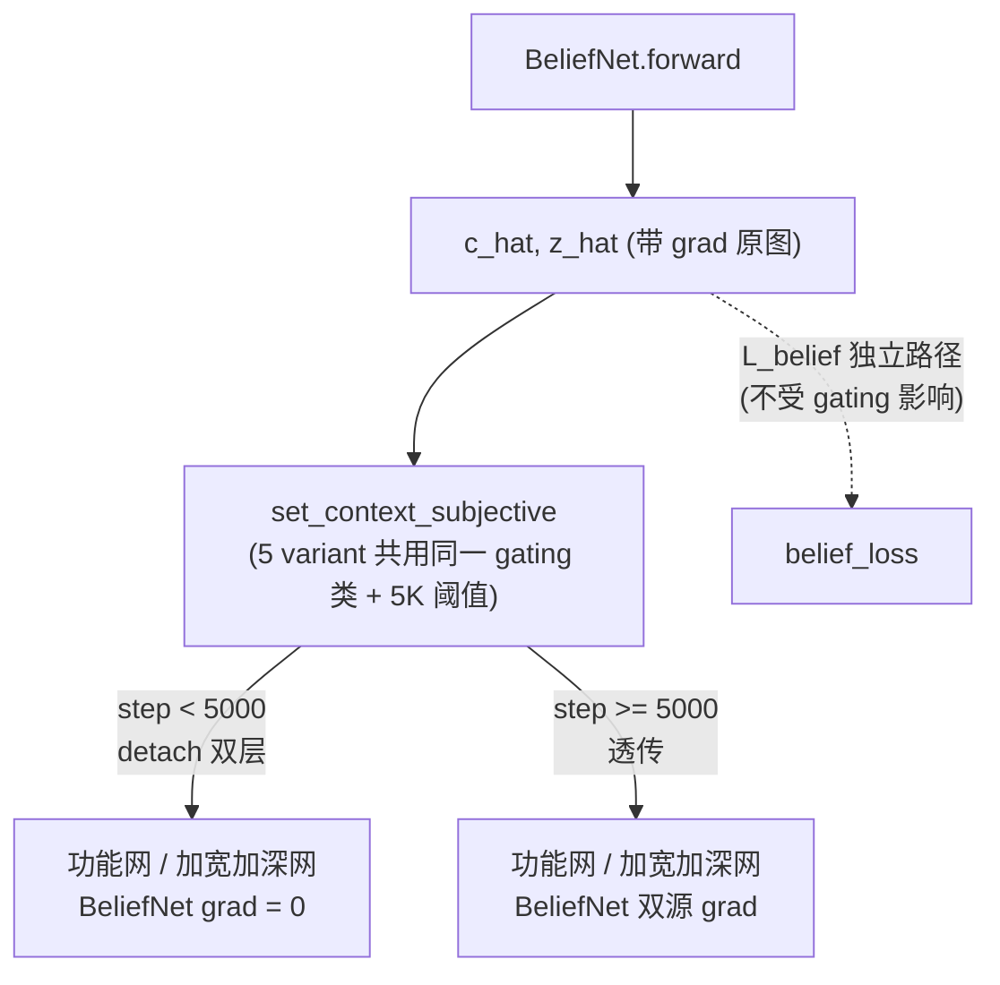

# Pkg-06: Baselines — Design

> 配套阅读：[`proposal.md`](./proposal.md)（**先读 proposal 再读本文**）·[`README.md`](./README.md)

---

## 1. Context

### 1.1 项目阶段

本包是 v4 重构的**第六个 SDD 包**，承接 Pkg-01 (Schema) / Pkg-02 (Env) / Pkg-03 (TriContextEncoder + BeliefNet) / Pkg-04 (DualHyperNetwork + Model) / Pkg-05 (Trainer & Worker)。Pkg-05 spec08 §3.1（line 136）已锁定 baseline 工厂的 import 路径与签名（`from hyper_mve.baselines import create_baseline_model`），本包的启动条件由此满足。

```
Pkg-01 (Schema)              ✅ 完成
Pkg-02 (Env)                 ✅ 完成
Pkg-03 (TriContextEncoder + BeliefNet)  ✅ 完成
Pkg-04 (DualHyperNetwork v2 & Model)  ✅ 完成（7 API + grad_gating 双层 detach）
Pkg-05 (Trainer & Worker)    ✅ 完成（spec08 §3 锁定 baseline 复用契约）
    ↓
Pkg-06 (本包 Baselines)      ⏳ 当前 —— create_baseline_model + shared_backbones + 5 模型类
    ↓
Pkg-07 (Eval)                ← baseline 与 hyper 走同一 evaluator
Pkg-08 (Experiments)         ← train_main.py --variant baseline_* + Abl 6.x/7 复用本包模型
```

### 1.2 前置依赖（本包消费什么）

| 来源 | 内容 |
|------|------|
| **Pkg-05** spec08 §3.1 | `create_baseline_model(cfg, variant)` 签名 + import 路径（line 136 锁定）|
| Pkg-05 spec08 §3.2 | 五条复用约束（同一 trainer/worker/buffer/loss，仅 model 类不同）|
| Pkg-05 spec08 §6.2 | `--variant` CLI 语义（`baseline_` 前缀）+ hyper/oracle_only/infer_only 走 curriculum override |
| **Pkg-04** spec02 | `HyperMuZeroModel` 7-API（baseline 逐字对齐）+ stateful "用最后一次 subjective agent_id"（L308-310）|
| Pkg-04 spec02 §3.4 + spec04 | `BeliefGradGating` 双层 detach（baseline 必须共用同一 gating）|
| **Pkg-03** spec08 §6 | RepNet/BeliefNet/TriContextEncoder 共享契约（同类同构、独立实例、独立梯度）|
| Pkg-04 spec08 §5.1 | `create_input_wide_baseline(...)` **illustrative 草案**（被本包 spec 01 supersede）|
| **Ch4_1_Motivation / Ch5** | 4 条断言 + §5.6 等参公平协议（step1 参数统计 / step2 LR sweep / step3 主对比）|

### 1.3 本包提供（后续包消费什么）

| 输出 | 消费者 | 用途 |
|------|--------|------|
| `create_baseline_model(cfg, variant)` | Pkg-05 `create_trainer_for_baseline` + Pkg-08 train_main.py | 5 variant 模型工厂 |
| `shared_backbones.py`（3 个 create_*）| 5 baseline + hyper | 等参公平性的共享后端 |
| `InputWideBaselineModel` / `InputDeepBaselineModel` | Pkg-08 断言 B 主对比 | input-conditioning 等参对照 |
| `MAMuZeroBaselineModel` | Pkg-08 断言 A | 共享 RewardHead 平均梯度对照 |
| `NoBeliefBaselineModel` | Pkg-08 Ablation 7（断言 C）| belief 路移除对照 |
| `ExplicitTypeRewardBaselineModel` | Pkg-08 Ablation 6.x（断言 A）| 显式 type 分支对照 |

---

## 2. Goals

### 2.1 主目标（必须完成）

1. **G1**: `create_baseline_model(cfg, variant)` 工厂 SDD（5 variant 注册表 + reject "hyper"），签名与 Pkg-05 spec08 §3.1 逐字一致
2. **G2**: `shared_backbones.py` 共享后端契约（RepNet/BeliefNet/TriContextEncoder 同类同构、独立实例、独立梯度、参数量逐位对齐）
3. **G3**: 5 个 baseline 模型类的 7-API 一致性 SDD（与 Pkg-04 spec02 逐字对齐 + 内部差异规范）
4. **G4**: 等参公平性量化协议（条件化消费子系统定义 + 双阈值 warn≤5%/fail≤10% + 逐 variant 账目与豁免规则）
5. **G5**: 5 variant `update_step` 共用同一 `BeliefGradGating`（断言 B 公平性核心），mermaid 双路径图
6. **G6**: Self-Info 严格 + stateful 契约对每个 variant 落地（具名单测每 variant 跑）
7. **G7**: spec 01 supersede 声明 + CLI↔工厂↔模型类映射表（消除 Pkg-04 §5.1 与前缀分裂两处 drift）

### 2.2 衍生目标（应尽量达到）

- **G8**: LR sweep 协议（Ch5 §5.6 step2）写进 spec 07，证明公平调参
- **G9**: 单步 forward 性能分档预算 + 单测护栏（spec 07）
- **G10**: 11 文档结构对称 Pkg-03/04/05；`check_ref_matrix.ps1` 真跑出 `[PASS]`
- **G11**: 每条硬约束（C6-*）有具名单测，无悬空（M3 映射完备）

### 2.3 Non-Goals（明确不解决）

- **NG1**: 不实现 baseline 实际代码（本包仅 SDD 文档）
- **NG2**: 不修改 Pkg-01/02/03/04/05 任何 spec 或代码（仅消费）
- **NG3**: 不提供断言 D（planner 双技术）的对照 model —— 由 Pkg-08 cfg flag 承载
- **NG4**: 不纳入 MAPPO/QMix/Mamba 等异范式 baseline（无法复用 7-API/MuZeroTrainer）
- **NG5**: 不重写 trainer/worker/buffer/loss
- **NG6**: 不引入新依赖（μP 宽度对齐等新机制不采用）
- **NG7**: 不修改论文 Ch4/Ch5 文档

---

## 3. 核心框架澄清（Day 1 hard-gate 前置）

> 本节先把三处最易 drift 的概念钉死，再进 Decisions。**这是 Day 1 审阅放行的前 4 项验收点**。

### 3.1 框架澄清①："7 训练入口" vs "5 工厂 variant"（修复 3）

> **"7 baseline"**（Pkg-03 spec08 §6 用语）= 7 个**训练入口**：`hyper` / `oracle_only` / `infer_only` / `input_wide` / `input_deep` / `ma_muzero` / `no_belief`。
> 其中只有 **5 个走 `create_baseline_model` 工厂创建独立模型类**；`hyper` / `oracle_only` / `infer_only` 三者**共用 `HyperMuZeroModel`** + 不同 curriculum cfg override（见 Pkg-05 spec08 §6.2）。
> Pkg-06 的"5 variant 工厂清单"与 Pkg-03 的"7 baseline 公平性约束"是**同一组对象的两种 framing，无矛盾**。

注：`rewardhead_explicit_type` 是 Ablation 6.x 专用对照，进工厂但不在 Pkg-03 的"7 主 baseline"列表内——它是断言 A 的第 2 个失败模式对照（详见 §3.3）。

### 3.2 框架澄清②：7×3 三角矩阵（训练入口 × 模型类 × 断言）

| 训练入口 | 创建路径 | 模型类 | 断言 |
|----------|----------|--------|------|
| `hyper` | `HyperMuZeroModel(cfg)`（**不走工厂**）| `HyperMuZeroModel` | A/B/C 主线 |
| `oracle_only` | `HyperMuZeroModel(cfg)` + `curriculum_stage_1_end_frac=1.0` | `HyperMuZeroModel` | B（oracle 上界）|
| `infer_only` | `HyperMuZeroModel(cfg)` + `curriculum_stage_1_end_frac=0.0` | `HyperMuZeroModel` | C（纯推断）|
| `input_wide` | `create_baseline_model(cfg, "input_wide")` | `InputWideBaselineModel` | **B** |
| `input_deep` | `create_baseline_model(cfg, "input_deep")` | `InputDeepBaselineModel` | **B** |
| `ma_muzero` | `create_baseline_model(cfg, "ma_muzero")` | `MAMuZeroBaselineModel` | **A** |
| `no_belief` | `create_baseline_model(cfg, "no_belief")` | `NoBeliefBaselineModel` | **C / Abl7** |
| `rewardhead_explicit_type` | `create_baseline_model(cfg, "rewardhead_explicit_type")` | `ExplicitTypeRewardBaselineModel` | **A / Abl6.x** |

> 共 8 行（7 主入口 + 1 ablation 对照）；其中 5 行走工厂 → 5 个独立模型类。这张表 spec 01 头部强制复刻。

### 3.3 框架澄清③：CLI ↔ 工厂 ↔ 模型类映射表（修复 1：前缀分裂）

Pkg-05 spec08 §6.2 CLI 用 `baseline_` 前缀；§3.1 工厂传参**无**前缀。两者非冲突，是**同一对象的两层命名**。spec 01 头部强制此表，避免 Pkg-08 调 train_main.py 再踩 drift：

| CLI `--variant` | 工厂传参（create_baseline_model 第 2 参）| 模型类 | 断言 |
|-----------------|------|--------|------|
| `baseline_input_wide` | `"input_wide"` | `InputWideBaselineModel` | B |
| `baseline_input_deep` | `"input_deep"` | `InputDeepBaselineModel` | B |
| `baseline_ma_muzero` | `"ma_muzero"` | `MAMuZeroBaselineModel` | A |
| `no_belief` | `"no_belief"` | `NoBeliefBaselineModel` | C / Abl7 |
| `rewardhead_explicit_type` | `"rewardhead_explicit_type"` | `ExplicitTypeRewardBaselineModel` | A / Abl6.x |
| `hyper` / `oracle_only` / `infer_only` | —（**不进工厂**）| `HyperMuZeroModel` + curriculum override | A(主线)/B/C |

---

## 4. Decisions

> 10 项关键设计抉择。每项格式：**Decision** → 候选 → 推荐 → 理由 → 风险与回滚。

### D1: spec 数量与文档结构

**Decision**：Pkg-06 用几个 spec？

**候选**：
- **A1**：8 specs 对称（11 文档结构，与 Pkg-03/04/05 完全对称）（**Q1 用户决议**）
- **A2**：6 specs（合并工厂+registry，合并 input wide/deep+ma_muzero）
- **A3**：10 specs（每 variant 一 spec）

**推荐**：**A1**（8 specs 对称）

**理由**：与 Pkg-03/04/05 体量/结构对称，Day 6 `check_ref_matrix.ps1` 可直接复用模板；A2 合并会让工厂与 backbone 边界模糊；A3 每 variant 一 spec 颗粒过细（input_wide/deep 共享 input-conditioning 机制，应同 spec）。

**风险**：8 specs 写作工作量大 → 7 天日历 + 每日交审分摊（§6）

**回滚**：合并 spec 03/04（input + ma_muzero）为 6 specs（仅文档合并，不改契约）

---

### D2: 工厂归属与签名

**Decision**：`create_baseline_model` 放哪？签名形态？

**候选**：
- **B1**：`hyper_mve/baselines/__init__.py`，统一签名 `create_baseline_model(cfg, variant)`（**Pkg-05 spec08 §3.1 已锁**）
- **B2**：每 variant 一函数 `create_input_wide_baseline(cfg, total_params_target)`（Pkg-04 §5.1 旧草案）
- **B3**：放 `hyper_mve/models/baselines.py`

**推荐**：**B1**（统一工厂，import 路径已被上游锁定）

**理由**：
- Pkg-05 spec08 line 136 已锁 `from hyper_mve.baselines import create_baseline_model`——不可变更
- 统一签名 → Pkg-08 调用面单一，registry 集中管理 5 variant
- B2 每 variant 一函数 → Day 6 grep 双命中、Pkg-08 调用面分裂（**必须 supersede**，见 spec 01 头部声明）
- B3 与 Pkg-05 锁定的 import 路径不符

**风险**：旧草案 B2 残留 → spec 01 头部强制 supersede 声明 + Day 6 grep 验证单签名

**回滚**：无（上游已锁，不可回滚）

---

### D3: 工厂收到 "hyper" 的行为

**Decision**：`create_baseline_model(cfg, "hyper")` 该怎么办？

**候选**：
- **C1**：`raise ValueError`（hyper 不是 baseline，走 `HyperMuZeroModel` 直接构造）（**调整 3**）
- **C2**：返回 `HyperMuZeroModel(cfg)`（工厂兜底）
- **C3**：静默返回 None

**推荐**：**C1**（显式 raise ValueError）

**理由**：
- `hyper` 是主方法不是 baseline；Pkg-05 `create_trainer_for_baseline` 内部对 hyper 分支已显式 `HyperMuZeroModel(cfg)`（spec08 §6.2）
- 工厂兜底（C2）会让"5 variant"语义膨胀成 6，破坏 §3.1 framing
- C3 静默错误最危险

**风险**：调用方误传 "hyper" → 具名单测 `test_factory_rejects_hyper_variant` 锁定

**回滚**：C2（不推荐，破坏 framing）

---

### D4: 共享后端粒度

**Decision**：哪些子系统在 baseline 间共享结构？怎么共享？

**候选**：
- **D1**：RepNet + BeliefNet + TriContextEncoder 三者均"同类同构、独立实例、独立梯度"（**Q3 用户决议**，对齐 Pkg-03 spec08 §6）
- **D2**：共享同一实例（梯度共享）
- **D3**：只共享 RepNet

**推荐**：**D1**（三者同类同构、独立实例、独立梯度）

**理由**：
- 断言 B 要求 input baseline 与 hyper 在"条件化消费子系统之外"完全等价——RepNet/BeliefNet/TriContextEncoder 必须**结构+参数量逐位相同**
- 独立实例 + 独立梯度（非共享同一 nn.Module）→ 各 baseline 训练互不污染，符合"仅 model 类不同"
- D2 梯度共享会让 baseline 间互相影响，破坏独立 run 语义
- D3 只共享 RepNet → BeliefNet/TriCtx 不对齐，断言 B 不公平

**风险**：跨 variant 参数量漂移 → `test_shared_backbone_identical_param_count`（逐位校验）

**回滚**：无（公平性核心，不可回滚）

---

### D5: 等参对照单元的精确定义（修复 6）

**Decision**：等参公平性"统计哪些参数"？

**候选**：
- **E1**：**条件化消费子系统** = {θ_state 生成器(若有) + θ_rew^i 生成器(若有) + θ_pred^i 生成器(若有) + 接收 ctx_aug 的 3 个功能网}，**排除**共享 RepNet/BeliefNet/TriContextEncoder（**Q4 用户决议**，对齐 Ch5 §5.6 step1）
- **E2**：统计全模型参数
- **E3**：仅统计功能网

**推荐**：**E1**（条件化消费子系统，排除共享后端）

**理由**：
- 原"`hyper_{trans,rew,pred}` + 3 功能网"对 input_wide/deep **不严密**——它们无 hypernet，只剩 3 功能网，比 hyper 少了整个 hypernet 参数，会假性"超参"
- 重定义为"生成器(若有) + 功能网"后，input baseline 用加宽/加深的功能网参数去补 hyper 的 hypernet 参数，比较才公平
- E2 含共享后端 → 后端占大头，掩盖条件化子系统差异
- E3 漏掉 hypernet → hyper 被低估

**逐 variant 等参账目**：

| variant | 生成器 | 功能网 | 等参对照规则 |
|---------|--------|--------|----------|
| `hyper` | hypernet 3 头 | 3 vanilla | **基准** |
| `input_wide` | 无 | 3 **加宽**（concat ctx_aug 进 input）| **5%/10% 强制** vs hyper |
| `input_deep` | 无 | 3 **加深** | **5%/10% 强制** vs hyper |
| `no_belief` | hypernet 3 头 | 3 vanilla（belief 路置零）| **5%/10% 强制** vs hyper |
| `ma_muzero` | 无 | 3 vanilla（无 ctx_aug，仅 agent_id one-hot + own_type one-hot）| **结构性偏小，豁免**强制对齐 |
| `rewardhead_explicit_type` | hypernet 仅 trans/pred | RewardHead 带 type 分支 | **结构性差异，豁免** |

**豁免规则**：`ma_muzero` / `rewardhead_explicit_type` 不强行对齐参数量（结构性差异无法对齐），但**必须在 LR sweep 协议下报告 wall-clock 步数等价性**（Ch5 §5.6 step2）。双阈值单测只对 `input_wide`/`input_deep`/`no_belief` vs `hyper` 断言。

**风险**：input baseline 调宽度/层数逼近 hyper 参数量需迭代 → spec 07 给逼近流程 + 双阈值（warn 先报，fail 才挂）

**回滚**：放宽 fail 阈值到 15%（需重新论证断言 B 公平性，不推荐）

---

### D6: belief 梯度门控在 baseline 内的一致性（修复 5）

**Decision**：5 个 baseline 的 `update_step` 各自管理 belief 梯度门控，还是共用同一 `BeliefGradGating`？

**候选**：
- **F1**：5 variant **共用同一 `BeliefGradGating` 类 + 同一阈值参数**（`cfg.train.belief_grad_gating_steps=5000`），每 variant **各自实例化**（与 D4 共享后端粒度对齐），`update_step` 触发同一逻辑路径
- **F2**：各 variant 自管理 gating（不同阈值/不同逻辑）
- **F3**：input baseline 不做 gating（反正不走 hypernet）

**推荐**：**F1**（共用同一 gating 类 + 5K 阈值，每 variant 各自实例化）

> **措辞澄清（对齐 D4）**：BeliefGradGating 在 Pkg-04 spec02 line 258 是 model 实例属性（`self.grad_gating.apply(...)`），按 model 走——每 variant 各自持有 instance。"共用"指**共用同一类 + 同一阈值参数**，等价于"5 variant 的 `update_step(global_step)` 触发同一逻辑路径（pre-5K 双层 detach / post-5K 透传）"，**不是**共享同一 nn.Module 状态。

**理由**：
- input-conditioned baseline 内部不走 hypernet，但 belief tuple 仍经 `set_context_subjective` 进功能网。若 input baseline 在 5K 步前就存在 belief→model 梯度路径，而 hyper（pre-5K detach）没有 → **断言 B 不公平**
- 必须 5 variant 共用同一门控逻辑，`update_step(global_step)` 在每个 variant 内触发同样的 pre-5K detach / post-5K 透传
- F3 直接破坏断言 B 公平性（最危险）

**风险**：易漏（input baseline 看似无 hypernet 就不需要 gating）→ spec 06 画 mermaid 双路径图 + `test_baseline_update_step_gates_belief_grad`（每 variant 验证 pre-5K BeliefNet 梯度=0）

**回滚**：无（公平性核心）

**mermaid 双路径图框架**（spec 06 详化，覆盖 5 variant 共用同一 gating）：



> 关键：**所有 5 variant 的 `set_context_subjective` 走同一条 gating 路径**——pre-5K 时 input_wide/deep 的加宽/加深功能网与 hyper 的功能网一样拿不到 belief 梯度。

---

### D7: ma_muzero vs rewardhead_explicit_type 边界（修复 4）

**Decision**：两者都打断言 A，如何撕分避免撞车？

**候选**：
- **G1**：明确两者**失败模式不同**，分别由 spec 04 / spec 05 承载，头部画边界表
- **G2**：合并为一个 variant
- **G3**：只保留 ma_muzero

**推荐**：**G1**（撕分，不同失败模式）

**理由**：断言 A 有两个独立的失败模式，需要两个对照点：

| variant | hypernet | RewardHead | type 输入 | 失败模式（断言 A 的对照点）|
|---------|----------|------------|-----------|---------------------------|
| `ma_muzero` | 无（vanilla MARL）| 共享单一头 | agent_id one-hot + own_type one-hot 进 input | 共享头学到 α/β **平均梯度** |
| `rewardhead_explicit_type` | 有 `hyper_{trans,pred}`，**无** `hyper_rew` | 共享头但**显式按 type 分支**（type-conditioned）| 显式 type 分支**无法吸收 capability 异质性**（cap 连续，type 离散）|

**理由（续）**：
- ma_muzero 证伪"完全不区分 type"；rewardhead_explicit_type 证伪"离散 type 分支够用"——后者更强，逼近 hyper 但仍输（cap 连续 vs type 离散）
- G2 合并丢掉"离散分支无法吸收连续 capability"这个关键对照点（Abl6.x）
- G3 只保留 ma_muzero → 审稿人会问"那显式 type 分支呢"

**风险**：两 variant 撞车（都说"打断言 A"）→ spec 04（ma_muzero）/ spec 05（rewardhead_explicit_type）各自头部标注差异化失败模式

**回滚**：合并为 ma_muzero（丢 Abl6.x 对照，需 Pkg-08 补论证）

---

### D8: input-conditioned baseline 的 stateful 契约（修复 7）

**Decision**：input baseline 不走 hypernet，是否仍需缓存 (agent_id, cap_i, belief)？

**候选**：
- **H1**：**必须缓存**，`predict_reward/predict` 用**最后一次** `set_context_subjective` 的值（逐字 Pkg-04 spec02 L308-310）
- **H2**：input baseline 每次 forward 显式传 ctx（无状态）
- **H3**：缓存但允许 predict 用任意 agent

**推荐**：**H1**（缓存 + 用最后一次 subjective agent_id）

**理由**：
- 7-API 是统一契约——MuZeroTrainer / Worker / MVEPlanner 按"set_context_subjective(k) 后 transition/predict_reward/predict 返回 agent k 的结果"调用
- input baseline 即便内部 concat ctx 而非 hypernet，也必须遵守此 stateful 语义，否则 trainer 的 N-agent 循环对它失效
- H2 改变调用面 → 破坏"仅 model 类不同"
- H3 语义不确定 → planner 行为不可预测

**风险**：实现者忘记缓存 → spec 06 docstring 化 + `test_baseline_predict_uses_last_subjective_agent_id`（每 variant 跑）

**回滚**：无（7-API 契约）

---

### D9: Self-Info 严格在 baseline 的落地

**Decision**：baseline 如何保证不泄漏 oracle types？

**候选**：
- **I1**：每个 baseline `set_context_subjective` 内 `assert cap_i.shape[-1] == 4`，belief 来自 BeliefNet（C11/D6）
- **I2**：仅 hyper 严格，baseline 放松（反正是对照）
- **I3**：运行时不校验，文档约定

**推荐**：**I1**（每 variant 严格 assert）

**理由**：
- baseline 若偷看 oracle types，会高估 baseline 性能 → 断言失效（baseline 不该比真实可获信息更强）
- ma_muzero 用的是 own_type（self-info 合法，agent 知道自己 type），但**不得**用 opponents 的 oracle types
- I2 放松 → baseline 不公平地强；I3 不校验 → 易漏

**风险**：ma_muzero 的 own_type 与 oracle types 边界模糊 → spec 06 明确"own_type 合法（self-info），opponent types 非法” + `test_baseline_set_context_subjective_no_oracle_types_leak`（每 variant）

**回滚**：无（断言可信度核心）

---

### D10: cfg 新字段归属（修复/调整 4 + M4）

**Decision**：input-conditioned baseline 专用 cfg 字段放哪？谁声明？

**候选**：
- **J1**：字段加在 `cfg.model.*`，由 Pkg-01 spec05 同步声明，Pkg-06 仅**消费态声明，不改上游**（**调整 4**）
- **J2**：Pkg-06 自己新建 baseline_config.py
- **J3**：硬编码在工厂内

**推荐**：**J1**（cfg.model.* + Pkg-01 同步 + 消费态声明）

**理由**：
- 配置单一来源原则（CLAUDE.md：所有超参在 config 内）
- Pkg-06 不改上游 → 在 spec 01 末尾列"待 Pkg-01 spec05 同步声明"的字段清单，挂"消费态、不改上游"标签
- J2 分裂配置源；J3 硬编码无法 sweep

**待声明 cfg 字段（4 个，M4 穷举）**：

```
cfg.model.baseline_wide_hidden_dim           # input_wide 加宽宽度（逼近 hyper 参数量）
cfg.model.baseline_deep_layers               # input_deep 加深层数
cfg.model.baseline_ma_muzero_share_pred_head # ma_muzero 是否共享 pred 头
cfg.model.baseline_explicit_type_branches    # rewardhead_explicit_type 分支数（= type 数）
```

**风险**：Pkg-06 误改 Pkg-01 spec05 → §5 验证 `git diff` 确认 Pkg-01..05 零改动

**回滚**：字段移入 Pkg-08 ablation cfg（若 Pkg-01 拒绝同步）

---

## 5. 设计决策对照表

| Decision | 推荐 | 影响范围 | 后续修改成本 |
|----------|------|----------|--------------|
| D1 spec 数量 | 8 specs 对称 | 全 SDD 结构 | 低（文档合并）|
| D2 工厂归属与签名 | `baselines/__init__.py` 统一工厂 | spec 01 / 08 | 无（上游已锁）|
| D3 工厂收 "hyper" | raise ValueError | spec 01 | 低 |
| D4 共享后端粒度 | 同类同构/独立实例/独立梯度 | spec 02 | 无（公平核心）|
| D5 等参对照单元 | 条件化消费子系统 + 双阈值 | spec 07 | 中（阈值可调）|
| D6 belief 门控一致性 | 5 variant 共用同一 gating | spec 06 | 无（公平核心）|
| D7 ma_muzero vs explicit_type 边界 | 撕分不同失败模式 | spec 04 / 05 | 低 |
| D8 stateful 契约 | 缓存 + 用最后一次 subjective | spec 06 | 无（7-API）|
| D9 Self-Info 严格 | 每 variant assert cap==4 | spec 06 | 无（可信度核心）|
| D10 cfg 新字段归属 | cfg.model.* + Pkg-01 同步 | spec 01 | 中（需上游配合）|

---

## 6. 实现顺序建议（7 天日历 + 响应式 SLA）

> **Day 1 design.md 审阅 = HARD GATE**：决定后续 specs 走向，未过不进 Day 2。

```
Day 1:
  - README.md + proposal.md + design.md 三件套
  - 【HARD GATE】用户审阅 design.md 7 项验收清单（见下）

Day 2:
  - spec 01-baselines-factory-and-registry (create_baseline_model + registry + supersede + CLI 映射表)
  - spec 02-shared-backbones (create_rep_net/belief_net/tri_context_encoder + 等参共享契约)
  - 当天末各自交审

Day 3:
  - spec 03-input-conditioned-baselines (input_wide + input_deep, 断言 B 等参对照)
  - spec 04-ma-muzero-baseline (ma_muzero 共享 RewardHead, 断言 A)
  - 当天末交审

Day 4:
  - spec 05-belief-type-ablation-baselines (no_belief 断言 C/Abl7 + rewardhead_explicit_type 断言 A/Abl6.x)
  - spec 06-model-7api-conformance (7-API + set_context 拆分 + Self-Info 严格 + stateful + mermaid 门控图)
  - 当天末交审

Day 5:
  - spec 07-param-fairness-and-lr-sweep (等参双阈值 + LR sweep 协议 + 性能护栏)
  - spec 08-integration-contracts (与 Pkg-05 工厂 + Pkg-07/08 契约)
  - 当天末交审

Day 6:
  - scripts/check_ref_matrix.ps1 (纯 ASCII) + ref_matrix.csv
  - 真跑出 [PASS]；跑 M3 映射表自查

Day 7:
  - PR_DESCRIPTION.md + 用户最终 ack
```

### Day 1 HARD GATE 验收清单（7 项，全过才放行 —— 调整 1）

| # | 验收项 | design.md 落点 |
|---|--------|---------------|
| 1 | 5 variant 各自核心区别表（含 ma_muzero vs rewardhead_explicit_type 撕分）| §4 D7 边界表 + proposal §2.1.3 |
| 2 | 等参对照单元定义（条件化消费子系统 + 逐 variant 账目 + 豁免规则）| §4 D5 |
| 3 | mermaid belief grad-gating 双路径图框架（pre-/post-5K，覆盖 5 variant）| §4 D6 |
| 4 | "7 训练入口 vs 5 工厂 variant" framing 澄清 + 7×3 三角矩阵 + CLI 映射表 | §3.1 / §3.2 / §3.3 |
| 5 | cfg 新字段穷举（4 个待声明字段，挂"消费态、不改上游"标签）| §4 D10 |
| 6 | ref_matrix 预期表（8×expected）| §8 |
| 7 | 7 天日历 + 响应式 SLA | §6 本节 |

### 响应式 SLA（调整 5）

日历是**名义节奏，非硬截止**。**Day 1 hard gate 不通过 → 全流程顺延 1 天**（不带病进 Day 2）。每个 spec 交审后等用户 ack 再进下一个，审阅往返时间不计入"天"。

---

## 7. 跨包接口约定（M2 伪签名先行，spec 08 §2 完整版）

### 7.1 import 路径（稳定）

```python
# Pkg-08 应使用这些 import 路径，本包承诺不变更
from hyper_mve.baselines import create_baseline_model          # Pkg-05 spec08 line 136 锁定
from hyper_mve.baselines.shared_backbones import (
    create_rep_net, create_belief_net, create_tri_context_encoder,
)
```

### 7.2 工厂签名（稳定，逐字对齐 Pkg-05 spec08 §3.1）

```python
def create_baseline_model(cfg, variant: str):
    """统一 baseline 模型工厂.

    variant ∈ {"input_wide", "input_deep", "ma_muzero",
               "no_belief", "rewardhead_explicit_type"}.

    Raises:
        ValueError: 当 variant == "hyper"（hyper 走 HyperMuZeroModel 直接构造，不走本工厂）.
        ValueError: 当 variant 不在注册表内.
    """
    if variant == "hyper":
        raise ValueError("'hyper' uses HyperMuZeroModel directly, not this factory")
    ...

# 上游 (Pkg-05 create_trainer_for_baseline) 调用模式:
#   if variant == "hyper": model = HyperMuZeroModel(cfg)
#   else:                  model = create_baseline_model(cfg, variant)
#   return MuZeroTrainer(cfg, model)   # ★ 同一 trainer 实例（五条复用约束）
```

### 7.3 shared_backbones 签名（稳定，对齐 Pkg-03 spec08 §6）

```python
def create_rep_net(env_cfg, model_cfg): ...          # 同类同构（复用 Pkg-04 RepresentationNet）
def create_belief_net(env_cfg, model_cfg): ...       # 独立实例、独立梯度、参数量逐位对齐
def create_tri_context_encoder(env_cfg, model_cfg): ...
# 约束：5 baseline + hyper 各自实例化，结构+参数量完全相同，训练时梯度不共享
```

### 7.4 7-API model 契约（稳定，逐字对齐 Pkg-04 spec02）

```python
update_step(global_step: int) -> None                                        # 维护 belief grad-gating 计数（5 variant 一致）
set_context_objective(c_t: Tensor) -> None                                   # (B,)|(B,1) f32
set_context_subjective(agent_id: int, cap_i: Tensor, belief: tuple) -> None  # cap_i (B,4); belief=(c_hat (B,), z_hat (B,N-1,2))
encode(obs: Tensor) -> Tensor                                                # (B,N,obs_dim) -> (B,latent)
transition(s: Tensor, action: Tensor) -> Tensor                              # (B,latent),(B,N*A) -> (B,latent)
predict_reward(s: Tensor, action: Tensor) -> Tensor                          # -> (B,1)
predict(s: Tensor) -> tuple[Tensor, Tensor]                                  # -> ((B,A),(B,1))
```

> `belief: tuple` 是 design 层简化记法；spec 06 落到完整类型 `belief: tuple[torch.Tensor, torch.Tensor]`（逐字对齐 Pkg-04 spec02 line 206：`(c_hat (B,), z_hat (B,N-1,2))`）。

### 7.5 五条等参公平约束（spec 08，逐字 Pkg-05 spec08 §3.2）

```
1. 同一 MuZeroTrainer 类（无 baseline-specific train_step）
2. 同一 Worker 类（采集行为一致）
3. 同一 EpisodeReplayBuffer 类
4. 同一 compose_total_loss 函数
5. 仅 model 类不同
```

---

## 8. 验证策略概览（M3 + ref_matrix）

### 8.1 硬约束 → 具名单测映射（C6-*，统一可读前缀 —— 调整 2）

> 详细 acceptance 见 `specs/*.md`。本节列硬约束 → 具名单测（M3 风险预映射）。前缀：`FACT`(工厂) / `FAIR`(等参) / `SELF`(Self-Info) / `API` / `REUSE`(复用) / `GRAD`(梯度门控) / `STRUCT`(结构) / `CFG`(配置消费) / `PERF`(性能护栏)。

| # | 硬约束 | 具名单测 | spec 归属 |
|---|--------|----------|-----------|
| C6-FACT1 | 5 variant 均可实例化 | `test_create_baseline_model_all_5_variants` | spec 01 |
| C6-FACT2 | 工厂收 "hyper" 抛 ValueError | `test_factory_rejects_hyper_variant` | spec 01 |
| C6-CFG1 | 工厂消费 4 个 baseline cfg 字段，无 hard-coded 默认值 | `test_factory_reads_baseline_cfg_fields` | spec 01 |
| C6-FAIR1 | 条件化消费子系统 ≤5% warn / ≤10% fail（仅 input_wide/deep/no_belief）| `test_baseline_param_count_within_5pct` | spec 07 |
| C6-FAIR2 | RepNet/BeliefNet/TriCtx 跨 variant 参数量逐位相同 | `test_shared_backbone_identical_param_count` | spec 02 |
| C6-SELF1 | 不泄漏 oracle types（每 variant）| `test_baseline_set_context_subjective_no_oracle_types_leak` | spec 06 |
| C6-API1 | 7 方法签名一致 | `test_baseline_implements_full_7api` | spec 06 |
| C6-API2 | stateful 用最后一次 subjective agent_id（每 variant）| `test_baseline_predict_uses_last_subjective_agent_id` | spec 06 |
| C6-REUSE1 | 同一 MuZeroTrainer/Worker/Buffer/compose_total_loss | `test_baseline_reuses_same_trainer_class` | spec 08 |
| C6-GRAD1 | pre-5K BeliefNet 梯度=0（每 variant）| `test_baseline_update_step_gates_belief_grad` | spec 06 |
| C6-STRUCT1 | input-conditioned 不含 DualHyperNetwork（结构约束）| `test_input_baseline_no_hypernet` | spec 03 |
| C6-STRUCT2 | ma_muzero 无 per-agent θ_rew（共享单一头，结构约束）| `test_ma_muzero_shared_rewardhead` | spec 04 |
| C6-PERF1 | input baseline 单步 forward ≤ 2.0× hyper（性能护栏，G9）| `test_baseline_forward_budget` | spec 07 |

### 8.2 ref_matrix 预期表（8×expected，Day 6 真跑校验 —— 验收项 6）

| spec | refs_expected | 备注 |
|------|---------------|------|
| 01-baselines-factory-and-registry | 02, 03, 04, 05, 06, 08 | 工厂 registry 必 mention 5 variant 各自模型类的归属 spec（03/04/05）|
| 02-shared-backbones | 03, 04, 05, 06, 08 | backbone 被 input/ma/no_belief 消费（03/04/05）+ 服务 7-API contract（06）|
| 03-input-conditioned-baselines | 02, 06, 07, 08 | – |
| 04-ma-muzero-baseline | 02, 06, 07, 08 | – |
| 05-belief-type-ablation-baselines | 02, 06, 08 | – |
| 06-model-7api-conformance | 02, 03, 04, 05, 08 | 统一 7-API 必 reference 每 variant 的 stateful/Self-Info/update_step 落地（03/04/05）|
| 07-param-fairness-and-lr-sweep | 03, 04, 05, 08 | D5 逐 variant 等参账目含 no_belief/explicit_type（05）|
| 08-integration-contracts | 01, 02, 03, 04, 05, 06, 07 | 契约层引全 7 个 |

> ⚠️ **Pkg-05 Day 6 血的教训**：工厂/统一 API/参数账目类 spec 必然 cite 各 variant 的 spec。expected 表若漏写、actual 实际更全 → delta 非空挂红。本表已按"spec 实际会 cite 谁"补全，Day 6 真跑校验（不写理想态）。

### 8.3 其他验证

1. **结构对称**：11 文档齐全，8 specs 命名 `0X-kebab.md`。
2. **机器校验**：`pwsh sdd/pkg-06-baselines/scripts/check_ref_matrix.ps1` 输出 `[PASS]`，delta 全空。
3. **契约一致性 grep**：工厂签名/7-API 签名与 Pkg-05 spec08 §3.1、Pkg-04 spec02 逐字比对。
4. **M3 映射完备**：每条 C6-* 有具名单测，无悬空。
5. **不改上游**：`git diff` 确认 `sdd/pkg-01..05/` 与 `hyper_mve/**` 代码零改动。
6. **断言可追溯**：每个 variant 在 spec 头部标注断言 (A/B/C) + Pkg-08 ablation 编号。

---

## 9. Open Questions（含用户审阅决议）

| # | Question | 决议 | 影响 |
|---|----------|------|------|
| **Q1** | spec 数量 6 vs 8 vs 10 | ✅ **8 个**（与 Pkg-03/04/05 对称）| README + spec 08（D1）|
| **Q2** | variant 清单（哪些进工厂）| ✅ **5 个**：input_wide/input_deep/ma_muzero/no_belief/rewardhead_explicit_type；hyper/oracle_only/infer_only **不进工厂**；MAPPO/QMix 出范围 | spec 01 registry |
| **Q3** | 工厂归属 & 共享粒度 | ✅ **工厂在 `baselines/__init__.py`；RepNet/BeliefNet/TriCtx 同类同构、独立实例、独立梯度**（D2/D4）| spec 01 / 02 |
| **Q4** | 等参验证口径 | ✅ **仅条件化消费子系统 + 双阈值(5%/10%) + 具名单测**（D5）| spec 07 |
| 修复1 | CLI 前缀分裂 | ✅ spec 01 头部强制 CLI↔工厂↔模型类映射表 | §3.3 |
| 修复2 | Pkg-04 §5.1 旧草案 | ✅ spec 01 头部 supersede 声明 + Day 6 grep | D2 |
| 修复3 | "7 baseline" vs "5 variant" | ✅ §3.1 framing 澄清 + §3.2 7×3 三角矩阵 | §3 |
| 修复4 | ma_muzero vs explicit_type 撞车 | ✅ D7 边界表（不同失败模式）| D7 / spec 04/05 |
| 修复5 | belief 门控一致性 | ✅ D6 5 variant 共用同一 gating + mermaid | D6 / spec 06 |
| 修复6 | 等参单元对 input baseline 不严密 | ✅ D5 重定义条件化消费子系统 + 逐 variant 账目 + 豁免 | D5 / spec 07 |
| 修复7 | stateful 契约 | ✅ D8 缓存 + 用最后一次 subjective | D8 / spec 06 |

### 9.1 待 spec 详化的 Open Questions（design 层不必详化，显式留兜底）

| # | Question | 状态 | 归属 |
|---|----------|------|------|
| **OQ-1** | D5 豁免规则下 ma_muzero / rewardhead_explicit_type 的"wall-clock 步数等价性"具体怎么度量？（候选：同 step budget 下回报曲线 saturate 判据 / 最佳 LR 下多次重启平均 / ...）| ⏳ **spec 07 详化** | spec 07 |

> 全部 Q1-Q4 + 修复 1-7 + 调整 1-5 已 ack；OQ-1 留 spec 07 兜底。本 design.md 待 **Day 1 hard gate 用户审阅**后 finalize。

---

## 10. References

- `proposal.md`（本包）·`README.md`（本包）
- Pkg-03 spec08 §6（RepNet/BeliefNet/TriContextEncoder 共享契约）
- Pkg-04 spec02（7-API + stateful L308-310）+ spec02 §3.4 / spec04（BeliefGradGating 双层 detach）+ spec08 §5.1（旧草案，被 supersede）
- Pkg-05 spec08 §3.1（工厂签名 line 136）+ §3.2（五条复用约束）+ §6.2（--variant CLI 语义）
- `D:\RL\hyper_mve\docs\Chapter4_1_Motivation*.md`（4 条断言）
- `D:\RL\hyper_mve\docs\Chapter5_Methodology_v4.md` §5.6（等参公平协议 step1/2/3）
- 项目 Plan File: Pkg-06 Baselines + Q1-Q4 决议 + 修复 1-7 + 调整 1-5
