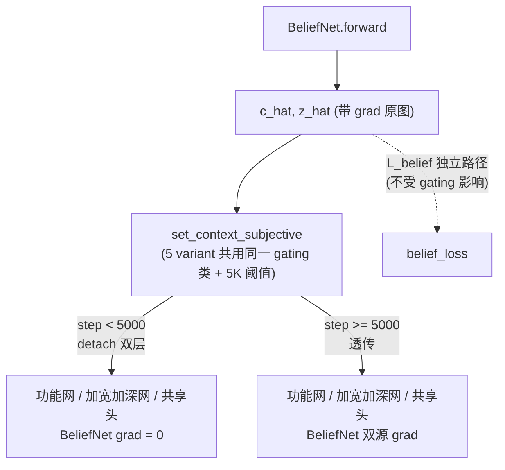

# Spec 06: Model 7-API Conformance — 统一 7-API + Self-Info 严格 + stateful + belief 门控一致

> 父文档：[`../proposal.md`](../proposal.md) §2.2 · [`../design.md`](../design.md) §4 D6/D8/D9 · §7.4
> **断言覆盖**：所有 5 variant 的接口一致性基座——是断言 A/B/C 公平对照的**协议前提**（接口不一致则无法"仅 model 类不同"）。
> **上游对齐**：7-API **逐字对齐 Pkg-04 spec 02**；stateful 契约逐字对齐 Pkg-04 spec 02 line 308-310；BeliefGradGating 对齐 Pkg-04 spec 04。

---

## 1. Purpose

规定 5 个 baseline 模型类**共同**必须满足的接口契约，使 Pkg-05 的 `MuZeroTrainer` / `Worker` / `MVEPlanner` 对每个 variant 透明（"仅 model 类不同"）。本 spec 是 4 类硬约束的统一落点：

| 约束族 | 内容 | 具名单测（每 variant 跑）|
|--------|------|---------------------------|
| C6-API1 | 7 方法签名一致 | `test_baseline_implements_full_7api` |
| C6-API2 | stateful：用最后一次 subjective agent_id | `test_baseline_predict_uses_last_subjective_agent_id` |
| C6-SELF1 | 不泄漏 oracle types（`cap_i.shape[-1]==4`）| `test_baseline_set_context_subjective_no_oracle_types_leak` |
| C6-GRAD1 | pre-5K BeliefNet 梯度=0 | `test_baseline_update_step_gates_belief_grad` |

---

## 2. Interface

### 2.1 7-API 契约（逐字对齐 Pkg-04 spec 02）

5 个 baseline 模型类 + `HyperMuZeroModel` 均实现以下 7 方法，签名逐字一致：

```python
update_step(global_step: int) -> None
    # 维护 belief grad-gating 计数 (5 variant 行为一致, §2.4)
set_context_objective(c_t: torch.Tensor) -> None
    # c_t: (B,) | (B,1) float32; 缓存客观 context (rule). 必须先于 subjective 调.
set_context_subjective(agent_id: int, cap_i: torch.Tensor,
                       belief: tuple[torch.Tensor, torch.Tensor]) -> None
    # cap_i: (B,4) —— Self-Info 严格 (§2.3); belief = (c_hat (B,), z_hat (B,N-1,2))
    # 缓存 (agent_id, ctx) 供后续 transition/predict_* 使用 (stateful, §2.2)
encode(obs: torch.Tensor) -> torch.Tensor
    # obs: (B,N,obs_dim) -> s: (B,latent)
transition(s: torch.Tensor, action: torch.Tensor) -> torch.Tensor
    # s:(B,latent), action:(B,N*A) -> s':(B,latent)
predict_reward(s: torch.Tensor, action: torch.Tensor) -> torch.Tensor
    # -> r:(B,1); 用最后一次 set_context_subjective 的 agent_id (§2.2)
predict(s: torch.Tensor) -> tuple[torch.Tensor, torch.Tensor]
    # -> (policy_logits:(B,A), value:(B,1)); 用最后一次 subjective 的 agent_id
```

> `belief: tuple[torch.Tensor, torch.Tensor]` 落到完整类型（design §7.4 注：design 层简化记 `tuple`，此处定型，逐字对齐 Pkg-04 spec 02 line 206 `(c_hat (B,), z_hat (B,N-1,2))`）。

### 2.2 调用序契约 + stateful（D8，逐字对齐 Pkg-04 spec 02 L308-310）

```
1. update_step(global_step)            # 每个 train step 起始, 更新 gating 计数
2. set_context_objective(c_t)          # 先于 subjective
3. set_context_subjective(k, cap, bel) # 缓存 agent k 的 ctx
4. encode / transition / predict_*     # 用 agent k 的缓存 (最后一次 subjective)
```

**stateful 契约（docstring 化，C6-API2）**：`transition/predict_reward/predict` 使用**最后一次** `set_context_subjective` 缓存的 `agent_id`/ctx。切换 agent 视角必须重新调 `set_context_subjective(k')`。此契约对 5 variant **无例外**——input baseline 即使内部 concat ctx 而非 hypernet（spec 03），ma_muzero 即使只缓存 id one-hot（spec 04），也必须遵守，否则 MuZeroTrainer 的 N-agent 循环对其失效。

> docstring 模板（每个 variant 的 `predict` / `predict_reward` 必带）：
> ```python
> """使用最后一次 set_context_subjective 缓存的 agent_id 的视角.
> 切换视角须重新调 set_context_subjective(new_agent_id). (Pkg-04 spec 02 L308-310)"""
> ```

### 2.3 Self-Info 严格（D9，C6-SELF1）

每个 variant 的 `set_context_subjective` 首行 `assert cap_i.shape[-1] == 4`：

- **合法**：`cap_i (B,4)`（agent 自身 capability，self-info）；ma_muzero 的 `own_type`（agent 知道自己 type，spec 04 §2.3）。
- **非法**：opponents 的 oracle types（`env.info["types"]`）；任何使 `cap_i.shape[-1] > 4` 的增广输入。
- belief 信息**只能**来自 `BeliefNet` 推断（带 gating），**不得**用 ground-truth types。

> 理由（design D9）：baseline 若偷看 oracle types，会高估其性能 → 断言失效（baseline 不该比真实可获信息更强）。

### 2.4 belief 梯度门控一致性（D6，C6-GRAD1）—— 断言 B 公平性核心

5 个 variant 共用同一 `BeliefGradGating` **类** + 同一阈值参数（`cfg.train.belief_grad_gating_steps = 5000`），每 variant **各自实例化**（model 实例属性，对齐 Pkg-04 spec 02 line 258）。`update_step(global_step)` 在每个 variant 内触发**同一逻辑路径**：



> **关键公平点**：input_wide/input_deep（spec 03）内部不走 hypernet，但 ctx_aug 仍经 `grad_gating.apply` → pre-5K 时它们的加宽/加深功能网与 hyper 的功能网一样拿不到 belief 梯度。ma_muzero / no_belief（spec 04 / spec 05）即便不消费/置零 belief，`update_step` 计数逻辑仍一致。若任一 variant 在 5K 步前就有 belief→model 梯度路径，断言 B 即不公平。

### 2.5 附加约定：`SHARED_BACKBONE_PREFIXES` 常量

5 模型类 + `HyperMuZeroModel` 均定义 `SHARED_BACKBONE_PREFIXES = ("rep_net", "belief_net", "tri_context_encoder")`，供 `count_conditioning_params`（spec 02）过滤共享后端。SB5（spec 02）验收此常量存在性。

---

## 3. Implementation Notes

### 3.1 用统一基类 / Mixin 收敛公共契约（建议，非强制）

5 variant 的 7-API 骨架、调用序、Self-Info assert、gating 计数高度同构。建议抽 `BaselineModelMixin` 承载公共部分（`update_step` / `set_context_objective` / Self-Info assert / stateful 缓存），各 variant 仅 override `transition/predict_reward/predict` 的条件化机制（hypernet vs concat vs 共享头）。这样 C6-API1/SELF1/GRAD1 的实现单点收敛，降低 variant 间漂移。

### 3.2 每个具名单测对 5 variant 参数化（无 variant 特例）

C6-API1/API2/SELF1/GRAD1 四条均以 `@pytest.mark.parametrize("variant", BASELINE_REGISTRY)` 对 5 variant 跑——保证无 variant 偷偷偏离统一契约。这是"仅 model 类不同"在测试层的兑现。

### 3.3 input baseline 的 stateful 不退化（易漏点）

input baseline 内部是 concat，实现者易误以为"无状态、每次传 ctx 即可"。spec 03 §3.4 + 本 spec §2.2 强制其缓存 `_ctx_aug` + `_agent_id`，`test_baseline_predict_uses_last_subjective_agent_id` 对 input_wide/input_deep 同样跑。

---

## 4. Edge Cases

| 场景 | 行为 |
|------|------|
| 任一 variant 缺 7 方法之一 | `test_baseline_implements_full_7api` fail（C6-API1）|
| `set_context_subjective` 先于 `set_context_objective` 调 | `_ctx_obj is None` → AssertionError（调用序）|
| `transition` 在任何 `set_context_subjective` 前调 | 缓存为 None → AssertionError |
| `cap_i.shape[-1] != 4` | AssertionError（C6-SELF1，每 variant）|
| 切 agent 未重调 `set_context_subjective` | predict 返回旧 agent 视角（契约如此；调用方负责重设）|
| pre-5K backward 后 BeliefNet 有非零梯度 | `test_baseline_update_step_gates_belief_grad` fail（C6-GRAD1）|

---

## 5. Acceptance Criteria

### 5.1 单元测试（`tests/baselines/test_7api_conformance.py`，每 variant 参数化）

```python
import pytest
import torch
from hyper_mve.configs import V4Config
from hyper_mve.baselines import create_baseline_model, BASELINE_REGISTRY


@pytest.fixture
def cfg():
    return V4Config.from_preset("medium")


# ====== C6-API1: 7 方法签名一致 ======

@pytest.mark.parametrize("variant", list(BASELINE_REGISTRY))
def test_baseline_implements_full_7api(cfg, variant):
    model = create_baseline_model(cfg, variant)
    for method in ("update_step", "set_context_objective", "set_context_subjective",
                   "encode", "transition", "predict_reward", "predict"):
        assert callable(getattr(model, method, None)), f"{variant} 缺 {method}"


# ====== C6-SELF1: 不泄漏 oracle types ======

@pytest.mark.parametrize("variant", list(BASELINE_REGISTRY))
def test_baseline_set_context_subjective_no_oracle_types_leak(cfg, variant):
    model = create_baseline_model(cfg, variant)
    B = 4
    model.set_context_objective(torch.zeros(B))
    bad_cap = torch.zeros(B, 8)        # 4 (cap) + 4 (oracle type) 泄漏
    belief = (torch.zeros(B), torch.zeros(B, cfg.env.N - 1, 2))
    with pytest.raises(AssertionError):
        model.set_context_subjective(0, bad_cap, belief)


# ====== C6-API2: stateful 用最后一次 subjective agent_id ======

@pytest.mark.parametrize("variant", list(BASELINE_REGISTRY))
def test_baseline_predict_uses_last_subjective_agent_id(cfg, variant):
    model = create_baseline_model(cfg, variant)
    B = 4
    obs = torch.randn(B, cfg.env.N, cfg.env.obs_dim)
    s = model.encode(obs)
    model.set_context_objective(torch.zeros(B))
    cap = torch.zeros(B, 4)
    belief = (torch.zeros(B), torch.zeros(B, cfg.env.N - 1, 2))
    model.set_context_subjective(0, cap, belief); p0, _ = model.predict(s)
    model.set_context_subjective(1, cap + 1, belief); p1, _ = model.predict(s)
    # 重设回 agent 0 应复现 agent 0 的输出 (证明用的是最后一次 subjective)
    model.set_context_subjective(0, cap, belief); p0b, _ = model.predict(s)
    assert torch.allclose(p0, p0b)
    if variant != "ma_muzero":     # ma_muzero own_type 可能令 0/1 输出巧合接近
        assert not torch.allclose(p0, p1)


# ====== C6-GRAD1: pre-5K BeliefNet 梯度=0 ======

@pytest.mark.parametrize("variant", list(BASELINE_REGISTRY))
def test_baseline_update_step_gates_belief_grad(cfg, variant):
    model = create_baseline_model(cfg, variant)
    model.update_step(global_step=100)     # < 5000
    B = 4
    obs = torch.randn(B, cfg.env.N, cfg.env.obs_dim)
    model.set_context_objective(torch.zeros(B))
    belief = model.belief_net(obs)         # 带 grad
    model.set_context_subjective(0, torch.zeros(B, 4), belief)
    s = model.encode(obs)
    model.transition(s, torch.zeros(B, cfg.env.N * cfg.env.A)).sum().backward()
    for p in model.belief_net.parameters():
        assert p.grad is None or torch.all(p.grad == 0), (
            f"{variant} pre-5K BeliefNet 梯度非零 (断言 B 不公平)"
        )
```

### 5.2 契约一致性 grep（Day 6）

- 7 方法签名与 Pkg-04 spec 02 逐字比对（含 `belief: tuple[torch.Tensor, torch.Tensor]`）。
- 5 模型类的 `predict` / `predict_reward` docstring 含"用最后一次 set_context_subjective"字样（C6-API2 stateful）。

---

## 6. Cross-references

- [`02-shared-backbones.md`](./02-shared-backbones.md)（`SHARED_BACKBONE_PREFIXES` + BeliefNet 接入 7-API）
- [`03-input-conditioned-baselines.md`](./03-input-conditioned-baselines.md)（input baseline 的 stateful + concat 仍走 gating）
- [`04-ma-muzero-baseline.md`](./04-ma-muzero-baseline.md)（ma_muzero own_type 的 Self-Info 边界 + gating 计数一致）
- [`05-belief-type-ablation-baselines.md`](./05-belief-type-ablation-baselines.md)（no_belief / explicit_type 的 7-API + gating）
- [`08-integration-contracts.md`](./08-integration-contracts.md)（7-API 是五条复用约束的接口前提）
- Pkg-04 spec 02（7-API 逐字源 + stateful L308-310 + belief tuple L206）
- Pkg-04 spec 04（`BeliefGradGating` 双层 detach）
