# Pkg-08: Eval + Ablation Framework — Design

> 配套阅读：[`proposal.md`](./proposal.md)（**先读 proposal 再读本文**）· [`README.md`](./README.md)
> **Day 1 HARD GATE**：§3 框架澄清五件套 + §4 D1-D10 全部通过用户审阅（§5 Decision Acceptance **10 项**；§10 用户审阅清单 10 项），方可放行进 spec 01-08 起草

---

## 1. Context

### 1.1 项目阶段

本包是 v4 重构的**第八个、也是终端 SDD 包**，承接 Pkg-01..05 + Pkg-07：

```
Pkg-01..05                  ✅ 完成
Pkg-06 (Internal Baselines) 📄 SUPERSEDED BY pkg-07
Pkg-07 (Internal + External Baselines)  ⏳ Day 2 起草中（spec 01 / spec 04 与本包 spec 01 / spec 08 同步锁）
    ↓
Pkg-08 (本包, Eval + Ablation Framework) ← 终端 SDD 包
    ↓
Code-implementation Phase D-F（实施期 2-3 周）→ Ch6 论文成稿
```

启动条件（来自 pkg-07）:
- **pkg-07 spec 01 §2**: `REGISTRY` 11 keys finalized（5 internal + 3 Tier-1 + MAMBA + 2 stubs；stubs 在 sweep 中产生 "skipped: NotImplementedError" rows）
- **pkg-07 spec 04**: `ResourceCommonsPettingZooEnv` N-parametric 契约（agent IDs = `agent_0..agent_{N-1}` from `env_cfg.N`）+ **两 flag 信息门控**（`oracle_mode=False` AND `eval_info_mode=False` 默认；4 leak-surface 全 gated）
- **pkg-07 spec 08**: `evaluate(env_fn, c_grid, episodes) -> EvalReport` 签名稳定 + `BaselineLike Union type`（`BaselineModel | ExternalBaselineRunner`）
- **pkg-07 D10**: `cfg.baselines.*` namespace 5 字段穷举 + `external_lr_sweep_grid: Mapping[str, tuple[float, ...]]` 锁

### 1.2 前置依赖（本包消费什么）

| 来源 | 内容 |
|------|------|
| **pkg-07** spec 01 §2 | `REGISTRY` 11 keys（只读 `MappingProxyType`）→ sweep enumeration 上游 |
| **pkg-07** spec 04 | `ResourceCommonsPettingZooEnv` N-parametric + 两 flag 信息门控 → external runner eval 通路 |
| **pkg-07** spec 08 | `evaluate(env_fn, c_grid, episodes) -> EvalReport` 签名锁 + `BaselineLike Union` → spec 01 反向消费 |
| **pkg-07** D10 | `cfg.baselines.external_lr_sweep_grid` → spec 05 sweep 默认 LR grid |
| Pkg-05 spec02 | `MVEPlanner` API（`use_crn` / `use_coord_desc / randomize_order` / planner state）→ spec 03 四 mode dispatch |
| Pkg-04 spec02 | `set_context_subjective`（eval 期不接 oracle types，Self-Info 严格继承）→ spec 01 |
| Pkg-02 | `ResourceCommonsEnv` info dict + observation 结构 → spec 02 c_hidden 通路 |
| Pkg-01 spec05 | V4Config 顶层结构（无 `.v4` 中间层）→ 5 新 cfg 字段挂载 |
| training/evaluation.py | 现有 `run_eval(model, cfg)` 函数 → spec 01 包装不替换 |
| configs/eval_config.py | 现有 `eval_c_grid` / `c_segments` / `zero_shot_*` / `bell_curve_type_ratios` reserved 字段 → spec 02 直接消费 |
| Ch6 / Theory Audit §10.3 | 主表格协议 + 4 ablation cell 重定义 + Welch t / 5 seeds / Holm-Bonf | 全 spec |

### 1.3 本包提供（终端，无下游 SDD 消费者）

| 输出 | 消费者 | 用途 |
|------|--------|------|
| `EvalReport @dataclass(frozen=True)` schema | 论文 Ch6 全部 table 与图 | 主表 + ablation 表 + zero-shot 表 + 比较图 |
| `unified_evaluator.evaluate(model_or_runner, env_fn, c_grid, episodes) -> EvalReport` | 论文 Ch6 全部 table 与图 | internal + external 同 schema 双消费 |
| `experiments/sweep.py::run_sweep(SweepConfig)` | 实施期人手运行 | 主表 + ablation table cartesian |
| `runs/registry.jsonl`（JSONL append-only RunRegistry）| `experiments/stats.py` + `experiments/compare.py` | Welch t 输入 + 比较图绘制 |
| `python -m hyper_mve.experiments.ablate --ablation <id>` CLI | 实施期人手运行 | 4 ablation cell（Abl1/Abl4/Abl6/Abl7）分发 |
| `python -m hyper_mve.experiments.compare --a ... --b ...` CLI | 实施期 + 论文成稿 | markdown 比较表 + bar+errorbar 图 |
| 4 ablation 表 + zero-shot 表 + μP 自检图 | 论文 Ch6 | 直接进 Ch6.2 / 6.6 / 6.7 / 6.9 |
| 3 处 SDD-zero 下游补丁声明（Pkg-02 obs-mask / Pkg-05 planner flag / Pkg-05 CLI rename） | 实施期 code patch | 不动上游 SDD |

**终端宣示**：本包出口直接进入论文 Ch6 成稿流程，无下游 SDD 包消费。

---

## 2. Goals

### 2.1 主目标（必须完成，对应 §4 D1-D10）

1. **G1**: 8-spec 文档结构（Eval 半 specs 01-04 + Ablation 半 specs 05-08；spec 08 = 集成契约）
2. **G2**: `@dataclass(frozen=True) EvalReport` schema 字段穷举锁（spec 08 §3）；internal `BaselineModel.evaluate()` 与 external `ExternalBaselineRunner.evaluate()` 双消费同 schema
3. **G3**: `unified_evaluator` 扩展 `training/evaluation.py:run_eval` 而**不替换**；现有 TB tag 全保留
4. **G4**: c_hidden 评估通路（`cfg.env.c_visible: bool = True` 默认 + Pkg-02 `envs/resource_commons/observations.py` +3 行 obs-mask 下游补丁；与 Theory Audit Q7 对齐）
5. **G5**: 零样本协议固化（train `{0.2,0.5,0.8}` → test `{0.0,0.35,0.65,1.0}` 4 unseen c 全部出现；cfg 驱动而非硬编码，沿用 `cfg.eval.zero_shot_*` 三 reserved 字段）
6. **G6**: regret 指标（`regret(c) = oracle_ceiling(c) - method(c)`；oracle ceiling 缓存到 `runs/_oracle_ceilings/<config_hash>/<c>.json`；cache miss 自动触发 `oracle_only` 重跑；5 seeds 平均）
7. **G7**: 四 planner eval mode 解耦（`direct_inference` / `planner_no_crn` / `planner_no_coord_desc` / `planner_full`）；新 `cfg.eval.eval_planner_mode: Literal[...]`；与 Abl4 (training-time) cell 解耦
8. **G8**: sweep harness 进程隔离（subprocess-per-row + per-GPU semaphore + JSONL `RunRegistry` append-only with fcntl/msvcrt 文件锁）
9. **G9**: `--ablation` CLI 5 ID canned YAML 分发（abl1 / abl4_crn_joint / abl4_joint_easy_n2 / abl6 / abl7）；YAML 描述 sweep cartesian + override，CLI 仅 dispatch
10. **G10**: 5 新 cfg 字段穷举（`c_visible` / `randomize_order` / `mve_joint_enumerate` / `eval_planner_mode` / `eval_use_planner_direct_inference`）+ 归属 + 默认值 + 消费 spec 表

### 2.2 衍生目标（必须有但落点在 spec 内）

- **G11**: μP base-shape LR-doubling 自检（2 widths × 3 LRs × 3 seeds = 18 Easy runs；失败 → 论文 drop μP 主张 + appendix 披露）
- **G12**: Welch t-test pipeline（`scipy.stats.ttest_ind(equal_var=False)` + Holm-Bonferroni for >2 方法 + < 5 seeds 输出 `[WARN]` 但不阻塞）
- **G13**: 论文-grade comparison plot（bar + errorbar (SEM) + Welch t 标注；matplotlib backend = Agg 无 GUI 依赖）
- **G14**: 每条 C8-EVAL-* / C8-ABL-* 有具名单测，无悬空（M3 完备；spec 08 §6 矩阵）

### 2.3 Non-Goals

- **NG1**: 不实现 evaluator/sweep/ablation/stats 代码（仅 SDD）
- **NG2**: 不修改 Pkg-01..05 任何 SDD（仅消费 + 3 处下游代码补丁由 spec 08 显式声明）
- **NG3**: 不修改 Pkg-07 SDD（仅消费契约；pkg-07 spec 01 / spec 04 / spec 08 反向消费在本包 spec 01 / spec 08 内做）
- **NG4**: 不替换 `training/evaluation.py:run_eval`（仅扩展）
- **NG5**: 不引入新的 RL / 统计 / 可视化大型依赖（沿用 scipy + matplotlib）
- **NG6**: 不强求 Ablation cell 间 cartesian（每 cell 独立 sweep；cell 间用 stats.py 比较）
- **NG7**: 不强求 zero-shot 与 c_hidden 同 run（分两条 sweep，避免维度爆炸）
- **NG8**: 不在 design.md 内决定 ablation cell 的具体 hyper-param 值（留给 spec 06 各 YAML）
- **NG9**: 不写中间 SDD 文档（本包出口直接进 code-implementation Phase D-F）

---

## 3. 核心框架澄清（Day 1 hard-gate 前置 5 项）

### 3.1 框架澄清①：Eval-半 vs Ablation-半 分配

> **Eval 半 (specs 01-04)** = 跑出"single-run / single-config 的评估报告"所需的所有契约：unified evaluator + zero-shot + c_hidden + regret + four planner mode + μP self-check。出口是单条 `EvalReport`。
>
> **Ablation 半 (specs 05-08)** = 把"single-run report"扩成"main table + ablation table + 比较图"所需的契约：sweep harness + RunRegistry + ablation CLI canned YAMLs + stats + compare CLI + 集成契约。出口是论文-grade tables + plots。
>
> **spec 08 是集成契约层**：`EvalReport` schema 锁 + `RunRegistry` row schema 锁 + 5 新 cfg 字段穷举 + 3 下游补丁清单 + 对 pkg-07 spec 01 / spec 04 / spec 08 反向消费对账。

| Spec | 名字 | 半 | 出口 |
|------|------|----|------|
| **01** | unified-evaluator | Eval | `EvalReport @dataclass` + `evaluate(model_or_runner, env_fn, c_grid, episodes)` |
| **02** | zero-shot-and-c-hidden | Eval | train/test split + obs-mask 下游补丁 + regret 缓存 |
| **03** | direct-inference-toggle | Eval | 4 planner eval mode + `cfg.eval.eval_planner_mode` literal |
| **04** | mup-verification | Eval | 18-run plan + 失败 fallback 披露 |
| **05** | sweep-harness-and-run-registry | Ablation | `SweepConfig` cartesian + JSONL `RunRegistry` + subprocess isolation |
| **06** | ablation-cli-and-cells | Ablation | `--ablation <id>` 5 canned YAML 分发 + Abl4 重定义 + `randomize_order` rename |
| **07** | statistics-and-comparison | Ablation | Welch t + Holm-Bonf + `compare` CLI |
| **08** | integration-contracts | 集成 | `EvalReport` schema 锁 + `RunRegistry` row schema 锁 + 5 cfg 字段 + 3 下游补丁 + pkg-07 反向消费 |

**Rationale**:
- 8-spec 对称延续 pkg-04/05/06/07 节奏，便于交叉对比。
- Eval/Ablation 半切是"评估单位 vs 比较单位"的语义切；spec 08 作为集成契约层是 pkg-04..07 已建立的惯例。
- spec 03 紧邻 spec 01-02（与 Abl4 cell 解耦的 eval-time toggle 性质相近），不与 spec 06（training-time Abl4 cell）合并以避免维度混淆。

### 3.2 框架澄清②：EvalReport schema（**载荷契约，最关键**）

`@dataclass(frozen=True) EvalReport` 字段穷举（spec 08 §3 锁；本节是 design 层视图）。**hashable + JSON-serializable**（用 `tuple` 而非 `list`，用 `Mapping[str, ...]` 而非 `dict` 配 `MappingProxyType`）：

```python
from dataclasses import dataclass, field
from types import MappingProxyType
from typing import Mapping, Literal

@dataclass(frozen=True)
class EvalReport:
    # === Identity（who/what was evaluated）===
    variant: str                                      # CLI 字串（"hyper" / "baseline_input_wide" / "external_mappo" / ...）
    seed: int
    config_hash: str                                  # SHA1 of (variant, env_cfg, model_cfg, train_cfg) for cache key
    eval_mode: Literal["prior", "planner"]            # in-training eval 已用的；保留语义
    eval_planner_mode: Literal[                       # NEW: spec 03 四 mode
        "direct_inference",
        "planner_no_crn",
        "planner_no_coord_desc",
        "planner_full",
    ]
    c_visible: bool                                   # NEW: spec 02 c_hidden 标识

    # === Headline scalars ===
    return_mean: float                                # mean across all eval episodes
    return_sem: float                                 # standard error of mean
    return_zero_shot_seen: float                      # mean over c ∈ zero_shot_train_c
    return_zero_shot_unseen: float                    # mean over c ∈ zero_shot_unseen_c
    return_zero_shot_gap: float                       # seen - unseen (headline gap)

    # === Per-c breakdown (zero-shot full grid)===
    return_per_c: Mapping[float, float]               # c -> mean return; 7 c-vals (train ∪ test)
    return_per_c_sem: Mapping[float, float]           # SEM per c
    episodes_per_c: Mapping[float, int]               # episode count (for SEM correctness)

    # === c-segment三段聚合（Ch6.2.4）===
    return_per_segment: Mapping[tuple[float, float], float]   # (low,high) -> mean
    return_per_segment_sem: Mapping[tuple[float, float], float]

    # === Bell-curve type-ratio sweep（Ch6.6）===
    return_per_type_ratio: Mapping[tuple[int, int], float]    # (n_alpha,n_beta) -> mean
    return_per_type_ratio_sem: Mapping[tuple[int, int], float]

    # === Regret vs oracle ceiling（spec 02 §3）===
    regret_per_c: Mapping[float, float]               # c -> ceiling(c) - method(c)
    regret_mean: float                                # mean across c grid
    oracle_ceiling_per_c: Mapping[float, float]       # c -> ceiling 缓存值（diagnostic）
    oracle_ceiling_cache_hit: Mapping[float, bool]    # c -> True if cache hit, False if recomputed

    # === planner-prior gap（in-training eval 既有）===
    planner_prior_return_gap: float                   # planner_full - direct_inference
    direct_inference_return_mean: float               # 单独导出以供 4-mode 比较
    planner_full_return_mean: float

    # === Diagnostics / provenance ===
    walltime_seconds: float                           # eval 总时长
    env_steps_evaluated: int                          # 累计 env steps（for normalization）
    episodes_total: int
    info_gating_strict: bool                          # external runner: oracle_mode=False AND eval_info_mode=False 验证位
    set_context_subjective_oracle_leak: bool          # hyper internal: set_context_subjective 是否接 oracle types（必须 False）

    # === Optional belief 头诊断（hyper-only；非 hyper variant 全 None）===
    belief_c_mae: float | None = None                 # mean abs err of ĉ vs c_true (c_hidden 档为真推断诊断)
    belief_c_calibration: float | None = None         # |E[ĉ] - c_true| over eval
```

**双消费**（pkg-07 spec 08 反向消费）：
- internal `BaselineModel.evaluate(env_fn, c_grid, episodes) -> EvalReport` 直接构造
- external `ExternalBaselineRunner.evaluate(env_fn, c_grid, episodes) -> EvalReport` 同 schema 构造
- `unified_evaluator.evaluate(model_or_runner, ...)` 只是 dispatcher，不重写 schema

**Frozen + hashable rationale**: 
- `frozen=True` 防止 evaluator 内部不小心改 report 字段（捕获 bug）
- `Mapping[...]` + `MappingProxyType` 强 read-only，比 `dict` 更安全
- `tuple` keys（`(low,high)` segments / `(n_alpha,n_beta)` ratios）保证 hashable

**为什么不内嵌 `Sequence[float]` per-episode returns**: 单 report 的体积要可控（JSON 序列化进 `runs/registry.jsonl`）；per-episode raw returns 落到 `runs/<run_tag>/eval_episodes.csv` 单独文件，report 只持有聚合统计。

### 3.3 框架澄清③：四 planner eval mode taxonomy（与 Abl4 cell 解耦）

> **核心区分**: **eval mode** 跑的是 **evaluation-time** 选项（评估时 planner 走哪 4 条路径之一）；**Abl4 cell** 跑的是 **training-time** 选项（训练时 CRN × Joint/CoordDesc 是否启用）。**两者正交，不能合并到同一开关**。

**4 planner eval mode 真值表**（new `cfg.eval.eval_planner_mode`）:

| Mode | `use_planner_at_eval` | `use_crn` (eval) | `use_coord_desc / randomize_order` (eval) | 说明 |
|------|-----------------------|------------------|---|---|
| **`direct_inference`** | False | n/a | n/a | π̂ 直接 argmax (alias 当前 `prior` 模式)，**不调用 planner** |
| **`planner_no_crn`** | True | False | True (启用) | planner 启用但 CRN 关闭（v4.6 失效模拟） |
| **`planner_no_coord_desc`** | True | True | **False** (关闭) | planner 启用但每 agent 独立 argmax（无 coord descent） |
| **`planner_full`** | True | True | True | 全启用，默认值 |

**与 in-training eval `eval_mode` 兼容**:
- `eval_mode="prior"`（现有）≡ `eval_planner_mode="direct_inference"`（新）
- `eval_mode="planner"`（现有）默认到 `eval_planner_mode="planner_full"`（新）
- spec 03 强制 in-training eval 的 `planner` 模式始终走 `planner_full`；其余 3 mode 仅在 `unified_evaluator` 内 dispatch

**与 Abl4 cell 解耦表**:

| Abl4 cell (training-time) | `cfg.train.use_crn` | `cfg.train.randomize_order` | eval mode 用 |
|---|---|---|---|
| CRN-on + CoordDesc-on（baseline）| True | True | `planner_full`（eval-mode 不动）|
| CRN-off + CoordDesc-on | False | True | `planner_full`（eval-mode 不动）|
| CRN-on + CoordDesc-off | True | False | `planner_full`（eval-mode 不动）|
| Joint enum（Easy N=2 only）| n/a | n/a (mve_joint_enumerate=True) | `planner_full`（eval-mode 不动）|

**Rationale**: 解耦确保 Abl4 跑出来的 4 行训练 cell 都用同一 eval-mode（`planner_full`）做公平评估；而 eval-mode 自身的 4 行是另一条独立 sweep（在固定的 `planner_full`-trained model 上跑），用于回答"distillation gap 多大 / 不同 eval-time planner 组件失效有多大代价"。

### 3.4 框架澄清④：RunRegistry row schema（实施期持久化契约）

`runs/registry.jsonl` 是 JSONL append-only（每行一个 row dict），spec 08 §4 锁字段：

```python
# Single row schema (一 line of registry.jsonl)
{
    # === Identity ===
    "run_id": str,                  # uuid4 hex，唯一行 id
    "variant": str,                 # CLI 字串
    "seed": int,
    "config_hash": str,             # 同 EvalReport.config_hash，跨 row 去重 key
    "ablation_cell": str | None,    # e.g. "abl4_crn_joint::CRN_off_CoordDesc_on"; None for main-table runs
    "sweep_row_index": int,         # 0-indexed within parent SweepConfig
    
    # === Provenance ===
    "git_sha": str,                 # repo HEAD at run start
    "git_dirty": bool,              # uncommitted changes?
    "started_at_iso8601": str,
    "completed_at_iso8601": str | None,    # None 标 still-running / failed
    "status": Literal["pending", "running", "completed", "failed", "skipped"],
    "failure_reason": str | None,   # e.g. "NotImplementedError: stub external_marie"; None if completed
    
    # === Resource ===
    "gpu_id": int | None,           # CUDA device, None for CPU
    "walltime_seconds": float | None,
    "peak_gpu_memory_mb": float | None,
    
    # === Config snapshot (resolved V4Config) ===
    "config_snapshot_path": str,    # path to runs/<run_tag>/config.yaml (full resolved cfg)
    
    # === Output pointers ===
    "checkpoint_path": str | None,  # path to runs/<run_tag>/ckpt_final.pt
    "eval_report_path": str | None, # path to runs/<run_tag>/eval_report.json (EvalReport dump)
    "tensorboard_dir": str,         # runs/<run_tag>/tb/
    
    # === Summary metrics（duplicated from EvalReport for SQL-like filtering）===
    "return_mean": float | None,
    "return_zero_shot_unseen": float | None,
    "regret_mean": float | None,

    # === Schema sentinel ===
    "schema_version": str,          # "pkg08-spec05-v1" — bumped on synchronous spec 05 §4 + spec 08 §4 edit
}
```

**Key count**: 22 schema-domain fields above + 1 `schema_version` sentinel = **23 keys** on every JSONL line. **Authoritative source = spec 05 §4 `@dataclass` body**; the grouping above (Identity/Provenance/…) is a navigational aid and the spec 05 grouping (Identity 5 / Provenance 4 / Lifecycle 3 / Resource 3 / Output pointers 3 / TB pointer 1 / Duplicated summary metrics 3) is the formal one for the drift detector test. Both groupings cover the same 22 schema-domain keys.

**Append-only rationale**:
- JSONL 比 sqlite 简单（无 schema 迁移问题），比 csv 强（嵌套字段直接 JSON dump）。
- 并发安全用 OS file lock（`fcntl.flock` on Unix / `msvcrt.locking` on Windows）+ atomic newline append。
- failed/skipped rows 显式存（不删行），可重跑同 row_id 时 append new row（不覆盖；用 `completed_at_iso8601` 与 `status` 区分）。

**SQL-like 查询路径**: `pandas.read_json("runs/registry.jsonl", lines=True)` → 一行 DataFrame → groupby variant / seed / ablation_cell 做主表与 ablation 表生成。

### 3.5 框架澄清⑤：sweep harness subprocess isolation rationale

`hyper_mve/experiments/sweep.py::run_sweep(SweepConfig)` 用 **subprocess-per-row**（每 row 独立 Python 进程）而非 in-process 循环。**理由**:

1. **CUDA OOM / segfault 不传染**: PyTorch CUDA 错误经常是 unrecoverable（CUDA context 损坏），in-process 循环 row1 OOM 会让 row2-N 全部失败。subprocess 隔离让每 row 进程独立崩溃，sweep 继续。
2. **GPU 资源真清理**: subprocess exit 触发 CUDA context 完整释放（in-process `torch.cuda.empty_cache()` 不释放 driver-level 资源）；下一 row 拿到干净 GPU。
3. **配置完全独立**: 每 row 独立 V4Config 实例（避免 frozen dataclass 边界 case 与全局 state 污染，如 `torch.set_num_threads` / matplotlib backend 残留）。
4. **per-GPU semaphore**: `multiprocessing.Semaphore(n_gpu)` 限制并发 row 数；row 拿到 semaphore 才启动 subprocess，结束释放。
5. **可中断**: 用户 Ctrl-C 杀 sweep parent，children 用 SIGTERM 优雅退出，registry.jsonl 留 `status="failed"` row 可重跑。

**实施**:
```python
# experiments/sweep.py 伪代码（实施期落码，design.md 锁意图）
@dataclass
class SweepRow:
    variant: str
    seed: int
    overrides: dict  # cfg path -> value
    ablation_cell: str | None

def run_sweep(sweep_cfg: SweepConfig) -> None:
    rows = enumerate_cartesian(sweep_cfg)
    sem = mp.Semaphore(sweep_cfg.n_gpus)
    for row in rows:
        sem.acquire()
        registry.append_pending(row)
        proc = subprocess.Popen(
            [sys.executable, "-m", "hyper_mve.experiments._sweep_worker"],
            stdin=subprocess.PIPE,
        )
        proc.stdin.write(json.dumps(asdict(row)).encode())
        proc.stdin.close()
        # async watch: when proc exits, registry append completed/failed; sem.release()
```

**反对方案权衡**: in-process 循环简单，但已知 v4.x 训练有偶发 CUDA OOM（episode buffer 峰值）。subprocess 复杂度可控（< 200 LOC sweep.py + < 100 LOC _sweep_worker.py），换来鲁棒性是合算的。

---

## 4. 10 项 Decisions

### D1: 8-spec 文档结构（Eval 半 + Ablation 半 + 集成契约）

**Decision**:
- **Eval 半 (specs 01-04)**: 01-unified-evaluator / 02-zero-shot-and-c-hidden / 03-direct-inference-toggle / 04-mup-verification
- **Ablation 半 (specs 05-08)**: 05-sweep-harness-and-run-registry / 06-ablation-cli-and-cells / 07-statistics-and-comparison / 08-integration-contracts
- **spec 08 是集成契约层**（与 pkg-04/05/06/07 spec 08 一致：对外硬契约 + 下游补丁声明 + 上游反向消费）

**Rationale**:
- 8-spec 对称延续 pkg-04..07 节奏。
- Eval/Ablation 半切是"评估单位 vs 比较单位"语义切；spec 03 紧邻 spec 01-02（与 spec 06 Abl4 cell 解耦）。
- 7+1 而非 4+4 也行，但 7 Eval + 1 Ablation 会让 Ablation 半的 sweep/registry/ablate/stats 挤进 1 个 spec 不可读。

**反对方案权衡**:
- 5 spec 紧凑（合并 spec 01+02、合并 spec 05+06+07）→ 拒，因 spec 02 的 c_hidden 与 spec 06 的 Abl4 cell 需独立 anchor 供论文回引。
- 10+ spec 过散 → 拒，与 pkg-04..07 节奏不一致。

### D2: EvalReport @dataclass schema 字段冻结

**Decision**: 
- `@dataclass(frozen=True) EvalReport` 字段穷举如 §3.2（spec 08 §3 锁逐字段）
- internal `BaselineModel.evaluate()` 与 external `ExternalBaselineRunner.evaluate()` 双消费同 schema（pkg-07 spec 08 反向消费）
- 所有 `Mapping[...]` 字段用 `MappingProxyType` 包装确保 read-only
- `tuple` keys (`(low,high)` / `(n_alpha,n_beta)`) 保证 hashable
- belief diagnostic 字段 (`belief_c_mae` / `belief_c_calibration`) 对非 hyper variant 为 None

**Rationale**:
- frozen + Mapping 强 read-only 防止 evaluator 内部不小心改字段。
- 字段穷举锁是终端契约（论文 Ch6 全部 table/图从此 schema 来）；漂移代价不可接受。
- belief diagnostic 可选字段 vs 强制字段：hyper-only 头不该污染 external variant，nullable 是诚实选择。

**spec 08 双向锁**: pkg-07 spec 08 的 `evaluate() -> EvalReport` 签名引用本字段穷举；本包 spec 01 引用 pkg-07 spec 08 签名；两边任一漂移触发对方修订（spec 08 §6 漂移检测章节强制 reviewer 对账）。

### D3: unified_evaluator 扩展 `run_eval`，**不替换**

**Decision**:
- `hyper_mve/eval/unified_evaluator.py::evaluate(model_or_runner, env_fn, c_grid, episodes, **kwargs) -> EvalReport`
- 内部调用 `from hyper_mve.training.evaluation import run_eval` 复用 c-grid 循环、TB tag 写入、episode collection
- 新增功能（zero-shot grid / regret cache / 4 planner mode dispatch / c-segment / bell-curve）作为 `run_eval` 的**外层包装**
- 现有 TB tag（`eval/return_per_c/*`, `eval/planner_prior_gap`）全保留不动
- spec 01 单测 `test_run_eval_not_modified.py` 用 `inspect.getsource(run_eval)` 比 git baseline 确保签名与正文未变

**Rationale**:
- 复用现有 `run_eval` 的 in-training eval cadence（TB + console output）是已验证的工程价值，重写代价高 risk 大。
- "扩展不替换"是 v4 项目一贯的代码演化策略（参考 pkg-04 / pkg-05 的同模式 wrapper 策略）。
- 外层包装让新功能（zero-shot/regret/4-mode）有清晰落点而不污染 `run_eval` 内的训练时调用路径。

**反对方案权衡**:
- 重写 `run_eval` → 拒，TB tag 兼容性 break 论文实验追溯。
- 在 `run_eval` 内加 if-else 分支 → 拒，污染训练时 in-training eval 路径增加 bug 面。

### D4: c_hidden 实施路径（cfg flag + Pkg-02 obs-mask 下游补丁）

**Decision**:
- 新 cfg 字段 `cfg.env.c_visible: bool = True`（默认 True，向后兼容）
- 当 `cfg.env.c_visible = False` 时，Pkg-02 `envs/resource_commons/observations.py` 内 +3 行 obs-mask 把 obs 中的 c-相关位置零（不改 obs shape）
- 下游补丁由 spec 02 + spec 08 显式声明；**Pkg-02 SDD 零修改**（补丁是实施期 code patch）
- 信念叙事 ĉ 头在 `c_visible=False` 档为「真推断」（Theory Audit Q7 处置）；在 `c_visible=True` 档退化为「直读 obs」并在论文中坦诚披露

**3 行补丁草案**（实施期落码，design 锁意图）:
```python
# envs/resource_commons/observations.py 内 build_obs() 函数末尾
if not env_cfg.c_visible:                              # +1
    obs[..., C_OBS_INDICES] = 0.0                       # +2 (C_OBS_INDICES 是 module-level 常量)
                                                        # +3 (空行/注释)
```

**Rationale**:
- 不改 obs shape 是关键：所有 internal/external baseline 不需重训 embedding layer。
- "全置零"而非"删字段"避免破坏 PettingZoo 适配器的 obs dict 结构。
- 默认 `True` 让现有所有 baseline 跑出来的数（无 c_hidden flag）行为不变。

**反对方案权衡**:
- 在 wrapper 层做 mask（不动 env）→ 可行但 mask 散落两处（hyper 与 external 各一）；统一在 env 内做更 DRY。
- 改 obs shape → 拒，破坏 ckpt 兼容。

### D5: zero-shot 网格 cfg 驱动而非硬编码

**Decision**:
- 沿用 `configs/eval_config.py` 已 reserved 的 3 字段：
  - `cfg.eval.zero_shot_train_c: tuple[float, ...]` = `(0.2, 0.5, 0.8)`
  - `cfg.eval.zero_shot_test_c: tuple[float, ...]` = `(0.0, 0.2, 0.35, 0.5, 0.65, 0.8, 1.0)`
  - `cfg.eval.zero_shot_unseen_c: tuple[float, ...]` = `(0.0, 0.35, 0.65, 1.0)`
- spec 02 强制 zero-shot eval 同时输出 seen / unseen / gap（C8-EVAL-ZS1）
- 主表与 ablation 各自 sweep 用同一 `zero_shot_*` cfg 默认值，确保对比公平

**Rationale**:
- cfg 字段已存在（不新增）；只需 spec 02 锁默认值与 Pkg-07 Ch6.9 一致。
- 硬编码 grid 会让审稿人怀疑 cherry-pick；cfg 驱动让 sweep YAML 可调（但默认锁）。
- `zero_shot_test_c = train ∪ unseen` 保证主表的 7 c-vals breakdown 与 zero-shot 7-grid 是同一份数。

### D6: regret 指标用 oracle ceiling cache

**Decision**:
- `regret(c) = oracle_ceiling(c) - method(c)`，单位 = mean return
- Oracle ceiling 缓存路径：`runs/_oracle_ceilings/<config_hash>/<c>.json`
- `config_hash` = SHA1 of (env_cfg, model_cfg 仅相关字段如 num_agents/N/episode_len) → 同 env / 同 hyper config 下 ceiling 共享
- Cache miss 触发 `oracle_only` 变体重跑（5 seeds × cfg.eval.evaluate_episodes 集成）→ 写入 cache → 继续计算 regret
- ceiling JSON schema:
  ```json
  {
    "c": 0.35,
    "config_hash": "abc123...",
    "ceiling_mean": 12.34,
    "ceiling_sem": 0.45,
    "n_seeds": 5,
    "n_episodes_per_seed": 30,
    "computed_at_iso8601": "2026-06-19T...",
    "git_sha": "0d0f955...",
    "method": "oracle_only"
  }
  ```
- `EvalReport.regret_per_c` 与 `EvalReport.oracle_ceiling_cache_hit` 都填充（diagnostic）

**Rationale**:
- Cache 复用避免每条 main-table run 都重跑 ceiling（5 seeds × 7 c-vals × 30 episodes ≈ 1k episodes per ceiling 是高成本）。
- `config_hash` 切分 cache 域；不同 env preset (Easy/Medium/Hard) 自动隔离。
- ceiling 5 seeds 平均与 method 5 seeds 一致；regret SEM 用 sum-of-variances 估（spec 02 §3 详）。

**反对方案权衡**:
- 每 row 内联跑 ceiling → 拒，重复成本 ≥10x。
- 共享 ceiling 全 cfg（不 hash 切）→ 拒，N=2 与 N=4 ceiling 差异巨大。

### D7: 四 planner eval mode 解耦（`cfg.eval.eval_planner_mode` literal）

**Decision**:
- 新 cfg 字段 `cfg.eval.eval_planner_mode: Literal["direct_inference", "planner_no_crn", "planner_no_coord_desc", "planner_full"]` = `"planner_full"`
- 兜底字段 `cfg.eval.eval_use_planner_direct_inference: bool = False`（当 True 时短路到 `direct_inference`，方便 CLI 快速切换）
- 真值表见 §3.3
- spec 03 单测 `test_all_4_planner_modes_dispatch.py` 强制 4 mode 都能跑出非 None `EvalReport`
- 与 spec 06 Abl4 cell（training-time CRN × CoordDesc）解耦：Abl4 训练 4 row × `eval_planner_mode="planner_full"`；eval-mode sweep 在固定模型上 4 row × `eval_planner_mode={direct_inference, planner_no_crn, planner_no_coord_desc, planner_full}`

**Rationale**:
- 解耦是诚实的：training-time CRN-off 训出来的模型，eval-time 还原 CRN-on 跑（policy 与 planner 选择回原 baseline 路径）是合理对照。
- Literal 类型在 mypy / runtime 都可校验。

### D8: sweep harness subprocess-per-row + JSONL RunRegistry

**Decision**:
- `experiments/sweep.py::run_sweep(SweepConfig)` enumerate cartesian → 每 row 起独立 subprocess
- per-GPU semaphore (`multiprocessing.Semaphore(n_gpus)`) 限并发
- `runs/registry.jsonl` JSONL append-only + OS file lock（fcntl/msvcrt 跨平台）
- subprocess crash 不传染（status="failed" 行写入；sweep 继续）
- 实施细节见 §3.5

**Rationale**: 详见 §3.5 五点（CUDA OOM 不传染 / GPU 真清理 / 配置独立 / per-GPU 调度 / 优雅中断）。

### D9: --ablation CLI canned YAML 分发（5 ID）

**Decision**:
- `python -m hyper_mve.experiments.ablate --ablation <id>` 分发到 `hyper_mve/experiments/ablations/*.yaml`
- 5 canned ID + YAML 路径表:

| `--ablation` 字串 | YAML 路径 | cells |
|---|---|---|
| `abl1` | `experiments/ablations/abl1_gen_scope.yaml` | 7-cell gen_scope（Theory Audit §2.2 锁）|
| `abl4_crn_joint` | `experiments/ablations/abl4_crn_joint.yaml` | CRN × Joint/CoordDesc 2×2（重定义后；CoordDesc cell 用 `randomize_order=False`）|
| `abl4_joint_easy_n2` | `experiments/ablations/abl4_joint_easy_n2.yaml` | Easy N=2 only，6²=36 exhaustive enum cell（触发 Pkg-05 `mve_joint_enumerate=True` 1 行下游补丁）|
| `abl6` | `experiments/ablations/abl6_fehr_schmidt.yaml` | Fehr-Schmidt 3×3 扫描（α/β 不平等厌恶）|
| `abl7` | `experiments/ablations/abl7_curriculum.yaml` | oracle_only / mixed / infer_only 三段 curriculum |

- YAML 描述 sweep cartesian + override；CLI 仅做 dispatch（thin wrapper）
- spec 06 单测 `test_ablation_cli_dispatch_all_5.py` 验证 5 ID 全可分发并触发 sweep

**Rationale**:
- canned YAMLs 让 ablation 协议成为版本受控数据（git diff 可见调整），而非埋在 Python 代码里。
- CLI dispatch 简化使用：单一 `--ablation` flag 替代 10+ 个 hyper-param flag。
- 5 ID 覆盖 Theory Audit §10.3 必备 ablation；abl4 拆 2 文件因 Joint enum cell 只在 Easy N=2 跑（独立 sweep）。

### D10: 5 新 cfg 字段穷举（cfg.env / cfg.train / cfg.eval 分布）

**Decision**: 5 字段 + 默认值 + 归属 + 消费 spec:

| 字段 | 默认 | 归属 | 消费 spec | 用途 |
|------|------|------|----------|------|
| `cfg.env.c_visible: bool` | `True` | `EnvConfig` | spec 02 | c_hidden 评估通路（D4）|
| `cfg.train.randomize_order: bool` | mirrors `use_coord_desc` (alias-with-deprecation) | `TrainConfig` | spec 06 | Abl4 重定义 + rename（Theory Audit Q2）|
| `cfg.train.mve_joint_enumerate: bool` | `False` | `TrainConfig` | spec 06 | Abl4 Joint cell, Easy N=2 only（Pkg-05 1 行下游补丁）|
| `cfg.eval.eval_planner_mode: Literal[...]` | `"planner_full"` | `EvalConfig` | spec 03 | 四 planner eval mode dispatch（D7）|
| `cfg.eval.eval_use_planner_direct_inference: bool` | `False` | `EvalConfig` | spec 03 | mode 短路开关（与 `eval_planner_mode="direct_inference"` 等价；CLI 快速切换）|

**alias-with-deprecation 协议**（针对 `use_coord_desc → randomize_order` rename）:
- `cfg.train.randomize_order` 是 canonical 名
- `cfg.train.use_coord_desc` 保留为 property alias：读时 `warnings.warn(DeprecationWarning)` 并返回 `randomize_order`
- grep codebase 确认无直接 `use_coord_desc` 读者残留（spec 06 单测 `test_use_coord_desc_alias_warns.py` + grep 自检）
- 默认值保持向后兼容（None → 取自 `use_coord_desc` 的当前默认）

**消费态声明**: 本包**仅声明字段**；实施期由 Pkg-01 spec05（cfg 同步章节）消费态登记。Pkg-01 SDD **不修改**。

**Rationale**:
- 5 字段穷举防止"未声明 hyper-param 偷偷加入"造成 cfg 漂移。
- 3 cfg sub-namespace 分布（env / train / eval）按字段语义归属，不强求集中到一个 cfg 节。
- alias-with-deprecation 是 Python 标准做法；Theory Audit Q2 的 rename 必落实但不能 break 现有 ckpt/yaml。

---

## 5. Decision Acceptance（Day 1 HARD GATE **10 项**）

| # | 验收项 | Decision 落点 | 检测 |
|---|--------|--------------|------|
| 1 | 8-spec Eval/Ablation 半分配清晰（specs 01-04 = Eval 半 / specs 05-08 = Ablation 半 / spec 08 = 集成契约层）| §3.1 + §4 D1 | README §"文档导览"对账 |
| 2 | **`@dataclass(frozen=True) EvalReport` 字段穷举**（per-c return / planner-prior gap / zero-shot seen/unseen/gap / c-segment 三段 / bell-curve type-ratio / regret-vs-ceiling / 4-mode planner 标签 / belief diagnostic nullable）| §3.2 + §4 D2 | spec 01 + spec 08 §3 锁逐字段 |
| 3 | **c_hidden 模式实施路径**（`cfg.env.c_visible: bool=True` 默认 + Pkg-02 `envs/resource_commons/observations.py` +3 行 obs-mask 下游补丁；与 Theory Audit Q7 对齐）| §3.1 + §4 D4 | spec 02 + spec 08 下游补丁清单 |
| 4 | **regret 指标定义** + oracle ceiling cache schema（`runs/_oracle_ceilings/<config_hash>/<c>.json` 字段穷举 + cache miss 触发 `oracle_only` 重跑 + 5 seeds 平均）| §3.4 + §4 D6 | spec 02 §3 + spec 08 |
| 5 | **四 planner eval mode 解耦表**（mode × `use_planner_at_eval` × `use_crn` × `use_coord_desc/randomize_order` 真值表 + 与 Abl4 (training-time) cell 解耦表）| §3.3 + §4 D7 | spec 03 §2 + spec 06 §3 |
| 6 | **sweep harness 进程隔离** + `RunRegistry` row schema（subprocess-per-row 五点理由 + JSONL append-only + 并发文件锁 fcntl/msvcrt + row schema **22 schema-domain + 1 schema_version = 23 keys 穷举**）| §3.5 + §3.4 + §4 D8 | spec 05 §4 + spec 08 §4 |
| 7 | **`--ablation` CLI 5 ID 分发表**（abl1 / abl4_crn_joint / abl4_joint_easy_n2 / abl6 / abl7 → canned YAML 路径表）| §4 D9 | spec 06 §2 |
| 8 | **5 新 cfg 字段穷举**（`c_visible` / `randomize_order` / `mve_joint_enumerate` / `eval_planner_mode` / `eval_use_planner_direct_inference` — 字段名、默认值、归属、消费 spec、alias-with-deprecation 协议）| §4 D10 | spec 01 + Pkg-01 spec05 同步消费态 |
| 9 | **8-spec ref_matrix 预期表**（per-spec ↔ per-spec 引用矩阵；spec 08 引用 01-07 全）| §8 | scripts/check_ref_matrix.ps1 Day 8 真跑 |
| 10 | **9 天日历 + 响应式 SLA + Phase 8 真跑** | §6 + README §"实施顺序" | Day 8 ref_matrix [PASS] + Day 9 PR_DESCRIPTION.md |

**Day 1 HARD GATE 全过 → 放行进 Day 2 spec 01 起草（与 pkg-07 spec 01/spec 08 同步锁 `evaluate() -> EvalReport` 签名）。**
**任一项未过 → 顺延 1 天修订 design.md，不带病进 Day 2。**

---

## 6. 9 天日历（详见 [README §"实施顺序"](./README.md)）

| Day | 文档 | 审阅点 |
|-----|------|--------|
| 1 | README + proposal + design.md（**HARD GATE**）| 10 项 §5 验收清单 |
| 2 | spec 01（unified-evaluator + `EvalReport` schema）| 与 pkg-07 spec 01 / spec 08 同步签名锁 |
| 3 | spec 05（sweep harness + RunRegistry）| sweep cartesian + JSONL schema + subprocess 隔离 |
| 4 | spec 02（zero-shot + c_hidden + regret 缓存）| Pkg-02 obs-mask 3 行下游补丁声明 + ceiling cache schema |
| 5 | spec 03（direct-inference toggle）+ spec 04（μP 自检）| `eval_planner_mode` literal 锁 + μP 18-run 计划 |
| 6 | spec 06（ablation CLI + 4 cells）| `randomize_order` rename + Pkg-05 `mve_joint_enumerate` 1 行下游补丁声明 |
| 7 | spec 07（Welch t + Holm-Bonf + compare CLI）+ spec 08（集成契约 + 反向消费 pkg-07）| 5-seed 协议 + 3 下游补丁清单 + pkg-07 → pkg-08 契约对账 |
| 8 | `scripts/check_ref_matrix.ps1`（纯 ASCII）+ `ref_matrix.csv` 真跑 `[PASS]` | M6 引用核对 |
| 9 | PR_DESCRIPTION.md + 用户最终 ack | Pkg-08 SDD finalized |

**响应式 SLA**: Day 1 hard gate 不过 → 全流程顺延 1 天；每 spec 当天末交审，审阅往返不计入"天"。

---

## 7. Mermaid: pkg-07 契约 → pkg-08 unified evaluator → 主表 + ablation cells

```mermaid
flowchart TB
    subgraph PKG07["Pkg-07 (上游契约)"]
        registry[REGISTRY 11 keys<br/>MappingProxyType only]
        adapter_pz[ResourceCommonsPettingZooEnv<br/>N-parametric<br/>oracle_mode=False<br/>eval_info_mode=False]
        evaluate_sig[BaselineLike.evaluate<br/>env_fn, c_grid, episodes<br/>→ EvalReport]
        baselines_cfg[cfg.baselines.external_lr_sweep_grid<br/>Mapping str → tuple]
    end

    subgraph PKG08_EVAL["Pkg-08 Eval 半 (specs 01-04)"]
        run_eval_existing[training/evaluation.py:run_eval<br/>EXISTING - NOT MODIFIED]
        unified[unified_evaluator.evaluate<br/>spec 01<br/>WRAPS NOT REPLACES]
        zero_shot[zero_shot.py<br/>spec 02<br/>train→test split]
        c_hidden_mod[c_hidden.py<br/>spec 02<br/>consumes Pkg-02 obs-mask patch]
        regret_mod[regret.py<br/>spec 02<br/>oracle ceiling cache]
        planner_modes[planner_modes.py<br/>spec 03<br/>4 mode dispatch]
        mup[mup_verification.py<br/>spec 04<br/>18-run self-check]
        eval_report[EvalReport @dataclass frozen<br/>spec 01 + spec 08 §3<br/>SCHEMA LOCKED]
    end

    subgraph PKG08_ABL["Pkg-08 Ablation 半 (specs 05-08)"]
        sweep[experiments/sweep.py<br/>spec 05<br/>SweepConfig cartesian<br/>subprocess-per-row]
        registry_jsonl[runs/registry.jsonl<br/>spec 05 + spec 08 §4<br/>JSONL append-only<br/>fcntl/msvcrt lock]
        ablate_cli[experiments/ablate.py<br/>spec 06<br/>--ablation 5 IDs]
        ablation_yamls[ablations/abl1, abl4_*, abl6, abl7<br/>canned YAML]
        stats[experiments/stats.py<br/>spec 07<br/>Welch t + Holm-Bonf]
        compare_cli[experiments/compare.py<br/>spec 07<br/>md table + bar+errorbar plot]
        integration[spec 08 = INTEGRATION<br/>EvalReport schema lock<br/>RunRegistry row schema lock<br/>5 new cfg fields<br/>3 downstream patches<br/>pkg-07 reverse consumption]
    end

    subgraph DOWNSTREAM_PATCHES["3 downstream code patches (NOT SDD changes)"]
        patch_obs[Pkg-02 obs-mask +3 lines<br/>envs/resource_commons/observations.py]
        patch_planner[Pkg-05 planner flag +1 line<br/>planning/mve_planner.py]
        patch_cli[Pkg-05 CLI rename<br/>scripts/train_main.py<br/>--use_coord_desc → --randomize_order]
    end

    subgraph OUTPUTS["论文 Ch6 出口"]
        main_table[Main Table<br/>hyper + 5 internal + 3 Tier-1 + MAMBA<br/>× 5 seeds × 2 presets]
        abl_tables[4 Ablation Tables<br/>Abl1/Abl4/Abl6/Abl7]
        zs_table[Zero-Shot Table<br/>train 0.2/0.5/0.8 → test 4 unseen c]
        mup_fig[μP Self-Check Figure<br/>or appendix disclosure if FAIL]
        compare_fig[Comparison Plots<br/>bar + errorbar + Welch t annot]
    end

    registry --> sweep
    adapter_pz --> unified
    evaluate_sig --> unified
    evaluate_sig --> eval_report
    baselines_cfg --> sweep

    run_eval_existing -.wrapped by.-> unified
    unified --> eval_report
    zero_shot --> eval_report
    c_hidden_mod --> eval_report
    regret_mod --> eval_report
    planner_modes --> eval_report
    mup --> eval_report

    patch_obs -.consumed by.-> c_hidden_mod
    patch_planner -.consumed by.-> ablate_cli
    patch_cli -.consumed by.-> sweep

    sweep --> registry_jsonl
    ablate_cli --> sweep
    ablation_yamls --> ablate_cli
    registry_jsonl --> stats
    registry_jsonl --> compare_cli
    stats --> compare_cli

    sweep --> main_table
    ablate_cli --> abl_tables
    unified --> zs_table
    mup --> mup_fig
    compare_cli --> compare_fig

    integration -.locks contract for.-> eval_report
    integration -.locks contract for.-> registry_jsonl
    integration -.declares.-> patch_obs
    integration -.declares.-> patch_planner
    integration -.declares.-> patch_cli

    style eval_report fill:#90ee90,stroke:#006400,stroke-width:3px
    style registry_jsonl fill:#90ee90,stroke:#006400,stroke-width:3px
    style unified fill:#ffe4b5,stroke:#ff8c00,stroke-width:2px
    style run_eval_existing fill:#ddd,stroke:#666,stroke-dasharray:5
    style integration fill:#ffd700,stroke:#b8860b,stroke-width:2px
    style patch_obs fill:#fdd,stroke:#c00
    style patch_planner fill:#fdd,stroke:#c00
    style patch_cli fill:#fdd,stroke:#c00
```



**关键流向**:
1. **pkg-07 契约** → `unified_evaluator` 消费 `BaselineLike Union` 与 `ResourceCommonsPettingZooEnv`，输出 `EvalReport`（schema 由 spec 08 双向锁）
2. **Eval 半** → 全部产出 `EvalReport`（单 run 单条 report）
3. **Ablation 半** → sweep enumerate cartesian → 每 row 起 subprocess → run `EvalReport` 写入 `registry.jsonl` → stats + compare 消费 registry → 出 table + 图
4. **3 下游补丁**（实施期 code patch，**非 SDD 修改**）→ 仅由 spec 08 声明；spec 02 / spec 06 消费补丁后行为

---

## 8. ref_matrix 预期表（Day 1 HARD GATE #9）

> **澄清**：本节是 **8-spec 引用矩阵**（per-spec ↔ per-spec），不是 ablation cell 矩阵。Cell 清单见 §4 D9 五 ID 表。

| Spec | 期望引用（spec 0X） |
|------|--------------------|
| spec 01 | 02, 03, 04, 08 |
| spec 02 | 01, 06, 08 |
| spec 03 | 01, 06, 08 |
| spec 04 | 01, 08 |
| spec 05 | 06, 07, 08 |
| spec 06 | 03, 05, 08 |
| spec 07 | 05, 06, 08 |
| spec 08 | 01, 02, 03, 04, 05, 06, 07（全 7 引）|

Day 8 真跑 `pwsh sdd/pkg-08-eval-and-ablation/scripts/check_ref_matrix.ps1` 验证 delta 全空。

**额外契约对账**（不在 ref_matrix 内，但 spec 08 §6 强制 reviewer 检查）:
- spec 01 / spec 08 反向引用 pkg-07 spec 01 §2（REGISTRY）+ spec 04（adapter）+ spec 08（evaluate 签名 + BaselineLike Union）
- 任一漂移 → 触发 pkg-07 ↔ pkg-08 同步修订

---

## 9. 关键决议（Q&A，用户 ack 锁定）

| Q | 决议 | 影响位置 |
|---|------|---------|
| **Q1** 与 pkg-07 关系 | pkg-08 仅消费 pkg-07 契约（`REGISTRY` + adapter + evaluate 签名 + BaselineLike Union + external_lr_sweep_grid），不重发明；pkg-07 SDD 零修改 | spec 01 / spec 05 / spec 08 反向消费段 |
| **Q2** EvalReport schema lock | `@dataclass(frozen=True)` 字段穷举（§3.2 30+ 字段）；`Mapping[...]` 用 `MappingProxyType` 强 read-only；`tuple` keys 保证 hashable；belief diagnostic 字段对非 hyper variant 为 None | §3.2 + §4 D2 + spec 01 + spec 08 §3 |
| **Q3** c_hidden 处置 | `cfg.env.c_visible: bool=True` 默认 + Pkg-02 `envs/resource_commons/observations.py` +3 行 obs-mask 下游补丁；ĉ 头在 c_hidden 档为真推断 | §4 D4 + spec 02 + spec 08 下游补丁清单 |
| **Q4** regret 指标 | `regret(c) = oracle_ceiling(c) - method(c)`；oracle ceiling 缓存 `runs/_oracle_ceilings/<config_hash>/<c>.json`；cache miss 触发 `oracle_only` 重跑；5 seeds 平均 | §3.4 + §4 D6 + spec 02 |
| **Q5** 四 planner eval mode | `direct_inference` (alias 当前 `prior`) / `planner_no_crn` / `planner_no_coord_desc` / `planner_full`；与 Abl4 cell 解耦真值表 | §3.3 + §4 D7 + spec 03 |
| **Q6** sweep 进程隔离 | subprocess-per-row（五点理由 §3.5）+ per-GPU semaphore + JSONL `RunRegistry` append-only + fcntl/msvcrt 文件锁 | §3.5 + §4 D8 + spec 05 |
| **Q7** Ablation CLI 5 IDs | `abl1` / `abl4_crn_joint` / `abl4_joint_easy_n2` / `abl6` / `abl7` → canned YAML 分发；`use_coord_desc → randomize_order` rename（alias-with-deprecation） | §4 D9 + spec 06 |
| **Q8** 5 新 cfg 字段穷举 | `cfg.env.c_visible: bool=True` / `cfg.train.randomize_order: bool` (alias) / `cfg.train.mve_joint_enumerate: bool=False` / `cfg.eval.eval_planner_mode: Literal[...]="planner_full"` / `cfg.eval.eval_use_planner_direct_inference: bool=False` | §4 D10 + spec 01 + Pkg-01 spec05 同步消费态 |
| **Q9** 3 下游代码补丁 | Pkg-02 obs-mask +3 行 / Pkg-05 planner flag +1 行 / Pkg-05 CLI 字串 rename；**Pkg-01..05 SDD 零修改**；spec 08 显式声明 | spec 08 §5 + 各 spec 消费段 |
| **Q10** 终端宣示 | 本包出口直接进 Code-implementation Phase D-F → 论文 Ch6 成稿；无下游 SDD 包消费 | §1.3 + §2.3 NG9 |

---

## 10. 用户 Day 1 HARD GATE 审阅清单（**10 项**）

请用户在 design.md 审阅时勾选:

- [ ] §3.1 8-spec Eval / Ablation 半分配清晰（specs 01-04 = Eval；specs 05-08 = Ablation；spec 08 = 集成契约层）；与 README §"文档导览"对账一致
- [ ] §3.2 **`@dataclass(frozen=True) EvalReport` 字段穷举**（30+ 字段；identity / headline / per-c / segment / bell-curve / regret / planner-prior gap / diagnostics / belief nullable）；hashable + JSON-serializable；internal + external 双消费同 schema
- [ ] §3.3 **四 planner eval mode 真值表** 可对账（mode × `use_planner_at_eval` × `use_crn` × `randomize_order`）；与 Abl4 (training-time) cell 解耦表清晰
- [ ] §3.4 **`RunRegistry` row schema 23 keys 穷举**（22 schema-domain：identity 5 + provenance 4 + lifecycle 3 + resource 3 + output pointers 3 + TB pointer 1 + duplicated summary metrics 3；+ 1 `schema_version` sentinel = **23 keys** on every JSONL line；spec 05 §4 是 authoritative @dataclass body）；JSONL append-only + fcntl/msvcrt 跨平台文件锁
- [ ] §3.5 **subprocess-per-row 五点理由**（CUDA OOM 不传染 / GPU 真清理 / 配置独立 / per-GPU semaphore / 优雅中断）认可
- [ ] §4 D2-D7 框架决策（schema 锁 / wrap 不替换 / c_hidden 路径 / zero-shot cfg 驱动 / regret 缓存 / 4 mode 解耦）逐项认可
- [ ] §4 D9 **`--ablation` CLI 5 ID 分发表** 可对账 canned YAMLs 路径（`abl1` / `abl4_crn_joint` / `abl4_joint_easy_n2` / `abl6` / `abl7`）
- [ ] §4 D10 **5 新 cfg 字段穷举**（`c_visible` / `randomize_order` / `mve_joint_enumerate` / `eval_planner_mode` / `eval_use_planner_direct_inference`）+ 归属 + 默认值 + 消费 spec + alias-with-deprecation 协议；Pkg-01 spec05 同步消费态
- [ ] §7 mermaid 流程图正确反映 pkg-07 契约 → unified evaluator → 主表 + ablation cells；3 下游补丁的"非 SDD 修改"边界清晰
- [ ] §8 **8-spec ref_matrix 预期表** 合理（per-spec ↔ per-spec，非 cell 矩阵；spec 08 引用 01-07 全 7 个；Day 8 真跑校验 [PASS]）

**Day 1 HARD GATE 全过 → 放行进 Day 2 spec 01（unified-evaluator + EvalReport schema）起草，与 pkg-07 spec 01 / spec 08 同步锁 `evaluate() -> EvalReport` 签名。**
**任一项未过 → 顺延 1 天修订 design.md，不带病进 Day 2。**
