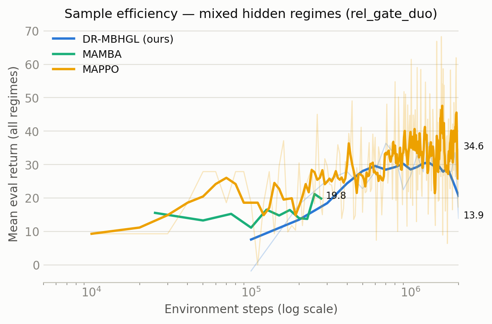
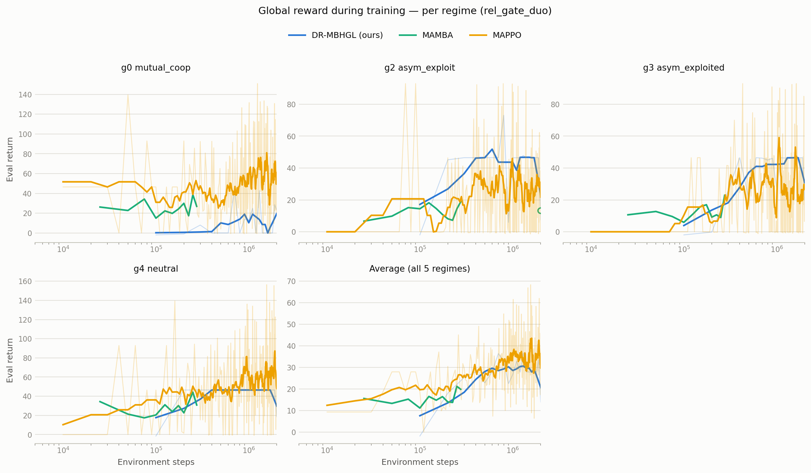
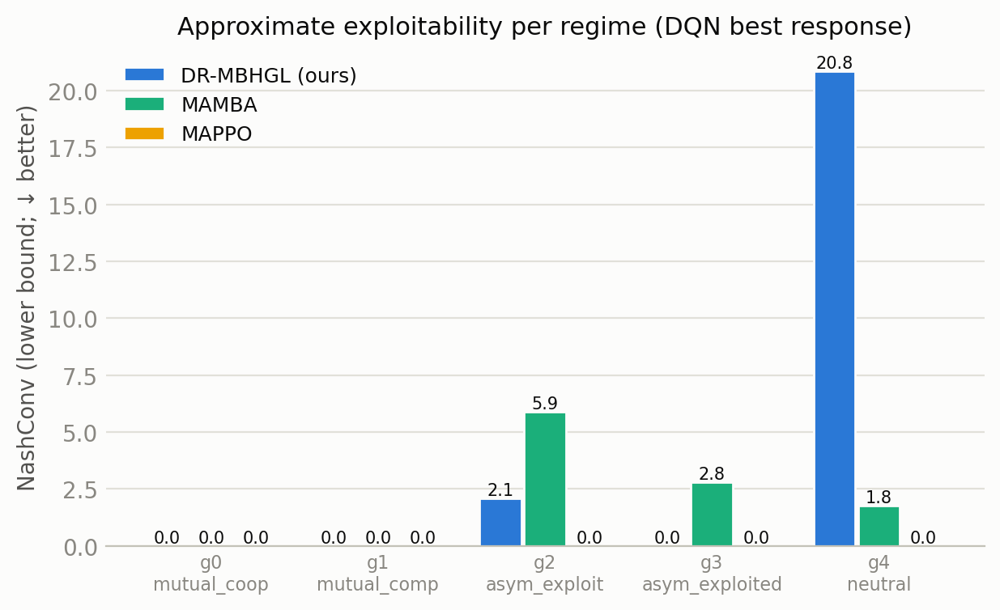
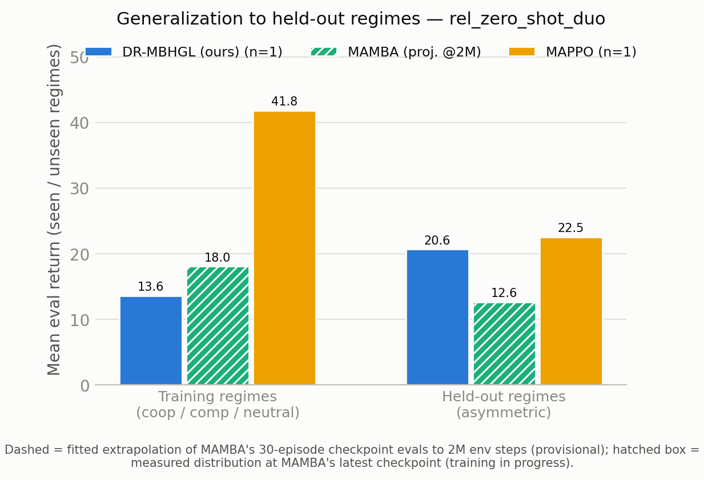

<!--
标题候选（用户确认后删除本注释；当前采用候选①）：
① 面向动态角色关系混合博弈的模型基础多智能体强化学习方法研究
② 基于动态角色关系的多智能体混合博弈模型基础强化学习方法研究
③ 动态角色关系下的多智能体混合博弈在线学习与关系泛化研究（对原题最小改动）
数据溯源（2M 标准化对比，2026-07-12 晚重填）：
  统一协议数值 = runs/_analysis/rel_defense/final_evals_2m/*.json（collect_final_evals.py，30回合/构型）
  MAMBA 中间检查点序列 = runs/_analysis/rel_defense/mamba_ckpt_series_{gate,zeroshot}.json（拟合外推来源）
  NashConv = runs/_analysis/rel_defense/game_metrics_{hyper,external_mappo,external_mamba}.json（@2M 检查点；MAMBA @最新检查点）
  汇总表 = runs/_analysis/rel_defense/table1.md；图 2-1~2-4 = docs/assets/interim_report/fig{1..4}_*.png（make_baseline_comparison.py）
  扩展训练参考（68.5 等）= runs/suite/*/hyper_seed0_*/eval_report.json（完整 20 万梯度步训练）
  MAMBA 2M 训练仍在进行（GPU3，约 4 天完成），完成后以实测替换全部 * 号暂定值并重新生成图表。
-->

|     |     |
| --- | --- |
| **论文题目** | 面向动态角色关系混合博弈的模型基础多智能体强化学习方法研究 |     |
| **一、研究内容简介**  多智能体系统中，智能体之间的合作与竞争关系往往随任务进程动态演变，形成合作、竞争与非对称利用并存的混合博弈。求解此类问题的主流途径是多智能体强化学习，但传统无模型（model-free）方法将收益结构与环境动力学一并编码进端到端的反应式策略，样本效率低，且在关系模式发生变化时只能依靠新的试错交互被动适应。模型基础（model-based）多智能体强化学习通过显式学习环境动力学模型，以规划或虚拟推演提升决策效率与样本效率，为应对动态关系提供了新的可能。然而，对现有模型基础多智能体强化学习工作的调研表明，代表性方法（如 MAMBA、MAZero、MARIE 等）绝大多数面向纯协作任务或假定智能体间关系固定，缺乏对"关系本身如何变化"的显式建模，难以直接求解关系动态演变下的混合博弈。  本课题以显式的**角色关系矩阵**为核心建模对象：系统的关系构型由矩阵 W(g)∈[−1,1]^{N×N} 描述，g 取自一个有限的命名关系族 G；矩阵元素 w_ij 表示智能体 i 对智能体 j 收益的关切权重，一行 w_i· 即为智能体 i 的"角色"。每个智能体仅私有地观测到自身所在行，关系构型 g 与他人的角色行向量均不可观测、需要通过交互推断。在此基础上，研究内容按关系的动态性程度递进展开。**研究内容一**面向"回合间重采样、回合内保持静态"的关系动态（对应 Harsanyi 不完全信息博弈框架，角色行向量即为参与人的私有类型），需要解决三个相互耦合的子问题：（a）**关系非平稳性**——收益结构随关系构型改变而改变，这是本课题拟解决的首要矛盾，采用超网络（HyperNetwork）架构按"当前角色+当前信念"动态生成各智能体专属的收益与策略预测参数；（b）**视角与共同学习引入的非平稳性**——多智能体同时学习时，从单个智能体视角看环境持续变化，采用"主观—客观"分离的世界模型架构（客观动力学以权重共享网络刻画其观察者无关性，主观收益侧由超网络生成）；（c）**任务结构不确定下的规划**——联合动作空间随智能体数量呈指数增长，混合博弈下不存在可供统一最大化的单一团队价值，且关系构型对智能体隐藏、需在线推断；本课题以规划型模型基础框架 MAZero 为基座，将其面向单一团队价值的采样式蒙特卡洛树搜索改造为逐智能体解耦选择、向量回传、叶节点按构型后验对超网络逐构型生成的价值头做贝叶斯平均的解耦式搜索，使规划在动作探索与任务结构识别两类不确定性下仍能产生稳定的策略改进信号。**研究内容二**进一步面向**全动态博弈环境**：角色间关系矩阵在单个回合内以不定期的方式发生切换，环境成为隐马尔可夫切换博弈。该设定下信念推断、模型规划与评估范式均面临新的挑战，本课题将在研究内容一所建立的"共享客观模型+超网络生成主观参数"架构上，给出切换感知的信念追踪与低成本参数重生成的求解范式（详见工作计划）。两部分研究共用同一环境内核（以单一切换概率参数统一刻画关系动态性），形成"关系显式建模—静态关系在线求解—全动态关系扩展"的完整研究路径。 |     |     |
| **二、研究工作进展**  多智能体系统在无人集群、能源互联网与智能交通等领域的核心决策问题可归结为智能体间的博弈，而现实任务中智能体的交互关系往往兼具合作与竞争，且随任务进程动态演化。董绍康等（2025）系统梳理了混合博弈问题的建模与求解方法，指出将博弈论与多智能体强化学习深度融合是应对该问题的重要路径\[1\]；郝建业等（2023）进一步提出了博弈智能的研究范式，强调感知、推理与学习在博弈决策中的一体化整合\[2\]；李艺春等（2025）在综述中明确，基于多智能体强化学习的博弈方法仍以在线交互学习为主导，采样效率与泛化能力尚存显著瓶颈\[3\]；罗俊仁等（2024）归纳了多智能体博弈学习的关键进展，认为动态环境下的策略适应性是未来方向\[4\]。在方法路线上，Wang 等（2022）对模型基础多智能体强化学习的系统综述指出，学习环境动力学模型并据此规划，是突破无模型方法样本效率瓶颈的主要途径，同时也指出模型偏差、非平稳性与可扩展性是该路线的核心挑战\[5\]。本课题据此采用模型基础的求解路线，并针对"动态角色关系"这一现有工作覆盖不足的问题结构展开研究。进一步的调研将该问题定位于模型基础多智能体强化学习两条分支的空白交汇点：面向任务泛化的分支完全处于协作设定——Chai 等（2025）的多任务协作综述将多任务问题划分为规模类、奖励类与跨域类，指出奖励类变化研究相对不足，并将合作—竞争博弈中的多任务决策列为首要开放问题\[17\]；其后续工作 M3W（2025）首次给出多任务世界模型，但任务身份以独热标签显式给定、专家库规模固定、且规划器仅支持连续动作\[18\]。而混合博弈分支虽具备逐智能体收益与均衡评估视角，却假定收益结构固定且已知。本课题的设定——变化的"任务"恰是收益结构本身、且对智能体隐藏——正是上述开放问题在世界模型层面的具体形态。据此，本课题确定以规划型协作框架 MAZero（Liu 等，2024）\[16\]为方法基座（在其上改进搜索机制是当前活跃且被认可的研究路径\[19\]），将其面向团队收益的训练逻辑迁移至混合博弈。以下分别汇报问题形式化与环境构建、方法设计、以及与代表性方法的对比实验三方面进展。  **2.1 问题形式化与 RelationCommons 实验环境**  本课题将动态角色关系混合博弈形式化为如下结构：N 个智能体处于共享的资源采集物理环境中；关系构型 g 取自有限命名关系族 G，对应关系矩阵 W(g)∈[−1,1]^{N×N}（对角元恒为 1）；智能体 i 的即时收益为关系加权的归一化聚合 R_i = (u_i + Σ_{j≠i} w_ij·u_j) / (1 + Σ_{j≠i}\|w_ij\|) − ε·1\[移动\]，其中 u_i 为 i 的即时物理采集量，ε 为微小移动代价，分母的行归一化保证不同关系构型下回报量纲可比。信息结构为：智能体 i 仅观测自身行向量 w_i·（其"角色"，即私有信息），g 与他人行向量不可观测；关系构型的真值仅在训练期作为可选的监督信号提供，执行期完全依赖推断。这一"公共物理规律+私有角色类型"的划分直接对应 Harsanyi（1967-1968）以私有类型与共同先验定义贝叶斯博弈的经典分析\[6\]，为本课题主观—客观双通路的参数划分提供了博弈论基础。  配套实现的 RelationCommons 环境将上述结构具体化：N 个智能体在 L×L 网格中活动，网格上散布 K 个以恒定速率再生的资源点，智能体可执行原地不动、四方向移动与采集共 6 种离散动作；网格资源采集与再生的设定延续了 Perolat 等（2017）对公共池塘资源博弈的多智能体强化学习建模\[7\]。当前研究规模为 N=2、L=8、K=8、回合长度 100 步，关系族 G 含 5 个命名构型：互利合作、互相竞争（该构型下关系收益按构造为零和）、两个方向相反的非对称利用构型、以及互不关切的中立构型。回合开始时 g 依先验重采样、回合内保持不变（研究内容一的设定）；环境内核以单一切换概率参数统一支持回合内切换（该参数大于零即进入研究内容二的全动态设定），两部分研究因此共用同一实验基础设施。环境同时实现了严格的信息分段契约：模型可见的公共信息、仅限训练期监督的关系真值、与仅限评估诊断的环境内部状态在接口层显式隔离，并对外部对比方法施加运行期检查，防止任何私有信息泄漏进入策略学习。  **2.2 DR-MBHGL 方法设计：按三个子问题的求解**  在上述问题结构上，本课题实现了动态关系感知的模型基础混合博弈学习方法 DR-MBHGL（Dynamic Relationship-Aware Model-Based Hybrid Game Learning）。需要说明：本节所述及 2.3—2.5 所报告的是本课题**前期原型系统**的设计与结果——其规划器为逐智能体坐标下降式模型价值估计（MVE，见（c）），用于先行验证超网络主观参数生成机制的可行性；依据上述最新文献调研结论，本课题已确定以 MAZero 为基座的重构技术路线（超网络机制与信念课程保留，MVE 原型规划器由解耦式搜索规划器取代），重构工作列为下一步计划的最高优先级（见三）。方法按研究内容一的三个子问题组织如下。  （a）**以超网络应对关系非平稳性（首要贡献）**。关系构型改变时，真正变化的只是各智能体的收益结构与最优响应，而非环境物理规律。DR-MBHGL 采用 DualHyperNetwork 架构：以"角色嵌入（自身行向量编码）⊕ 信念嵌入（对 g 的后验编码）"构成的上下文向量为输入，由超网络为每个智能体分别生成其专属的奖励头与策略预测头参数。其中对 g 的后验由基于门控循环单元的 BeliefNet 模块从观测序列在线推断，训练采用"先示教（利用训练期关系真值）、再线性退火、终至纯推断"的课程。这一以一个网络生成另一网络参数的思路延续了 Ha 等（2017）提出的超网络范式\[8\]，信念推断的设计借鉴了罗俊仁等（2022）的对手建模框架\[9\]。其效果是：当信念更新指示关系构型改变时，主观侧参数可由超网络**低成本地重新生成**，而无需像无模型方法那样依靠新的交互数据逐步重训策略——这正是应对关系非平稳性的关键机制。  （b）**以主观—客观分离与固定情景采样应对视角与共同学习非平稳性**。多智能体同时学习时，从任一智能体的视角看，"环境"（含其他智能体）持续变化。DR-MBHGL 从两个层面缓解该问题。架构层面，世界模型按"主观—客观"分离：客观通路为一个**所有智能体权重共享的状态转移网络**，以常规梯度下降训练——权重共享本身即编码了"物理规律与观察者无关"的视角不变性约束，使共性动力学知识在所有关系构型与所有智能体视角下一次学习、处处复用；主观通路即（a）中由超网络生成的各智能体专属收益与预测头。训练层面与规划层面，规划器引入**固定情景采样**，即共同随机数技术（Common Random Numbers，可追溯至 Wright 与 Ramsay（1979）对该方差缩减方法的经典分析\[10\]）：对某一智能体的候选动作逐一打分时，其余智能体的首步动作样本在同一候选组内被冻结为同一抽样，使"他人行为的随机性"这一共同噪声项在候选间比较中相消，显著提升打分信噪比，从而在他人策略持续变化的条件下仍能获得稳定的策略改进信号。  （c）**以逐智能体坐标下降 MVE 平衡计算复杂度**。多智能体联合动作空间大小为 A^N，随智能体数量指数增长；以蒙特卡洛树搜索为核心的规划方法（如 MuZero 及其多智能体扩展\[11\]）在该空间中面临组合爆炸。DR-MBHGL 采用简化的**逐智能体坐标下降式模型价值估计（MVE）**规划器，其思想与 Feinberg 等（2018）提出的以有限步模型展开结合自举价值的估计方法一致\[12\]：对每个智能体，仅对其自身 A 个候选动作沿世界模型滚动 K 步、累积折扣回报与自举价值，经归一化与 softmax 得到改进策略 π_mve 作为策略蒸馏目标；智能体间以坐标下降方式轮转优化。整个规划过程不涉及树搜索，单步规划代价由 A^N 量级降至 N·A 量级，与（b）中的固定情景采样配合构成完整的规划方案。BeliefNet、世界模型与策略—价值网络在同一训练回路中联合端到端优化。  **2.3 与代表性方法的对比实验**  为检验方法有效性，本课题在 RelationCommons（N=2，5 关系构型混合训练）上开展了与代表性方法的对比实验。对比方法的选取依据前期文献调研：**MAMBA**（Egorov 与 Shpilman，AAMAS 2022）是将模型基础强化学习系统引入多智能体场景的代表性工作，官方开源实现被广泛用作基线\[13\]；本课题将其官方代码移植适配至本环境（去除其分布式与实验跟踪依赖、对接本环境接口；其想象阶段将各智能体奖励取平均的协作性假设按原实现保留，作为该方法适用范围的披露项）。**MAPPO**（Yu 等，2022）为无模型多智能体策略优化的代表方法\[14\]；**QMIX**（Rashid 等，2018）为值分解路线的代表方法\[15\]（其以全体奖励之和为训练信号，在互相竞争构型下该信号按构造恒为零，此为该路线在混合博弈中的固有局限，作为披露项一并报告）。所有对比方法与本方法面对完全相同的观测接口与信息约束，关系真值对所有方法一律不可见。  对比将全部方法**统一在 2×10⁶ 环境交互步的同一预算点**上进行，并采用统一评估协议：在各方法 2×10⁶ 步对应的检查点上，逐构型执行 30 回合确定性评估。核心指标为三类：**（一）样本效率曲线**——以确定性评估回报对累计环境交互步数作图（对数横轴，展示区间统一为 5×10³ 至 2×10⁶ 步；前 5×10³ 步为预热阶段、不含评估点）。**（二）全局回报及其按关系构型的分解**——在标准化预算点报告总体均值、逐构型训练全程回报曲线与逐构型回报分布（箱线图）；互相竞争构型按构造收益零和、各方法均接近 0，故不单列面板。**（三）纳什均衡度量（NashConv/可利用度）**——对标准化检查点的冻结策略，逐构型训练近似最优反应（独立双 DQN，预算 2 万环境步/每智能体每构型），报告 NashConv(g)=Σ_i max(0, V_i(BR_i, π_{−i}) − V_i(π))。由于最优反应为近似训练所得，该值为真实可利用度的**下界**，训练预算随结果一并披露。此外需要说明比较的理论预期：无模型方法直接与真实环境交互、不承受世界模型的建模误差，在确定性训练场景下、同等环境交互步数预算内，其回报理论上应高于模型基础方法；因此模型基础方法的一项关键评估指标，是其回报与无模型参照之间的差距 Δ——该差距直接反映世界模型能否准确模拟真实环境（|Δ| 越小，拟真度越高）。  实验规模与预算的说明：三种方法均以 2×10⁶ 环境交互步为标准化预算点，各 1 个随机种子。本方法取其训练过程中 2×10⁶ 环境步对应的检查点（即 2 万梯度步；其规划器驱动采集使每个梯度步约消耗 100 环境步）参与全部标准化比较；作为扩展训练参考一并披露：其完整训练（20 万梯度步，约 2×10⁷ 环境步，单种子约 30.6 小时）最终收敛回报为 68.5，该值不计入 2×10⁶ 步的标准化对比。MAPPO 已完成完整的 2×10⁶ 步训练。MAMBA 受其世界模型训练开销限制（实测约 155 毫秒/环境步，单种子 2×10⁶ 步约需 4 天），截至中期节点其 2×10⁶ 步训练仍在进行（已完成约 2.75×10⁵ 步）；正文与图表中凡涉及其 2×10⁶ 步点位的数值，均为对其各中间检查点的完整 30 回合评估序列做饱和型学习曲线拟合后的外推预测值，一律以\*号标注"暂定"，且仅在外推稳定性检验通过的度量上给出，训练完成后将全部以实测结果替换。全部方法均为单种子、不含统计误差估计，相应结论均为初步观察，待后续补齐种子后作统计检验。  主对比结果如图 2-1、图 2-2 所示。在统一的 2×10⁶ 环境步预算点（图 2-1）：无模型参照 MAPPO 为 34.6，本方法为 13.9（Δ = −20.7），MAMBA 截至 2.75×10⁵ 步的实测值为 19.2（训练进行中）。这一排序与本节开头的理论预期一致：无模型方法不承受世界模型误差，在同等交互步数内回报理论上更高；两种模型基础方法与无模型参照的差距处于同一量级，其中本方法的差距主要集中在互利合作与中立两个构型（见下）。作为扩展训练参考：本方法的回报随交互预算持续增长，至 2×10⁷ 环境步收敛于 68.5；而 MAPPO 在 10⁶ 步（前期三种子实验均值 36.2±2.3）与 2×10⁶ 步（34.6）之间已无提升——即本方法的渐近性能显著更高，但该观察跨越不同预算，不作为标准化对比结论。按关系构型分解（图 2-2，四个非零和构型的训练全程回报曲线、全构型平均曲线与 2×10⁶ 步分布箱线图）：本方法在两个非对称利用构型上为 7.5 与 20.5（MAPPO 27.3 与 21.8），中立构型 18.6（MAPPO 63.3），互利合作构型 23.1（MAPPO 60.9）——即在 2×10⁶ 步点位，本方法在非对称利用（被利用方）构型上已达到与无模型参照相当的回报（20.5 对 21.8），而合作与中立构型的高回报策略（完整训练后合作构型可达 114.6）尚处形成早期；MAMBA 截至 2.75×10⁵ 步为非对称 17.3 与 16.2、中立 46.5、合作 16.1（训练进行中）。互相竞争构型下三种方法的关系收益均接近 0，与该构型收益按构造零和的性质一致，可视为评估管线的一致性检验。    图 2-1 样本效率曲线（对数横轴，统一展示区间 5×10³—2×10⁶ 环境步；细线为原始评估序列，粗线为滑动平均；各曲线终点为 2×10⁶ 步检查点的 30 回合确定性评估值；MAMBA 为训练中的实测部分曲线）    图 2-2 全局回报的逐构型分析：四个非零和构型的训练全程评估回报曲线与全构型平均曲线（对数横轴，5×10³—2×10⁶ 步），以及 2×10⁶ 步预算点的逐构型回报分布箱线图（每构型 30 回合；MAMBA 箱线为其最新检查点的实测分布，训练进行中；互相竞争构型各方法均接近 0，未单列）  纳什均衡度量结果如图 2-3 所示（均在 2×10⁶ 步标准化检查点上计算；MAMBA 为其最新检查点，训练进行中）：在 2 万环境步的近似最优反应预算下，无模型参照 MAPPO 在全部 5 个构型上的 NashConv 下界均为 0；本方法在非对称利用（利用方）与中立构型分别为 2.1 与 20.8、其余构型为 0（均值 4.6），与其在该预算点策略尚未收敛的状态一致——作为扩展训练参考，其完整训练检查点在全部 5 个构型上的该下界均为 0，即收敛后在该预算内未找到任何单方面有利偏离。MAMBA（@2.75×10⁵ 步）在两个非对称利用构型与中立构型上分别为 5.9、2.8 与 1.8（合作与竞争构型为 0）——正值恰好集中于智能体利益不一致的构型，与其想象阶段将各智能体奖励取平均的协作性目标假设相符，印证了本节开头关于协作性假设方法适用范围的披露。需强调 NashConv 为下界度量：随最优反应预算增大数值可能上升，上述结论仅在所披露预算下成立。    图 2-3 各关系构型下的近似可利用度（NashConv 下界，越低越好；近似最优反应为独立双 DQN，预算 2 万环境步/每智能体每构型；本方法与 MAPPO 在 2×10⁶ 步标准化检查点计算，MAMBA 为其最新检查点，训练进行中）  **2.4 对训练中未出现关系构型的泛化**  本课题方法的一个结构性预期是：由于收益按关系行向量线性聚合，固定联合策略下各智能体的价值函数可按 Q_i = Σ_j w_ij·Q_j^u 线性分解（Q_j^u 为对 j 的物理采集价值），因此在部分关系构型上学得的世界模型与信念先验，应能对训练中未出现的关系构型形成有效的重组泛化。为检验该预期，泛化实验将训练限制在三个对称构型（互利合作、互相竞争、中立），并在两个训练中从未出现的非对称利用构型上以确定性策略评估，与各对比方法在完全相同的训练限制下比较。  泛化实验结果如图 2-4 所示（均在 2×10⁶ 步标准化预算点评估）。该实验的评判核心不在绝对回报的高低，而在方法面对训练中从未出现的关系机制时**能否实现知识迁移**。本方法在训练构型上的评估回报为 13.6，在两个从未训练过的非对称构型上为 20.6——未见构型的回报反而高出 +7.1（约 +52%），即完全不存在训练分布外的性能崩塌；训练构型上获得的经验（共享的客观转移动力学、由角色行向量到主观参数的生成映射）在新构型上甚至更为适用。与之相对，无模型方法 MAPPO 从训练构型的 41.8 崩落至未见构型的 22.5（−19.3，约 −46%），呈现显著的分布外性能崩塌；MAMBA 的拟合外推预测值为训练构型 18.0\*、未见构型 12.6\*（−5.5\*，暂定）。值得注意的是，本实验中信念模块的构型识别针对的是训练先验之外的构型，其后验不可能收敛到正确类别，迁移收益因此主要由"角色行向量直接参与主观参数生成"这一结构通道支撑——这与上述线性值分解假设的预期方向一致。以上均为单种子初步观察，幅度数字待补齐种子后确认。    图 2-4 训练构型与未见非对称构型上的确定性评估回报（2×10⁶ 步标准化预算点，每构型 30 回合；训练限制在互利合作/互相竞争/中立三构型；各方法 1 种子；MAMBA 为拟合外推暂定值，带斜纹标注）  **2.5 已取得的成绩**  截至目前，本课题已完成以下工作：（1）完成了动态角色关系混合博弈的问题形式化（关系矩阵族、关系加权归一化收益、私有行向量信息结构），并实现了 RelationCommons 仿真环境，含严格的信息分段契约与统一的关系动态性内核（同一切换概率参数覆盖研究内容一、二两种设定）；（2）实现了 DR-MBHGL 方法的全部组件：DualHyperNetwork 主观参数生成、共享客观转移网络、BeliefNet 关系信念推断及其三阶段课程、逐智能体坐标下降 MVE 规划器与固定情景采样（CRN）方差缩减；（3）搭建了配套实验基础设施：声明式实验套件与按（变体，种子）粒度的断点恢复调度、逐关系构型的统一评估报告、TensorBoard 诊断与跨方法统计比较工具，并为外部对比方法增设了训练期周期性模型检查点与对各中间检查点的批量离线评估工具（每检查点 30 回合/构型），使样本效率曲线在方法间以统一评估协议可比；（4）完成了模型基础多智能体强化学习的系统文献调研（覆盖 2019—2025 年 10 个核心算法及其开源生态），据此确定了对比方法与评估实践；（5）完成了 MAMBA 官方实现向本环境的移植与验证：移植层通过与既有外部方法完全一致的接口契约测试与小预算训练—评估—存取回路测试；采用其官方"最优参数"配置后，单种子 2 万环境步的学习探针在互利合作构型下取得确定性评估回报 24.2（随机策略基线约 5.1），确认移植实现具备正常学习能力（单种子探针，仅作移植正确性佐证，方法间比较以 2.3 节正式实验为准）；（6）完成了 DR-MBHGL 在本环境上的训练验证：主对比训练行的训练期评估显示，信念模块对隐藏关系构型的识别准确率在 5 千步内由随机水平（0.198，五分类）提升至 0.70，规划器评估回报由训练初期的负值提升至 5 千步 22.8、完整训练结束时 68.5（扩展训练参考，见 2.3 节预算说明），确认信念推断与规划改进两条通路均在正常工作（信念准确率在课程退火后期有所回落，其与蒸馏策略的耦合关系将在后续消融中分析）。主对比、泛化与纳什度量的完整结果见 2.3—2.4 节。 |     |     |
| **三、下一步的工作计划**  一是完成以 MAZero 为基座的方法重构（最高优先级）。按四个可验证阶段推进：第一阶段将 RelationCommons 环境接入 MAZero 训练栈，以未改动的协作版基座完成冒烟训练以验证适配层；第二阶段完成搜索树的向量化改造（逐智能体价值存储、向量回传、解耦式选择），以"全合作特例下向量化实现复现标量基座行为"为数值回归门槛；第三阶段迁移主观通路（超网络按构型生成奖励与价值头、信念网络及其课程）并接入按构型后验的贝叶斯平均叶评估，同步将优势加权策略优化的优势项、价值/奖励回归目标与再分析机制逐智能体化；第四阶段接入统一评估协议，使重构方法与 MAPPO、MAMBA 及协作版 MAZero 基线直接可比。重构完成后，以模型拟真度、规划精度与任务泛化三类指标组织核心比对，开展条件化机制对比消融（超网络参数生成 对 混合专家路由 对 特征调制，直接检验相对 M3W 类方法的差异化主张）与规划器组件消融（叶评估方式、联合动作投影策略），补齐多随机种子与统计检验，并将实验场景扩展至 MPE 捕食者—猎物场景（主配置施加关系矩阵收益重加权与逐回合角色重采样，另设标准固定角色配置用于对标校准）。  二是展开研究内容二：全动态博弈环境下的求解范式。该设定中关系矩阵在单回合内以不定期方式切换（环境内核中切换概率参数大于零，成为隐马尔可夫切换博弈），带来四项新挑战：（1）**切换潜变量的在线追踪**——信念模块须从"平稳后验收敛"转变为"切换感知的滤波"，在切换时刻不可观测的条件下快速检测并重定位后验；（2）**规划中的关系冻结近似**——在想象滚动的有限步内将关系矩阵按当前信念冻结是必要的工程近似，切换密度升高时其误差需要刻画与控制；（3）**评估范式的转变**——平稳均值回报不再充分，须引入切换后的适应滞后（adaptation lag）与动态遗憾（dynamic regret）等面向非平稳性的度量；（4）**跨切换的信用分配**——切换前后经验的价值目标不再同分布。对应的求解范式为：切换感知的 BeliefNet（隐马尔可夫式后验/变点检测）+ 超网络在后验跳变时对主观参数的低成本重生成（本架构区别于端到端方法的核心优势：适应关系切换无需重训练，只需重生成）+ 短视界重搜索 + 以切换频率为难度轴的训练课程（从零开始逐步增大切换概率）。  三是深化博弈论评估：加大逐构型近似最优反应的训练预算以收紧 NashConv 下界，建立合作最优参照以报告经验性效率（empirical Price of Anarchy），并将两项度量扩展至全动态设定下的切换阶段分解评估。 |     |     |
| **四、指导教师评语**  签名： 日期： 年 月 日 |     |
| **五、中期考核结果**（请在相应等级后的"（）"内打"√"，并给出评语和修改意见）  **考核结果：** 优秀（ ）; 合格（ ）; 不合格（ ）  **评语：**  **修改意见：**  中期考核专家小组签名：  组长  成员  时间： 年 月 日 |     |
| **参考文献**  \[1\]董绍康, 李超, 杨光, 葛振兴, 曹宏业, 陈武兵, 杨尚东, 陈兴国, 李文斌, 高阳. 混合博弈问题的求解与应用综述\[J\]. 软件学报, 2025, 36 (1): 107-151.  \[2\]郝建业, 邵坤, 李凯, 李栋, 毛航宇, 胡舒悦, 王震. 博弈智能的研究与应用\[J\]. 中国科学:信息科学, 2023, 53 (10): 1892-1923.  \[3\]李艺春, 刘泽娇, 洪艺天, 王继超, 王健瑞, 李毅, 唐漾. 基于多智能体强化学习的博弈综述\[J\]. 自动化学报, 2025, 51 (3): 540-558.  \[4\]罗俊仁, 张万鹏, 苏炯铭, 袁唯淋, 陈璟. 多智能体博弈学习研究进展\[J\]. 系统工程与电子技术, 2024, 46 (5): 1628-1655.  \[5\]Xihuai Wang, Zhicheng Zhang, Weinan Zhang. Model-based Multi-agent Reinforcement Learning: Recent Progress and Prospects\[J/OL\]. arXiv:2203.10603, 2022.  \[6\]John C. Harsanyi. Games with Incomplete Information Played by "Bayesian" Players, I-III\[J\]. Management Science, 1967-1968, 14 (3): 159-182; 14 (5): 320-334; 14 (7): 486-502.  \[7\]Julien Perolat, Joel Z. Leibo, Vinicius Zambaldi, Charles Beattie, Karl Tuyls, Thore Graepel. A multi-agent reinforcement learning model of common-pool resource appropriation\[C\]. Advances in Neural Information Processing Systems 30 (NIPS 2017), 2017.  \[8\]David Ha, Andrew Dai, Quoc V. Le. HyperNetworks\[C\]. International Conference on Learning Representations (ICLR 2017), 2017.  \[9\]罗俊仁, 张万鹏, 袁唯淋, 胡振震, 陈少飞, 陈璟. 面向多智能体博弈对抗的对手建模框架\[J\]. 系统仿真学报, 2022, 34 (9): 1941-1955.  \[10\]R. D. Wright, T. E. Ramsay Jr. On the effectiveness of common random numbers\[J\]. Management Science, 1979, 25 (7): 649-656.  \[11\]Julian Schrittwieser, Ioannis Antonoglou, Thomas Hubert, Karen Simonyan, Laurent Sifre, Simon Schmitt, Arthur Guez, Edward Lockhart, Demis Hassabis, Thore Graepel, Timothy Lillicrap, David Silver. Mastering Atari, Go, Chess and Shogi by Planning with a Learned Model\[J\]. Nature, 2020, 588 (7839): 604-609.  \[12\]Vladimir Feinberg, Alvin Wan, Ion Stoica, Michael I. Jordan, Joseph E. Gonzalez, Sergey Levine. Model-based value estimation for efficient model-free reinforcement learning\[J/OL\]. arXiv:1803.00101, 2018.  \[13\]Vladimir Egorov, Alexei Shpilman. Scalable Multi-Agent Model-Based Reinforcement Learning\[C\]. Proceedings of the 21st International Conference on Autonomous Agents and Multiagent Systems (AAMAS 2022), 2022: 381-390.  \[14\]Chao Yu, Akash Velu, Eugene Vinitsky, Jiaxuan Gao, Yu Wang, Alexandre Bayen, Yi Wu. The Surprising Effectiveness of PPO in Cooperative, Multi-Agent Games\[C\]. Advances in Neural Information Processing Systems 35 (NeurIPS 2022), Datasets and Benchmarks Track, 2022.  \[15\]Tabish Rashid, Mikayel Samvelyan, Christian Schroeder de Witt, Gregory Farquhar, Jakob Foerster, Shimon Whiteson. QMIX: Monotonic Value Function Factorisation for Deep Multi-Agent Reinforcement Learning\[C\]. Proceedings of the 35th International Conference on Machine Learning (ICML 2018), 2018.  \[16\]Qihan Liu, Jianing Ye, Xiaoteng Ma, Jun Yang, Bin Liang, Chongjie Zhang. Efficient Multi-agent Reinforcement Learning by Planning\[C\]. International Conference on Learning Representations (ICLR 2024), 2024.  \[17\]Jiajun Chai, Zijie Zhao, Yuanheng Zhu, Dongbin Zhao. A Survey of Cooperative Multi-Agent Reinforcement Learning for Multi-Task Scenarios\[J\]. Artificial Intelligence Science and Engineering, 2025, 1 (2): 98-121.  \[18\]Zijie Zhao, Zhongyue Zhao, Kaixuan Xu, Yuqian Fu, Jiajun Chai, Yuanheng Zhu, Dongbin Zhao. Learning and Planning Multi-Agent Tasks via an MoE-based World Model\[C\]. Advances in Neural Information Processing Systems 38 (NeurIPS 2025), 2025: 40857-40890.  \[19\]Sizhe Tang, Jiayu Chen, Tian Lan. MALinZero: Efficient Low-Dimensional Search for Mastering Complex Multi-Agent Planning\[C\]. Advances in Neural Information Processing Systems 38 (NeurIPS 2025), 2025: 75248-75278. |     |     |
