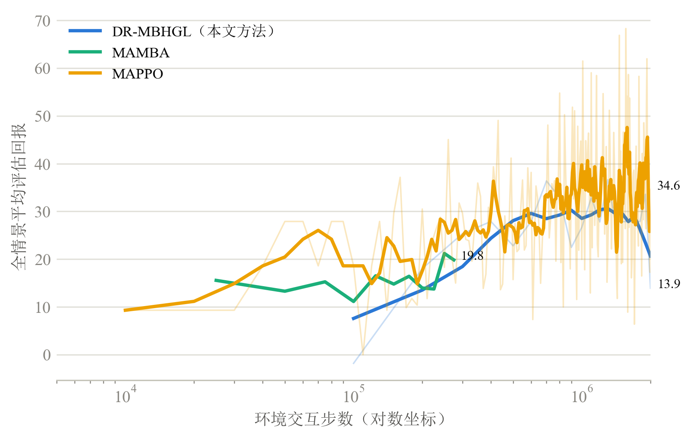
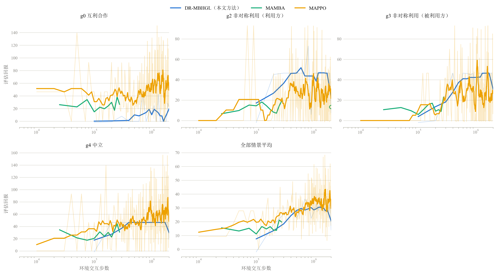
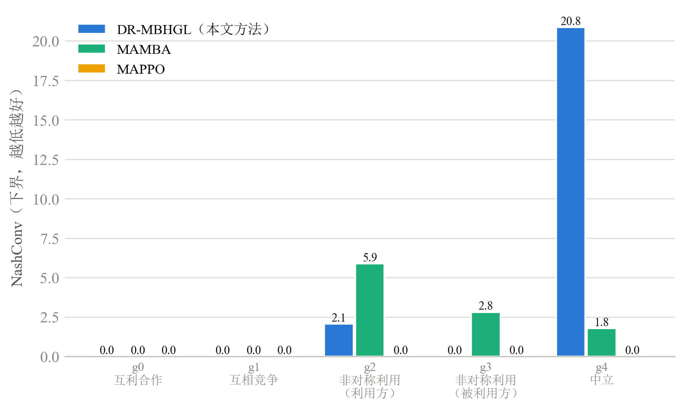
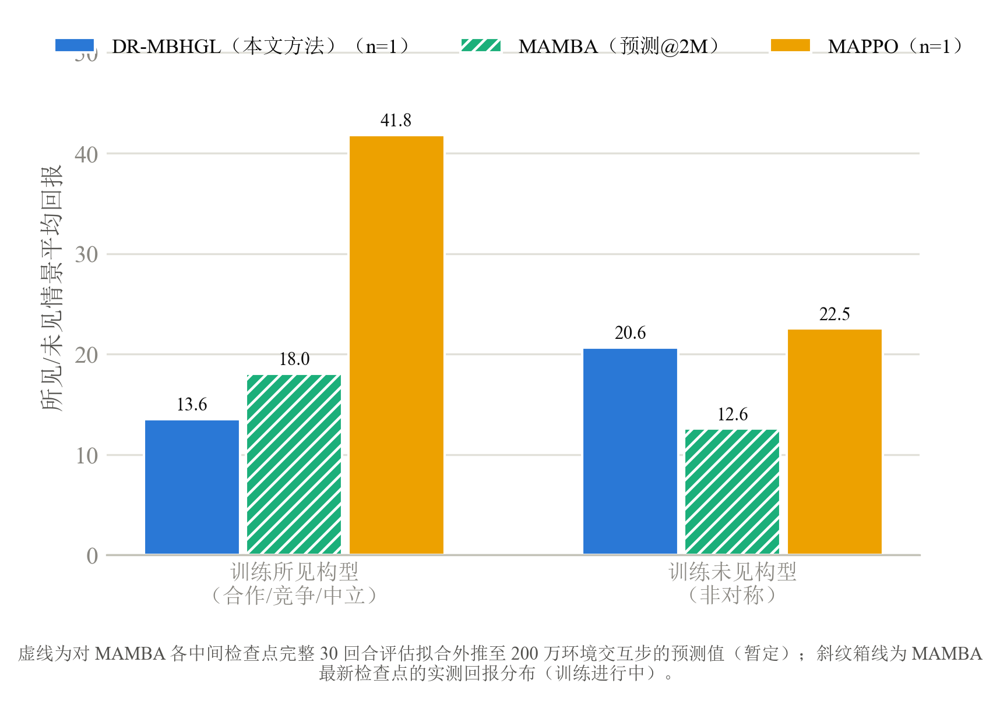
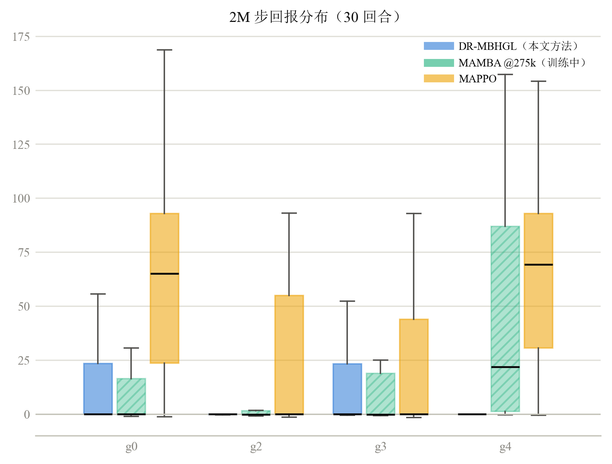

# 一、研究内容简介
多智能体强化学习（Multi-Agent Reinforcement Learning, MARL）让多个智能体在共享环境中通过交互与试错来学习最优决策策略，在自动驾驶车队协同、无人机集群控制和多机器人协作等场景中具有广泛应用前景。然而在一个真实的多智能体系统中，智能体之间的合作与竞争关系往往随任务进程动态演变，形成合作、竞争与非对称利用并存的混合博弈。传统无模型（model-free）方法将收益结构与环境动力学一并编码进端到端的反应式策略，在关系模式发生变化时只能依靠新的试错交互被动适应，且样本效率低。基于模型的（model-based）多智能体强化学习通过显式学习环境动力学模型，为应对动态关系提供了新的可能，并能通过虚拟推演提升决策效率与样本效率。但是目前大多数算法假定智能体间关系固定，难以直接求解关系动态演变下的混合博弈。本课题面向多智能体强化学习中模型无法适应动态角色关系、训练样本效率与泛化能力有限的问题，开展基于超网络的多智能体在线强化学习方法研究，按关系动态性程度递进设置两部分研究内容。
研究内容一面向**局间动态博弈环境**，即关系构型在回合间重采样、回合内保持静态的设定。使用角色关系矩阵描述角色间的动态关系变化，并将其映射到各智能体的奖励函数与策略之中，完成博弈环境里关系非平稳性问题的数学化定义。以规划型模型基础多智能体强化学习框架 MAZero 为基座，研究超网络对角色关系的表征能力，以及世界模型在多智能体不同视角下面临的隐状态分歧（客观状态漂移）问题，提出主观—客观分离的超网络世界模型架构，保障关系构型改变训练任务结构时的世界模型拟真度。设计全局回报及其按关系构型的分解、纳什均衡度量等指标衡量模型性能，通过消融实验分析各模块的合理性与改善作用。在规划层面，联合动作空间随智能体数量指数增长，混合博弈下不存在可供统一最大化的单一团队价值，且关系构型对智能体隐藏、需在线推断；为此在基座的采样式蒙特卡洛树搜索基础上，研究逐智能体解耦选择与按构型后验贝叶斯平均的叶节点评估，使规划过程在动作探索与任务结构识别两类不确定性下仍能产生稳定的策略改进信号。
研究内容二进一步面向**全动态博弈环境**：关系矩阵在单个回合内以不定期方式切换，环境成为隐马尔可夫切换博弈。该设定下切换前后经验的价值目标不再同分布，需要超网络在信念后验跳变时对主观参数进行低成本重生成，并配合短视界重搜索完成在线适应。实验遵循 OpenAI Gym 环境接口规范，将角色关系矩阵集成进 RelationCommons 多智能体资源采集仿真环境，采用样本效率曲线、全局回报和纳什均衡度量等指标综合评估方法有效性。
## 二、研究工作进展
### 2.1 相关研究现状与文献调研

**（1）无模型多智能体强化学习方法**

无模型方法是当前多智能体强化学习的主流路线，其代表性框架为集中式训练—分布式执行（Centralized Training with Decentralized Execution, CTDE）：训练期利用全局信息辅助价值估计，执行期各智能体仅依据局部观测决策。MADDPG（Lowe 等，2017）是该框架下的早期代表工作\[R1\]，其为每个智能体维护一个确定性策略 $\mu_i(o_i;\theta_i)$，并以能够访问全体智能体观测与动作的集中式评论家 $Q_i^{\mu}$ 指导策略更新，策略梯度为

$$\nabla_{\theta_i} J(\theta_i) \;=\; \mathbb{E}_{x,a\sim\mathcal{D}}\Bigl[\nabla_{\theta_i}\mu_i(o_i)\;\nabla_{a_i} Q_i^{\mu}\bigl(x, a_1,\ldots,a_N\bigr)\big|_{a_i=\mu_i(o_i)}\Bigr]$$

其中 $x$ 为全局状态信息，$\mathcal{D}$ 为经验回放池。集中式评论家将其他智能体的策略变化纳入价值估计，缓解了独立学习者面临的环境非平稳性，使该方法可同时适用于合作、竞争与混合场景。MAPPO（Yu 等，2022）将近端策略优化引入多智能体设定\[R2\]，各智能体共享策略网络并配以集中式价值函数，优化裁剪代理目标

$$L^{\mathrm{CLIP}}(\theta) \;=\; \mathbb{E}_t\Bigl[\min\bigl(r_t(\theta)\hat{A}_t,\;\mathrm{clip}\bigl(r_t(\theta),\,1-\epsilon,\,1+\epsilon\bigr)\hat{A}_t\bigr)\Bigr],\qquad r_t(\theta)=\frac{\pi_\theta(a_t\mid o_t)}{\pi_{\theta_{\mathrm{old}}}(a_t\mid o_t)}$$

其中 $\hat{A}_t$ 为广义优势估计。该方法以简洁的同策略训练在多个协作基准上取得了与异策略方法相当乃至更优的性能，是目前使用最广泛的无模型基线之一。然而，上述方法共同的结构性局限在于：收益结构与环境动力学被一并压缩进端到端的策略/价值网络，网络内部并无"关系"这一显式变量——当智能体间的合作—竞争关系发生变化时，已学策略只能依靠新的试错交互整体重训；同时，同策略方法每一步策略更新都需要新鲜样本，样本效率受限。

**（2）模型基础多智能体强化学习的发展脉络**

针对样本效率瓶颈，模型基础路线显式学习环境动力学模型 $\hat{\mathcal{M}}$，并在模型内部通过虚拟推演或规划优化策略。Wang 等（2022）对该方向的系统综述指出，模型基础方法可将无模型方法的交互需求降低一个数量级，但模型偏差、多智能体非平稳性与联合空间可扩展性是其核心挑战\[R3\]。该路线的一般范式可概括为：在真实交互数据 $\mathcal{D}$ 上以极大似然拟合动力学模型，再在模型内最大化想象回报，

$$\hat{\mathcal{M}} \;=\; \arg\min_{\mathcal{M}'}\;\mathbb{E}_{(s_t,a_t,r_t,s_{t+1})\sim\mathcal{D}}\bigl[-\log P_{\mathcal{M}'}(s_{t+1}, r_t \mid s_t, a_t)\bigr],\qquad \pi^* \;=\; \arg\max_{\pi}\;\mathbb{E}_{\hat{\mathcal{M}},\,\pi}\Bigl[\sum_{k=0}^{H}\gamma^{k}\, \hat{r}_{t+k}\Bigr]$$

其中 $H$ 为想象滚动视界。该路线的发展可概括为"确立可行性—提升模型与规划质量—走向任务泛化"三个阶段。第一阶段（2021—2022 年）以证明可行性与样本效率优势为主线：MAMBA（Egorov 与 Shpilman，2022）将 Dreamer 类潜在空间世界模型扩展到多智能体协作场景，各智能体在潜在空间中生成想象轨迹并以其训练策略，仅在与真实环境交互时消耗样本，在星际争霸多智能体挑战等基准的低数据设定下相比 MAPPO 等无模型方法取得了约一个数量级的样本效率提升\[R4\]，其官方开源实现被广泛用作后续工作的对比基线；AORPO（Zhang 等，2021）则将智能体视角下的"环境"分解为物理动力学与其他智能体策略两部分，分别建模并依据各对手模型的误差自适应调整其模型滚动长度，给出了模型化多智能体策略优化的单调改进条件\[R5\]。第二阶段（2023—2024 年）转向更高质量的模型与显式规划：MAZero（Liu 等，2024）将 MuZero 范式扩展到多智能体协作场景\[R6\]，以"个体表示—注意力通信—个体动力学—集中式奖励/价值—个体策略"六个函数组成的集中式训练—分布式执行架构，配合采样式蒙特卡洛树搜索在联合动作空间中前瞻规划，并以乐观搜索 OS($\lambda$) 与优势加权策略优化（AWPO）分别缓解稀疏采样下的价值低估与行为克隆丢弃价值幅度信息两个问题，是规划型模型基础多智能体方法的代表性框架。第三阶段（2025 年）前沿分化为三条并行方向：其一是世界模型生成架构的革新，如 DIMA 以扩散模型的逐步去噪机制重构多智能体世界模型，将联合动作条件化为逐智能体的顺序去噪过程\[R12\]；其二是搜索效率的持续优化，如 MALinZero 在 MAZero 基础上以上下文线性赌博机形式化，将联合动作搜索的未知量规模从 $d^N$ 压缩到 $N\cdot d$\[R9\]——这也说明"在 MAZero 框架上改进搜索机制"是当前活跃且被认可的研究路径；其三是面向多任务的世界模型（见（4））。需要强调，以上主线工作均处于**完全协作**设定（以团队共同回报为优化目标），且均假定**单一固定任务**——收益结构在训练与执行全程不变。

**（3）面向混合博弈的模型基础方法分支**

与上述协作主线并行，存在一支规模小得多的混合博弈分支，将逐智能体独立收益与博弈均衡概念引入模型基础方法。H-MARL（Sessa 等，2022）在一般和马尔可夫博弈（即混合协作—竞争设定）中提出基于高斯过程转移模型与乐观粗相关均衡计算的模型基础算法，给出了动态遗憾界与均衡收敛速率分析\[R10\]；MBOM（Yu 等，2022）利用环境模型在想象空间中模拟对手的递归推理与策略改进，面向竞争性场景实现对手建模\[R13\]；MBC（Han 等，2024）在具有逐智能体独立收益的部分可观测马尔可夫博弈中，以模型基础方式预测通信消息的动力学以削减通信开销\[R11\]；前述 AORPO 的实验也覆盖混合协作—竞争环境\[R5\]。该分支确立了本课题所需的问题形式化基础——以逐智能体收益 $r^i$ 定义的马尔可夫博弈，以及以可利用性/均衡度量评估策略质量的评价视角。但其共同前提是**收益结构在训练与执行全程固定且已知**：关系（收益权重）从不作为随任务进程变化的对象进入模型；并且该分支至今未沉淀出可复用的神经网络"世界模型 + 规划"框架——H-MARL 基于高斯过程模型且未开源，MBOM 与 AORPO 属对手建模式滚动方法，MBC 仅对消息动力学建模。

**（4）面向任务泛化的多任务方法与公开难题**

2025 年，中国科学院自动化研究所团队对多任务场景下的协作多智能体强化学习进行了系统综述\[R7\]，将多任务问题划分为三类：由智能体数量变化引起的规模类、由奖励函数变化引起的**奖励类**、由状态/动作空间与转移动力学差异引起的跨域类；并指出现有研究绝大多数集中于规模类问题，奖励类变化的研究相对不足。同一团队随后提出的 M3W（Zhao 等，2025）首次将混合专家（MoE）世界模型引入多任务多智能体设定：以任务标签的可学习嵌入为条件信号贯穿全部模型组件，以软/稀疏混合专家结构分别承载跨任务的动力学与奖励差异，配合模型预测路径积分规划器，在双灵巧手操作与多智能体 MuJoCo 的多任务联合训练中取得最优平均性能\[R8\]。然而 M3W 存在三项与本课题直接相关的边界：其一，任务身份以独热标签**显式给定**，方法不含对隐藏任务身份的在线推断；其二，专家库规模固定、按已见任务路由，缺乏向未见任务外推的机制；其三，其规划器仅适用于连续动作空间，论文明确将"结合蒙特卡洛树搜索以支持离散动作"列为未来工作。尤为重要的是，该综述在未来方向中将**合作—竞争博弈中的多任务决策**列为首要开放问题，指出这一方向的研究仍然有限\[R7\]。

**（5）现有研究的不足与本课题的切入点**

综合上述调研，模型基础多智能体强化学习的两条相关分支呈现出一个清晰的空白交汇点：任务泛化分支（综述与 M3W）完全处于协作设定、任务身份给定，且所处理的任务变化以动力学与规模差异为主；混合博弈分支具备逐智能体收益与均衡视角，但假定收益结构固定且已知。二者的交集——**变化的"任务"恰是收益结构本身，且该结构对智能体隐藏**——目前为空白，而这正是上述综述所列开放问题在世界模型层面的具体形态。本课题的问题设定精确落于该交汇点：以显式关系矩阵 $W(g)$ 刻画收益结构，构型 $g$ 逐回合重采样（研究内容一）乃至回合内切换（研究内容二）且对智能体隐藏，即一般和马尔可夫博弈中的**奖励类多任务问题叠加隐藏任务身份**。在该设定下，现有架构的失效机理是结构性的：环境物理动力学跨构型不变、其模型始终有效，而奖励与价值预测头在不同构型下面对符号相反的回归目标，共享网络上来自不同构型的梯度相互抵消（数学刻画见 2.2.1（a）的类型梯度撕裂分析）。由此，本课题的技术路线从文献脉络中自然导出：以规划型协作框架 MAZero 为基座（离散动作、含显式规划、架构模块划分清晰），沿用混合博弈分支的形式化与均衡度量；针对第一研究方向（关系变化下的世界模型拟真度），以超网络按"自身角色 + 构型信念"上下文**逐构型生成**各智能体专属的奖励与价值预测头参数——相比 M3W 的"给定任务标签 + 固定专家库"，参数生成机制既能以在线推断的信念替代给定标签以处理隐藏任务，又能借助关系行向量的连续输入向未见构型外推；针对第二研究方向（任务结构不确定下的规划），将基座面向单一团队价值的搜索改造为逐智能体解耦选择与按构型后验贝叶斯平均的叶节点评估（见 2.2.2）——回应混合博弈下"单一价值最大化"不再良定义与任务结构需在线识别这两重挑战，同时呼应 M3W 将离散动作规划列为未来工作、MALinZero 持续优化 MAZero 搜索机制的前沿脉络。

### 2.2 问题形式化定义与算法设计
本课题的算法设计围绕两个核心创新展开：第一，**局间动态博弈环境**（关系构型在回合间重采样、回合内保持静态）下，以 MAZero 为基座、基于超网络主观参数生成与解耦式搜索规划的多智能体强化学习算法；第二，全动态博弈环境下基于局内关系感知切换和参数重生成的适应机制。其中，第一部分是当前阶段的主要研究重点，第二部分作为后续扩展方向。

本课题方法的整体架构由三个相互衔接的模块组成：**角色感知模块**（2.2.1）从私有角色行向量与观测历史中提取"当前角色 + 当前信念"的上下文表征；**主观—客观分离的世界模型模块**（2.2.1）以该上下文为条件，由超网络生成各智能体专属的奖励与价值/策略预测参数，同时以权重共享的客观网络（继承基座的表示、通信与个体动力学函数）刻画与关系无关的环境动力学；**解耦式搜索规划模块**（2.2.2）在学习到的世界模型上执行逐智能体解耦的采样式树搜索，叶节点按构型后验对超网络生成的逐构型价值头做贝叶斯平均，产生改进策略作为训练目标。整体算法流程如图 2-a 所示：环境观测一方面经表征网络编码为隐状态，另一方面经角色感知模块编码为上下文向量；超网络按上下文生成主观参数后，规划器在世界模型上为每个智能体搜索候选动作并输出改进策略，智能体依其行动并将经验存入回放池，构成"交互—学习—规划"的闭环。

图 2-a DR-MBHGL 整体算法流程（三个模块分组对应 2.2.1 与 2.2.2 小节）

<!-- 图 2-a/2-b 绘图说明（2026-07-16）：现有 fig_algo_flow.drawio 与 fig_grad_flow.drawio 的规划器分组仍为已退役的 MVE 原型；重绘时规划器模块应改为"解耦式搜索规划器"（2.2.2），梯度流图的策略损失应标注为逐智能体优势加权的 AWPO。 -->

训练阶段各网络在同一回路中联合优化，梯度流向如图 2-b 所示。训练目标由五项损失构成：策略改进损失（以搜索输出的改进策略为目标、按各智能体自身优势加权的 AWPO 交叉熵，优势由该智能体自身的根节点搜索价值与预测价值之差给出）、价值损失（以逐智能体 n 步回报为目标）、奖励损失（以各智能体的环境真实收益为回归目标）、潜在状态一致性损失（预测隐状态向下一时刻真实编码对齐，目标侧截断梯度）以及信念监督损失（训练期以关系构型真值监督信念网络的分类头，并附加防止各智能体信念坍缩的多样性正则）。其中前四项经上下文通路反向传播至超网络与角色感知模块，信念监督损失则专职训练信念网络；训练初期设置信念梯度门控，主任务梯度暂不回传信念通路，待信念推断稳定后放开，避免两条学习信号在冷启动阶段相互干扰。全部参数由单一优化器联合更新。

图 2-b 训练梯度流向（实线为前向数据流，虚线为梯度反传路径，⊘ 标记停梯度边界）

### 2.2.1 基于超网络的自身角色感知能力和主观-客观分离的世界模型框架设计
本课题选择基于模型的强化学习算法框架的原因在于环境中存在不随博弈关系变化的共性物理规律，这部分知识可被学习一次并在所有关系构型下复用；而真正随关系演化的只是各智能体的收益偏好与最优响应。若采用无模型方法，策略会将收益结构和环境动力学混杂进同一个端到端映射，一旦关系偏移，整个策略只能通过大量新交互重新调整，样本效率很低。相比之下，基于模型的方法显式学习环境动态模型，可利用规划前瞻性决策，并允许将共性动力学与关系敏感的收益预测解耦，从而在关系变化时仅需更新收益部分，无需重新学习环境模型，大幅提升样本效率与适应速度。
但是基于模型的强化学习算法在多智能体环境中会面临收益结构随关系构型改变而改变，导致类型梯度撕裂和角色平均。

**（a）类型梯度撕裂与角色平均的数学解释**

设关系构型 $g$ 对应关系矩阵 $W(g)\in[-1,1]^{N\times N}$（对角元恒为 1），智能体 $i$ 的即时收益为关系加权的归一化聚合

$$R_i \;=\; \frac{u_i + \sum_{j\neq i} w_{ij}\,u_j}{1 + \sum_{j\neq i} |w_{ij}|}$$

其中 $u_j$ 为智能体 $j$ 的即时物理采集量。对任一物理采集量求偏导，得

$$\frac{\partial R_i}{\partial u_j} \;=\; \frac{w_{ij}}{1 + \sum_{k\neq i} |w_{ik}|}\qquad (j\neq i),\qquad \frac{\partial R_i}{\partial u_i} \;=\; \frac{1}{1 + \sum_{k\neq i} |w_{ik}|}$$

即收益对"他人采集"的敏感度完全由关系权重 $w_{ij}$ 决定。以 $N=2$、关系强度 $|w_{ij}|=1$ 的五个命名构型为例，交叉偏导 $\partial R_i/\partial u_j$ 的取值为：互利合作构型下双方均为 $+1/2$，互相竞争构型下双方均为 $-1/2$，非对称利用构型下利用方为 $-1/2$ 而被利用方为 $+1/2$（同一构型内两侧符号相反），中立构型下双方均为 $0$。这意味着**同一个共享的奖励预测网络被要求在不同关系构型下拟合符号相反的输入—输出关系**：合作构型要求"对方多采集则我的收益上升"，竞争构型要求恰好相反。反向传播时，来自不同构型样本的梯度在共享权重上直接相互抵消，网络只能收敛到各构型梯度的平均——此即**类型梯度撕裂**。其后果是奖励预测（进而价值估计与策略）在每个具体构型下都是系统性有偏的。进一步地，即使在同一构型内部，非对称构型下两个智能体的最优响应也截然不同（利用方应持续采集，被利用方的收益还依赖对方行为），共享的策略/价值网络容量在不同角色间被平均分配，无法为任一角色学到专属的精细策略——此即**角色平均**。两个问题的共同根源是：关系构型与角色是收益结构的真实生成变量，却未作为显式条件进入网络参数。

**（b）自身角色感知模块设计**

角色感知模块的任务是把上述"真实生成变量"编码为可供参数生成使用的上下文向量，其结构如图 2-c 所示。模块包含两条并行编码通路。**角色通路**处理智能体可直接观测的私有信息：自身编号经嵌入层得到身份嵌入，自身关系行向量 $w_{i\cdot}$（其"角色"）经两层感知机得到角色嵌入，二者拼接为 32 维角色表征——该通路刻画"我是谁、我关切谁"。**信念通路**处理需要推断的隐藏信息：关系构型 $g$ 与他人的角色行向量均不可观测，模块以门控循环单元（GRU）网络 BeliefNet 从观测序列在线维护对 $g$ 的后验分布——观测经编码器压缩后逐步送入 GRU（各智能体共享网络权重、独立维护隐状态），128 维隐状态经分类头与 softmax 输出对 $|G|$ 个命名构型的后验概率 $\hat{g}_i$，再经线性投影得到 32 维信念表征。训练采用三阶段课程：初期直接以关系构型真值的独热编码替代后验（示教），中期在真值与推断之间线性退火混合，后期完全使用纯推断后验，避免信念推断尚不可靠时拖累主任务训练。两条通路的输出各经层归一化后拼接为 64 维上下文向量 $\mathrm{ctx}_i = [\text{角色}_i \,\|\, \text{信念}_i]$，作为下游超网络的输入。

图 2-c 自身角色感知模块结构（角色通路编码私有行向量，信念通路在线推断关系构型后验）

**（c）隐状态在不同角色视角下的分歧问题**

解决收益侧非平稳性的直接思路是把上下文向量注入世界模型的全部组件，即转移动力学也按"智能体 × 关系构型"条件化。但这会引入新的问题：环境的物理规律（资源的再生与被采集、智能体的移动）对所有智能体是同一份客观事实，与关系构型无关。若转移网络也接收各智能体不同的上下文，同一物理状态在不同智能体视角下将被编码到互不一致的隐状态区域，模型实际上在学习 N 份关于同一动力学的表述——它们相互冗余又相互矛盾（客观状态漂移）：一方面每份动力学只能利用 1/N 的经验，样本利用率下降；另一方面规划器在不同智能体的想象轨迹中面对不一致的"物理"，跨智能体的价值比较失去共同基准。

**（d）主观—客观分离的世界模型框架设计**

针对上述矛盾，本课题将世界模型按"什么随关系变化"这一标准显式分离为两条通路。**客观通路**负责与关系无关的部分，完整继承基座 MAZero 的三个客观函数：表示网络 $h$ 将各智能体观测编码为个体隐状态，注意力通信网络 $e$ 为各智能体生成协作特征，个体动力学网络 $g$ 以残差形式由（个体隐状态、个体动作、协作特征）预测下一个体隐状态；三者均为**所有智能体权重共享**的常规网络，以梯度下降直接训练。权重共享本身即编码了"物理规律与观察者无关"的结构性约束，使共性动力学知识在所有关系构型与所有智能体视角下一次学习、处处复用，从根本上消除（c）中的隐状态分歧。**主观通路**负责随关系变化的部分：以（b）中的上下文向量 $\mathrm{ctx}_i$ 为输入，超网络分别生成智能体 $i$ 专属的奖励预测头参数 $\theta_{\mathrm{rew}}^i$ 与策略—价值预测头参数 $\theta_{\mathrm{pred}}^i$；不同构型、不同角色获得不同的头参数，各自的输入—输出关系不再相互抵消，从架构上化解（a）中的类型梯度撕裂与角色平均。这一"共享客观模型 + 超网络生成主观参数"的划分同时带来关键的适应性优势：当信念更新指示关系构型改变时，只需以新上下文重新前向一次超网络即可重生成主观参数，客观模型原样复用，无需任何重训练——这正是研究内容二中低成本在线适应机制的架构基础。

**（e）与 MAZero 基座的继承关系及 CTDE 框架的保持**

按照 2.1（5）导出的技术路线，上述主观—客观分离框架落实为对 MAZero 六函数架构的一次结构化改造，逐函数对应关系为：表示 $h$、通信 $e$、动力学 $g$ 三个函数**原样继承**，构成客观通路；集中式团队奖励头 $R$ 改造为 $N$ 个由超网络生成参数的智能体专属主观奖励头 $\hat{R}_i(\boldsymbol{s},\boldsymbol{a};\theta_{\mathrm{rew}}^i)$——其"全体隐状态与联合动作"的全局输入在本课题中不仅是继承而且是语义必需的，因为关系加权收益 $R_i$ 经权重 $w_{ij}$ 依赖其他智能体的物理采集量；集中式团队价值头 $V$ 改造为逐智能体价值头，由超网络按构型生成、供规划器叶评估做贝叶斯平均（2.2.2）；个体策略头 $P$ 保留逐智能体共享结构，额外以（b）中的上下文 $\mathrm{ctx}_i$ 为条件。

该改造完整保持了基座的集中式训练—分布式执行（CTDE）划分。可分布式执行侧（$h$、$g$、$P$）不变或仅增加**本地可得**的条件输入：$P$ 新增的上下文由自身私有行向量与自身观测历史（信念网络）构成，不需要任何其他智能体的信息。仅中心化训练使用侧（$e$、$R$、$V$）改变的是输出形态——标量到向量、静态参数到超网络生成——其信息类别不变。新增模块同样各归其位：信念网络与角色编码器在执行期仅依赖本地信息，可分布式执行；其训练期的构型真值监督属于"仅中心化训练可用的特权信息"，恰是 CTDE 中"集中训练"一侧的典型体现。联合策略保持按智能体因子化（$\prod_i P$），与基座一致；训练中改变的仅是各因子策略损失的优势权重由团队优势变为其自身优势。基座中"集中式 $R$/$V$ 承担团队信用分配"的角色，在混合博弈设定下相应推广为"集中式 $\hat{R}_i$/$V_i$ 承担关系矩阵 $W(g)$ 下的逐智能体收益归因"——机制被继承，其博弈论含义被推广。
### 2.2.2 面向任务结构不确定性的解耦式搜索规划器设计

基座 MAZero 的采样式蒙特卡洛树搜索以单一团队价值为搜索目标：树节点存储标量价值统计，回传累积标量回报，节点处的动作选择最大化统一的团队置信上界。本课题设定下该前提在两处失效：其一，混合博弈中各智能体收益不同，"最大化单一价值"的选择与回传**不再良定义**；其二，关系构型 $g$ 对智能体隐藏，叶节点的价值评估面临任务结构层面的认知不确定性。与此同时，联合动作空间的指数增长问题依然存在，基座既有的联合动作采样机制对此依然有效、应予保留。

据此，本课题在**完整保留基座树结构、联合动作采样机制与先验机制**的前提下，对搜索过程做四处局部化改造：

1. **节点价值存储向量化**：节点存储的标量团队价值改为逐智能体价值向量 $[\hat{V}_1,\dots,\hat{V}_N]$；
2. **回传向量化**：沿搜索路径的标量回传改为向量回传，各智能体独立累积自身的价值统计；
3. **选择解耦化**：节点处的动作选择由"最大化统一团队置信上界"改为**各智能体独立最大化其自身 $\mathrm{UCB}_i$**（解耦式 UCT）：每个智能体在已采样子节点上维护自身动作的边际统计并独立给出偏好动作；当各智能体独立选择拼成的联合动作不在已采样子节点集合中时，默认按边际统计投影至最近的已采样子节点，另保留将该联合动作动态加入子节点集合的机制（类似 MALinZero 的动态节点生成\[R9\]）作为可选增强；
4. **叶节点评估贝叶斯化**：以超网络按构型生成的逐智能体价值头替换团队价值头，并按信念后验做贝叶斯平均——对叶节点隐状态 $s$ 与智能体 $i$ 的信念 $b_i$：

$$\hat{v}^{\,i}(s) \;=\; \sum_{g\in G} b_i(g)\; V^{i}_{\theta^i(g)}(s), \qquad \theta^i(g)=\mathrm{hyper}\bigl(\mathrm{ctx}_i(g)\bigr)$$

其中 $\mathrm{ctx}_i(g)$ 为将上下文的信念分量替换为构型 $g$ 独热编码后的取值。当前 $|G|=5$，可对全部构型精确枚举，单次叶评估代价为 $|G|\times N$ 次小型多层感知机前向，可批处理，开销可控。

这一设计对规划中的两类不确定性作了**层次化的分离处理**：树内的解耦式置信上界机制负责**动作探索**的不确定性，该机制对联合动作空间规模具有良好的可扩展性；叶端的贝叶斯平均负责**构型识别**的认知不确定性，由信念后验显式加权。两者在机制上互不干扰。与之配套的一项刻意的**条件化不对称**是：引导树内探索的策略先验使用信念混合的点估计上下文——先验仅引导探索、可容忍近似，且逐构型枚举先验会成倍放大节点扩展开销；而决定回传与最终决策的叶价值使用对 $G$ 的精确枚举——回传精度直接决定策略改进质量。

需要如实说明的是，解耦式 UCT 在一般和博弈中的均衡收敛性没有一般性理论保证（同时移动博弈的蒙特卡洛树搜索文献中存在已知的反例与条件性结果）。本课题不宣称搜索过程收敛于均衡，而以 2.3 节的纳什均衡度量（NashConv）对搜索所得联合策略的可利用性做直接的实证检验。

训练接口上，搜索输出的各智能体根节点访问分布作为其策略改进目标，参与 2.2 节所述按自身优势加权的 AWPO 策略损失（优势 $\mathrm{adv}_i$ 取该智能体自身的根节点搜索价值与预测价值之差）；价值与奖励的回归目标逐智能体化；基座的再分析（reanalyze）机制沿用，其重算的目标相应向量化。

图 2-d 面向任务结构不确定性的解耦式搜索规划器（树内：逐智能体解耦选择与向量回传；叶端：按构型后验对超网络逐构型价值头做贝叶斯平均）

<!-- 图 2-d 绘图说明：原 fig_mve_planner.drawio 对应已退役的 MVE 原型规划器；新图源文件 fig_planner_search.drawio 待绘制（内容：采样式搜索树 + 逐智能体向量回传 + 解耦式选择 + 叶端 Σ_g b(g)·V_g 贝叶斯平均示意），绘制导出前本图为占位引用。 -->

### 2.3 实验环境设计

**（1）RelationCommons 环境**

本课题实验基于 RelationCommons 多智能体资源采集仿真环境，遵循 OpenAI Gym 接口规范。当前实验固定 $N=2$ 智能体、$L\times L=8\times 8$ 网格、$K=8$ 个资源点、回合长度 $T_{\max}=100$。每个智能体在每一步从 6 个离散动作中选择一个：静止、上下左右移动、采集；移动为确定性执行（越界动作被裁剪至网格边界内）。当多个智能体同时处于同一资源点时，该点产出按人数均分。资源存量按常数速率的逻辑斯蒂规律再生：

$$q_k \;\leftarrow\; \mathrm{clip}\bigl(q_k - h_k + \alpha\,(Q_{\max} - q_k),\; 0,\; Q_{\max}\bigr)$$

其中 $h_k$ 为资源点 $k$ 在该步被采集的总量，$\alpha=0.10$ 为再生速率常数，$Q_{\max}=10.0$ 为单点存量上限。移动规则、均分采集与再生方程对所有智能体、所有关系构型完全一致——这正是 2.2.1（d）中"客观通路与关系无关"这一设计前提在环境层面的落实：变化的只是收益如何在物理采集量之上重新加权，物理规律本身不因构型而改变。

每个智能体的观测由五个信息块拼接而成：自身状态（4 维，含归一化坐标、累计采集量与距上次采集的步数）、资源块（$3K$ 维，各资源点相对位置与归一化存量）、邻居块（$9(N-1)$ 维，其余智能体的相对位置、末次动作独热编码与在场标志）、全局时间比例（1 维），以及智能体自身的关系行向量 $w_{i\cdot}$（$N-1$ 维，替代了旧版本中的能力/类型信息块）。观测总维度为 $5+3K+10(N-1)$，在 $N=2,K=8$ 的当前设定下为 39 维。信息可见性遵循严格的三分原则：关系行向量 $w_{i\cdot}$ 是智能体 $i$ 可观测的私有信息；关系构型真值 $g$ 与其他智能体的行向量对所有模型前向计算不可见，仅作为训练期信念网络的监督信号与离线评估的参照使用。

**（2）关系构型族**

沿用 2.2.1（a）中定义的关系矩阵 $W(g)$ 与奖励聚合 $R_i=(u_i+\sum_{j\neq i}w_{ij}u_j)/(1+\sum_{j\neq i}|w_{ij}|)-\varepsilon\cdot\mathbf{1}[\text{moved}_i]$（$\varepsilon=0.01$），当前双智能体实验固定关系强度 $\lambda=1$，构造 $|G|=5$ 个命名构型：

| 构型 | 名称 | $(w_{01},\,w_{10})$ | 说明 |
|---|---|---|---|
| $g_0$ | 互利合作 mutual_coop | $(+1,+1)$ | 对称，双方均以对方收益为己方收益的一部分 |
| $g_1$ | 互相竞争 mutual_comp | $(-1,-1)$ | 对称，双方均以对方收益为己方负效用 |
| $g_2$ | 非对称利用 asym_exploit | $(-1,+1)$ | 非对称，智能体 0 为利用方、智能体 1 为被利用方 |
| $g_3$ | 非对称利用 asym_exploited | $(+1,-1)$ | 非对称，$g_2$ 的镜像，智能体 1 为利用方 |
| $g_4$ | 中立 neutral | $(0,0)$ | 对称，双方收益互不相关，退化为独立采集 |

对应研究内容一的局间动态博弈环境设定，关系构型在每回合开始时按均匀分布 $g\sim\rho$ 重新采样，回合内保持不变（切换概率 $p=0$），且 $g$ 对两个智能体均隐藏，仅需依据自身可观测的行向量与交互历史在线推断。

**（3）评估指标体系**

评估流水线实现的指标可分为三类。第一类为本阶段实验报告的三个核心指标：

- **样本效率**：评估回报关于累计环境交互步数的学习曲线。全部方法统一换算为累计真实环境步数并**统一在 $2\times10^6$ 步的同一预算点比较**（本文方法按其规划器驱动采样约每梯度步消耗 100 环境步，取 $2\times10^6$ 环境步即 2 万梯度步对应的检查点）；曲线展示区间统一为 $5\times10^3$–$2\times10^6$ 步（前 $5\times10^3$ 步为预热阶段、不含评估点），坐标轴取对数尺度。
- **全局回报（社会总福利）**：固定构型 $g$ 下多条评估轨迹的平均总收益 $\bar{R}(g)=\mathbb{E}[\sum_i R_i \mid g]$，及其两个切片——分构型回报（按 $g_0$–$g_4$ 分别统计）与对训练中未出现的关系构型的泛化回报（将评估构型划分为训练阶段可见集合 $G_{\text{train}}$ 与未参与训练的补集，分别统计平均回报 $\bar{R}_{\text{seen}}$、$\bar{R}_{\text{unseen}}$ 及**迁移增益** $\Delta_{\text{gen}}=\bar{R}_{\text{unseen}}-\bar{R}_{\text{seen}}$：正值表示训练经验向未见关系机制发生了有效的知识迁移，负值表示训练分布外的性能崩塌）。
- **纳什均衡度量（NashConv）**：冻结联合策略 $\pi$ 后，对每个（智能体、构型）独立训练一个双 Q 网络最优反应 $\mathrm{BR}_i$（预算 $2\times10^4$ 环境步），

$$\mathrm{NashConv}(g) \;=\; \sum_i \max\bigl(0,\; V_i(\mathrm{BR}_i,\pi_{-i}) - V_i(\pi)\bigr)$$

  由于最优反应训练预算有限，该指标为真实可利用性的**下界**，数值越低说明策略在给定预算内越难被单方偏离获利。

此外需要说明跨方法比较的理论预期：无模型方法直接与真实环境交互、不承受世界模型的建模误差，在确定性训练场景下、同等环境交互步数预算内，其回报理论上应高于模型基础方法。因此对模型基础方法而言，一项关键评估指标是其回报与无模型参照之间的差距 $\Delta_{\text{mf}}$——该差距直接反映世界模型能否准确模拟真实环境（$|\Delta_{\text{mf}}|$ 越小，世界模型拟真度越高）；而模型基础路线的收益则应主要体现在关系构型泛化（迁移增益 $\Delta_{\text{gen}}$）与博弈稳定性等结构性指标上。

第二类为评估流水线中已实现、当前尚未系统报告的辅助指标：物理总福利 $W_{\mathrm{phys}}(g)=\sum_i u_i$（与关系构型无关的原始采集总量，用作跨构型可比的效率参照）、可持续性 $S(g)=\frac{1}{KQ_{\max}}\sum_k q_{k,T_{\max}}$、公平性 $F(g)=1-N\,\sigma(u)/\sum_i u_i$，以及资源崩溃指标 $T(g)=\mathbf{1}[S(g)<0.2]$。第三类为信念构型识别准确率（信念网络后验对真值 $g$ 的判别式分类准确率）与经验性无政府代价 $\mathrm{Eff}(g)=W_{\mathrm{phys}}(\pi,g)/\hat{W}^*(g)$（$\hat{W}^*$ 为全合作构型下的最优参照福利）——该指标的计算逻辑已实现，但合作最优参照尚未标定，故本阶段暂缺，列入第三章工作计划。

**（4）实验实现说明（结果溯源）**

需要首先说明：2.3.1 与 2.3.2 报告的全部实验结果由本课题**前期原型系统**产生。该原型完整实现了 2.2.1 所述的角色感知与超网络主观参数生成机制，但其规划器为一个轻量级的逐智能体模型价值展开（MVE）过程——对每个智能体的候选动作，在固定的他人首步动作情景样本下沿世界模型做 $K$ 步展开加价值自举评估，经温度 softmax 得到改进策略，不构造搜索树。该原型用于先行验证第一研究方向（超网络主观参数生成机制）的可行性；而 2.2 节所述以 MAZero 为基座的重构设计（含 2.2.2 的解耦式搜索规划器）是本课题依据文献调研结论最新确定的技术路线，其系统实现与实验为第三章工作计划的首要内容。因此，本节中方法名 DR-MBHGL 指代上述原型实现，凡涉及规划器行为的结果均应理解为原型规划器的结果；原型结果对重构方法的参考意义主要在于超网络机制与信念课程两个被保留的组成部分。

#### 2.3.1 核心指标比对验证实验

本实验在五构型混合、构型逐回合重采样且对智能体隐藏的设定下，比较三个核心指标：本文方法 DR-MBHGL、模型基础代表性方法 MAMBA[R4]、无模型代表性方法 MAPPO[R2]。三种方法**统一以 $2\times10^6$ 环境交互步为标准化预算点、各 1 个随机种子**，并采用统一评估协议（在各方法 $2\times10^6$ 步对应的检查点上逐构型执行 30 回合确定性评估）。两点说明：其一，本文方法取其训练过程中 $2\times10^6$ 环境步（即 2 万梯度步）的检查点参与全部标准化比较，其完整训练（$2\times10^5$ 梯度步 $\approx 2\times10^7$ 环境步）最终收敛回报为 68.5，作为扩展训练参考披露、不计入标准化对比；其二，MAMBA 受其世界模型训练开销限制（实测约 155 毫秒/环境步，$2\times10^6$ 步约需 4 天），截至中期节点其训练仍在进行（已完成约 $2.75\times10^5$ 步），文中凡涉及其 $2\times10^6$ 步点位的数值均为对各中间检查点 30 回合评估序列做饱和型学习曲线拟合后的外推预测值（以 \* 号标注"暂定"，仅在外推稳定性检验通过的度量上给出，训练完成后一律以实测替换）。全部方法均为单一种子、未作显著性检验，以下比较结论应在此局限下审慎解读。

图 2-e 样本效率曲线——五构型混合设定（rel_gate_duo），统一展示区间 $5\times10^3$–$2\times10^6$ 环境步，各曲线终点为 $2\times10^6$ 步检查点的 30 回合确定性评估值。统一预算点上：MAPPO 34.6，DR-MBHGL 13.9（$\Delta_{\text{mf}}=-20.7$），MAMBA 截至 $2.75\times10^5$ 步实测 19.2（训练进行中）。该排序与理论预期一致——无模型方法不承受世界模型建模误差，在同等交互步数内回报理论上更高；两种模型基础方法与无模型参照的差距处于同一量级。扩展训练参考：DR-MBHGL 的回报随交互继续增长，至 $2\times10^7$ 步收敛于 68.5，而 MAPPO 自 $10^6$ 步（前期三种子实验均值 36.2±2.3）至 $2\times10^6$ 步（34.6）已无提升（该观察跨越不同预算，不作为标准化对比结论）。

图 2-f 全局回报的逐构型分析——四个非零和构型的训练全程回报曲线、全构型平均曲线（$2\times10^6$ 步预算点的逐构型回报分布箱线图见附录A图 A-1）。为提高曲线可读性，各方法评估序列经居中滑动平均处理，其中 MAPPO 因逐检查点评估方差显著高于其余两方法，采用更宽的滑动窗口，原始序列均以浅色细线保留于底层；MAMBA 曲线绘至其最新实测检查点（$2.75\times10^5$ 步）；对拟合外推通过稳定性检验的构型（口径同本节引言），额外以空心圆标出其 $2\times10^6$ 步预测值（暂定，训练完成后以实测替换），其余构型因外推未通过检验而不作标注，与表 2-1 对应条目"待训练完成"的处理一致。$2\times10^6$ 步点位：DR-MBHGL 为 $g_0$ 23.1、$g_2$ 7.5、$g_3$ 20.5、$g_4$ 18.6；MAPPO 为 $g_0$ 60.9、$g_2$ 27.3、$g_3$ 21.8、$g_4$ 63.3；MAMBA（截至 $2.75\times10^5$ 步）为 $g_0$ 16.1、$g_2$ 17.3、$g_3$ 16.2、$g_4$ 46.5。可见 DR-MBHGL 在该预算点已于非对称利用（被利用方）构型达到与无模型参照相当的回报（20.5 对 21.8），其与参照的差距主要集中于互利合作与中立构型——其完整训练后合作构型回报可达 114.6（扩展训练参考），说明该差距源于策略尚未收敛而非结构缺陷。三种方法在 $g_1$ 互相竞争构型下的社会总福利均为接近于零的小负值（DR-MBHGL −0.1、MAMBA −0.2、MAPPO −0.1）。这一现象可由 2.2.1（a）中的奖励定义严格解释：$g_1$ 下 $w_{01}=w_{10}=-1$，代入可得 $R_0+R_1=-\varepsilon\bigl(\mathbf{1}[\mathrm{moved}_0]+\mathbf{1}[\mathrm{moved}_1]\bigr)\le 0$，即该构型下社会总福利的上界恒为 0、且与双方物理采集量的相对多寡无关，仅由移动步数决定——三种方法在此构型下的小负值均属构型本身的结构性质，而非某一方法在此构型下失效的信号；该构型因此不设单独面板，仅在均值与汇总表中体现。

图 2-g 各构型下的近似可利用性（NashConv，越低越好；均在 $2\times10^6$ 步标准化检查点计算，MAMBA 为其最新检查点、训练进行中）。无模型参照 MAPPO 在全部五个构型下均未发现有利偏离（NashConv=0.00）；DR-MBHGL 在 $g_2$ 与 $g_4$ 分别为 2.1 与 20.8（其余构型为 0，均值 4.6），与其在该预算点策略尚未收敛一致——作为扩展训练参考，其完整训练检查点在全部五个构型下 NashConv=0.00；MAMBA（@$2.75\times10^5$ 步）在 $g_2$、$g_3$、$g_4$ 分别为 5.9、2.8、1.8（$g_0$、$g_1$ 为 0）——可利用性恰好集中于智能体利益不一致的构型，与其原生团队平均回报目标未对此类构型做区分优化的假设相符，为关系感知优化目标在混合博弈下的必要性提供了初步证据。

表 2-1 为该实验的定量汇总（rel_gate_duo，$N=2$，$|G|=5$；统一 $2\times10^6$ 环境步预算点、统一 30 回合/构型评估协议，单一随机种子）：

| 方法 | 种子数 | 环境步预算 | 回报（均值） | $\Delta_{\text{mf}}$（对无模型参照） | NashConv（均值，下界） |
|---|---|---|---|---|---|
| DR-MBHGL（本文方法） | 1 | 2,000,000 | 13.92 | −20.69 | 4.58 |
| MAMBA | 1 | 2,000,000（训练中，已至 275,000） | 19.19（@275,000 实测） | —（待训练完成） | 2.09（@275,000） |
| MAPPO（无模型参照） | 1 | 2,000,000 | 34.61 | 0（参照） | 0.00 |

（扩展训练参考：DR-MBHGL 完整训练 $2\times10^7$ 环境步的收敛回报为 68.5、NashConv 在全部构型上为 0.00；该行不计入本标准化对比。）

此外（扩展训练参考）：DR-MBHGL 在完整训练（$2\times10^5$ 梯度步）终点的信念构型识别准确率为 0.28（五分类随机猜测水平为 0.20），低于本课题此前一次小规模（5 千步）独立探针实验中观察到的 0.51–0.68 区间，提示信念推断准确率可能与信念梯度门控课程的退火节奏之间存在耦合，具体机制将在 2.3.3 消融实验中检验。

#### 2.3.2 算法泛化性验证实验

本实验（rel_zero_shot_duo）训练阶段仅采样对称构型 $\{g_0\text{ 互利合作}, g_1\text{ 互相竞争}, g_4\text{ 中立}\}$，评估阶段通过指定构型的方式覆盖全部五个构型，包括训练中未出现的非对称构型对 $\{g_2, g_3\}$，用以检验模型对训练中未出现的关系构型的泛化能力。该设计的理论依据即 2.2.1（d）所述的主观—客观分离架构：关系行向量作为显式模型输入而非隐式记忆的策略偏置，若关系加权奖励下的价值函数近似满足 $Q_i^\pi=\sum_j w_{ij}Q_j^{u,\pi}$ 的线性重组关系，则未见构型本质上是已见构型所对应基元的新线性组合，模型无需重新学习即可外推。

图 2-h 训练所见构型与训练未见构型的评估回报对比（$2\times10^6$ 步标准化预算点，每构型 30 回合）。本实验的评判核心不在绝对回报的高低，而在方法面对训练中从未出现的关系机制时**能否实现知识迁移**。DR-MBHGL 在训练所见构型上为 13.6、在训练未见的非对称构型上为 20.6，迁移增益 $\Delta_{\text{gen}}=+7.1$（约 +52%）——未见构型的回报不降反升，即完全不存在分布外性能崩塌，训练构型上获得的经验（共享客观转移动力学、角色行向量到主观参数的生成映射）对新构型甚至更为适用；这正是 2.3.2 开头线性重组假设所预期的行为。与之相对，无模型方法 MAPPO 由 41.8 崩落至 22.5（$\Delta_{\text{gen}}=-19.3$，约 −46%），呈显著的分布外性能崩塌；MAMBA 的拟合外推预测值为所见 18.0\*、未见 12.6\*（$\Delta_{\text{gen}}=-5.5$\*，暂定）。同前一实验，本结果基于单一随机种子，未作统计显著性检验，有待后续补充种子后确认。

#### 2.3.3 网络结构消融实验

本部分消融实验采用与 2.3.1 相同的实验环境（rel_gate_duo）与训练预算，当前正在运行中，尚无可报告结果，此处仅说明实验设计与预期。

1. **信念通路消融（no_belief）**：模型结构与完整模型完全同构，仅将传入角色感知模块的关系构型后验强制置零，用以检验 2.2.1（b）中信念通路（对隐藏构型的在线推断）是否为性能的必要组成部分。预期该消融在构型混合隐藏的评估设定下显著劣于完整模型。
2. **信念课程端点消融（oracle_only / infer_only）**：对 2.2.1（b）中示教—退火—纯推断三阶段信念课程取两个端点分别训练，检验课程式退火本身相对于两个极端策略的必要性。预期 infer_only（全程纯推断）因冷启动阶段信念不可靠而收敛更慢，oracle_only（全程真值示教）因评估阶段不再提供真值而在测试时出现更大的训练—评估分布差距。
3. **规划器组件消融（叶评估方式 / 联合动作投影策略）**：在以 MAZero 为基座的重构实现（2.2.2）上，分别检验叶节点评估方式（构型后验贝叶斯平均 对 信念混合点估计）与解耦式选择的联合动作处理策略（最近已采样子节点投影 对 动态子节点生成）对策略改进信号质量与最终回报的独立贡献。原设计中面向 MVE 原型规划器的固定情景采样与坐标下降轮转消融随该原型规划器一并退役，不再报告。

以上消融结果将在后续工作中随实验完成补充报告。

### 三、下一步的工作计划

**（1）完成以 MAZero 为基座的方法重构（最高优先级）。** 按四个可验证的阶段推进：第一阶段，将 RelationCommons 环境接入 MAZero 训练栈，并以未做任何改动的协作版基座完成冒烟训练，验证环境适配层的正确性；第二阶段，完成搜索树的向量化改造（逐智能体价值存储、向量回传、解耦式选择），并以"全合作特例下向量化实现复现标量基座行为"作为数值回归门槛；第三阶段，迁移主观通路（超网络按构型生成奖励与价值头、信念网络与三阶段课程机制）并接入贝叶斯平均叶评估，同步将 AWPO 优势、价值/奖励回归目标与再分析机制逐智能体化；第四阶段，将重构方法接入统一评估协议（逐构型评估报告与博弈论指标流水线），使其与 MAPPO、MAMBA 及协作版 MAZero 基线直接可比。各阶段以冒烟训练与契约测试作为进入下一阶段的门槛。

**（2）重构完成后的实验矩阵。** 围绕模型拟真度（逐构型奖励预测误差、与无模型参照的差距 $\Delta_{\text{mf}}$）、规划精度（搜索相对先验策略的改进幅度、相对"构型真值先知规划器"的差距、NashConv）与任务泛化（迁移增益 $\Delta_{\text{gen}}$、未见构型上的信念准确率）三类指标组织核心比对；完成 2.3.3 的消融矩阵，其中**条件化机制对比消融**（同一上下文输入下，超网络参数生成 对 MoE 路由 对 FiLM 调制）直接检验第一研究方向相对 M3W 类方法的差异化主张；为全部结论补齐多随机种子与统计显著性检验；将实验场景扩展至 MPE 捕食者—猎物场景，主配置施加关系矩阵 $W(g)$ 的收益重加权与逐回合角色重采样，另设一个标准固定角色配置用于与公开结果对标校准。同时标定全合作构型下的最优参照福利 $\hat{W}^*$ 以启用经验性无政府代价指标，并提高最优反应训练预算以收紧 NashConv 下界。

**（3）开展全动态博弈环境下的求解范式研究（研究内容二）。** 在关系构型允许回合内切换（$p>0$）的隐马尔可夫切换博弈设定下，研究切换潜变量的在线追踪机制，即信念后验发生跳变时如何低成本触发超网络对主观参数的重生成；相应地评估范式需要从当前的回合级评估过渡到切换段级评估，以区分模型在稳定构型下的常规表现与切换后短暂适应期内的表现；在规划层面研究短视界内将关系矩阵近似冻结为常量的规划近似策略，以控制切换非平稳性对搜索价值回传的干扰；并研究跨越切换点的信用分配问题，即切换前后经验对价值目标的贡献应如何合理划分。

## 附录 A：核心指标比对实验——2×10⁶ 步逐构型回报分布箱线图

图 A-1 核心指标比对验证实验（rel_gate_duo，对应 2.3.1 节图 2-f）在 $2\times10^6$ 步标准化预算点的逐构型回报分布（每构型 30 回合确定性评估），数值来源与图 2-f、表 2-1 一致。DR-MBHGL 与 MAPPO 箱体为该预算点的实测分布；MAMBA 箱体（斜纹填充）为其最新检查点（$2.75\times10^5$ 步，训练进行中）的实测分布，与图 2-f 中经稳定性检验通过后于个别构型标出的 $2\times10^6$ 步预测值（表 2-1 中以 \* 号标注）分属不同性质，请勿混淆。

<!--
参考文献（2.1 节新增，编号 [R1]–[R6] 为暂存占位，请在全文整合时统一改为正式编号）：
[R1] Ryan Lowe, Yi Wu, Aviv Tamar, Jean Harb, Pieter Abbeel, Igor Mordatch. Multi-Agent Actor-Critic for Mixed Cooperative-Competitive Environments[C]. Advances in Neural Information Processing Systems 30 (NIPS 2017), 2017.
[R2] Chao Yu, Akash Velu, Eugene Vinitsky, Jiaxuan Gao, Yu Wang, Alexandre Bayen, Yi Wu. The Surprising Effectiveness of PPO in Cooperative, Multi-Agent Games[C]. Advances in Neural Information Processing Systems 35 (NeurIPS 2022), Datasets and Benchmarks Track, 2022.
[R3] Xihuai Wang, Zhicheng Zhang, Weinan Zhang. Model-based Multi-agent Reinforcement Learning: Recent Progress and Prospects[J/OL]. arXiv:2203.10603, 2022.
[R4] Vladimir Egorov, Alexei Shpilman. Scalable Multi-Agent Model-Based Reinforcement Learning[C]. Proceedings of the 21st International Conference on Autonomous Agents and Multiagent Systems (AAMAS 2022), 2022: 381-390.
[R5] Weinan Zhang, Xihuai Wang, Jian Shen, Ming Zhou. Model-based Multi-agent Policy Optimization with Adaptive Opponent-wise Rollouts[C]. Proceedings of the 30th International Joint Conference on Artificial Intelligence (IJCAI 2021), 2021.
[R6] Qihan Liu, Jianing Ye, Xiaoteng Ma, Jun Yang, Bin Liang, Chongjie Zhang. Efficient Multi-agent Reinforcement Learning by Planning[C]. International Conference on Learning Representations (ICLR 2024), 2024.
[R7] Jiajun Chai, Zijie Zhao, Yuanheng Zhu, Dongbin Zhao. A Survey of Cooperative Multi-Agent Reinforcement Learning for Multi-Task Scenarios[J]. Artificial Intelligence Science and Engineering, 2025, 1(2): 98-121. DOI: 10.23919/AISE.2025.000008.
[R8] Zijie Zhao, Zhongyue Zhao, Kaixuan Xu, Yuqian Fu, Jiajun Chai, Yuanheng Zhu, Dongbin Zhao. Learning and Planning Multi-Agent Tasks via an MoE-based World Model[C]. Advances in Neural Information Processing Systems 38 (NeurIPS 2025), 2025: 40857-40890.
[R9] Sizhe Tang, Jiayu Chen, Tian Lan. MALinZero: Efficient Low-Dimensional Search for Mastering Complex Multi-Agent Planning[C]. Advances in Neural Information Processing Systems 38 (NeurIPS 2025), 2025: 75248-75278.
[R10] Pier Giuseppe Sessa, Maryam Kamgarpour, Andreas Krause. Efficient Model-based Multi-agent Reinforcement Learning via Optimistic Equilibrium Computation[C]. Proceedings of the 39th International Conference on Machine Learning (ICML 2022), PMLR 162, 2022: 19580-19597.
[R11] Shuai Han, Mehdi Dastani, Shihan Wang. Model-based Sparse Communication in Multi-agent Reinforcement Learning[C]. 17th European Workshop on Reinforcement Learning (EWRL 2024), 2024.
[R12] Yang Zhang, Xinran Li, Jianing Ye, Shuang Qiu, Delin Qu, Xiu Li, Chongjie Zhang, Chenjia Bai. Revisiting Multi-Agent World Modeling from a Diffusion-Inspired Perspective[C]. Advances in Neural Information Processing Systems 38 (NeurIPS 2025), 2025: 65439-65470.
[R13] Xiaopeng Yu, Jiechuan Jiang, Wanpeng Zhang, Haobin Jiang, Zongqing Lu. Model-Based Opponent Modeling[C]. Advances in Neural Information Processing Systems 35 (NeurIPS 2022), 2022.
核实来源（2026-07-12 抓取）：R1/R5 = arXiv API（1706.02275 / 2105.03363，R5 的 arXiv comment 注明 "Paper accepted at IJCAI 2021"）；R6 = arXiv API（2405.11778，comment 注明 "ICLR2024"）；R2/R3/R4 沿用 docs/中期报告.md 已核实条目 [14]/[5]/[13]。
核实来源（2026-07-16 补充）：R7 = docs/参考文献/mixed cooperative-competitive/ 下 IEEE Xplore BibTeX（条目 11077963）与 PDF 原文一致；R8/R9/R12 = docs/参考文献/ 各子目录 NeurIPS 官方 BibTeX 与 PDF 原文一致；R10 = pmlr-v162-sessa22a.bib 与 PDF 原文一致；R11 = PDF 原文（EWRL 2024，暂无正式 BibTeX，引用时注意其为研讨会论文）；R13 = arXiv 2108.01843 页面核实作者列表（Yu, Jiang, Zhang, Jiang, Lu），NeurIPS 2022 收录见 proceedings.neurips.cc（注意：docs/模型基础…调研报告.md 中"陆宗骐"署名有误，应为 Zongqing Lu / 卢宗青团队）。
-->

