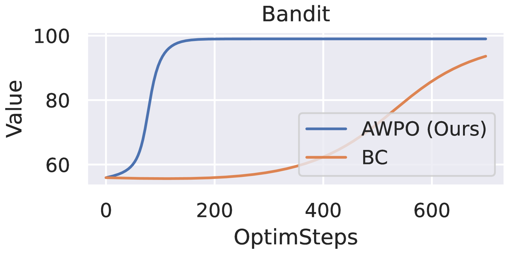
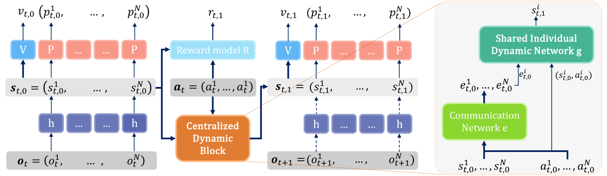
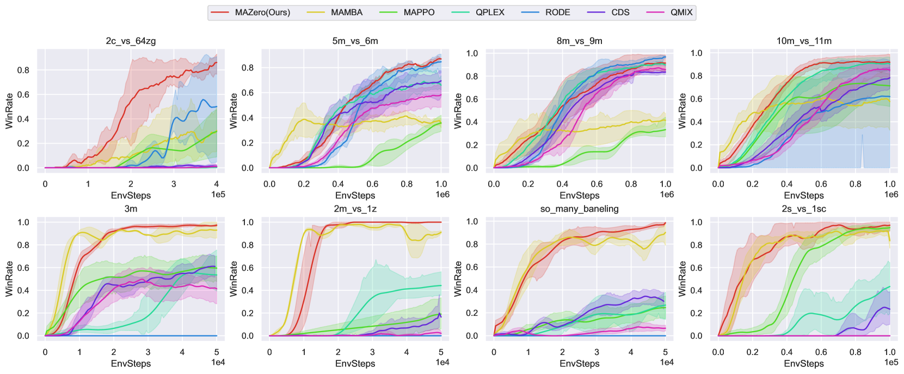
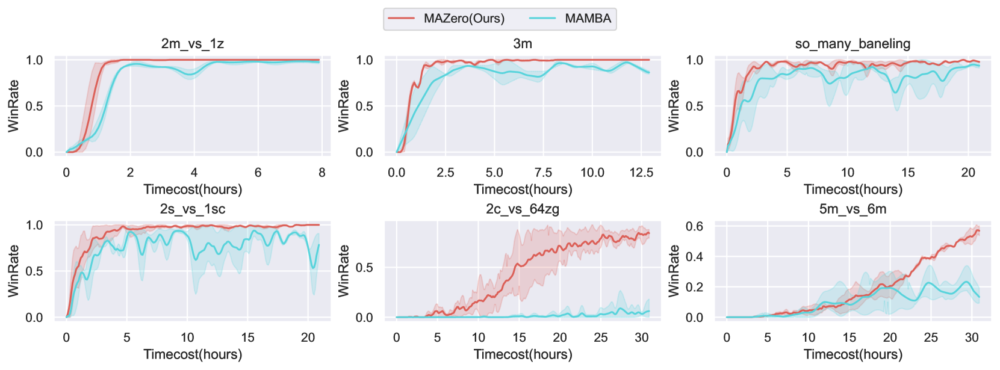
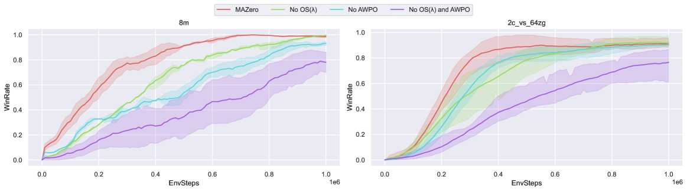
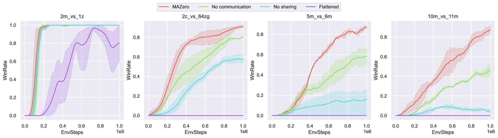
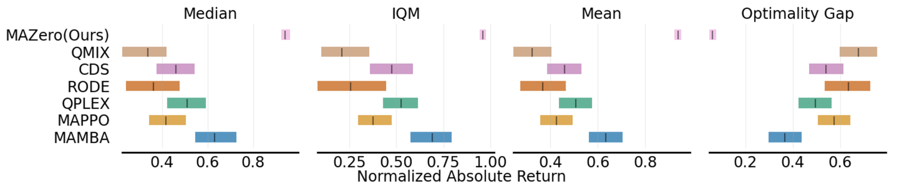
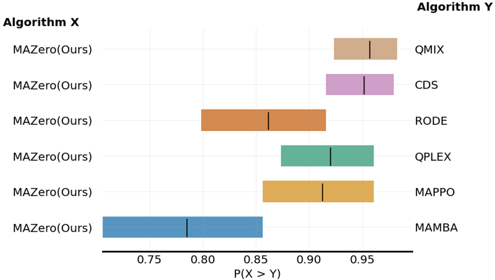

# MAZero 详解：把 MuZero 搬进合作式多智能体

> 论文：*Efficient Multi-agent Reinforcement Learning by Planning*（Liu et al., ICLR 2024，arXiv:2405.11778v1）
> 代码：<https://github.com/liuqh16/MAZero>
> 本文面向**已系统学过 MuZero** 的读者，只简要回顾单智能体基础，把篇幅集中在 **MAZero 相对 MuZero 的增量创新**。所有公式均取自论文 HTML 源的 LaTeX，可放心引用。

---

## 0. TL;DR 与「MuZero → MAZero」差异速览

MAZero = **MuZero + Sampled MuZero** 迁移到 **合作式多智能体（CTDE）** 设定，并针对多智能体特有的两个痛点提出两项新技术。

一句话概括三大改动：

1. **模型结构**：从「单个扁平模型」改为 **中心化价值 + 个体动力学 + 参数共享 + 注意力通信** 的 CTDE 网络（§4.1）。
2. **搜索**：利用「学到的世界模型是确定性的」这一事实，用 **乐观值估计 OS(λ)** 替换 UCT 里过于保守的均值回传（§4.2）。
3. **策略损失**：用 **优势加权策略优化 AWPO** 替换 Sampled MuZero 里「丢弃了价值绝对量」的行为克隆（BC）损失（§4.3）。

| 维度 | MuZero / Sampled MuZero（单智能体） | MAZero（多智能体，本文新增） |
|---|---|---|
| 模型 | 3 个函数 `h,g,f`，单一扁平隐状态 | 6 个函数：`h,e,g,R,V,P`；**每个智能体一份局部隐状态**，中心化 `R/V`、局部 `h/g/P`，`e` 为注意力通信块 |
| 参数 | 单智能体 | **全体智能体共享** `h,g,P`（利用同质性偏置） |
| 动作空间 | Go ≈ 300；靠 Sampled MuZero 采样 | 联合动作 **指数爆炸**（SMAC `27m_vs_30m` ≈ $10^{42}$），采样比例极低 |
| 搜索值回传 | pUCT 用子树**均值** $Q(s,a)$ | **OS(λ)**：确定性模型下取**乐观分位**并按深度用 λ 折扣（缓解展开误差） |
| 策略损失 | BC / 交叉熵到 MCTS 访问分布（丢弃价值绝对量） | **AWPO**：用 $\exp(A_\lambda^\rho/\alpha)$ 对每个采样动作的 BC 项加权 |
| 一致性损失 | EfficientZero 引入 $l_s$ | 沿用 $l_s$ |

> 术语约定：本文「确定性世界模型」指 MuZero 类模型学到的是一个**确定性的**隐空间转移（给定 $(s,a)$ 下一隐状态唯一），这正是 OS(λ) 敢用「乐观」而非「均值」的前提。

---

## 1. 定位与核心贡献（Abstract + §1）

**动机**：MARL 目前主流仍是 model-free（QMIX、MAPPO 等），样本效率受限；而单智能体里带规划的 MBRL（MuZero）已展现出「少数据、超人表现」。作者的目标就是**把带规划的 MBRL 的样本效率优势带到 MARL**。难点在于：多智能体的**联合动作空间随智能体数指数增长**，vanilla MCTS 无法枚举全部动作，必须利用智能体「近似独立」的性质来加速。

论文的四条贡献：

1. **CTDE 网络结构**：中心化价值、个体动力学、全体参数共享，并在模型展开时加入**基于注意力的通信块**促进协作（§4.1）。
2. **OS(λ)**：利用学到模型的确定性，对采样回报做**乐观估计**，并用 λ 抑制大深度处的展开误差（§4.2）。
3. **AWPO**：利用 OS(λ) 算出的价值信息改进采样动作的策略损失（§4.3）。
4. **SMAC 大量实验**：样本效率优于 model-free；在样本与计算效率上均优于或持平已有 model-based 方法（§5）。

---

## 2. 背景速览（§2，精简）

### 2.1 POMDP / Dec-POMDP 记号

POMDP 记为 $(\mathcal{S},\mathcal{A},T,U,\Omega,\mathcal{O},\gamma)$。每步智能体基于观测历史 $o_{\le t}$ 选动作 $a_t$，收到奖励 $u_t=U(s_t,a_t)$，目标是最大化折扣回报

$$J(\pi)=\mathbb{E}_{\pi}\Big[\textstyle\sum_{t=0}^{\infty}\gamma^{t}u_{t}\,\big|\,a_{t}\sim\pi(\cdot|o_{\le t})\Big].$$

多智能体设定下有 $N$ 个智能体，观测 $\boldsymbol{o}_t=(o_t^1,\dots,o_t^N)$，联合动作 $\boldsymbol{a}_t=(a_t^1,\dots,a_t^N)$，团队共享标量奖励（合作式）。

### 2.2 MuZero 三函数 + MCTS（一句话回顾）

MuZero 学一个由三函数组成的模型：表示 $h$、动力学 $g$、预测 $f$；在**隐空间**里跑 MCTS。每次模拟含 **Selection / Expansion / Backup** 三阶段，Selection 用 pUCT 规则：

$$a=\arg\max_{a}\Big[Q(s,a)+P(s,a)\cdot\tfrac{\sqrt{\sum_{b}N(s,b)}}{1+N(s,a)}\cdot c(s)\Big]\tag{1}$$

其中 $Q$ 是子树价值均值估计、$N$ 访问次数、$P$ 先验、$c(s)$ 平衡先验与价值。目标搜索策略 $\pi(\cdot|s_{t,0})$ 是根节点访问次数的归一化分布。训练损失：

$$L^{\text{MuZero}}=\sum_{k=0}^{K}\big[l_{r}(u_{t+k},r_{t,k})+l_{v}(z_{t+k},v_{t,k})+l_{p}(\pi_{t+k},p_{t,k})\big]\tag{2}$$

$z_{t+k}$ 是 n-step 回报（奖励 + MCTS 搜索价值 bootstrap）。**EfficientZero** 另加自监督一致性损失 $l_s=\|s_{t,k}-s_{t+k,0}\|$，让「动力学展开的隐状态」与「真实未来观测的表示」对齐——MAZero 沿用这一项。

### 2.3 Sampled MuZero（关键前置，务必理解）

当动作空间大到无法在每个节点枚举时，**Sampled MuZero** 只在 Expansion 阶段展开动作全集 $\mathcal{A}$ 的一个**采样子集** $T(s)$（从基于先验 $\pi$ 的提议分布 $\beta$ 采样），Selection 改用修正 pUCT：

$$a=\arg\max_{a\in T(s)\subset\mathcal{A}}\Big[Q(s,a)+\tfrac{\hat{\beta}}{\beta}P(s,a)\cdot\tfrac{\sqrt{\sum_{b}N(s,b)}}{1+N(s,a)}\cdot c(s)\Big]\tag{3}$$

其中 $\hat\beta$ 是采样动作的经验分布（支撑集为 $T(s)$），$\hat\beta/\beta$ 是重要性修正。$N$ 次模拟后得到一个**随机**搜索策略 $\omega(\cdot|s_{t,0})$（支撑在 $T(s_{t,0})$ 上），其**期望**才是真正的改进策略

$$\pi^{\text{MCTS}}(\cdot|s_{t,0})=\mathbb{E}[\omega(\cdot|s_{t,0})].$$

> **推广到多智能体**：把每个智能体的动作看成「一个智能体的多离散（multi-discrete）动作空间」中的一维，就能在中心化规划里直接套用 Sampled MuZero，改进策略记作 $\boldsymbol{\pi}^{\text{MCTS}}(\cdot|\boldsymbol{s}_{t,0})$。**这是 MAZero 把 MuZero 接到多智能体上的技术底座。**

---

## 3. 核心挑战（§3）：为什么不能照搬单智能体做法

### 3.1 模型设计：扁平模型不行

最直接的做法是学一个「联合模型」，在联合策略空间里做中心化规划。但多智能体状态-动作空间巨大，**直接照搬单智能体的扁平模型学习效率极低**（见 §8 的 Fig 6 消融）。原因是扁平模型没有编码多智能体环境特有的两个**归纳偏置**：

- **近似独立**：多数时刻各智能体独立决策，只在少数情形需要协作 —— IPPO 等独立学习方法的成功印证了这点。
- **同质性**：同类智能体行为高度相似（如 SMAC 里的集火）—— model-free 里**参数共享**的巨大成功正是对同质偏置的利用。

**结论**：如何把这两个偏置编码进模型，是多智能体 MBRL 的第一大挑战。MAZero 的答案 = **个体动力学 + 参数共享（独立性、同质性）+ 注意力通信块（协作）**。

### 3.2 指数级联合动作空间

联合动作空间随智能体数**指数增长**：Go 才 ~300 个动作，而 SMAC `27m_vs_30m` 高达 $\sim 10^{42}$。即便用 Sampled MuZero 采样，**采样数与全集之比极小**，带来两个问题：

1. **低估问题（underestimation）加剧**：Sampled MCTS 的均值回传在采样稀疏时系统性偏保守，搜索效率不理想 → 促使作者设计**更乐观**的搜索（OS(λ)）。
2. **BC 损失丢弃价值绝对量**：Sampled MCTS 采用的行为克隆损失只学到采样动作价值的**相对**大小（谁访问多），**丢弃了绝对价值信息**。动作空间小时无所谓；但多智能体里采样数 $B$ 与 $|\mathcal{A}|$ 差距悬殊，忽略价值信息的代价不可接受 → 促使作者设计 **AWPO**。

下面这个 bandit 玩具实验（$|\mathcal{A}|=100$，采样 $B=2$）直观说明第 2 点：AWPO 因为用上了价值，收敛远快于 BC。



*图 1：在 $|\mathcal{A}|=100,\ B=2$ 的 bandit 上，AWPO（蓝）约 150 个优化步就收敛到最优值 ~100，而 BC（橙）到 700 步才爬到 ~93。*

---

## 4. MAZero 模型结构（§4.1）

MAZero 模型由 **6 个函数**组成：

- **表示 $h_\theta$**：把智能体 $i$ 的观测历史 $o^i_{\le t}$ 映射为**个体**隐状态 $s_{t,0}^i$。
- **通信 $e_\theta$**：通过**注意力机制**为每个智能体生成协作特征 $e_{t,k}^i$。
- **动力学 $g_\theta$**：由个体状态 $s_{t,k}^i$、未来动作 $a_{t+k}^i$、通信特征 $e_{t,k}^i$ 推出下一个体隐状态 $s_{t,k+1}^i$。
- **奖励预测 $R_\theta$**：从全局隐状态 $\boldsymbol{s}_{t,k}=(s_{t,k}^1,\dots,s_{t,k}^N)$ 与联合动作预测团队奖励 $r_{t,k}$。
- **价值预测 $V_\theta$**：从全局隐状态 $\boldsymbol{s}_{t,k}$ 预测价值 $v_{t,k}$。
- **策略预测 $P_\theta$**：从个体状态 $s_{t,k}^i$ 生成个体策略 $p_{t,k}^i$。

模型方程组（Eq 4）：

$$
\left\{
\begin{array}{ll}
\text{Representation:} & s_{t,0}^{i}=h_{\theta}(o_{\le t}^{i})\\[4pt]
\text{Communication:} & e_{t,k}^{1},\dots,e_{t,k}^{N}=e_{\theta}(s_{t,k}^{1},\dots,s_{t,k}^{N},a_{t+k}^{1},\dots,a_{t+k}^{N})\\[4pt]
\text{Dynamic:} & s_{t,k+1}^{i}=g_{\theta}(s_{t,k}^{i},a_{t+k}^{i},e_{t,k}^{i})\\[4pt]
\text{Reward:} & r_{t,k}=R_{\theta}(s_{t,k}^{1},\dots,s_{t,k}^{N},a_{t+k}^{1},\dots,a_{t+k}^{N})\\[4pt]
\text{Value:} & v_{t,k}=V_{\theta}(s_{t,k}^{1},\dots,s_{t,k}^{N})\\[4pt]
\text{Policy:} & p_{t,k}^{i}=P_{\theta}(s_{t,k}^{i})
\end{array}
\right.
\tag{4}
$$

**中心化 vs 分布式的划分**（这正是 CTDE 的体现）：

- **局部信息即可、支持分布式执行**：$h_\theta$、$g_\theta$、$P_\theta$（表示、动力学、策略都只吃自己的局部状态）。
- **需要全局信息、只在中心化训练时用**：$e_\theta$（通信）、$R_\theta$（团队奖励）、$V_\theta$（团队价值）。



**图 2 逐块解读**：

- **左侧**：各智能体观测 $o_t^i$ 经**共享**表示网络 $h$ 得到局部隐状态 $s_{t,0}^i$；价值 $v_{t,0}$ 由全局隐状态 $\boldsymbol{s}_{t,0}$ 算出（V 头），而策略先验 $p_{t,0}^i$ 由各自局部隐状态算出（P 头，逐智能体）。
- **中间（Centralized Dynamic Block）**：输入联合动作 $\boldsymbol{a}_t$，输出团队奖励 $r_{t,1}$（Reward model R）与下一联合隐状态 $\boldsymbol{s}_{t,1}$。
- **右侧放大**：中心化动力学块内部 = **通信网络 $e$**（吃 $s_{t,0}^{1..N}$ 产出协作特征 $e_{t,0}^i$）→ **共享个体动力学网络 $g$**（吃 $(e_{t,0}^i,\ (s_{t,0}^i,a_{t,0}^i))$ 产出下一个体状态 $s_{t,1}^i$）。
- **训练期**：真实未来观测 $\boldsymbol{o}_{t+1}$ 可用，经表示网络得到下一隐状态目标 $\boldsymbol{s}_{t+1,0}$，用于一致性损失 $l_s$。

> 一句话记忆：**通信块负责"什么时候需要协作"，参数共享负责"同类智能体共用一套动力学/策略"，中心化 V/R 负责"团队信用分配"。**

---

## 5. Optimistic Search Lambda —— OS(λ)（§4.2）

### 5.1 动机：确定性模型下，UCT 的均值太保守

pUCT 里的价值分数 $Q(s,a)$ 用的是「子树内所有模拟的**均值**」。均值估计是为了对抗**环境随机性**——像 UCB/UCT 那样反复采样同一臂再取平均。但 MuZero 类模型学到的是**确定性**世界模型：拉同一条臂结果恒定，**没必要**反复采样求平均。于是作者主张：确定性模型下，**用更乐观的估计取代均值**，把注意力从「对抗环境随机性」转移到「管理模型泛化误差」。

### 5.2 定义（Eq 5–8）

对每个节点 $s$，先收集其子树中**深度为 $d$** 的所有叶子给出的回报估计集合：

$$\mathcal{U}_{d}(s)=\Big\{\textstyle\sum_{k<d}\gamma^{k}r_{k}+\gamma^{d}v(s')\ \Big|\ s':\text{dep}(s')=\text{dep}(s)+d\Big\}\tag{5}$$

取其中**最乐观的一部分**（Top $(1-\rho)$ 分位，$\rho$ 越大越激进地只保留高值）：

$$\mathcal{U}_{d}^{\rho}(s)=\text{Top }(1-\rho)\text{ 分位的值},\ \text{取自}\ \mathcal{U}_{d}\tag{6}$$

再把不同深度的乐观值按 $\lambda^d$ **加权平均**（深度越大权重越小，因为展开误差随深度放大）：

$$V_{\lambda}^{\rho}(s)=\frac{\sum_{d}\sum_{x\in\mathcal{U}_{d}^{\rho}(s)}\lambda^{d}\,x}{\sum_{d}\lambda^{d}\,|\mathcal{U}_{d}^{\rho}(s)|}\tag{7}$$

最后定义**乐观优势**：

$$A_{\lambda}^{\rho}(s,a)=r(s,a)+\gamma\,V_{\lambda}^{\rho}\big(\text{Dynamic}(s,a)\big)-v(s)\tag{8}$$

其中 $\text{dep}(u)$ 是节点深度，$\rho,\lambda\in[0,1]$ 为超参，$r,v,\text{Dynamic}$ 都是 Eq 4 的模型预测。

**两个超参的直觉**：

- $\rho$（乐观程度）：只保留 Top $(1-\rho)$ 的高价值样本，$\rho\!\uparrow$ 越乐观。
- $\lambda$（深度折扣）：类似 TD(λ) 的思想，$\lambda\!\downarrow$ 越信任浅层（模型误差小）的估计。$V_\lambda^\rho$ 是「乐观分位」在深度上的 λ 加权平均。

### 5.3 用乐观优势替换 Selection 的价值分数（Eq 9）

把 Eq 3（Sampled pUCT）里的价值分数 $Q(s,a)$ 换成乐观优势 $A_\lambda^\rho(s,a)$，得到 OS(λ) 的选择规则：

$$a=\arg\max_{a\in T(s)\subset\mathcal{A}}\Big[A_{\lambda}^{\rho}(s,a)+\tfrac{\hat{\beta}}{\beta}P(s,a)\cdot\tfrac{\sqrt{\sum_{b}N(s,b)}}{1+N(s,a)}\cdot c(s)\Big]\tag{9}$$

> 记忆点：**OS(λ) = "确定性模型 ⇒ 敢乐观" + "深度越深越不可信 ⇒ 用 λ 折扣" 两个直觉的合成**。它同时产出后面 AWPO 要用的 $A_\lambda^\rho$。

---

## 6. Advantage-Weighted Policy Optimization —— AWPO（§4.3 + 附录 G）

### 6.1 动机与形式（Eq 10）

BC 损失只学「谁访问多」，丢弃了 OS(λ) 算出的价值绝对量。AWPO 的做法：把每个采样动作的 BC 项，用 $\exp(A_\lambda^\rho/\alpha)$ **加权**：

$$l_{p}(\theta;\pi,\omega,A_{\lambda}^{\rho})=-\mathbb{E}\Big[\sum_{a\in T(s)}\omega(a|s)\,\exp\!\Big(\tfrac{A_{\lambda}^{\rho}(s,a)}{\alpha}\Big)\log\pi(a|s;\theta)\Big]\tag{10}$$

其中 $\pi(\cdot|s;\theta)$ 是待改进的网络策略，$\omega(\cdot|s)$ 是支撑在 $T(s)$ 上的搜索策略，$\alpha>0$ 是控制乐观程度的温度超参。期望取自 OS(λ) 的所有随机性（为简洁公式里略去）。**优势越大的采样动作，被克隆的权重越大**——这就把价值信息注入了策略学习。

### 6.2 理论解释：AWPO 是对一个 KL 约束改进问题的闭式解做交叉熵

AWPO 可视为最优策略 $\eta^*$ 与 $\pi$ 之间的**交叉熵**（等价于最小化 $\mathrm{KL}(\eta^*\|\pi)$），其中 $\eta^*$ 是下面**KL 约束策略改进问题**的非参数解：

$$\max_{\eta}\ \mathbb{E}_{a\sim\eta(\cdot|s)}\big[A_{\lambda}^{\rho}(s,a)\big]\quad\text{s.t.}\quad \mathrm{KL}\big(\eta(\cdot|s)\,\|\,\pi^{\text{MCTS}}(\cdot|s)\big)\le\epsilon\tag{11}$$

即「在离 $\pi^{\text{MCTS}}$ 不太远（KL 约束）的前提下，最大化乐观优势的期望」。用拉格朗日法求解得闭式最优：

$$\eta^{*}(a|s)\ \propto\ \pi^{\text{MCTS}}(a|s)\,\exp\!\Big(\tfrac{A_{\lambda}^{\rho}(s,a)}{\alpha}\Big)=\mathbb{E}\Big[\omega(a|s)\exp\!\Big(\tfrac{A_{\lambda}^{\rho}(s,a)}{\alpha}\Big)\Big]\tag{12}$$

（第二个等号用到 $\pi^{\text{MCTS}}=\mathbb{E}[\omega]$。）再最小化 $\mathrm{KL}(\eta^*\|\pi)$：

$$
\begin{aligned}
\arg\min_{\theta}\ \mathrm{KL}\big(\eta^{*}(\cdot|s)\,\|\,\pi(\cdot|s;\theta)\big)
&=\arg\min_{\theta}\ -\frac{1}{Z(s)}\sum_{a}\pi^{\text{MCTS}}(a|s)\exp\!\Big(\tfrac{A_{\lambda}^{\rho}(s,a)}{\alpha}\Big)\log\pi(a|s;\theta)-H(\eta^{*})\\
&=\arg\min_{\theta}\ l_{p}(\theta;\pi,\omega,A_{\lambda}^{\rho})
\end{aligned}
$$

其中归一化因子 $Z(s)=\sum_{a}\pi^{\text{MCTS}}(a|s)\exp(A_\lambda^\rho(s,a)/\alpha)$，熵 $H(\eta^*)$ 对 $\theta$ 是常数可略。于是最小化 KL 就等价于 Eq 10 的 AWPO 损失。**直觉**：AWPO 在 $\pi^{\text{MCTS}}$ 邻域内优化 $\pi$ 的价值提升，把 OS(λ) 的乐观值与改进策略结合，弥补 BC 忽略价值的缺陷。

### 6.3 附录 G：完整推导（拉格朗日 + KKT）

考虑一般化的约束优化（Eq 15，含归一化约束）：

$$\eta^{*}=\arg\max_{\eta}\ \mathbb{E}_{\mathbf{a}\sim\eta(\cdot|\mathbf{s})}[A(\mathbf{s},\mathbf{a})]\quad \text{s.t.}\ \mathrm{KL}\big(\eta(\cdot|\mathbf{s})\|\pi(\cdot|\mathbf{s})\big)\le\epsilon,\ \ \int_{\mathbf{a}}\eta(\mathbf{a}|\mathbf{s})\,d\mathbf{a}=1\tag{15}$$

拉格朗日函数（Eq 16）：

$$\mathcal{L}(\eta,\lambda,\alpha)=\mathbb{E}_{\mathbf{a}\sim\eta}[A(\mathbf{s},\mathbf{a})]+\lambda\big(\epsilon-D_{\mathrm{KL}}(\eta\|\pi)\big)+\alpha\Big(1-\int_{\mathbf{a}}\eta(\mathbf{a}|\mathbf{s})\,d\mathbf{a}\Big)\tag{16}$$

由 KKT 条件对 $\eta$ 求偏导（Eq 17）：

$$\frac{\partial\mathcal{L}}{\partial\eta}=A(\mathbf{s},\mathbf{a})+\lambda\log\pi(\mathbf{a}|\mathbf{s})-\lambda\log\eta(\mathbf{a}|\mathbf{s})+\lambda-\alpha=0\tag{17}$$

解出（Eq 18）：

$$\eta^{*}(\mathbf{a}|\mathbf{s})=\frac{1}{Z(\mathbf{s})}\,\pi(\mathbf{a}|\mathbf{s})\,\exp\!\Big(\tfrac{1}{\lambda}A(\mathbf{s},\mathbf{a})\Big)\tag{18}$$

把 $\pi\!\to\!\pi^{\text{MCTS}}$、温度 $\lambda\!\to\!\alpha$ 代回即得 Eq 12，证毕。推导沿用 **Nair et al. (2021)**（即 AWAC/AWR 一脉的优势加权回归思想）。

> ⚠️ **符号提醒**：附录里的 $\lambda$ 是 **KL 约束的拉格朗日乘子**（对应正文里的温度 $\alpha$），附录里的 $\alpha$ 是**归一化约束的乘子**。它和 OS(λ) 里那个「深度折扣 $\lambda$」**完全无关**，只是符号复用，别混淆。

### 6.4 与 BC 的对比（呼应图 1）

BC 只把 $\omega$ 蒸馏进 $\pi$，看不到价值绝对量；AWPO 相当于把目标从 $\pi^{\text{MCTS}}$ 换成「按乐观优势指数重加权后的 $\eta^*$」。当采样数远小于动作空间（多智能体的典型情形），AWPO 能显著加速策略优化——图 1 的 bandit 就是最小复现。

---

## 7. 端到端训练（§4.4）

模型像 MuZero 那样**展开 $K$ 步端到端训练**。给定长度 $K{+}1$ 的轨迹（观测 $\boldsymbol{o}_{t:t+K}$、联合动作 $\boldsymbol{a}_{t:t+K}$、奖励 $u_{t:t+K}$、价值目标 $z_{t:t+K}$、策略目标 $\boldsymbol{\pi}^{\text{MCTS}}_{t:t+K}$、乐观优势 $A_\lambda^\rho$），最小化总损失：

$$\mathcal{L}=\sum_{k=1}^{K}(l_{r}+l_{v}+l_{s})+\sum_{k=0}^{K}l_{p}\tag{13}$$

各项：

- $l_{r}=\|r_{t,k}-u_{t+k}\|$：奖励损失（同 MuZero）。
- $l_{v}=\|v_{t,k}-z_{t+k}\|$：价值损失（同 MuZero）。
- $l_{s}=\|\boldsymbol{s}_{t,k}-\boldsymbol{s}_{t+k,0}\|$：一致性损失（同 EfficientZero）。
- $l_{p}$：**AWPO 策略损失**（Eq 10）在多智能体联合动作空间下的形式（Eq 14）：

$$l_{p}=-\sum_{\boldsymbol{a}\in T(\boldsymbol{s}_{t+k,0})}\omega(\boldsymbol{a}|\boldsymbol{s}_{t+k,0})\exp\!\Big(\tfrac{A_{\lambda}^{\rho}(\boldsymbol{s}_{t+k,0},\boldsymbol{a})}{\alpha}\Big)\log\boldsymbol{\pi}(\boldsymbol{a}|\boldsymbol{s}_{t,k};\theta)\tag{14}$$

其中 OS(λ) 在**由真实未来观测 $\boldsymbol{o}_{t+k}$ 直接表示得到的**隐状态 $\boldsymbol{s}_{t+k,0}$ 上执行（而非动力学展开的 $\boldsymbol{s}_{t,k}$），据此得到动作子集 $T(\boldsymbol{s}_{t+k,0})$、搜索策略 $\omega$、乐观优势 $A_\lambda^\rho$；而**待改进的联合策略**取自动力学展开的隐状态 $\boldsymbol{s}_{t,k}$，且按智能体**因子化**：

$$\boldsymbol{\pi}(\boldsymbol{a}|\boldsymbol{s}_{t,k};\theta)=\prod_{i=1}^{N}P_{\theta}(a^{i}|s_{t,k}^{i})\tag{14'}$$

> 与 MuZero 对照：损失骨架（$l_r,l_v,l_p$）+ EfficientZero 的 $l_s$ 都保留；**唯一质变是 $l_p$ 从 BC 换成 AWPO，且联合策略按个体因子化**（$\prod_i P_\theta$）——正好契合「参数共享 + 分布式执行」的结构。

---

## 8. 实验与结论（§5–§6）

### 8.1 设置与基线

在 **SMAC** 上对比：

- **Model-based 基线**：MAMBA（基于 DreamerV2，以 SMAC 上 SOTA 样本效率著称）。
- **Model-free 基线**：QMIX、QPLEX、RODE、CDS、MAPPO。

23 个场景选 8 个展示（4 Easy + 4 Hard），每个算法跑 10 个随机种子。

### 8.2 主结果：样本效率（图 3）



- 给定环境步数，**MAZero 在 8 个场景上全面超过所有基线**。
- 两个 model-based 方法（MAZero、MAMBA）在 Easy 任务上样本效率**显著优于** model-free。
- MAZero 相比 MAMBA **训练曲线更稳、评测胜率更平滑**；Hard 任务整体也更强。
- **亮点场景 `2c_vs_64zg`**：只有 2 个智能体但每个动作空间高达 ~70（其他场景通常 <20），**规划的价值被放大**，MAZero 用更少样本拿到更高胜率——类比 MuZero 在围棋上的优势。

### 8.3 计算效率（图 4）



MAZero 直接用 replay buffer 里的规划结果做端到端训练，**省去了 Dreamer 系方法的数据增强时间开销**，因此在相同平台的**累计运行时间**维度上也优于 MAMBA。

### 8.4 消融



**图 5**：分别关闭 OS(λ)、AWPO 或两者（退化为原始 Sampled MCTS + BC）。结论：**两项技术都对最终性能与学习效率有显著正贡献。**



**图 6**：**"通信（communication)"与"共享（sharing)"两个组件影响巨大**；而单智能体 MBRL 的扁平模型因未编码多智能体偏置，只能在最简单的 `2m_vs_1z` 上学到胜利策略——**用实验坐实了 §3.1 的论断。**





**图 7–8**：采用 SPEP（标准化性能评测协议，见附录 C）给出聚合指标与改进概率，进一步佐证 MAZero 的优势具有统计意义。

### 8.5 结论

MAZero 首次把「带规划的 MBRL（MuZero）」成功迁移到合作式 MARL：用 **CTDE 网络结构**编码多智能体偏置，用 **OS(λ)** 和 **AWPO** 解决「指数动作空间 + 确定性模型」下的搜索与策略优化难题，在 SMAC 上取得**样本效率与计算效率的双重优势**。

---

## 9. 附录要点索引（便于回查）

| 附录 | 内容一句话 |
|---|---|
| A | 相关工作（MBRL / MARL / 规划）综述 |
| B | 实现细节：B.1 网络结构、B.2 训练细节、B.3 各基线实现、B.4 bandit 实验细节；含 MAZero/MAMBA/QMIX/QPLEX/RODE/CDS/MAPPO 超参表（表 1–7） |
| C | 标准化性能评测协议（SPEP，对应图 7–8 的聚合指标口径） |
| D | 更多消融：优化器（图 9）、采样规模（图 10）、$\rho$ 与 $\lambda$（图 11a/b）、评测时是否用 MCTS（表 8） |
| E | 单智能体环境实验（如 LunarLander，表 9） |
| F | 其他多智能体环境（Waterworld 表 10、Google Research Football GRF 表 11） |
| G | **AWPO 损失完整推导**（本文 §6.3 已展开） |

---

## 10. 术语与符号对照表

**中英术语**

| 英文 | 中文 | 备注 |
|---|---|---|
| CTDE (Centralized Training with Decentralized Execution) | 中心化训练、分布式执行 | MAZero 结构主线 |
| MBRL (Model-Based RL) | 基于模型的强化学习 | 对立面：model-free |
| MCTS / pUCT | 蒙特卡洛树搜索 / 概率上置信树 | Eq 1、3、9 |
| Sampled MuZero | 采样版 MuZero | 处理大动作空间；MAZero 底座 |
| OS(λ) (Optimistic Search Lambda) | 乐观搜索 λ | §4.2，Eq 5–9 |
| AWPO (Advantage-Weighted Policy Optimization) | 优势加权策略优化 | §4.3，Eq 10–12 |
| BC (Behavior Cloning) | 行为克隆 | AWPO 的对照基线 |
| Consistency loss | 一致性损失 | $l_s$，源自 EfficientZero |
| Parameter sharing | 参数共享 | 利用同质性偏置 |

**关键符号**

| 符号 | 含义 |
|---|---|
| $s_{t,k}^{i}$ | 智能体 $i$ 在时刻 $t$、展开第 $k$ 步的**个体**隐状态 |
| $\boldsymbol{s}_{t,k}=(s_{t,k}^1,\dots,s_{t,k}^N)$ | 全局隐状态（个体拼接） |
| $e_{t,k}^{i}$ | 通信网络 $e_\theta$ 产出的协作特征 |
| $T(s)$ | 从 $\beta$ 采样得到的动作子集（Expansion 展开的子集） |
| $\beta,\hat\beta$ | 采样提议分布 / 采样动作的经验分布（重要性修正 $\hat\beta/\beta$） |
| $\omega(\cdot|s)$ | 单次搜索得到的**随机**搜索策略（支撑在 $T(s)$） |
| $\pi^{\text{MCTS}}=\mathbb{E}[\omega]$ | 改进策略（$\omega$ 的期望） |
| $\pi(\cdot|s;\theta)$ | 待改进的**网络**策略（$P_\theta$ 因子化） |
| $A_{\lambda}^{\rho}(s,a)$ | 乐观优势（OS(λ) 产出，Eq 8） |
| $\rho$ | 乐观分位超参（保留 Top $(1-\rho)$） |
| $\lambda$ | OS(λ) 的**深度折扣**超参（注意与附录 G 的 KL 乘子同名不同义） |
| $\alpha$ | AWPO 温度超参（= 附录 G 的 KL 乘子） |
| $\eta^{*}$ | KL 约束改进问题的非参数最优解（Eq 12） |
| $l_r,l_v,l_s,l_p$ | 奖励 / 价值 / 一致性 / AWPO 策略损失 |

---

### 附：如何进一步核对论文原文

论文以 arXiv HTML 存档在同目录 `Efficient Multi-agent Reinforcement Learning by Planning.mhtml`（MIME 归档）。可用 Python 解析：

```python
import email
from email import policy
from bs4 import BeautifulSoup
msg = email.message_from_binary_file(open(PATH,"rb"), policy=policy.default)
html = next(p for p in msg.walk() if p.get_content_type()=="text/html").get_payload(decode=True).decode("utf-8","ignore")
soup = BeautifulSoup(html, "html.parser")
# 每个公式的干净 LaTeX 在 <annotation encoding="application/x-tex"> 里
```

本文所有公式即由该方式提取，编号与论文一致（Eq 1–18）。
