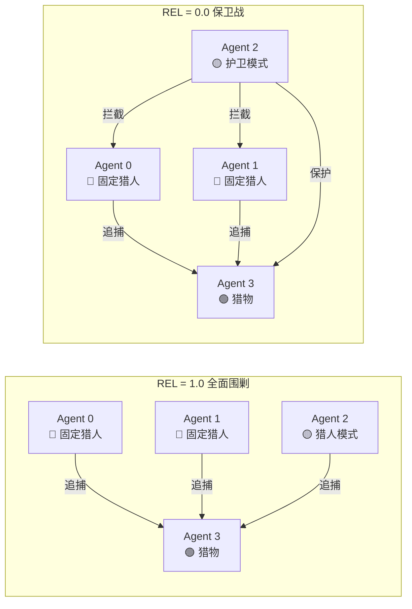
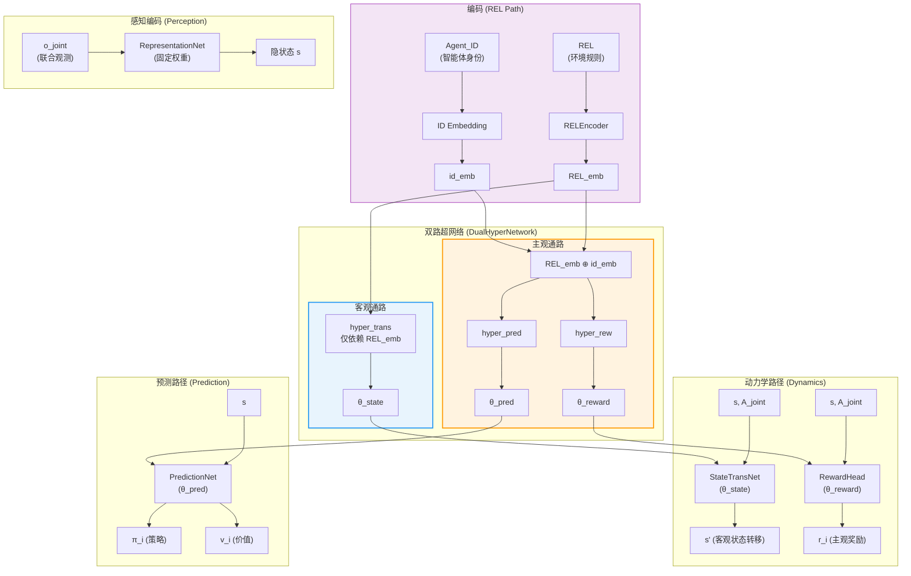
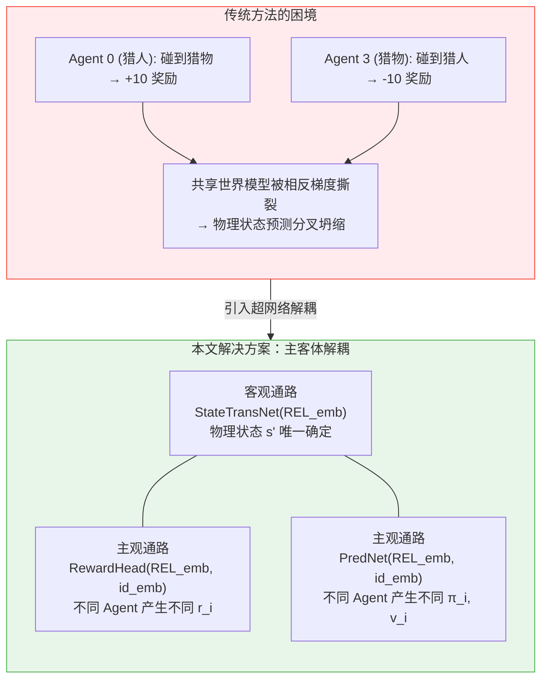
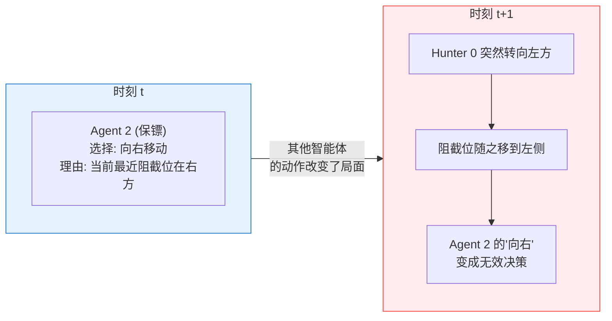
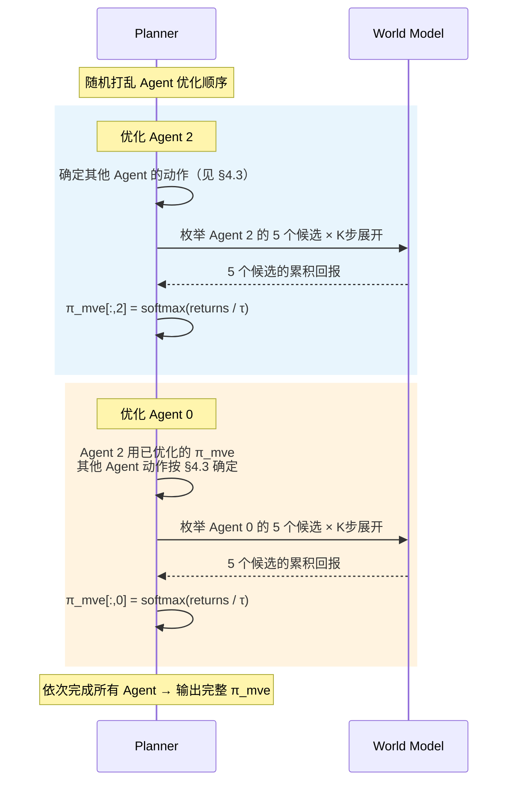
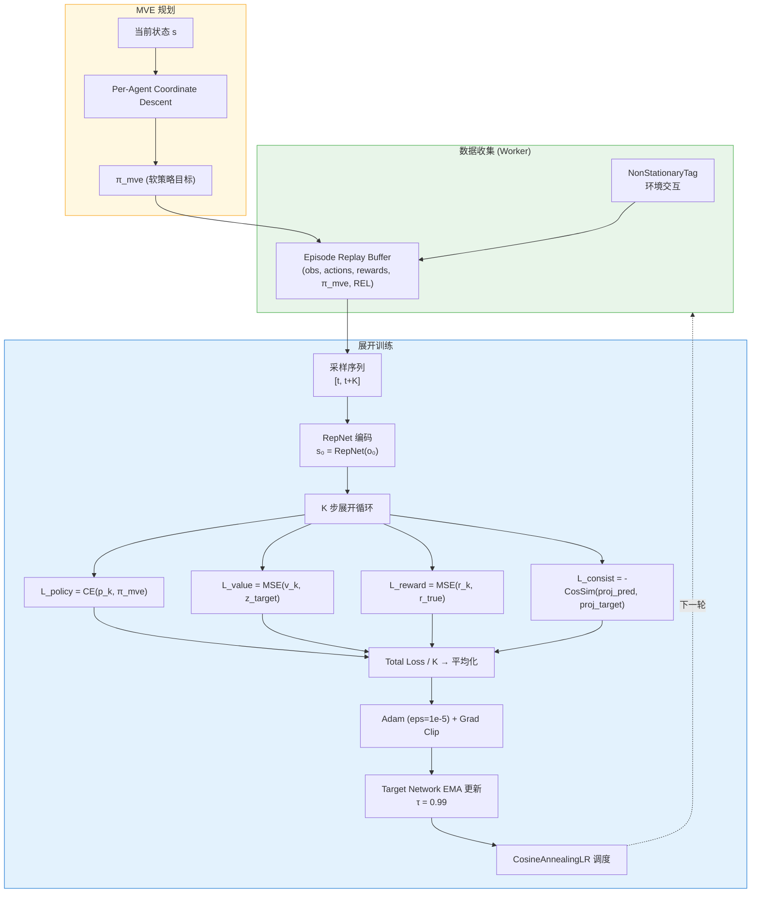
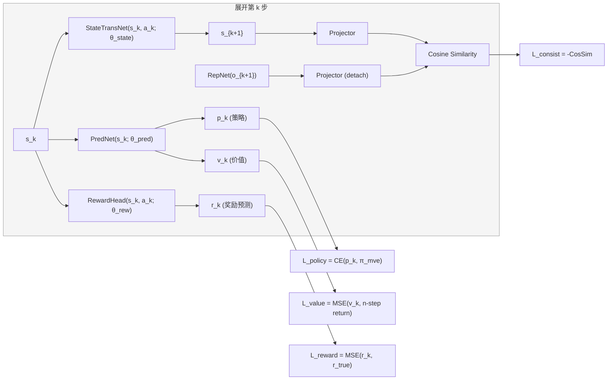
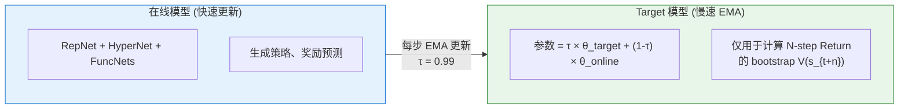
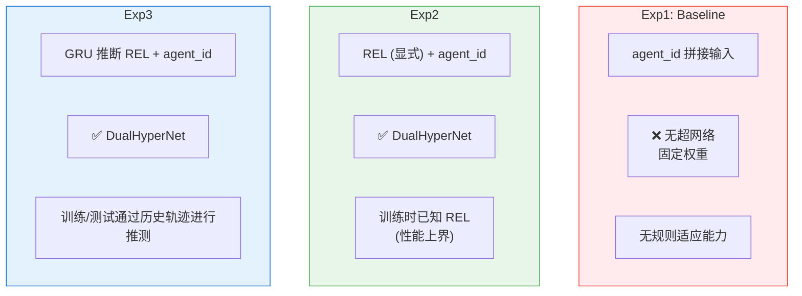

# 面向非平稳环境的视角自适应多智能体强化学习
---

## 一、研究背景与问题定义

### 1.1 核心问题：环境非平稳性

当前多智能体强化学习（MARL）研究大多建立在**环境平稳**的理想假设之上——即使是复杂的混合博弈其根本前提也遵守着底层的物理转移分布 P和奖励函数R不随时间发生结构性改变。只要处于相同的联合状态 s并采取相同的联合动作a，系统反馈的分布永远一致。然而在真实场景（自动驾驶、无人机集群、动态博弈）中，环境的底层逻辑和智能体之间的关系会随时间推移发生改变：

$$s_{t+1} \sim P(\cdot | s_t, a_t; \text{REL}_t), \quad r_{t,i} = R_i(s_t, a_t; \text{REL}_t)$$

由于智能体之间关系{REL}_t的改变，在面临相同观测时，采取相同状态动作对(s, a)可能产生截然不同的演化和奖励。在这种非平稳的环境中，传统算法会面临灾难性遗忘与价值滞后的问题。

### 1.2 现有方法的局限性

| 方法类别 | 代表算法 | 核心局限 |
|---------|---------|---------|
| **无模型 MARL** | MADDPG, MAPPO, QMIX | 网络权重隐式拟合特定环境转移矩阵，当智能体之间的关系发生改变时，面临**灾难性遗忘**，需重新收集海量数据 |
| **基于模型 RL** | MuZero, Dreamer | 多局限于单智能体；扩展到多智能体时，不同角色的主观奖励冲突导致**物理状态预测分叉坍缩** |
| **离线 RL** | OMAR, ICQ | 面临分布外（OOD）推断问题，难以从混合规则的静态数据集中提取自适应策略 |

---

## 二、非平稳环境设计：动态阵营重组

### 2.1 环境概述

基于 Gym MPE 开发的 **NonStationaryTag** 环境，包含 4 个智能体，通过 $\text{REL} \in [0, 1]$ 控制全局敌友关系矩阵的动态切换。



### 2.2 智能体角色定义

| 智能体 | 角色 | REL=1 行为 | REL=0 行为 |
|--------|------|------------|------------|
| Agent 0 | 固定猎人 | 追猎物，Agent 2 是队友 | 追猎物，Agent 2 是障碍 |
| Agent 1 | 固定猎人 | 追猎物，Agent 2 是队友 | 追猎物，Agent 2 是障碍 |
| Agent 2 | **可变角色** | 猎人（复用 Hunter reward） | 保镖（拦截猎人，保护猎物） |
| Agent 3 | 猎物 | 恐惧所有人（含 Agent 2） | 恐惧 {0,1}，靠近 Agent 2 寻求庇护 |

### 2.3 正交化奖励设计（阻截点机制）

为消除不同规则下物理事件的符号对冲，引入 **Blocking Point** 阻截点机制：

$$\mathbf{b}_i = (1-\alpha) \cdot \mathbf{p}_{hunter_i} + \alpha \cdot \mathbf{p}_{prey}$$

$$\text{shield\_reward} = \max_i \left[ R_{max} \cdot \max\left(0, 1 - \frac{\|\mathbf{p}_{a2} - \mathbf{b}_i\|}{d_{max}}\right) \right]$$

**设计原则**：Hunt 用距离猎物引导，Guard 用距离阻截点引导——**两个引导指向不同物理位置**，消除所有符号对冲。

| 事件 | r_hunt | r_guard | 消除？ |
|------|--------|---------|--------|
| 接近猎物 | -0.1·d | **0** | 一侧为零 |
| 阻截位 | **0** | +shield_reward | 一侧为零 |
| 碰到猎物 | +10 | **0** | 一侧为零 |
| 猎物被猎人抓 | 0 | -10 | 一侧为零 |

---

## 三、核心架构：双路超网络 (DualHyperNetwork)

### 3.1 核心理念——视角

将环境规则和智能体身份统一编码：

$$C_{aug} = [\text{RELEncoder}(\text{REL}), \;\text{Embedding}(\text{agent\_id})]$$

- **REL**：决定客观物理反馈机制（碰撞是否得分）
- **Agent ID**：决定主观价值判断（"我想抓人"还是"我想逃跑"）
- **超网络**：$H(C_{aug}) \to \theta$，生成"在该规则下，身为该角色"的世界模型权重

### 3.2 系统架构总览



### 3.3 主客体解耦的核心思想



### 3.4 五大核心网络

| 网络 | 输入 | 输出 | 权重来源 | 客观/主观 |
|------|------|------|---------|----------|
| **RepresentationNet** | $o_{joint}$ | $s$ | 固定训练参数 | 客观 |
| **StateTransNet** | $s, A_{joint}$ | $s'$ | hyper_trans(REL) | 客观 |
| **RewardHead** | $s, A_{joint}$ | $r_i$ | hyper_rew(REL, id) | 主观 |
| **PredictionNet** | $s$ | $\pi_i, v_i$ | hyper_pred(REL, id) | 主观 |
| **RELEncoder** | REL, agent_id | $c_{aug}$ | 固定训练参数 | -- |
---

## 四、规划器设计：Per-Agent Coordinate Descent MVE 

### 4.1 为什么需要多步规划？

多智能体环境中，最直觉的做法是让每个智能体独立地选择当前对自己最优的动作。但这存在根本性缺陷——**短视决策问题**：



Agent j 当前的"最优动作"取决于其他智能体后续会做什么。因此我们利用学到的世界模型向前模拟 K 步，在模拟轨迹上评估候选动作的**累积回报**，选择长期收益最高的动作——这就是 **Model-based Value Expansion (MVE) 规划**。

---

### 4.2 多智能体下的MVE规划难题

将 MVE 应用到多智能体场景后，面临**组合爆炸**：

| | 单智能体 (Atari) | 4 智能体 |
|---|---|---|
| 每步动作空间 | 18 | $5^4 = 625$ |
| K=5 步轨迹空间 | $18^5 \approx 2 \times 10^6$ | $625^5 = 5^{20} \approx 10^{14}$ |

$10^{14}$ 量级的轨迹空间不可能通过采样覆盖。

**解决方案：Per-Agent 坐标下降。** 不一次性优化所有 Agent，而是逐个 Agent 依次优化：随机选择 Agent j，枚举它的 5 个候选动作，固定其他 Agent 的动作选择，用世界模型展开 K 步评估累积回报。搜索维度从联合空间（$5^4=625$/步）降到单 agent 空间（$5$/步）。



后优化的 Agent 能利用前面 Agent 的已优化结果，顺序每次随机打乱以消除位置偏差。
---

### 4.3 其他 Agent 的动作如何确定？

坐标下降中，枚举 Agent j 的候选动作时，需要确定其他 Agent 的动作。

**最简单的方案是 argmax**：取策略网络输出概率最高的动作。此时整条 K 步轨迹完全确定，每个候选只需 1 次评估。

但训练初期策略接近均匀，logits 可能是 [0.21, 0.20, 0.19, 0.20, 0.20]，argmax 选右纯属偶然。基于一个虚假确定的动作做 K 步规划，结论不可靠。

**因此仅在第一步对其他 Agent 的动作进行多次随机采样**:其他 3 个 Agent 各从策略分布中采样一个动作，构成一个"场景"（scenario）。后续 step 1~K-1 中，所有Agent都按策略网络在当前隐状态下正常执行，其行为由世界模型和策略网络确定性地推演。

```
总预算 50 条轨迹，5 个候选动作
→ 每个候选分配 50/5 = 10 个场景

所谓"场景"= step-0 其他 3 个 Agent 的一组动作配置
  场景 1: 其他agent step-0 动作 = [上, 右, 下]
  场景 2: 其他agent step-0 动作 = [左, 停, 右]
  ...
  场景10: 其他agent step-0 动作 = [停, 下, 上]

对每个场景，agent j 的候选动作确定后：
  step 0: agent j = 候选动作, 其他 = 该场景的采样动作
  step 1~K-1: 所有 agent 按策略网络在当前状态下执行
  → 得到一条完整 K 步轨迹 → 计算累积回报
```

## 五、训练流程

### 5.1 训练流程总览



### 5.2 单步展开细节

每个训练步在 K=5 步展开内计算四项 Loss：



### 5.3 Target Network (EMA) 稳定 Bootstrap



**核心作用**：阻断 V 值过估的正反馈循环。在线 V 偶然过估时，target V 因 EMA 平滑而不会立即跟随，为训练提供稳定的学习目标。
---

## 六、三组对比实验设计

### 6.1 实验设置




### 6.2 统一评估框架

- 固定测试 REL 集合：{0.0, 0.5, 1.0}
- 通过 `env.reset(options={'REL': REL_val})` 强制指定 REL
- Per-Agent 奖励分项 + 总奖励 + 捕获率 + Episode 长度

---

## 七、实验结果与分析

### 7.1 策略表现：奖励曲线对比


**分析**：
- **Baseline**：无法适应非稳态环境变化
- **Infer**：动态感知环境中智能体间的关系

####  捕获率


**关键结论**：Infer稳定在 **70%-80%** 的捕获率，而 Baseline 仅徘徊在 **10%-20%**

#### REL = 1.0


**分析**：
- REL=1.0 下 Infer 捕获率 **75%-80%** vs Baseline **10%**
- Agent 2 奖励：Infer +3.2~+4.4 vs Baseline -5.9
- Hunter 0 奖励：Infer +2.1~+3.7 vs Baseline -12.2

### 7.2 各规则下定量对比总结

| 指标 | REL | Baseline | Infer (最优) | 提升 |
|------|------|----------|-------------|------|
| Agent 2 Reward | 0.0 | -2.45 | -0.11 | +2.34 |
| Agent 2 Reward | 0.5 | -3.49 | +1.49 | +4.98 |
| Agent 2 Reward | 1.0 | -5.95 | +4.37 | +10.32 |
| Hunter 0 Reward | 0.0 | -11.69 | +2.67 | +14.36 |
| Hunter 0 Reward | 0.5 | -10.62 | +2.94 | +13.56 |
| Hunter 0 Reward | 1.0 | -12.16 | +3.71 | +15.87 |
| Capture Rate | 0.5 | 15.6% | 75.8% | **+60.2%** |
| Capture Rate | 1.0 | 10.1% | 79.0% | **+68.9%** |

### 7.3 训练稳定性分析

#### 价值损失 (Value Loss)


**分析**：
- **Baseline** (深色)：l_val 持续波动上升（0.47 → 0.67），后期不收敛，呈现 V 值过估的正反馈特征
- **Infer** (彩色)：l_val 稳定收敛至 0.16~0.24，证明 Target Network (EMA) 有效抑制了过估计

#### Agent 2 价值损失


**分析**：Agent 2 作为可变角色，其价值预测难度最高。Baseline l_val_a2 在 30k 步后剧烈震荡（峰值 >1.0），而 Infer 始终稳定在 0.16~0.25。

#### 规划器熵值 (h_mve)


**分析**：
- ln(5) = 1.609 为均匀分布的熵值上界
- **Baseline**：h_mve ≈ 1.29，接近均匀，说明 Planner 缺乏判别力
- **Infer**：h_mve ≈ 1.14，显著低于 Baseline，证明 技术使规划器成功输出了具有**强指向性**的非均匀策略

#### 一致性损失 (Consistency Loss)


**分析**：l_con 从初始 0.025 快速下降并收敛至 0.002，证明 RepresentationNet 成功将多智能体观测映射到了统一的客观物理状态空间。Projection + Cosine Similarity 的 consistency loss 设计有效。

### 7.4 超网络权重分化验证

#### 预测网络权重余弦相似度 (cos_pred)


**分析**：
- **cos_pred_0v1**（Agent 0 vs Agent 1，同为猎人）：相似度维持在 0.74，符合预期——同角色应保持相近策略
- **cos_pred_0v2**（猎人 vs 可变角色）：从 0.80 下降至 0.63，产生明显分化
- **cos_pred_0v3**（猎人 vs 猎物）：从 0.65 **大幅下降至 0.50**，分化最为显著——对立角色的策略权重差异最大

#### 奖励网络权重余弦相似度 (cos_rew)


**分析**：
- **cos_rew_0v3**（猎人 vs 猎物奖励权重）：从 0.37 持续下降至 **0.28**，分化效果极其显著
- **cos_rew_0v2**（猎人 vs 可变角色）：从 0.40 下降至 0.35
- **cos_rew_0v1**（同角色猎人）：维持在 0.65，符合预期

**结论**：DualHyperNetwork 成功实现了不同角色主观视角的权重解耦，没有发生参数坍缩。对立角色（猎人 vs 猎物）的分化最为显著，同角色（猎人 vs 猎人）保持相似，完全符合物理直觉。

#### Oracle 模型的奖励权重分化


Oracle 模型在直接接收 REL 输入的条件下，同样展现出清晰的角色权重分化模式，验证了超网络架构设计的有效性。

---

## 八、关键超参数配置

| 参数 | 值 | 说明 |
|------|-----|------|
| `num_agents` | 4 | 2 猎人 + 1 可变 + 1 猎物 |
| `num_actions` | 5 | 离散动作 (停/右/左/上/下) |
| `latent_dim` | 64 | 隐状态维度 |
| `hidden_dim` | 128 | 网络隐藏层 |
| `REL_emb_dim` / `id_emb_dim` | 16 / 16 | 编码维度 |
| `unroll_K` | 5 | 展开步数 |
| `mve_samples` | 50 | MVE 采样轨迹数 |
| `mve_depth` | 5 | MVE 展开深度 |
| `gamma` | 0.95 | 折扣因子 |
| `lr` | 1e-4 | 学习率 |
| `ema_tau` | 0.99 | Target Network EMA 系数 |
| `batch_size` | 256 | 批大小 |
| `buffer_size` | 5000 | Buffer episode 数 |
| `grad_clip` | 10.0 | 梯度裁剪 |

---

## 九、后续工作方向

1. **离线强化学习扩展**：基于混合数据集的非平稳环境离线 RL 算法，解决 OOD 推断问题
2. **规模化验证**：加入更多的算法对比结果

---

